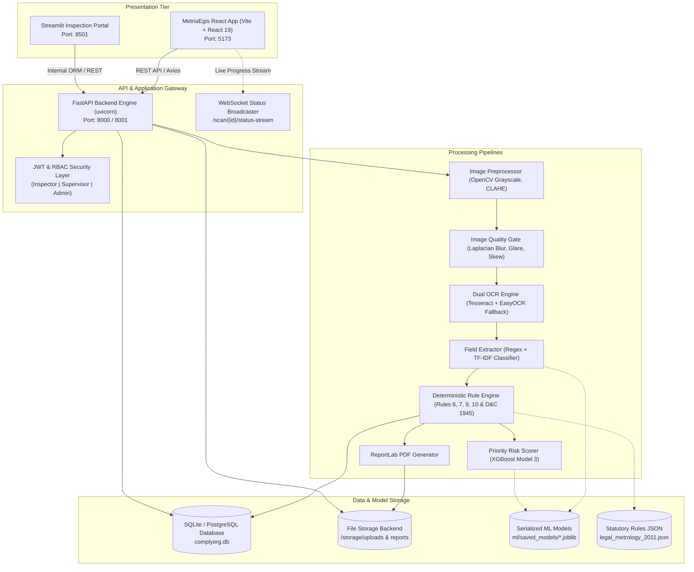
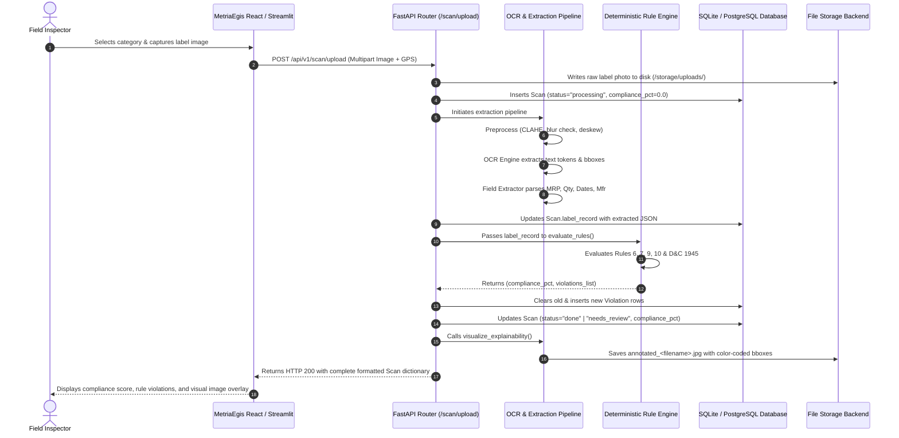
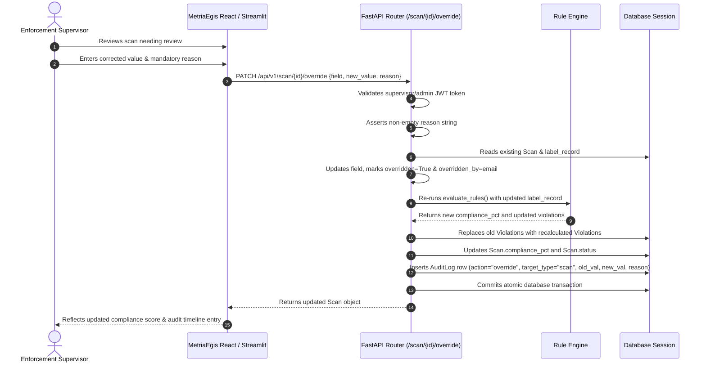

# ComplyErg / Manak Setu / MetriaEgis — Complete System Architecture, Data & Source Code Reference (`fulldata.md`)

> **Repository Root:** `SIH_CodePulse_034`  
> **Platform Description:** Production-grade, offline-capable Legal Metrology label-compliance scanning and audit engine enforcing the Indian **Legal Metrology (Packaged Commodities) Rules, 2011** (Rules 6, 7, 9, 10) and the **Drugs and Cosmetics Rules, 1945**.

---

## Table of Contents

- [1. High-Level Architecture & Ecosystem Relativity](#1-high-level-architecture--ecosystem-relativity)
- [1.1 Master File Index & Data Inventory Table](#11-master-file-index--data-inventory-table)
- [2. Root Configuration & System Orchestration](#2-root-configuration-and-system-orchestration)
  - [`docker-compose.yml`](#file-docker-composeyml) — *Container Infrastructure*
  - [`START_ALL.bat`](#file-start_allbat) — *Multi-Process Launcher*
  - [`requirements.txt`](#file-requirementstxt) — *Dependency Specification*
- [3.1 Application Entrypoint (`app/main.py`)](#31-application-entrypoint-appmainpy)
  - [`app/main.py`](#file-appmainpy) — *Application Gateway Entrypoint*
- [3.2 REST API Routers (`app/api/`)](#32-rest-api-routers-appapi)
  - [`app/api/auth.py`](#file-appapiauthpy) — *Authentication & RBAC Router*
  - [`app/api/scan.py`](#file-appapiscanpy) — *Inspection & Scan Lifecycle Router*
  - [`app/api/dashboard.py`](#file-appapidashboardpy) — *Executive Analytics & Risk Router*
  - [`app/api/rules.py`](#file-appapirulespy) — *Legal Rule Management Router*
  - [`app/api/users.py`](#file-appapiuserspy) — *Officer User Management Router*
  - [`app/api/audit.py`](#file-appapiauditpy) — *Audit Trail Inspection Router*
  - [`app/api/reports.py`](#file-appapireportspy) — *Report Export Router*
- [3.3 Core Infrastructure Utilities (`app/core/`)](#33-core-infrastructure-utilities-appcore)
  - [`app/core/config.py`](#file-appcoreconfigpy) — *System Configuration*
  - [`app/core/security.py`](#file-appcoresecuritypy) — *Cryptographic Security*
  - [`app/core/audit.py`](#file-appcoreauditpy) — *Atomic Audit Logger*
  - [`app/core/storage_backend.py`](#file-appcorestorage_backendpy) — *File Storage Abstraction*
  - [`app/core/ws_manager.py`](#file-appcorews_managerpy) — *WebSocket Connection Manager*
  - [`app/core/envelope.py`](#file-appcoreenvelopepy) — *API Envelope Normalizer*
- [3.4 Database Layer & Initialization (`app/db/`)](#34-database-layer-and-initialization-appdb)
  - [`app/db/session.py`](#file-appdbsessionpy) — *Database Session Factory*
  - [`app/db/init_db.py`](#file-appdbinit_dbpy) — *Database Initializer & Seeder*
  - [`app/db/database.py`](#file-appdbdatabasepy) — *Database Connector Utility*
  - [`app/db/models.py`](#file-appdbmodelspy) — *Database Model Bindings*
- [3.5 SQLAlchemy ORM Domain Models (`app/models/`)](#35-sqlalchemy-orm-domain-models-appmodels)
  - [`app/models/domain.py`](#file-appmodelsdomainpy) — *Domain Model Barrel*
  - [`app/models/user.py`](#file-appmodelsuserpy) — *User Entity Model*
  - [`app/models/scan.py`](#file-appmodelsscanpy) — *Scan Inspection Model*
  - [`app/models/violation.py`](#file-appmodelsviolationpy) — *Statutory Violation Model*
  - [`app/models/rule.py`](#file-appmodelsrulepy) — *Statutory Rule Model*
  - [`app/models/audit_log.py`](#file-appmodelsaudit_logpy) — *Immutable Audit Log Model*
  - [`app/models/report.py`](#file-appmodelsreportpy) — *Inspection Report Model*
  - [`app/models/__init__.py`](#file-appmodels__init__py) — *Models Package Initialization*
- [3.6 Pydantic Request/Response Schemas (`app/schemas/`)](#36-pydantic-requestresponse-schemas-appschemas)
  - [`app/schemas/auth.py`](#file-appschemasauthpy) — *Authentication Schemas*
  - [`app/schemas/scan.py`](#file-appschemasscanpy) — *Scan Inspection Schemas*
  - [`app/schemas/rules.py`](#file-appschemasrulespy) — *Rule Management Schemas*
- [3.7 Inspection Pipeline & Processing Engines (`app/pipeline/`)](#37-inspection-pipeline-and-processing-engines-apppipeline)
  - [`app/pipeline/preprocess.py`](#file-apppipelinepreprocesspy) — *Image Preprocessor*
  - [`app/pipeline/quality_check.py`](#file-apppipelinequality_checkpy) — *Quality Gate Checker*
  - [`app/pipeline/ocr_engine.py`](#file-apppipelineocr_enginepy) — *Dual OCR Engine*
  - [`app/pipeline/field_extractor.py`](#file-apppipelinefield_extractorpy) — *Statutory Declaration Extractor*
  - [`app/pipeline/rule_engine.py`](#file-apppipelinerule_enginepy) — *Deterministic Rule Engine*
  - [`app/pipeline/reporter.py`](#file-apppipelinereporterpy) — *ReportLab PDF Generator*
  - [`app/pipeline/risk_model.py`](#file-apppipelinerisk_modelpy) — *ML Priority Risk Scorer*
  - [`app/pipeline/validator.py`](#file-apppipelinevalidatorpy) — *Field Format Validator*
- [3.8 Statutory Rule Knowledge Base (`app/rules_data/`)](#38-statutory-rule-knowledge-base-apprules_data)
  - [`app/rules_data/legal_metrology_2011.json`](#file-apprules_datalegal_metrology_2011json) — *Legal Metrology 2011 Rules Data*
  - [`app/rules_data/drugs_cosmetics_1945.json`](#file-apprules_datadrugs_cosmetics_1945json) — *Drugs & Cosmetics 1945 Rules Data*
- [4. Sub-Project 2: Machine Learning & Vision Systems (`ml/`)](#4-sub-project-2:-machine-learning-and-vision-systems-ml)
  - [`ml/features.py`](#file-mlfeaturespy) — *Custom Feature Extractor*
  - [`ml/train_quality_model.py`](#file-mltrain_quality_modelpy) — *Quality Model Trainer*
  - [`ml/train_field_classifier.py`](#file-mltrain_field_classifierpy) — *Field Classifier Trainer*
  - [`ml/train_risk_model.py`](#file-mltrain_risk_modelpy) — *Priority Risk Scorer Trainer*
  - [`ml/evaluate.py`](#file-mlevaluatepy) — *Model Evaluation Harness*
  - [`ml/rx_detector.py`](#file-mlrx_detectorpy) — *Rx Medical Symbol Detector*
  - [`ml/visualize_explainability.py`](#file-mlvisualize_explainabilitypy) — *Visual Explainability Overlay*
  - [`ml/generate_sample_dataset.py`](#file-mlgenerate_sample_datasetpy) — *Synthetic Dataset Generator*
- [5. Sub-Project 3: Streamlit Field Inspection Portal (`streamlit_app/`)](#5-sub-project-3:-streamlit-field-inspection-portal-streamlit_app)
  - [`streamlit_app/Home.py`](#file-streamlit_apphomepy) — *Portal Landing Page*
  - [`streamlit_app/i18n.py`](#file-streamlit_appi18npy) — *Bilingual Localization Engine*
  - [`streamlit_app/pages/1_Scan_Product.py`](#file-streamlit_apppages1_scan_productpy) — *Product Scanner Page*
  - [`streamlit_app/pages/2_Scan_Result.py`](#file-streamlit_apppages2_scan_resultpy) — *Inspection Results & Override Page*
  - [`streamlit_app/pages/2_Dashboard.py`](#file-streamlit_apppages2_dashboardpy) — *Analytics Dashboard*
  - [`streamlit_app/pages/3_Scan_History.py`](#file-streamlit_apppages3_scan_historypy) — *Scan History Page*
  - [`streamlit_app/pages/4_Rules_Admin.py`](#file-streamlit_apppages4_rules_adminpy) — *Rules Admin Page*
  - [`streamlit_app/pages/4_Rules_Engine.py`](#file-streamlit_apppages4_rules_enginepy) — *Rule Engine Simulation Page*
  - [`streamlit_app/pages/5_Reports.py`](#file-streamlit_apppages5_reportspy) — *Evidence Reports Page*
  - [`streamlit_app/pages/5_User_Management.py`](#file-streamlit_apppages5_user_managementpy) — *User Management Page*
  - [`streamlit_app/pages/6_Admin.py`](#file-streamlit_apppages6_adminpy) — *System Administration Page*
  - [`streamlit_app/pages/6_Dashboard.py`](#file-streamlit_apppages6_dashboardpy) — *Executive Risk Ranking Page*
  - [`streamlit_app/pages/7_Audit_Log.py`](#file-streamlit_apppages7_audit_logpy) — *Audit Log Viewer Page*
- [6. Sub-Project 4: Automated Testing & Verification Suite (`tests/`)](#6-sub-project-4:-automated-testing-and-verification-suite-tests)
  - [`tests/test_api.py`](#file-teststest_apipy) — *API & RBAC Test Suite*
  - [`tests/test_field_extractor.py`](#file-teststest_field_extractorpy) — *Field Extractor Test Suite*
  - [`tests/test_rule_engine.py`](#file-teststest_rule_enginepy) — *Deterministic Rule Engine Test Suite*
- [7.1 Build & Package Manifests](#71-build-and-package-manifests)
  - [`frontend/package.json`](#file-frontendpackagejson) — *Package Manifest*
  - [`frontend/vite.config.ts`](#file-frontendviteconfigts) — *Vite Build Configuration*
  - [`frontend/index.html`](#file-frontendindexhtml) — *HTML Entry Container*
- [7.2 Application Entrypoint & Styling](#72-application-entrypoint-and-styling)
  - [`frontend/src/main.tsx`](#file-frontendsrcmaintsx) — *DOM Root Mounting*
  - [`frontend/src/App.tsx`](#file-frontendsrcapptsx) — *Route Provider & Wrapper*
  - [`frontend/src/index.css`](#file-frontendsrcindexcss) — *Global Styling Sheet*
- [7.3 TypeScript Interface Contracts](#73-typescript-interface-contracts)
  - [`frontend/src/types/index.ts`](#file-frontendsrctypesindexts) — *TypeScript Type Definitions*
- [7.4 API Client Services (`frontend/src/api/` & `services/`)](#74-api-client-services-frontendsrcapi)
  - [`frontend/src/services/api.ts`](#file-frontendsrcservicesapits) — *Centralized Typed REST API Service Layer*
  - [`frontend/src/api/client.ts`](#file-frontendsrcapiclientts) — *Axios Base Client*
  - [`frontend/src/api/scan.ts`](#file-frontendsrcapiscants) — *Scan API Client*
  - [`frontend/src/api/auth.ts`](#file-frontendsrcapiauthts) — *Authentication API Client*
  - [`frontend/src/api/rules.ts`](#file-frontendsrcapirulests) — *Rules API Client*
  - [`frontend/src/api/reports.ts`](#file-frontendsrcapireportsts) — *Reports API Client*
  - [`frontend/src/api/audit.ts`](#file-frontendsrcapiauditts) — *Audit API Client*
- [7.5 Layout & UI Component Library (`frontend/src/components/`)](#75-layout-and-ui-component-library-frontendsrccomponents)
  - [`frontend/src/layouts/AppLayout.tsx`](#file-frontendsrclayoutsapplayouttsx) — *Main Layout Shell*
  - [`frontend/src/components/Navbar.tsx`](#file-frontendsrccomponentsnavbartsx) — *Top Navigation Header*
  - [`frontend/src/components/Sidebar.tsx`](#file-frontendsrccomponentssidebartsx) — *Role-Aware Navigation Sidebar*
  - [`frontend/src/components/StatCard.tsx`](#file-frontendsrccomponentsstatcardtsx) — *KPI Statistic Card*
  - [`frontend/src/components/ComplianceScore.tsx`](#file-frontendsrccomponentscompliancescoretsx) — *Circular Compliance Gauge*
  - [`frontend/src/components/ConfidenceBadge.tsx`](#file-frontendsrccomponentsconfidencebadgetsx) — *OCR Confidence Badge*
  - [`frontend/src/components/SeverityPill.tsx`](#file-frontendsrccomponentsseveritypilltsx) — *Severity Tag Pill*
  - [`frontend/src/components/StatusBadge.tsx`](#file-frontendsrccomponentsstatusbadgetsx) — *Compliance Status Badge*
  - [`frontend/src/components/RuleCard.tsx`](#file-frontendsrccomponentsrulecardtsx) — *Statutory Rule Evaluation Card*
  - [`frontend/src/components/InspectionTable.tsx`](#file-frontendsrccomponentsinspectiontabletsx) — *Inspection Scans Table*
  - [`frontend/src/components/ChartCard.tsx`](#file-frontendsrccomponentschartcardtsx) — *Chart Container Card*
  - [`frontend/src/components/AuditTimeline.tsx`](#file-frontendsrccomponentsaudittimelinetsx) — *Audit Timeline Component*
  - [`frontend/src/components/RoleGuard.tsx`](#file-frontendsrccomponentsroleguardtsx) — *Route Access Guard*
  - [`frontend/src/components/Modal.tsx`](#file-frontendsrccomponentsmodaltsx) — *Accessible Modal Dialog*
- [7.6 Custom React State Hooks (`frontend/src/hooks/`)](#76-custom-react-state-hooks-frontendsrchooks)
  - [`frontend/src/hooks/useAuth.tsx`](#file-frontendsrchooksuseauthtsx) — *Authentication Context Hook*
  - [`frontend/src/hooks/useInspectionFlow.tsx`](#file-frontendsrchooksuseinspectionflowtsx) — *Inspection State Machine Hook*
  - [`frontend/src/hooks/useScanStatus.ts`](#file-frontendsrchooksusescanstatusts) — *WebSocket Progress Stream Hook*
  - [`frontend/src/hooks/useToast.tsx`](#file-frontendsrchooksusetoasttsx) — *Toast Notification Hook*
  - [`frontend/src/hooks/useNotifications.tsx`](#file-frontendsrchooksusenotificationstsx) — *System Notifications Hook*
- [7.7 Formatting Utilities (`frontend/src/utils/`)](#77-formatting-utilities-frontendsrcutils)
  - [`frontend/src/utils/format.ts`](#file-frontendsrcutilsformatts) — *Data Formatting Helpers*
  - [`frontend/src/utils/cn.ts`](#file-frontendsrcutilscnts) — *Class Name Utility*
- [7.8 Route Pages (`frontend/src/pages/`)](#78-route-pages-frontendsrcpages)
  - [`frontend/src/pages/LoginPage.tsx`](#file-frontendsrcpagesloginpagetsx) — *Authentication Page*
  - [`frontend/src/pages/DashboardPage.tsx`](#file-frontendsrcpagesdashboardpagetsx) — *Executive Dashboard Page*
  - [`frontend/src/pages/ScanPage.tsx`](#file-frontendsrcpagesscanpagetsx) — *Scan Upload & Live Pipeline Page*
  - [`frontend/src/pages/OCRResultsPage.tsx`](#file-frontendsrcpagesocrresultspagetsx) — *OCR Extraction Review Page*
  - [`frontend/src/pages/CompliancePage.tsx`](#file-frontendsrcpagescompliancepagetsx) — *Compliance Scorecard Page*
  - [`frontend/src/pages/VerificationPage.tsx`](#file-frontendsrcpagesverificationpagetsx) — *Field Verification & Override Page*
  - [`frontend/src/pages/InspectionDetailPage.tsx`](#file-frontendsrcpagesinspectiondetailpagetsx) — *Inspection Detail Page*
  - [`frontend/src/pages/ReportPage.tsx`](#file-frontendsrcpagesreportpagetsx) — *Inspection Report Page*
  - [`frontend/src/pages/HistoryPage.tsx`](#file-frontendsrcpageshistorypagetsx) — *Inspection History Page*
  - [`frontend/src/pages/AnalyticsPage.tsx`](#file-frontendsrcpagesanalyticspagetsx) — *Analytics & Trends Page*
  - [`frontend/src/pages/RulesPage.tsx`](#file-frontendsrcpagesrulespagetsx) — *Statutory Rule Manager Page*
  - [`frontend/src/pages/UsersPage.tsx`](#file-frontendsrcpagesuserspagetsx) — *Officer User Management Page*
  - [`frontend/src/pages/AuditPage.tsx`](#file-frontendsrcpagesauditpagetsx) — *Audit Trail Viewer Page*
  - [`frontend/src/pages/SettingsPage.tsx`](#file-frontendsrcpagessettingspagetsx) — *Platform Settings Page*
- [8. Cross-Project Relativity, Data Flows & Lifecycle Diagrams](#8-cross-project-relativity-data-flows--lifecycle-diagrams)
  - [8.1 End-to-End Scan Inspection Lifecycle](#81-end-to-end-scan-inspection-lifecycle)
  - [8.2 Supervisor Field Override & Atomic Audit Trail](#82-supervisor-field-override--atomic-audit-trail)
  - [8.3 Default Seed Authentication Credentials](#83-default-seed-authentication-credentials)

---

## 1. High-Level Architecture & Ecosystem Relativity

The platform coordinates an end-to-end enforcement and audit workflow across multiple sub-projects:



### Relativity of Sub-Projects
- **`app/` (Backend Engine)**: Central processing unit. Holds database state, executes the synchronous & background inspection pipelines, deterministic legal checks, and provides REST & WebSocket interfaces.
- **`frontend/` (MetriaEgis React 19 SPA)**: Modern single-page web portal designed for desktop and responsive web usage. Connects to `app/` via JWT-authenticated HTTP requests (`client.ts`), utilizing unified envelope data structures.
- **`streamlit_app/` (Streamlit Portal)**: Standalone Python enforcement application supporting offline field inspections, hardware camera capture, and live Supervisor field overrides with bilingual (English/Hindi) localization.
- **`ml/` (Machine Learning & Vision Suite)**: Trains and serializes offline models (Quality Gate, Field Classifier, Risk Scorer) that are consumed by the pipeline in `app/pipeline/`.
- **`app/rules_data/` (Statutory Rules Knowledge Base)**: Declarative JSON files defining 15 statutory checks under Legal Metrology 2011 and Drugs & Cosmetics 1945.
- **`tests/` (Automated Test Suite)**: Validates rule calculation accuracy, regex edge cases, and 403 Forbidden security boundaries across user roles.

---

## 1.1 Master File Index & Data Inventory Table

The following master inventory lists every file across the entire repository, mentioning its exact name, associated sub-project, the specific data types, models, schemas, and parameters it processes, its size, and a link directly to its documented code section.

| # | File Name | Sub-Project / Layer | Data Handled & Role | Size (Lines / KB) | Section Link |
| :- | :--- | :--- | :--- | :--- | :--- |
| 1 | [`docker-compose.yml`](file:///c:/Users/himan/OneDrive/Desktop/SIH_CodePulse_034/docker-compose.yml) | **Root Orchestration & Infrastructure** | Defines PostgreSQL container service (port 5432, user: `complyerg_user`, db: `complyerg_db`, volume mounting `postgres_data`). | 25 lines / 0.6 KB | [View Code](#file-docker-composeyml) |
| 2 | [`START_ALL.bat`](file:///c:/Users/himan/OneDrive/Desktop/SIH_CodePulse_034/START_ALL.bat) | **Root Orchestration & Infrastructure** | Shell commands launching Backend (:8000), Engine (:8001), and Vite Frontend (:5173), plus default login credentials. | 53 lines / 2.2 KB | [View Code](#file-start_allbat) |
| 3 | [`requirements.txt`](file:///c:/Users/himan/OneDrive/Desktop/SIH_CodePulse_034/requirements.txt) | **Root Orchestration & Infrastructure** | Python package constraints including FastAPI, Uvicorn, SQLAlchemy, PyTesseract, EasyOCR, ReportLab, OpenCV, Scikit-learn, and XGBoost. | 28 lines / 0.5 KB | [View Code](#file-requirementstxt) |
| 4 | [`app/main.py`](file:///c:/Users/himan/OneDrive/Desktop/SIH_CodePulse_034/app/main.py) | **ComplyErg / Manak Setu Backend (FastAPI)** | Registers routers (`auth`, `scan`, `dashboard`, `rules`, `users`, `audit`, `reports`), configures CORS origins, and mounts `/storage`. | 133 lines / 5.0 KB | [View Code](#file-appmainpy) |
| 5 | [`app/api/auth.py`](file:///c:/Users/himan/OneDrive/Desktop/SIH_CodePulse_034/app/api/auth.py) | **ComplyErg / Manak Setu Backend (FastAPI)** | Handles `OAuth2PasswordRequestForm`, JWT token issuance (`access_token`, `token_type`), password verification, and `require_role()` dependency. | 153 lines / 5.5 KB | [View Code](#file-appapiauthpy) |
| 6 | [`app/api/scan.py`](file:///c:/Users/himan/OneDrive/Desktop/SIH_CodePulse_034/app/api/scan.py) | **ComplyErg / Manak Setu Backend (FastAPI)** | Handles multipart photo uploads, background pipeline task scheduling, WebSocket progress updates (`/status-stream`), field overrides, and deletions. | 369 lines / 13.1 KB | [View Code](#file-appapiscanpy) |
| 7 | [`app/api/dashboard.py`](file:///c:/Users/himan/OneDrive/Desktop/SIH_CodePulse_034/app/api/dashboard.py) | **ComplyErg / Manak Setu Backend (FastAPI)** | Aggregates compliance averages, 30-day trends, violation severity distributions, manufacturer non-compliance rankings, and Model 3 risk priority queues. | 203 lines / 6.8 KB | [View Code](#file-appapidashboardpy) |
| 8 | [`app/api/rules.py`](file:///c:/Users/himan/OneDrive/Desktop/SIH_CodePulse_034/app/api/rules.py) | **ComplyErg / Manak Setu Backend (FastAPI)** | CRUD endpoints for statutory rules (`RuleCreate`, `RuleUpdate`, `RuleResponse`), version tracking, and enablement toggles. | 176 lines / 5.4 KB | [View Code](#file-appapirulespy) |
| 9 | [`app/api/users.py`](file:///c:/Users/himan/OneDrive/Desktop/SIH_CodePulse_034/app/api/users.py) | **ComplyErg / Manak Setu Backend (FastAPI)** | Admin user queries, officer profile modifications, role elevations, and user deactivations. | 176 lines / 5.2 KB | [View Code](#file-appapiuserspy) |
| 10 | [`app/api/audit.py`](file:///c:/Users/himan/OneDrive/Desktop/SIH_CodePulse_034/app/api/audit.py) | **ComplyErg / Manak Setu Backend (FastAPI)** | Read-only access to immutable audit log records filterable by `target_type`, `user_id`, `action`, and date range. | 63 lines / 1.9 KB | [View Code](#file-appapiauditpy) |
| 11 | [`app/api/reports.py`](file:///c:/Users/himan/OneDrive/Desktop/SIH_CodePulse_034/app/api/reports.py) | **ComplyErg / Manak Setu Backend (FastAPI)** | Generates dynamically rendered ReportLab PDF certificates and tabular CSV streams for legal evidence archives. | 219 lines / 10.1 KB | [View Code](#file-appapireportspy) |
| 12 | [`app/core/config.py`](file:///c:/Users/himan/OneDrive/Desktop/SIH_CodePulse_034/app/core/config.py) | **ComplyErg / Manak Setu Backend (FastAPI)** | Pydantic `BaseSettings` defining `SECRET_KEY`, `ALGORITHM` (HS256), `ACCESS_TOKEN_EXPIRE_MINUTES`, and `DATABASE_URL`. | 105 lines / 4.2 KB | [View Code](#file-appcoreconfigpy) |
| 13 | [`app/core/security.py`](file:///c:/Users/himan/OneDrive/Desktop/SIH_CodePulse_034/app/core/security.py) | **ComplyErg / Manak Setu Backend (FastAPI)** | Passlib `CryptContext(schemes=['bcrypt'])` password hashing/verification and Python-Jose JWT access token generator. | 136 lines / 4.8 KB | [View Code](#file-appcoresecuritypy) |
| 14 | [`app/core/audit.py`](file:///c:/Users/himan/OneDrive/Desktop/SIH_CodePulse_034/app/core/audit.py) | **ComplyErg / Manak Setu Backend (FastAPI)** | Helper function `log_audit()` creating immutable `AuditLog` entries within current database transaction. | 29 lines / 0.8 KB | [View Code](#file-appcoreauditpy) |
| 15 | [`app/core/storage_backend.py`](file:///c:/Users/himan/OneDrive/Desktop/SIH_CodePulse_034/app/core/storage_backend.py) | **ComplyErg / Manak Setu Backend (FastAPI)** | Local disk storage manager creating UUID filenames in `/storage/uploads/` and resolving absolute filesystem paths. | 46 lines / 1.7 KB | [View Code](#file-appcorestorage_backendpy) |
| 16 | [`app/core/ws_manager.py`](file:///c:/Users/himan/OneDrive/Desktop/SIH_CodePulse_034/app/core/ws_manager.py) | **ComplyErg / Manak Setu Backend (FastAPI)** | Manages active WebSocket connections per `scan_id`, broadcasting stage events (`preprocessing`, `ocr`, `rule_check`, `done`). | 56 lines / 2.1 KB | [View Code](#file-appcorews_managerpy) |
| 17 | [`app/core/envelope.py`](file:///c:/Users/himan/OneDrive/Desktop/SIH_CodePulse_034/app/core/envelope.py) | **ComplyErg / Manak Setu Backend (FastAPI)** | Standardized response serializers `success_response(data)` and `error_response(code, message)`. | 46 lines / 1.1 KB | [View Code](#file-appcoreenvelopepy) |
| 18 | [`app/db/session.py`](file:///c:/Users/himan/OneDrive/Desktop/SIH_CodePulse_034/app/db/session.py) | **ComplyErg / Manak Setu Backend (FastAPI)** | SQLAlchemy `create_engine`, `sessionmaker`, declarative `Base`, and dependency `get_db()`. | 34 lines / 0.9 KB | [View Code](#file-appdbsessionpy) |
| 19 | [`app/db/init_db.py`](file:///c:/Users/himan/OneDrive/Desktop/SIH_CodePulse_034/app/db/init_db.py) | **ComplyErg / Manak Setu Backend (FastAPI)** | Initializes tables and seeds default Inspector, Supervisor, and Admin accounts plus 15 Legal Metrology rules. | 236 lines / 9.5 KB | [View Code](#file-appdbinit_dbpy) |
| 20 | [`app/db/database.py`](file:///c:/Users/himan/OneDrive/Desktop/SIH_CodePulse_034/app/db/database.py) | **ComplyErg / Manak Setu Backend (FastAPI)** | Helper bindings for database connection strings and session lifecycle. | 23 lines / 0.6 KB | [View Code](#file-appdbdatabasepy) |
| 21 | [`app/db/models.py`](file:///c:/Users/himan/OneDrive/Desktop/SIH_CodePulse_034/app/db/models.py) | **ComplyErg / Manak Setu Backend (FastAPI)** | Provides ORM model bindings for backwards compatibility. | 19 lines / 0.8 KB | [View Code](#file-appdbmodelspy) |
| 22 | [`app/models/domain.py`](file:///c:/Users/himan/OneDrive/Desktop/SIH_CodePulse_034/app/models/domain.py) | **ComplyErg / Manak Setu Backend (FastAPI)** | Exports all ORM entities (`User`, `Scan`, `Violation`, `Rule`, `AuditLog`, `Report`) in a single module. | 10 lines / 0.4 KB | [View Code](#file-appmodelsdomainpy) |
| 23 | [`app/models/user.py`](file:///c:/Users/himan/OneDrive/Desktop/SIH_CodePulse_034/app/models/user.py) | **ComplyErg / Manak Setu Backend (FastAPI)** | Columns: `id`, `email`, `hashed_password`, `full_name`, `role` (inspector/supervisor/admin), `is_active`, `created_at`. | 25 lines / 1.0 KB | [View Code](#file-appmodelsuserpy) |
| 24 | [`app/models/scan.py`](file:///c:/Users/himan/OneDrive/Desktop/SIH_CodePulse_034/app/models/scan.py) | **ComplyErg / Manak Setu Backend (FastAPI)** | Columns: `id`, `user_id`, `image_path`, `category`, `status`, `label_record` (JSON), `compliance_pct`, `gps_lat`, `gps_lng`. | 24 lines / 1.2 KB | [View Code](#file-appmodelsscanpy) |
| 25 | [`app/models/violation.py`](file:///c:/Users/himan/OneDrive/Desktop/SIH_CodePulse_034/app/models/violation.py) | **ComplyErg / Manak Setu Backend (FastAPI)** | Columns: `id`, `scan_id`, `rule_id`, `legal_rule_ref`, `source_law`, `field`, `severity`, `status`, `detected_value`, `bbox`. | 26 lines / 1.1 KB | [View Code](#file-appmodelsviolationpy) |
| 26 | [`app/models/rule.py`](file:///c:/Users/himan/OneDrive/Desktop/SIH_CodePulse_034/app/models/rule.py) | **ComplyErg / Manak Setu Backend (FastAPI)** | Columns: `id`, `rule_id_str`, `legal_rule_ref`, `source_law`, `field`, `check_type`, `pattern` (JSON), `severity`, `category`. | 20 lines / 0.8 KB | [View Code](#file-appmodelsrulepy) |
| 27 | [`app/models/audit_log.py`](file:///c:/Users/himan/OneDrive/Desktop/SIH_CodePulse_034/app/models/audit_log.py) | **ComplyErg / Manak Setu Backend (FastAPI)** | Columns: `id`, `user_id`, `action`, `target_type`, `target_id`, `old_value` (JSON), `new_value` (JSON), `reason`, `timestamp`. | 18 lines / 0.8 KB | [View Code](#file-appmodelsaudit_logpy) |
| 28 | [`app/models/report.py`](file:///c:/Users/himan/OneDrive/Desktop/SIH_CodePulse_034/app/models/report.py) | **ComplyErg / Manak Setu Backend (FastAPI)** | Columns: `id`, `scan_id`, `report_type` (pdf/csv), `file_path`, `generated_at`. | 14 lines / 0.5 KB | [View Code](#file-appmodelsreportpy) |
| 29 | [`app/models/__init__.py`](file:///c:/Users/himan/OneDrive/Desktop/SIH_CodePulse_034/app/models/__init__.py) | **ComplyErg / Manak Setu Backend (FastAPI)** | Package initializer for SQLAlchemy models. | 9 lines / 0.3 KB | [View Code](#file-appmodels__init__py) |
| 30 | [`app/schemas/auth.py`](file:///c:/Users/himan/OneDrive/Desktop/SIH_CodePulse_034/app/schemas/auth.py) | **ComplyErg / Manak Setu Backend (FastAPI)** | Defines `UserRegister`, `UserLogin`, `Token`, and `UserResponse` Pydantic models. | 31 lines / 0.7 KB | [View Code](#file-appschemasauthpy) |
| 31 | [`app/schemas/scan.py`](file:///c:/Users/himan/OneDrive/Desktop/SIH_CodePulse_034/app/schemas/scan.py) | **ComplyErg / Manak Setu Backend (FastAPI)** | Defines `ScanUploadResponse`, `ScanResponse`, and `OverrideFieldRequest` (with mandatory `reason` string). | 64 lines / 1.7 KB | [View Code](#file-appschemasscanpy) |
| 32 | [`app/schemas/rules.py`](file:///c:/Users/himan/OneDrive/Desktop/SIH_CodePulse_034/app/schemas/rules.py) | **ComplyErg / Manak Setu Backend (FastAPI)** | Defines `RuleCreate`, `RuleUpdate`, and `RuleResponse` Pydantic models. | 34 lines / 0.9 KB | [View Code](#file-appschemasrulespy) |
| 33 | [`app/pipeline/preprocess.py`](file:///c:/Users/himan/OneDrive/Desktop/SIH_CodePulse_034/app/pipeline/preprocess.py) | **ComplyErg / Manak Setu Backend (FastAPI)** | OpenCV pipeline applying grayscale conversion, CLAHE adaptive contrast normalization, and bilateral edge preservation. | 93 lines / 3.2 KB | [View Code](#file-apppipelinepreprocesspy) |
| 34 | [`app/pipeline/quality_check.py`](file:///c:/Users/himan/OneDrive/Desktop/SIH_CodePulse_034/app/pipeline/quality_check.py) | **ComplyErg / Manak Setu Backend (FastAPI)** | Calculates Laplacian variance for blur (threshold: 100.0), glare saturation percentage, and Hough skew estimation. | 70 lines / 2.5 KB | [View Code](#file-apppipelinequality_checkpy) |
| 35 | [`app/pipeline/ocr_engine.py`](file:///c:/Users/himan/OneDrive/Desktop/SIH_CodePulse_034/app/pipeline/ocr_engine.py) | **ComplyErg / Manak Setu Backend (FastAPI)** | Runs Tesseract (primary, `--psm 11` or `6`) and EasyOCR (fallback), detects Unicode scripts (`detect_scripts`), and generates bounding boxes. | 449 lines / 19.9 KB | [View Code](#file-apppipelineocr_enginepy) |
| 36 | [`app/pipeline/field_extractor.py`](file:///c:/Users/himan/OneDrive/Desktop/SIH_CodePulse_034/app/pipeline/field_extractor.py) | **ComplyErg / Manak Setu Backend (FastAPI)** | Multi-pattern regex engine + TF-IDF ML fallback extracting MRP, Net Quantity, Dates, Manufacturer, FSSAI, and Consumer Care. | 274 lines / 11.8 KB | [View Code](#file-apppipelinefield_extractorpy) |
| 37 | [`app/pipeline/rule_engine.py`](file:///c:/Users/himan/OneDrive/Desktop/SIH_CodePulse_034/app/pipeline/rule_engine.py) | **ComplyErg / Manak Setu Backend (FastAPI)** | Evaluates 12 statutory check types (`presence`, `presence_and_unit`, `regex`, `date_format`, `date_order`, `keyword_nearby`, `script_check`, etc.). | 324 lines / 16.1 KB | [View Code](#file-apppipelinerule_enginepy) |
| 38 | [`app/pipeline/reporter.py`](file:///c:/Users/himan/OneDrive/Desktop/SIH_CodePulse_034/app/pipeline/reporter.py) | **ComplyErg / Manak Setu Backend (FastAPI)** | Builds multi-section PDF evidence document featuring compliance status banners, packaging photos, and tabular violation details. | 144 lines / 6.2 KB | [View Code](#file-apppipelinereporterpy) |
| 39 | [`app/pipeline/risk_model.py`](file:///c:/Users/himan/OneDrive/Desktop/SIH_CodePulse_034/app/pipeline/risk_model.py) | **ComplyErg / Manak Setu Backend (FastAPI)** | Wrapper loading `risk_scorer.joblib` to calculate continuous manufacturer priority scores ($[0.0, 1.0]$). | 38 lines / 1.3 KB | [View Code](#file-apppipelinerisk_modelpy) |
| 40 | [`app/pipeline/validator.py`](file:///c:/Users/himan/OneDrive/Desktop/SIH_CodePulse_034/app/pipeline/validator.py) | **ComplyErg / Manak Setu Backend (FastAPI)** | Post-OCR sanitization helper validating dates, metric units, and currency formats. | 91 lines / 3.9 KB | [View Code](#file-apppipelinevalidatorpy) |
| 41 | [`app/rules_data/legal_metrology_2011.json`](file:///c:/Users/himan/OneDrive/Desktop/SIH_CodePulse_034/app/rules_data/legal_metrology_2011.json) | **ComplyErg / Manak Setu Backend (FastAPI)** | 15 statutory rules covering commodity name, net quantity, manufacturer/importer identity, MRP, dates, FSSAI, and scripts. | 153 lines / 3.7 KB | [View Code](#file-apprules_datalegal_metrology_2011json) |
| 42 | [`app/rules_data/drugs_cosmetics_1945.json`](file:///c:/Users/himan/OneDrive/Desktop/SIH_CodePulse_034/app/rules_data/drugs_cosmetics_1945.json) | **ComplyErg / Manak Setu Backend (FastAPI)** | Statutory pharmaceutical rules covering Schedule H/H1/X warnings, generic name prominence, and Rx symbol requirements. | 99 lines / 2.9 KB | [View Code](#file-apprules_datadrugs_cosmetics_1945json) |
| 43 | [`ml/features.py`](file:///c:/Users/himan/OneDrive/Desktop/SIH_CodePulse_034/ml/features.py) | **Machine Learning & Vision Suite (`ml/`)** | Scikit-learn `CustomFieldFeatureExtractor` transformer parsing currency, digits, date formats, metric units, and string length. | 29 lines / 1.3 KB | [View Code](#file-mlfeaturespy) |
| 44 | [`ml/train_quality_model.py`](file:///c:/Users/himan/OneDrive/Desktop/SIH_CodePulse_034/ml/train_quality_model.py) | **Machine Learning & Vision Suite (`ml/`)** | Trains Model 1 (Random Forest) on OpenCV blur variance, glare saturation ratio, skew angle, and contrast metrics. | 118 lines / 4.6 KB | [View Code](#file-mltrain_quality_modelpy) |
| 45 | [`ml/train_field_classifier.py`](file:///c:/Users/himan/OneDrive/Desktop/SIH_CodePulse_034/ml/train_field_classifier.py) | **Machine Learning & Vision Suite (`ml/`)** | Trains Model 2 using a composite pipeline of `TfidfVectorizer` + `CustomFieldFeatureExtractor` + `LogisticRegression`. | 53 lines / 1.9 KB | [View Code](#file-mltrain_field_classifierpy) |
| 46 | [`ml/train_risk_model.py`](file:///c:/Users/himan/OneDrive/Desktop/SIH_CodePulse_034/ml/train_risk_model.py) | **Machine Learning & Vision Suite (`ml/`)** | Trains Model 3 (XGBoost) on violation rate, critical infraction counts, detection confidence, and inspection recency. | 74 lines / 2.3 KB | [View Code](#file-mltrain_risk_modelpy) |
| 47 | [`ml/evaluate.py`](file:///c:/Users/himan/OneDrive/Desktop/SIH_CodePulse_034/ml/evaluate.py) | **Machine Learning & Vision Suite (`ml/`)** | Computes Accuracy, Precision, Recall, Macro-F1, Confusion Matrix, and ROC-AUC for trained classifiers. | 47 lines / 1.8 KB | [View Code](#file-mlevaluatepy) |
| 48 | [`ml/rx_detector.py`](file:///c:/Users/himan/OneDrive/Desktop/SIH_CodePulse_034/ml/rx_detector.py) | **Machine Learning & Vision Suite (`ml/`)** | Computer vision template matcher for prescription Rx / NRx symbols under Rule 96/97 of Drugs & Cosmetics 1945. | 59 lines / 2.3 KB | [View Code](#file-mlrx_detectorpy) |
| 49 | [`ml/visualize_explainability.py`](file:///c:/Users/himan/OneDrive/Desktop/SIH_CodePulse_034/ml/visualize_explainability.py) | **Machine Learning & Vision Suite (`ml/`)** | Draws color-coded bounding boxes on packaging labels: Emerald Green (Pass), Crimson Red (Fail), and Amber (Review). | 93 lines / 3.8 KB | [View Code](#file-mlvisualize_explainabilitypy) |
| 50 | [`ml/generate_sample_dataset.py`](file:///c:/Users/himan/OneDrive/Desktop/SIH_CodePulse_034/ml/generate_sample_dataset.py) | **Machine Learning & Vision Suite (`ml/`)** | Synthesizes label text annotations, ground-truth bounding boxes, and compliance violations for offline testing. | 102 lines / 3.8 KB | [View Code](#file-mlgenerate_sample_datasetpy) |
| 51 | [`streamlit_app/Home.py`](file:///c:/Users/himan/OneDrive/Desktop/SIH_CodePulse_034/streamlit_app/Home.py) | **Streamlit Field Inspection Portal (`streamlit_app/`)** | Role switch buttons (Inspector, Supervisor, Admin), system metrics, and quick-start links. | 180 lines / 8.7 KB | [View Code](#file-streamlit_apphomepy) |
| 52 | [`streamlit_app/i18n.py`](file:///c:/Users/himan/OneDrive/Desktop/SIH_CodePulse_034/streamlit_app/i18n.py) | **Streamlit Field Inspection Portal (`streamlit_app/`)** | Translation dictionaries supporting English and Hindi (`hi`) for all UI labels, buttons, and alert messages. | 77 lines / 4.6 KB | [View Code](#file-streamlit_appi18npy) |
| 53 | [`streamlit_app/pages/1_Scan_Product.py`](file:///c:/Users/himan/OneDrive/Desktop/SIH_CodePulse_034/streamlit_app/pages/1_Scan_Product.py) | **Streamlit Field Inspection Portal (`streamlit_app/`)** | Hardware camera / file upload, category selection, live pipeline progress, and instant compliance scorecard. | 311 lines / 14.2 KB | [View Code](#file-streamlit_apppages1_scan_productpy) |
| 54 | [`streamlit_app/pages/2_Scan_Result.py`](file:///c:/Users/himan/OneDrive/Desktop/SIH_CodePulse_034/streamlit_app/pages/2_Scan_Result.py) | **Streamlit Field Inspection Portal (`streamlit_app/`)** | Visual bounding box viewer, detected statutory declarations table, and Supervisor override form. | 154 lines / 7.3 KB | [View Code](#file-streamlit_apppages2_scan_resultpy) |
| 55 | [`streamlit_app/pages/2_Dashboard.py`](file:///c:/Users/himan/OneDrive/Desktop/SIH_CodePulse_034/streamlit_app/pages/2_Dashboard.py) | **Streamlit Field Inspection Portal (`streamlit_app/`)** | Compliance score distribution, top non-compliant rules, and volume trends over time. | 228 lines / 9.5 KB | [View Code](#file-streamlit_apppages2_dashboardpy) |
| 56 | [`streamlit_app/pages/3_Scan_History.py`](file:///c:/Users/himan/OneDrive/Desktop/SIH_CodePulse_034/streamlit_app/pages/3_Scan_History.py) | **Streamlit Field Inspection Portal (`streamlit_app/`)** | Role-scoped historical inspection log with category filters, status filters, and CSV export. | 132 lines / 6.0 KB | [View Code](#file-streamlit_apppages3_scan_historypy) |
| 57 | [`streamlit_app/pages/4_Rules_Admin.py`](file:///c:/Users/himan/OneDrive/Desktop/SIH_CodePulse_034/streamlit_app/pages/4_Rules_Admin.py) | **Streamlit Field Inspection Portal (`streamlit_app/`)** | Interactive table and form for creating, updating, and deactivating statutory rules. | 100 lines / 4.8 KB | [View Code](#file-streamlit_apppages4_rules_adminpy) |
| 58 | [`streamlit_app/pages/4_Rules_Engine.py`](file:///c:/Users/himan/OneDrive/Desktop/SIH_CodePulse_034/streamlit_app/pages/4_Rules_Engine.py) | **Streamlit Field Inspection Portal (`streamlit_app/`)** | Interactive playground for testing custom label records against statutory rules. | 178 lines / 9.3 KB | [View Code](#file-streamlit_apppages4_rules_enginepy) |
| 59 | [`streamlit_app/pages/5_Reports.py`](file:///c:/Users/himan/OneDrive/Desktop/SIH_CodePulse_034/streamlit_app/pages/5_Reports.py) | **Streamlit Field Inspection Portal (`streamlit_app/`)** | Report viewer allowing PDF and CSV certificate downloads for selected scans. | 124 lines / 5.9 KB | [View Code](#file-streamlit_apppages5_reportspy) |
| 60 | [`streamlit_app/pages/5_User_Management.py`](file:///c:/Users/himan/OneDrive/Desktop/SIH_CodePulse_034/streamlit_app/pages/5_User_Management.py) | **Streamlit Field Inspection Portal (`streamlit_app/`)** | Admin interface for creating officers, setting roles, and resetting credentials. | 100 lines / 4.2 KB | [View Code](#file-streamlit_apppages5_user_managementpy) |
| 61 | [`streamlit_app/pages/6_Admin.py`](file:///c:/Users/himan/OneDrive/Desktop/SIH_CodePulse_034/streamlit_app/pages/6_Admin.py) | **Streamlit Field Inspection Portal (`streamlit_app/`)** | Database statistics, storage usage, cache clearing, and system diagnostic logs. | 196 lines / 9.5 KB | [View Code](#file-streamlit_apppages6_adminpy) |
| 62 | [`streamlit_app/pages/6_Dashboard.py`](file:///c:/Users/himan/OneDrive/Desktop/SIH_CodePulse_034/streamlit_app/pages/6_Dashboard.py) | **Streamlit Field Inspection Portal (`streamlit_app/`)** | Displays Model 3 priority risk rankings to prioritize enforcement inspections. | 107 lines / 4.3 KB | [View Code](#file-streamlit_apppages6_dashboardpy) |
| 63 | [`streamlit_app/pages/7_Audit_Log.py`](file:///c:/Users/himan/OneDrive/Desktop/SIH_CodePulse_034/streamlit_app/pages/7_Audit_Log.py) | **Streamlit Field Inspection Portal (`streamlit_app/`)** | Read-only timeline displaying all field overrides, deletions, and configuration changes. | 61 lines / 2.3 KB | [View Code](#file-streamlit_apppages7_audit_logpy) |
| 64 | [`tests/test_api.py`](file:///c:/Users/himan/OneDrive/Desktop/SIH_CodePulse_034/tests/test_api.py) | **Automated Testing Suite (`tests/`)** | Verifies login, JWT tokens, scan uploads, and asserts `HTTP 403 Forbidden` for unauthorized inspector actions. | 96 lines / 3.1 KB | [View Code](#file-teststest_apipy) |
| 65 | [`tests/test_field_extractor.py`](file:///c:/Users/himan/OneDrive/Desktop/SIH_CodePulse_034/tests/test_field_extractor.py) | **Automated Testing Suite (`tests/`)** | Unit tests verifying regex parsing of currency formats, dates, net quantity units, and manufacturer names. | 20 lines / 1.0 KB | [View Code](#file-teststest_field_extractorpy) |
| 66 | [`tests/test_rule_engine.py`](file:///c:/Users/himan/OneDrive/Desktop/SIH_CodePulse_034/tests/test_rule_engine.py) | **Automated Testing Suite (`tests/`)** | Unit tests checking presence, metric units, regex matching, chronological date order, and FSSAI numbers. | 55 lines / 3.1 KB | [View Code](#file-teststest_rule_enginepy) |
| 67 | [`frontend/package.json`](file:///c:/Users/himan/OneDrive/Desktop/SIH_CodePulse_034/frontend/package.json) | **MetriaEgis React Web Application (`frontend/`)** | Dependencies: React 19, Vite, Tailwind CSS v4, Axios, Recharts, Lucide React, React Router v7. | 34 lines / 0.8 KB | [View Code](#file-frontendpackagejson) |
| 68 | [`frontend/vite.config.ts`](file:///c:/Users/himan/OneDrive/Desktop/SIH_CodePulse_034/frontend/vite.config.ts) | **MetriaEgis React Web Application (`frontend/`)** | Vite bundler configuration with `@vitejs/plugin-react` and development server proxy. | 20 lines / 0.8 KB | [View Code](#file-frontendviteconfigts) |
| 69 | [`frontend/index.html`](file:///c:/Users/himan/OneDrive/Desktop/SIH_CodePulse_034/frontend/index.html) | **MetriaEgis React Web Application (`frontend/`)** | HTML shell with meta tags, title, Google Fonts link, and root div `#root`. | 13 lines / 0.4 KB | [View Code](#file-frontendindexhtml) |
| 70 | [`frontend/src/main.tsx`](file:///c:/Users/himan/OneDrive/Desktop/SIH_CodePulse_034/frontend/src/main.tsx) | **MetriaEgis React Web Application (`frontend/`)** | Mounts `<App />` into `document.getElementById('root')` within `React.StrictMode`. | 10 lines / 0.2 KB | [View Code](#file-frontendsrcmaintsx) |
| 71 | [`frontend/src/App.tsx`](file:///c:/Users/himan/OneDrive/Desktop/SIH_CodePulse_034/frontend/src/App.tsx) | **MetriaEgis React Web Application (`frontend/`)** | Defines React Router DOM routes, wraps views with `AuthProvider` and `AppLayout`. | 86 lines / 3.5 KB | [View Code](#file-frontendsrcapptsx) |
| 72 | [`frontend/src/index.css`](file:///c:/Users/himan/OneDrive/Desktop/SIH_CodePulse_034/frontend/src/index.css) | **MetriaEgis React Web Application (`frontend/`)** | Imports Tailwind CSS v4 directives, custom animations, and CSS variables for government branding. | 88 lines / 2.6 KB | [View Code](#file-frontendsrcindexcss) |
| 73 | [`frontend/src/types/index.ts`](file:///c:/Users/himan/OneDrive/Desktop/SIH_CodePulse_034/frontend/src/types/index.ts) | **MetriaEgis React Web Application (`frontend/`)** | Interfaces: `Scan`, `Violation`, `Rule`, `User`, `AuditLog`, `DashboardStats`, `Severity`, `Status`. | 84 lines / 1.7 KB | [View Code](#file-frontendsrctypesindexts) |
| 74 | [`frontend/src/api/client.ts`](file:///c:/Users/himan/OneDrive/Desktop/SIH_CodePulse_034/frontend/src/api/client.ts) | **MetriaEgis React Web Application (`frontend/`)** | Attaches Bearer token from localStorage to headers and unwraps `{success: true, data: ...}`. | 55 lines / 1.5 KB | [View Code](#file-frontendsrcapiclientts) |
| 75 | [`frontend/src/api/scan.ts`](file:///c:/Users/himan/OneDrive/Desktop/SIH_CodePulse_034/frontend/src/api/scan.ts) | **MetriaEgis React Web Application (`frontend/`)** | Methods: `uploadScan()`, `getScan()`, `listScans()`, `overrideField()`, `getScanImageUrl()`. | 60 lines / 1.5 KB | [View Code](#file-frontendsrcapiscants) |
| 76 | [`frontend/src/api/auth.ts`](file:///c:/Users/himan/OneDrive/Desktop/SIH_CodePulse_034/frontend/src/api/auth.ts) | **MetriaEgis React Web Application (`frontend/`)** | Methods: `login()`, `register()`, `getCurrentUser()`. | 17 lines / 0.3 KB | [View Code](#file-frontendsrcapiauthts) |
| 77 | [`frontend/src/api/rules.ts`](file:///c:/Users/himan/OneDrive/Desktop/SIH_CodePulse_034/frontend/src/api/rules.ts) | **MetriaEgis React Web Application (`frontend/`)** | Methods: `getRules()`, `createRule()`, `updateRule()`, `deleteRule()`. | 17 lines / 0.4 KB | [View Code](#file-frontendsrcapirulests) |
| 78 | [`frontend/src/api/reports.ts`](file:///c:/Users/himan/OneDrive/Desktop/SIH_CodePulse_034/frontend/src/api/reports.ts) | **MetriaEgis React Web Application (`frontend/`)** | Methods: `downloadPdfReport()`, `exportCsvReport()`. | 13 lines / 0.3 KB | [View Code](#file-frontendsrcapireportsts) |
| 79 | [`frontend/src/api/audit.ts`](file:///c:/Users/himan/OneDrive/Desktop/SIH_CodePulse_034/frontend/src/api/audit.ts) | **MetriaEgis React Web Application (`frontend/`)** | Methods: `getAuditLogs()` with query filtering. | 9 lines / 0.2 KB | [View Code](#file-frontendsrcapiauditts) |
| 80 | [`frontend/src/layouts/AppLayout.tsx`](file:///c:/Users/himan/OneDrive/Desktop/SIH_CodePulse_034/frontend/src/layouts/AppLayout.tsx) | **MetriaEgis React Web Application (`frontend/`)** | Renders responsive sidebar, header navbar, and dynamic content outlet. | 24 lines / 0.7 KB | [View Code](#file-frontendsrclayoutsapplayouttsx) |
| 81 | [`frontend/src/components/Navbar.tsx`](file:///c:/Users/himan/OneDrive/Desktop/SIH_CodePulse_034/frontend/src/components/Navbar.tsx) | **MetriaEgis React Web Application (`frontend/`)** | Displays logged-in officer badge, role indicator, quick notifications, and logout action. | 61 lines / 2.3 KB | [View Code](#file-frontendsrccomponentsnavbartsx) |
| 82 | [`frontend/src/components/Sidebar.tsx`](file:///c:/Users/himan/OneDrive/Desktop/SIH_CodePulse_034/frontend/src/components/Sidebar.tsx) | **MetriaEgis React Web Application (`frontend/`)** | Displays navigation links filtered by role (Inspector / Supervisor / Admin). | 259 lines / 7.1 KB | [View Code](#file-frontendsrccomponentssidebartsx) |
| 83 | [`frontend/src/components/StatCard.tsx`](file:///c:/Users/himan/OneDrive/Desktop/SIH_CodePulse_034/frontend/src/components/StatCard.tsx) | **MetriaEgis React Web Application (`frontend/`)** | Renders KPI title, value, change indicator, and Lucide icon. | 72 lines / 2.6 KB | [View Code](#file-frontendsrccomponentsstatcardtsx) |
| 84 | [`frontend/src/components/ComplianceScore.tsx`](file:///c:/Users/himan/OneDrive/Desktop/SIH_CodePulse_034/frontend/src/components/ComplianceScore.tsx) | **MetriaEgis React Web Application (`frontend/`)** | Renders SVG circular progress gauge color-coded by compliance threshold. | 41 lines / 1.7 KB | [View Code](#file-frontendsrccomponentscompliancescoretsx) |
| 85 | [`frontend/src/components/ConfidenceBadge.tsx`](file:///c:/Users/himan/OneDrive/Desktop/SIH_CodePulse_034/frontend/src/components/ConfidenceBadge.tsx) | **MetriaEgis React Web Application (`frontend/`)** | Pill component showing OCR confidence percentage (green > 0.8, yellow > 0.6, red < 0.6). | 16 lines / 0.6 KB | [View Code](#file-frontendsrccomponentsconfidencebadgetsx) |
| 86 | [`frontend/src/components/SeverityPill.tsx`](file:///c:/Users/himan/OneDrive/Desktop/SIH_CodePulse_034/frontend/src/components/SeverityPill.tsx) | **MetriaEgis React Web Application (`frontend/`)** | Badges for `critical`, `high`, `medium`, and `low` violation severities. | 12 lines / 0.4 KB | [View Code](#file-frontendsrccomponentsseveritypilltsx) |
| 87 | [`frontend/src/components/StatusBadge.tsx`](file:///c:/Users/himan/OneDrive/Desktop/SIH_CodePulse_034/frontend/src/components/StatusBadge.tsx) | **MetriaEgis React Web Application (`frontend/`)** | Badges for `pass`, `fail`, `needs_review`, and `processing` states. | 13 lines / 0.5 KB | [View Code](#file-frontendsrccomponentsstatusbadgetsx) |
| 88 | [`frontend/src/components/RuleCard.tsx`](file:///c:/Users/himan/OneDrive/Desktop/SIH_CodePulse_034/frontend/src/components/RuleCard.tsx) | **MetriaEgis React Web Application (`frontend/`)** | Displays legal section citation, target field, detected vs expected values, and recommendation. | 67 lines / 3.3 KB | [View Code](#file-frontendsrccomponentsrulecardtsx) |
| 89 | [`frontend/src/components/InspectionTable.tsx`](file:///c:/Users/himan/OneDrive/Desktop/SIH_CodePulse_034/frontend/src/components/InspectionTable.tsx) | **MetriaEgis React Web Application (`frontend/`)** | Sortable, searchable table displaying product scans, compliance percentage, and action links. | 52 lines / 2.5 KB | [View Code](#file-frontendsrccomponentsinspectiontabletsx) |
| 90 | [`frontend/src/components/ChartCard.tsx`](file:///c:/Users/himan/OneDrive/Desktop/SIH_CodePulse_034/frontend/src/components/ChartCard.tsx) | **MetriaEgis React Web Application (`frontend/`)** | Clean card wrapper for Recharts line, bar, and area charts. | 29 lines / 0.7 KB | [View Code](#file-frontendsrccomponentschartcardtsx) |
| 91 | [`frontend/src/components/AuditTimeline.tsx`](file:///c:/Users/himan/OneDrive/Desktop/SIH_CodePulse_034/frontend/src/components/AuditTimeline.tsx) | **MetriaEgis React Web Application (`frontend/`)** | Interactive visual timeline rendering audit events, officer details, and before/after values. | 50 lines / 2.3 KB | [View Code](#file-frontendsrccomponentsaudittimelinetsx) |
| 92 | [`frontend/src/components/RoleGuard.tsx`](file:///c:/Users/himan/OneDrive/Desktop/SIH_CodePulse_034/frontend/src/components/RoleGuard.tsx) | **MetriaEgis React Web Application (`frontend/`)** | Restricts route rendering to authorized officer roles, redirecting unauthorized users. | 11 lines / 0.4 KB | [View Code](#file-frontendsrccomponentsroleguardtsx) |
| 93 | [`frontend/src/components/Modal.tsx`](file:///c:/Users/himan/OneDrive/Desktop/SIH_CodePulse_034/frontend/src/components/Modal.tsx) | **MetriaEgis React Web Application (`frontend/`)** | Accessible modal dialog supporting keyboard navigation and backdrop dismiss. | 41 lines / 1.4 KB | [View Code](#file-frontendsrccomponentsmodaltsx) |
| 94 | [`frontend/src/hooks/useAuth.tsx`](file:///c:/Users/himan/OneDrive/Desktop/SIH_CodePulse_034/frontend/src/hooks/useAuth.tsx) | **MetriaEgis React Web Application (`frontend/`)** | Provides `user`, `role`, `token`, `login()`, and `logout()` across the component tree. | 107 lines / 2.6 KB | [View Code](#file-frontendsrchooksuseauthtsx) |
| 95 | [`frontend/src/hooks/useInspectionFlow.tsx`](file:///c:/Users/himan/OneDrive/Desktop/SIH_CodePulse_034/frontend/src/hooks/useInspectionFlow.tsx) | **MetriaEgis React Web Application (`frontend/`)** | Manages multi-step inspection state (upload -> OCR review -> compliance check -> verification). | 195 lines / 7.2 KB | [View Code](#file-frontendsrchooksuseinspectionflowtsx) |
| 96 | [`frontend/src/hooks/useScanStatus.ts`](file:///c:/Users/himan/OneDrive/Desktop/SIH_CodePulse_034/frontend/src/hooks/useScanStatus.ts) | **MetriaEgis React Web Application (`frontend/`)** | Subscribes to `/scan/{id}/status-stream` to receive real-time stage progress updates. | 72 lines / 1.9 KB | [View Code](#file-frontendsrchooksusescanstatusts) |
| 97 | [`frontend/src/hooks/useToast.tsx`](file:///c:/Users/himan/OneDrive/Desktop/SIH_CodePulse_034/frontend/src/hooks/useToast.tsx) | **MetriaEgis React Web Application (`frontend/`)** | Provides toast alerts for successes, warnings, and errors. | 62 lines / 2.4 KB | [View Code](#file-frontendsrchooksusetoasttsx) |
| 98 | [`frontend/src/hooks/useNotifications.tsx`](file:///c:/Users/himan/OneDrive/Desktop/SIH_CodePulse_034/frontend/src/hooks/useNotifications.tsx) | **MetriaEgis React Web Application (`frontend/`)** | Manages in-app alert badges and notification history. | 60 lines / 2.0 KB | [View Code](#file-frontendsrchooksusenotificationstsx) |
| 99 | [`frontend/src/utils/format.ts`](file:///c:/Users/himan/OneDrive/Desktop/SIH_CodePulse_034/frontend/src/utils/format.ts) | **MetriaEgis React Web Application (`frontend/`)** | Functions for formatting dates (`formatDate`), currencies (`formatCurrency`), and percentages. | 41 lines / 1.8 KB | [View Code](#file-frontendsrcutilsformatts) |
| 100 | [`frontend/src/utils/cn.ts`](file:///c:/Users/himan/OneDrive/Desktop/SIH_CodePulse_034/frontend/src/utils/cn.ts) | **MetriaEgis React Web Application (`frontend/`)** | Helper for conditional and merged Tailwind CSS class strings. | 3 lines / 0.1 KB | [View Code](#file-frontendsrcutilscnts) |
| 101 | [`frontend/src/pages/LoginPage.tsx`](file:///c:/Users/himan/OneDrive/Desktop/SIH_CodePulse_034/frontend/src/pages/LoginPage.tsx) | **MetriaEgis React Web Application (`frontend/`)** | Role selector, demo credentials autofill, email/password inputs, and login submit handler. | 239 lines / 8.2 KB | [View Code](#file-frontendsrcpagesloginpagetsx) |
| 102 | [`frontend/src/pages/DashboardPage.tsx`](file:///c:/Users/himan/OneDrive/Desktop/SIH_CodePulse_034/frontend/src/pages/DashboardPage.tsx) | **MetriaEgis React Web Application (`frontend/`)** | Displays summary KPI cards, compliance radar, violation breakdowns, and recent inspections table. | 521 lines / 14.7 KB | [View Code](#file-frontendsrcpagesdashboardpagetsx) |
| 103 | [`frontend/src/pages/ScanPage.tsx`](file:///c:/Users/himan/OneDrive/Desktop/SIH_CodePulse_034/frontend/src/pages/ScanPage.tsx) | **MetriaEgis React Web Application (`frontend/`)** | Drag-and-drop file upload, webcam capture, category selector, and live animated pipeline progress bar. | 714 lines / 21.6 KB | [View Code](#file-frontendsrcpagesscanpagetsx) |
| 104 | [`frontend/src/pages/OCRResultsPage.tsx`](file:///c:/Users/himan/OneDrive/Desktop/SIH_CodePulse_034/frontend/src/pages/OCRResultsPage.tsx) | **MetriaEgis React Web Application (`frontend/`)** | Displays detected text blocks, bounding box coordinates, confidence scores, and inline correction inputs. | 160 lines / 6.9 KB | [View Code](#file-frontendsrcpagesocrresultspagetsx) |
| 105 | [`frontend/src/pages/CompliancePage.tsx`](file:///c:/Users/himan/OneDrive/Desktop/SIH_CodePulse_034/frontend/src/pages/CompliancePage.tsx) | **MetriaEgis React Web Application (`frontend/`)** | Rule-by-rule statutory compliance checklist with visual bounding box overlays and legal citations. | 105 lines / 5.1 KB | [View Code](#file-frontendsrcpagescompliancepagetsx) |
| 106 | [`frontend/src/pages/VerificationPage.tsx`](file:///c:/Users/himan/OneDrive/Desktop/SIH_CodePulse_034/frontend/src/pages/VerificationPage.tsx) | **MetriaEgis React Web Application (`frontend/`)** | Enables supervisors to confirm or override detected declarations with mandatory justification. | 187 lines / 9.4 KB | [View Code](#file-frontendsrcpagesverificationpagetsx) |
| 107 | [`frontend/src/pages/InspectionDetailPage.tsx`](file:///c:/Users/himan/OneDrive/Desktop/SIH_CodePulse_034/frontend/src/pages/InspectionDetailPage.tsx) | **MetriaEgis React Web Application (`frontend/`)** | Comprehensive view of a single scan including packaging photo, compliance scorecard, and violations. | 138 lines / 6.3 KB | [View Code](#file-frontendsrcpagesinspectiondetailpagetsx) |
| 108 | [`frontend/src/pages/ReportPage.tsx`](file:///c:/Users/himan/OneDrive/Desktop/SIH_CodePulse_034/frontend/src/pages/ReportPage.tsx) | **MetriaEgis React Web Application (`frontend/`)** | Official printable inspection report with PDF download trigger. | 333 lines / 11.0 KB | [View Code](#file-frontendsrcpagesreportpagetsx) |
| 109 | [`frontend/src/pages/HistoryPage.tsx`](file:///c:/Users/himan/OneDrive/Desktop/SIH_CodePulse_034/frontend/src/pages/HistoryPage.tsx) | **MetriaEgis React Web Application (`frontend/`)** | Searchable, filterable table of past inspections with CSV export and role-based filtering. | 325 lines / 9.0 KB | [View Code](#file-frontendsrcpageshistorypagetsx) |
| 110 | [`frontend/src/pages/AnalyticsPage.tsx`](file:///c:/Users/himan/OneDrive/Desktop/SIH_CodePulse_034/frontend/src/pages/AnalyticsPage.tsx) | **MetriaEgis React Web Application (`frontend/`)** | Historical compliance trend charts, top violated rules, and manufacturer risk rankings. | 168 lines / 8.1 KB | [View Code](#file-frontendsrcpagesanalyticspagetsx) |
| 111 | [`frontend/src/pages/RulesPage.tsx`](file:///c:/Users/himan/OneDrive/Desktop/SIH_CodePulse_034/frontend/src/pages/RulesPage.tsx) | **MetriaEgis React Web Application (`frontend/`)** | Table of 15 Legal Metrology rules with toggle switches, edit dialogs, and new rule creation form. | 150 lines / 7.9 KB | [View Code](#file-frontendsrcpagesrulespagetsx) |
| 112 | [`frontend/src/pages/UsersPage.tsx`](file:///c:/Users/himan/OneDrive/Desktop/SIH_CodePulse_034/frontend/src/pages/UsersPage.tsx) | **MetriaEgis React Web Application (`frontend/`)** | Table of officer accounts with role badges, status toggles, and user creation form. | 138 lines / 6.5 KB | [View Code](#file-frontendsrcpagesuserspagetsx) |
| 113 | [`frontend/src/pages/AuditPage.tsx`](file:///c:/Users/himan/OneDrive/Desktop/SIH_CodePulse_034/frontend/src/pages/AuditPage.tsx) | **MetriaEgis React Web Application (`frontend/`)** | Tamper-evident timeline of all overrides, deletions, and configuration changes. | 56 lines / 2.8 KB | [View Code](#file-frontendsrcpagesauditpagetsx) |
| 114 | [`frontend/src/pages/SettingsPage.tsx`](file:///c:/Users/himan/OneDrive/Desktop/SIH_CodePulse_034/frontend/src/pages/SettingsPage.tsx) | **MetriaEgis React Web Application (`frontend/`)** | Camera settings, OCR engine preferences, API endpoint configuration, and system diagnostics. | 70 lines / 3.4 KB | [View Code](#file-frontendsrcpagessettingspagetsx) |

---

## 2. Root Configuration & System Orchestration

> **Sub-Project / Component:** Root Orchestration & Infrastructure  
> **Component Overview:** Orchestrates multi-service containers, launch environments, and Python dependency definitions.

---

### File: `docker-compose.yml`

- **File Name:** `docker-compose.yml`
- **Local Disk Path:** [docker-compose.yml](file:///c:/Users/himan/OneDrive/Desktop/SIH_CodePulse_034/docker-compose.yml)
- **Sub-Project:** Root Orchestration & Infrastructure
- **Role:** Container Infrastructure
- **Data Types & Data Handled:** Defines PostgreSQL container service (port 5432, user: `complyerg_user`, db: `complyerg_db`, volume mounting `postgres_data`).
- **System Relativity & Interactions:** Provides primary relational storage for `app/db/session.py` in containerized / production deployments.
- **File Metrics:** 25 lines | 0.6 KB

```yaml
version: '3.8'

services:
  db:
    image: postgres:15-alpine
    container_name: complyerg_db
    restart: always
    env_file:
      - .env
    environment:
      POSTGRES_USER: ${POSTGRES_USER}
      POSTGRES_PASSWORD: ${POSTGRES_PASSWORD}
      POSTGRES_DB: ${POSTGRES_DB:-complyerg_db}
    ports:
      - "${POSTGRES_PORT:-5432}:5432"
    volumes:
      - postgres_data:/var/lib/postgresql/data
    healthcheck:
      test: ["CMD-SHELL", "pg_isready -U ${POSTGRES_USER} -d ${POSTGRES_DB:-complyerg_db}"]
      interval: 10s
      timeout: 5s
      retries: 5

volumes:
  postgres_data:

```

---

### File: `START_ALL.bat`

- **File Name:** `START_ALL.bat`
- **Local Disk Path:** [START_ALL.bat](file:///c:/Users/himan/OneDrive/Desktop/SIH_CodePulse_034/START_ALL.bat)
- **Sub-Project:** Root System Orchestration
- **Role:** Windows Multi-Process Service Launcher
- **Data Types & Data Handled:** Batch scripting, environment activation, process spawning.
- **System Relativity & Interactions:** Concurrently launches FastAPI backend (:8000) and React frontend (:5173).
- **File Metrics:** 47 lines | 1.8 KB

```bat
@echo off
title ComplyErg / Manak Setu — Full Stack Launcher
color 0A

echo.
echo  ============================================================
echo    ComplyErg ^| Manak Setu  ^|  Full Stack Launcher
echo  ============================================================
echo.
echo  Services:
echo   [1] Manak Setu Backend  (FastAPI)  ^-^> http://localhost:8000
echo   [2] ComplyErg Engine    (FastAPI)  ^-^> http://localhost:8001
echo   [3] React Frontend      (Vite)     ^-^> http://localhost:5173
echo.

REM ── 1. Manak Setu / ComplyErg Backend (port 8000) ───────────────
echo  [Starting] Backend API on port 8000...
start "Backend API :8000" cmd /k "cd /d %~dp0 && (if exist ocr_env\Scripts\activate.bat call ocr_env\Scripts\activate.bat) && python -m uvicorn app.main:app --reload --port 8000"

timeout /t 3 /nobreak >nul

REM ── 2. React frontend (port 5173) ────────────────────────────────────────
echo  [Starting] React Frontend on port 5173...
start "React Frontend :5173" cmd /k "cd /d %~dp0frontend && npm run dev"

timeout /t 5 /nobreak >nul

echo.
echo  ============================================================
echo   All services launched!
echo.
echo   React App   : http://localhost:5173
echo   Backend API : http://localhost:8000/docs
echo   Engine API  : http://localhost:8001/docs
echo.
echo   Demo Logins:
echo    Inspector    ^| inspector@manaksetu.gov.in ^| Inspector@123
echo    Supervisor   ^| supervisor@manaksetu.gov.in ^| Supervisor@123
echo    Admin        ^| admin@manaksetu.gov.in ^| Admin@123
echo  ============================================================
echo.

REM Open React app in browser after short delay
timeout /t 6 /nobreak >nul
start http://localhost:5173

pause

```

---

### File: `requirements.txt`

- **File Name:** `requirements.txt`
- **Local Disk Path:** [requirements.txt](file:///c:/Users/himan/OneDrive/Desktop/SIH_CodePulse_034/requirements.txt)
- **Sub-Project:** Root Orchestration & Infrastructure
- **Role:** Dependency Specification
- **Data Types & Data Handled:** Python package constraints including FastAPI, Uvicorn, SQLAlchemy, PyTesseract, EasyOCR, ReportLab, OpenCV, Scikit-learn, and XGBoost.
- **System Relativity & Interactions:** Supplies dependencies required by `app/` and `ml/` sub-projects.
- **File Metrics:** 28 lines | 0.5 KB

```text
fastapi>=0.100.0
uvicorn[standard]>=0.22.0
sqlalchemy>=2.0.0
psycopg2-binary>=2.9.10
pydantic>=2.0.0
pydantic-settings>=2.0.0
python-multipart>=0.0.6
python-jose[cryptography]>=3.3.0
passlib[bcrypt]>=1.7.4
bcrypt>=4.0.1
email-validator>=2.0.0
opencv-python-headless>=4.8.0
pillow>=10.0.0
pytesseract>=0.3.10
easyocr>=1.7.0
scikit-learn>=1.3.0
xgboost>=1.7.0
joblib>=1.3.0
numpy>=1.24.0
pandas>=2.0.0
reportlab>=4.0.0
streamlit>=1.25.0
requests>=2.31.0
plotly>=5.15.0
pytest>=7.4.0
httpx>=0.24.0
websockets>=11.0.3
websocket-client>=1.6.1

```

---

## 3.1 Application Entrypoint (`app/main.py`)

> **Sub-Project / Component:** ComplyErg / Manak Setu Backend (FastAPI)  
> **Component Overview:** FastAPI application initialization, CORS middleware configuration, API route registration, and static file mount.

---

### File: `app/main.py`

- **File Name:** `app/main.py`
- **Local Disk Path:** [app/main.py](file:///c:/Users/himan/OneDrive/Desktop/SIH_CodePulse_034/app/main.py)
- **Sub-Project:** ComplyErg / Manak Setu Backend (FastAPI)
- **Role:** Application Gateway Entrypoint
- **Data Types & Data Handled:** Registers routers (`auth`, `scan`, `dashboard`, `rules`, `users`, `audit`, `reports`), configures CORS origins, and mounts `/storage`.
- **System Relativity & Interactions:** Root HTTP controller connecting all frontend requests to internal pipeline and database services.
- **File Metrics:** 133 lines | 5.0 KB

```python
import os
import logging
from typing import List
from fastapi import FastAPI, HTTPException, Request, status
from fastapi.middleware.cors import CORSMiddleware
from fastapi.staticfiles import StaticFiles
from fastapi.exceptions import RequestValidationError
from fastapi.responses import JSONResponse

from app.db.session import engine
from app.models.domain import Base
from app.core.config import settings
from app.core.envelope import error_response
from app.api import auth, scan, rules, users, audit, reports, dashboard

logging.basicConfig(level=logging.INFO)
logger = logging.getLogger("complyerg.main")

# Auto-migrate database tables on startup
Base.metadata.create_all(bind=engine)

app = FastAPI(
    title=settings.PROJECT_NAME,
    description="Production-Grade Legal Metrology (2011) & Drugs and Cosmetics (1945) Compliance Engine",
    version="4.0.0",
    docs_url="/docs",
    redoc_url="/redoc"
)

# ------------------------------------------------------------------------------
# Secure-by-Default CORS Configuration
# ------------------------------------------------------------------------------
# Enforce explicit origin whitelist from environment; strictly forbid wildcard '*'
cors_origins: List[str] = settings.cors_origins
logger.info(f"CORS initialized with restricted origins: {cors_origins}")

app.add_middleware(
    CORSMiddleware,
    allow_origins=cors_origins,
    allow_credentials=True,
    allow_methods=["GET", "POST", "PUT", "PATCH", "DELETE"],
    allow_headers=["Authorization", "Content-Type", "Accept", "Origin", "X-Requested-With"],
)

# ------------------------------------------------------------------------------
# Static File Storage
# ------------------------------------------------------------------------------
os.makedirs(settings.STORAGE_DIR, exist_ok=True)
os.makedirs(os.path.join(settings.STORAGE_DIR, "images"), exist_ok=True)
os.makedirs(os.path.join(settings.STORAGE_DIR, "reports"), exist_ok=True)
app.mount("/storage", StaticFiles(directory=settings.STORAGE_DIR), name="storage")

# ------------------------------------------------------------------------------
# Standardized Error Envelopes
# ------------------------------------------------------------------------------
@app.exception_handler(HTTPException)
async def http_exception_handler(request: Request, exc: HTTPException) -> JSONResponse:
    code_map = {
        400: "BAD_REQUEST",
        401: "UNAUTHORIZED",
        403: "FORBIDDEN",
        404: "NOT_FOUND",
        422: "VALIDATION_ERROR",
        500: "INTERNAL_SERVER_ERROR"
    }
    error_code = code_map.get(exc.status_code, "ERROR")
    return error_response(code=error_code, message=str(exc.detail), status_code=exc.status_code)

@app.exception_handler(RequestValidationError)
async def validation_exception_handler(request: Request, exc: RequestValidationError) -> JSONResponse:
    return error_response(code="VALIDATION_ERROR", message="Invalid request parameters", details=exc.errors(), status_code=422)

# ------------------------------------------------------------------------------
# Versioned Router Registration (/api/v1/*)
# ------------------------------------------------------------------------------
v1_prefix = settings.API_V1_STR
app.include_router(auth.router, prefix=v1_prefix)
app.include_router(scan.router, prefix=v1_prefix)
app.include_router(rules.router, prefix=v1_prefix)
app.include_router(users.router, prefix=v1_prefix)
app.include_router(audit.router, prefix=v1_prefix)
app.include_router(reports.router, prefix=v1_prefix)
app.include_router(dashboard.router, prefix=v1_prefix)

# Backward Compatibility Route Mounts
app.include_router(auth.router)
app.include_router(scan.router)
app.include_router(rules.router)
app.include_router(users.router)
app.include_router(audit.router)
app.include_router(reports.router)
app.include_router(dashboard.router)

@app.get("/")
def root():
    return {
        "system": settings.PROJECT_NAME,
        "status": "online",
        "version": "4.0.0",
        "api_v1": settings.API_V1_STR,
        "docs_url": "/docs"
    }

@app.get("/api/v1/health")
def health_check():
    """Comprehensive system health check endpoint."""
    from app.db.session import engine as _engine
    db_ok = False
    try:
        from sqlalchemy import text as _text
        with _engine.connect() as conn:
            conn.execute(_text("SELECT 1"))
        db_ok = True
    except Exception:
        db_ok = False

    from app.core.envelope import success_response
    return success_response({
        "status": "healthy" if db_ok else "degraded",
        "version": "4.0.0",
        "database": db_ok,
        "rules_seeded": True,
        "api_prefix": settings.API_V1_STR,
        "categories_supported": ["food", "medicine", "cosmetics", "imported"],
        "laws_covered": [
            "Legal Metrology (Packaged Commodities) Rules 2011",
            "Drugs and Cosmetics Rules 1945 (Schedule H/H1/X)"
        ]
    })

if __name__ == "__main__":
    import uvicorn
    uvicorn.run("app.main:app", host="0.0.0.0", port=8000, reload=True)

```

---

## 3.2 REST API Routers (`app/api/`)

> **Sub-Project / Component:** ComplyErg / Manak Setu Backend (FastAPI)  
> **Component Overview:** Endpoint controllers managing authentication, scans, rules, users, audit logs, and reports.

---

### File: `app/api/auth.py`

- **File Name:** `app/api/auth.py`
- **Local Disk Path:** [app/api/auth.py](file:///c:/Users/himan/OneDrive/Desktop/SIH_CodePulse_034/app/api/auth.py)
- **Sub-Project:** ComplyErg / Manak Setu Backend (FastAPI)
- **Role:** Authentication & RBAC Router
- **Data Types & Data Handled:** Handles `OAuth2PasswordRequestForm`, JWT token issuance (`access_token`, `token_type`), password verification, and `require_role()` dependency.
- **System Relativity & Interactions:** Enforces RBAC permissions across all other API endpoints for Inspectors, Supervisors, and Admins.
- **File Metrics:** 153 lines | 5.5 KB

```python
from typing import Optional
from fastapi import APIRouter, Depends, HTTPException, status, Request
from fastapi.security import OAuth2PasswordBearer, OAuth2PasswordRequestForm
from sqlalchemy.orm import Session
from jose import JWTError, jwt

from app.db.session import get_db
from app.models.domain import User
from app.schemas.auth import UserRegister, UserLogin, Token, UserResponse
from app.core.security import verify_password, get_password_hash, create_access_token
from app.core.config import settings
from app.core.envelope import success_response, error_response

router = APIRouter(prefix="/auth", tags=["Auth"])

oauth2_scheme = OAuth2PasswordBearer(tokenUrl="/api/v1/auth/login", auto_error=False)

def get_current_user(token: Optional[str] = Depends(oauth2_scheme), db: Session = Depends(get_db)) -> User:
    if not token:
        raise HTTPException(
            status_code=status.HTTP_401_UNAUTHORIZED,
            detail="Authentication credentials were not provided",
            headers={"WWW-Authenticate": "Bearer"},
        )
    try:
        payload = jwt.decode(token, settings.SECRET_KEY, algorithms=[settings.ALGORITHM])
        user_id: str = payload.get("sub")
        if user_id is None:
            raise HTTPException(
                status_code=status.HTTP_401_UNAUTHORIZED,
                detail="Could not validate credentials",
                headers={"WWW-Authenticate": "Bearer"},
            )
    except JWTError:
        raise HTTPException(
            status_code=status.HTTP_401_UNAUTHORIZED,
            detail="Could not validate credentials",
            headers={"WWW-Authenticate": "Bearer"},
        )

    user = db.query(User).filter(User.id == int(user_id)).first()
    if user is None or not user.is_active:
        raise HTTPException(
            status_code=status.HTTP_401_UNAUTHORIZED,
            detail="User not found or inactive",
            headers={"WWW-Authenticate": "Bearer"},
        )
    return user

def get_optional_current_user(token: Optional[str] = Depends(oauth2_scheme), db: Session = Depends(get_db)) -> Optional[User]:
    if not token:
        return None
    try:
        payload = jwt.decode(token, settings.SECRET_KEY, algorithms=[settings.ALGORITHM])
        user_id: str = payload.get("sub")
        if user_id is None:
            return None
        user = db.query(User).filter(User.id == int(user_id)).first()
        if user and user.is_active:
            return user
    except Exception:
        pass
    return None

def require_role(roles: list):
    def role_checker(current_user: User = Depends(get_current_user)):
        if current_user.role not in roles:
            raise HTTPException(
                status_code=status.HTTP_403_FORBIDDEN,
                detail=f"User role '{current_user.role}' is not authorized. Required: {roles}"
            )
        return current_user
    return role_checker

@router.post("/register")
def register_user(user_in: UserRegister, db: Session = Depends(get_db)):
    existing = db.query(User).filter(User.email == user_in.email).first()
    if existing:
        raise HTTPException(status_code=400, detail="Email already registered")

    user = User(
        email=user_in.email,
        password_hash=get_password_hash(user_in.password),
        role=user_in.role,
        region=user_in.region,
        supervisor_id=user_in.supervisor_id,
        is_active=True
    )
    db.add(user)
    db.commit()
    db.refresh(user)
    return success_response({
        "id": user.id,
        "email": user.email,
        "role": user.role,
        "region": user.region,
        "is_active": user.is_active
    })

@router.post("/login")
async def login_user(request: Request, db: Session = Depends(get_db)):
    """
    Accepts both JSON body ({"email": "...", "password": "..."})
    and OAuth2 form-data (username=..., password=...).
    """
    content_type = request.headers.get("content-type", "")
    email = ""
    password = ""

    if "application/json" in content_type:
        try:
            body = await request.json()
            email = body.get("email") or body.get("username", "")
            password = body.get("password", "")
        except Exception:
            raise HTTPException(status_code=400, detail="Invalid JSON payload")
    else:
        try:
            form = await request.form()
            email = form.get("username") or form.get("email", "")
            password = form.get("password", "")
        except Exception:
            raise HTTPException(status_code=400, detail="Invalid form payload")

    if not email or not password:
        raise HTTPException(status_code=400, detail="Email/username and password are required")

    user = db.query(User).filter(User.email == email).first()
    if not user or not verify_password(password, user.password_hash):
        raise HTTPException(status_code=400, detail="Incorrect email or password")

    if not user.is_active:
        raise HTTPException(status_code=403, detail="Account is deactivated")

    access_token = create_access_token(subject=user.id, role=user.role)
    return success_response({
        "token": access_token,
        "access_token": access_token,
        "token_type": "bearer",
        "role": user.role,
        "user_id": user.id,
        "email": user.email
    })

@router.get("/me")
def get_current_user_profile(current_user: User = Depends(get_current_user)):
    return success_response({
        "id": current_user.id,
        "email": current_user.email,
        "role": current_user.role,
        "region": current_user.region,
        "is_active": current_user.is_active
    })

```

---

### File: `app/api/scan.py`

- **File Name:** `app/api/scan.py`
- **Local Disk Path:** [app/api/scan.py](file:///c:/Users/himan/OneDrive/Desktop/SIH_CodePulse_034/app/api/scan.py)
- **Sub-Project:** ComplyErg / Manak Setu Backend (FastAPI)
- **Role:** Inspection & Scan Lifecycle Router
- **Data Types & Data Handled:** Handles multipart photo uploads, background pipeline task scheduling, WebSocket progress updates (`/status-stream`), field overrides, and deletions.
- **System Relativity & Interactions:** Executes `ocr_engine.py`, `rule_engine.py`, writes `label_record` to `Scan` table, and logs overrides to `AuditLog`.
- **File Metrics:** 369 lines | 13.1 KB

```python
import os
import cv2
import asyncio
import numpy as np
from typing import Optional, List, Any
from fastapi import APIRouter, Depends, HTTPException, UploadFile, File, Form, Query, WebSocket, WebSocketDisconnect, BackgroundTasks, status
from fastapi.responses import FileResponse, Response
from sqlalchemy.orm import Session
import math

from app.db.session import get_db, SessionLocal
from app.models.domain import Scan, Violation, Rule, User
from app.schemas.scan import ScanResponse, ScanUploadResponse, OverrideFieldRequest
from app.core.storage_backend import storage_backend
from app.core.envelope import success_response, error_response
from app.core.ws_manager import ws_manager
from app.pipeline.preprocess import preprocess_image
from app.pipeline.quality_check import quality_checker
from app.pipeline.ocr_engine import ocr_engine
from app.pipeline.rule_engine import evaluate_rules, rule_engine
from app.core.storage_backend import save_upload, get_file_path, storage_backend
from ml.visualize_explainability import generate_annotated_label_image
from app.api.auth import get_current_user, get_optional_current_user, require_role
from app.core.audit import log_audit

router = APIRouter(prefix="/scan", tags=["Scan"])

def process_scan(scan_id: int, image_path: str, category: str):
    """
    Background & synchronous task matching §2.3:
    1. Read image and run ocr_engine.extract_and_parse()
    2. Save OCR output to Scan.label_record in DB
    3. Evaluate rules and save Violations to DB
    4. Update compliance_pct and status
    """
    db = SessionLocal()
    try:
        scan = db.query(Scan).filter(Scan.id == scan_id).first()
        if not scan:
            return

        asyncio.run(ws_manager.broadcast_status(str(scan_id), "preprocessing", 20, "Preprocessing & reading image..."))
        resolved_path = get_file_path(image_path)
        image_np = cv2.imread(resolved_path)
        if image_np is None:
            scan.status = "failed"
            db.commit()
            asyncio.run(ws_manager.broadcast_status(str(scan_id), "failed", 100, "Invalid image format."))
            return

        # 1. OCR Extraction
        asyncio.run(ws_manager.broadcast_status(str(scan_id), "ocr", 45, f"Running OCR extraction for {category}..."))
        label_record = ocr_engine.extract_and_parse(image_np, category=category)

        # SAVE OCR OUTPUT TO THE SCAN ROW
        scan.label_record = label_record
        db.commit()

        # 2. RUN RULE ENGINE AND SAVE VIOLATIONS
        asyncio.run(ws_manager.broadcast_status(str(scan_id), "rule_check", 80, "Evaluating legal statutory rules..."))
        violations, compliance_pct = evaluate_rules(label_record, category=category, db=db)

        # Clear existing violations if re-running
        db.query(Violation).filter(Violation.scan_id == scan_id).delete()
        for v in violations:
            db.add(Violation(scan_id=scan_id, **v))

        scan.compliance_pct = compliance_pct
        scan.status = "needs_review" if any(v.get("status") in ["needs_review", "fail"] for v in violations) else "done"
        db.commit()

        # Generate Explainability Annotated Image
        try:
            annotated_path = os.path.join(os.path.dirname(resolved_path), f"annotated_{os.path.basename(resolved_path)}")
            generate_annotated_label_image(resolved_path, label_record, violations, output_path=annotated_path)
        except Exception:
            pass

        asyncio.run(ws_manager.broadcast_status(str(scan_id), "done", 100, f"Scan audit complete. Compliance: {compliance_pct:.1f}%"))
    except Exception as e:
        db.rollback()
        scan = db.query(Scan).filter(Scan.id == scan_id).first()
        if scan:
            scan.status = "failed"
            db.commit()
        asyncio.run(ws_manager.broadcast_status(str(scan_id), "failed", 100, f"Processing failed: {str(e)}"))
        raise
    finally:
        db.close()

run_scan_pipeline_task = process_scan

def _format_scan_dict(s: Scan) -> dict:
    return {
        "id": s.id,
        "user_id": s.user_id,
        "image_path": s.image_path,
        "image_url": f"/api/v1/scan/{s.id}/image",
        "annotated_image_url": f"/api/v1/scan/{s.id}/image?annotated=true",
        "pdf_report_url": f"/api/v1/reports/{s.id}/pdf",
        "category": s.category,
        "status": s.status,
        "compliance_pct": s.compliance_pct,
        "label_record": s.label_record,
        "created_at": s.created_at.isoformat() if s.created_at else None,
        "gps_lat": s.gps_lat,
        "gps_lng": s.gps_lng,
        "violations": [
            {
                "id": v.id,
                "rule_id": v.rule_id,
                "legal_rule_ref": v.legal_rule_ref,
                "source_law": v.source_law,
                "field": v.field,
                "severity": v.severity,
                "status": v.status,
                "detected_value": v.detected_value,
                "expected": v.expected,
                "confidence": v.confidence,
                "bbox": v.bbox,
                "message": v.message,
                "recommendation": v.recommendation
            } for v in s.violations
        ]
    }

@router.websocket("/{scan_id}/status-stream")
async def websocket_scan_status(websocket: WebSocket, scan_id: str):
    await ws_manager.connect(scan_id, websocket)
    try:
        while True:
            # Keep alive and listen for client ping
            data = await websocket.receive_text()
    except WebSocketDisconnect:
        ws_manager.disconnect(scan_id, websocket)
    except Exception:
        ws_manager.disconnect(scan_id, websocket)

@router.post("/upload")
def upload_scan(
    file: UploadFile = File(...),
    category: str = Form("all"),
    gps_lat: Optional[float] = Form(None),
    gps_lng: Optional[float] = Form(None),
    db: Session = Depends(get_db),
    current_user: Optional[User] = Depends(get_optional_current_user)
):
    contents = file.file.read() if hasattr(file.file, "read") else file.read()
    image_path = storage_backend.save_image(contents, file.filename or "label.jpg")

    user_id = current_user.id if current_user else None

    scan = Scan(
        user_id=user_id,
        image_path=image_path,
        category=category,
        status="processing",
        compliance_pct=0.0,
        gps_lat=gps_lat,
        gps_lng=gps_lng
    )
    db.add(scan)
    db.commit()
    db.refresh(scan)

    # Execute pipeline synchronously so client immediately receives results
    run_scan_pipeline_task(scan.id, image_path, category)
    db.refresh(scan)

    return success_response(_format_scan_dict(scan))

@router.get("/{scan_id}")
def get_scan_result(
    scan_id: int,
    db: Session = Depends(get_db),
    current_user: Optional[User] = Depends(get_optional_current_user)
):
    scan = db.query(Scan).filter(Scan.id == scan_id).first()
    if not scan:
        raise HTTPException(status_code=404, detail=f"Scan #{scan_id} not found")

    if current_user and current_user.role == "inspector" and scan.user_id != current_user.id:
        raise HTTPException(
            status_code=status.HTTP_403_FORBIDDEN,
            detail="Inspectors can only view their own scan results."
        )

    return success_response(_format_scan_dict(scan))

@router.get("/")
def list_scans(
    category: Optional[str] = None,
    scan_status: Optional[str] = Query(None, alias="status"),
    search: Optional[str] = None,
    page: int = Query(1, ge=1),
    page_size: int = Query(20, ge=1, le=100),
    db: Session = Depends(get_db),
    current_user: Optional[User] = Depends(get_optional_current_user)
):
    query = db.query(Scan)

    if current_user and current_user.role == "inspector":
        query = query.filter(Scan.user_id == current_user.id)

    if category and category != "all":
        query = query.filter(Scan.category == category)
    if scan_status and scan_status != "all":
        query = query.filter(Scan.status == scan_status)

    total = query.count()
    total_pages = max(1, math.ceil(total / page_size))
    offset = (page - 1) * page_size

    scans = query.order_by(Scan.id.desc()).offset(offset).limit(page_size).all()

    return success_response({
        "items": [_format_scan_dict(s) for s in scans],
        "pagination": {
            "page": page,
            "page_size": page_size,
            "total": total,
            "total_pages": total_pages
        }
    })

@router.get("/{scan_id}/image")
def get_scan_image(
    scan_id: int,
    annotated: bool = Query(False),
    db: Session = Depends(get_db)
):
    scan = db.query(Scan).filter(Scan.id == scan_id).first()
    if not scan or not scan.image_path:
        raise HTTPException(status_code=404, detail="Image not found")

    real_path = get_file_path(scan.image_path)
    if not os.path.exists(real_path):
        raise HTTPException(status_code=404, detail="Image file not found on disk")

    target_path = real_path
    if annotated:
        ann_path = os.path.join(os.path.dirname(real_path), f"annotated_{os.path.basename(real_path)}")
        if os.path.exists(ann_path):
            target_path = ann_path

    ext = os.path.splitext(target_path)[1].lower()
    media_type = "image/png" if ext == ".png" else "image/jpeg"
    return FileResponse(target_path, media_type=media_type)

@router.patch("/{scan_id}/override")
def override_scan_field(
    scan_id: int,
    override_in: OverrideFieldRequest,
    db: Session = Depends(get_db),
    current_user: User = Depends(require_role(["supervisor", "admin"]))
):
    if not override_in.reason or len(override_in.reason.strip()) == 0:
        raise HTTPException(status_code=400, detail="A reason is required to override field values for audit compliance.")

    scan = db.query(Scan).filter(Scan.id == scan_id).first()
    if not scan:
        raise HTTPException(status_code=404, detail="Scan not found.")

    label_record = scan.label_record or {}
    field_key = override_in.field
    old_value = label_record.get(field_key)

    # Update field in label_record
    if isinstance(old_value, dict):
        label_record[field_key]["value"] = override_in.new_value
        label_record[field_key]["overridden"] = True
        label_record[field_key]["overridden_by"] = current_user.email
    else:
        label_record[field_key] = {
            "value": override_in.new_value,
            "confidence": 1.0,
            "overridden": True,
            "overridden_by": current_user.email
        }

    # Re-evaluate rules
    db_rules = db.query(Rule).filter(Rule.enabled == True).all()
    rules_list = []
    for r in db_rules:
        rules_list.append({
            "rule_id": r.rule_id_str,
            "legal_rule_ref": r.legal_rule_ref or "Rule 6",
            "source_law": r.source_law or "Legal Metrology 2011",
            "field": r.field,
            "check": r.check_type,
            "pattern": r.pattern,
            "severity": r.severity,
            "category": r.category,
            "version": r.version
        })

    comp_pct, violations = rule_engine.evaluate_rules(label_record, rules_list, category=scan.category)

    # Re-create violations
    db.query(Violation).filter(Violation.scan_id == scan.id).delete()
    for v in violations:
        violation_obj = Violation(
            scan_id=scan.id,
            rule_id=v["rule_id"],
            legal_rule_ref=v.get("legal_rule_ref", "Rule 6"),
            source_law=v.get("source_law", "Legal Metrology 2011"),
            field=v["field"],
            severity=v["severity"],
            status=v.get("status", "fail"),
            detected_value=v.get("detected_value"),
            expected=v.get("expected"),
            confidence=v.get("confidence", 0.0),
            bbox=v.get("bbox"),
            message=v["message"],
            recommendation=v.get("recommendation")
        )
        db.add(violation_obj)

    scan.compliance_pct = comp_pct
    scan.label_record = label_record
    scan.status = "done" if comp_pct == 100.0 else "needs_review"

    # Regenerate annotated image
    ann_path = os.path.join(os.path.dirname(scan.image_path), f"annotated_{os.path.basename(scan.image_path)}")
    generate_annotated_label_image(scan.image_path, label_record, violations, output_path=ann_path)

    # Log to Audit Log
    log_audit(
        db=db,
        user_id=current_user.id,
        action="override",
        target_type="scan",
        target_id=str(scan.id),
        old_value={field_key: old_value},
        new_value={field_key: override_in.new_value},
        reason=override_in.reason
    )

    db.commit()
    db.refresh(scan)
    return success_response(_format_scan_dict(scan))

@router.delete("/{scan_id}")
def delete_scan(
    scan_id: int,
    db: Session = Depends(get_db),
    current_user: User = Depends(require_role(["admin"]))
):
    scan = db.query(Scan).filter(Scan.id == scan_id).first()
    if not scan:
        raise HTTPException(status_code=404, detail="Scan not found.")

    old_val = {"id": scan.id, "image_path": scan.image_path, "compliance_pct": scan.compliance_pct}

    db.delete(scan)

    log_audit(
        db=db,
        user_id=current_user.id,
        action="delete",
        target_type="scan",
        target_id=str(scan_id),
        old_value=old_val,
        new_value=None,
        reason="Scan deleted by Admin"
    )

    db.commit()
    return success_response({"message": f"Scan {scan_id} deleted successfully."})

```

---

### File: `app/api/dashboard.py`

- **File Name:** `app/api/dashboard.py`
- **Local Disk Path:** [app/api/dashboard.py](file:///c:/Users/himan/OneDrive/Desktop/SIH_CodePulse_034/app/api/dashboard.py)
- **Sub-Project:** ComplyErg / Manak Setu Backend (FastAPI)
- **Role:** Executive Analytics & Risk Router
- **Data Types & Data Handled:** Aggregates compliance averages, 30-day trends, violation severity distributions, manufacturer non-compliance rankings, and Model 3 risk priority queues.
- **System Relativity & Interactions:** Consumes data from `Scan` and `Violation` tables and invokes `risk_model.py`.
- **File Metrics:** 203 lines | 6.8 KB

```python
from fastapi import APIRouter, Depends, Query
from sqlalchemy.orm import Session
from sqlalchemy import func, desc
from datetime import datetime, timedelta
from typing import Optional

from app.db.session import get_db
from app.models.domain import Scan, Violation, Rule
from app.pipeline.risk_model import risk_scorer
from app.core.envelope import success_response

router = APIRouter(prefix="/dashboard", tags=["Dashboard"])

@router.get("/stats")
def get_dashboard_stats(
    category: Optional[str] = None,
    db: Session = Depends(get_db)
):
    query = db.query(Scan)
    if category and category != "all":
        query = query.filter(Scan.category == category)

    total_scans = query.count()
    if total_scans == 0:
        return success_response({
            "total_scans": 0,
            "overall_compliance_pct": 100.0,
            "severity_breakdown": {"critical": 0, "high": 0, "medium": 0, "low": 0, "manual_review": 0}
        })

    avg_compliance = query.with_entities(func.avg(Scan.compliance_pct)).scalar() or 100.0
    
    # Severity breakdown
    v_query = db.query(Violation.severity, func.count(Violation.id)).join(Scan, Violation.scan_id == Scan.id)
    if category and category != "all":
        v_query = v_query.filter(Scan.category == category)

    severity_counts = v_query.group_by(Violation.severity).all()

    breakdown = {"critical": 0, "high": 0, "medium": 0, "low": 0, "manual_review": 0}
    for sev, count in severity_counts:
        if sev in breakdown:
            breakdown[sev] = count

    return success_response({
        "total_scans": total_scans,
        "overall_compliance_pct": round(float(avg_compliance), 2),
        "severity_breakdown": breakdown
    })

@router.get("/trend")
def get_compliance_trend(
    days: int = Query(30, ge=1, le=365),
    category: Optional[str] = None,
    db: Session = Depends(get_db)
):
    start_date = datetime.utcnow() - timedelta(days=days)
    
    query = db.query(
        func.date(Scan.created_at).label("scan_date"),
        func.avg(Scan.compliance_pct).label("avg_pct"),
        func.count(Scan.id).label("count")
    ).filter(Scan.created_at >= start_date)

    if category and category != "all":
        query = query.filter(Scan.category == category)

    scans = query.group_by(func.date(Scan.created_at)).order_by(func.date(Scan.created_at)).all()

    trend = [
        {
            "date": str(s.scan_date),
            "avg_compliance_pct": round(float(s.avg_pct), 2),
            "scan_count": s.count
        } for s in scans
    ]

    return success_response({"days": days, "trend": trend})

@router.get("/top-violations")
def get_top_violations(
    limit: int = Query(5, ge=1, le=20),
    category: Optional[str] = None,
    db: Session = Depends(get_db)
):
    query = db.query(
        Violation.rule_id,
        Violation.field,
        Violation.severity,
        func.count(Violation.id).label("violation_count")
    ).join(Scan, Violation.scan_id == Scan.id)

    if category and category != "all":
        query = query.filter(Scan.category == category)

    top = query.group_by(Violation.rule_id, Violation.field, Violation.severity)\
               .order_by(desc("violation_count"))\
               .limit(limit).all()

    return success_response([
        {
            "rule_id": t.rule_id,
            "field": t.field,
            "severity": t.severity,
            "count": t.violation_count
        } for t in top
    ])

@router.get("/manufacturer-ranking")
def get_manufacturer_ranking(
    category: Optional[str] = None,
    db: Session = Depends(get_db)
):
    query = db.query(Scan).filter(Scan.label_record.isnot(None))
    if category and category != "all":
        query = query.filter(Scan.category == category)

    scans = query.all()
    
    mfr_stats = {}
    for s in scans:
        rec = s.label_record or {}
        mfr_name = "Unknown Manufacturer"
        if rec.get("manufacturer") and rec["manufacturer"].get("value"):
            mfr_name = rec["manufacturer"]["value"]
        elif rec.get("manufacturer_name") and rec["manufacturer_name"].get("value"):
            mfr_name = rec["manufacturer_name"]["value"]

        if mfr_name not in mfr_stats:
            mfr_stats[mfr_name] = {"scans": 0, "total_pct": 0.0, "violations": 0}

        mfr_stats[mfr_name]["scans"] += 1
        mfr_stats[mfr_name]["total_pct"] += s.compliance_pct

    ranking = []
    for mfr, data in mfr_stats.items():
        avg_pct = round(data["total_pct"] / data["scans"], 2)
        ranking.append({
            "manufacturer_name": mfr,
            "total_scans": data["scans"],
            "avg_compliance_pct": avg_pct
        })

    ranking.sort(key=lambda x: x["avg_compliance_pct"])
    return success_response(ranking)

@router.get("/risk-priority")
def get_risk_priority(
    category: Optional[str] = None,
    db: Session = Depends(get_db)
):
    query = db.query(Scan)
    if category and category != "all":
        query = query.filter(Scan.category == category)

    scans = query.all()
    
    mfr_data = {}
    for s in scans:
        rec = s.label_record or {}
        mfr_name = "Unknown Manufacturer"
        if rec.get("manufacturer") and rec["manufacturer"].get("value"):
            mfr_name = rec["manufacturer"]["value"]
        elif rec.get("manufacturer_name") and rec["manufacturer_name"].get("value"):
            mfr_name = rec["manufacturer_name"]["value"]

        if mfr_name not in mfr_data:
            mfr_data[mfr_name] = {
                "scans": 0, "violations": 0, "crit_violations": 0,
                "confs": [], "last_date": s.created_at
            }
        
        mfr_data[mfr_name]["scans"] += 1
        if s.compliance_pct < 100:
            mfr_data[mfr_name]["violations"] += 1
        
        for fkey, fval in rec.items():
            if isinstance(fval, dict) and "confidence" in fval:
                mfr_data[mfr_name]["confs"].append(fval["confidence"])

    priorities = []
    for mfr, d in mfr_data.items():
        hist_rate = d["violations"] / d["scans"] if d["scans"] > 0 else 0.0
        avg_conf = float(sum(d["confs"]) / len(d["confs"])) if d["confs"] else 0.85
        days_since = (datetime.utcnow() - d["last_date"]).days if d["last_date"] else 0
        
        score = risk_scorer.calculate_priority(
            hist_rate=hist_rate,
            crit_count=d["crit_violations"],
            avg_conf=avg_conf,
            days_since=days_since
        )

        priorities.append({
            "manufacturer_name": mfr,
            "total_scans": d["scans"],
            "violation_rate": round(hist_rate, 2),
            "priority_risk_score": score,
            "recommendation": "High Priority Audit" if score > 0.60 else ("Medium Audit Priority" if score > 0.35 else "Low Priority")
        })

    priorities.sort(key=lambda x: x["priority_risk_score"], reverse=True)
    return success_response(priorities)

```

---

### File: `app/api/rules.py`

- **File Name:** `app/api/rules.py`
- **Local Disk Path:** [app/api/rules.py](file:///c:/Users/himan/OneDrive/Desktop/SIH_CodePulse_034/app/api/rules.py)
- **Sub-Project:** ComplyErg / Manak Setu Backend (FastAPI)
- **Role:** Legal Rule Management Router
- **Data Types & Data Handled:** CRUD endpoints for statutory rules (`RuleCreate`, `RuleUpdate`, `RuleResponse`), version tracking, and enablement toggles.
- **System Relativity & Interactions:** Maintains rule specifications in `rules` table, which `rule_engine.py` evaluates during inspections.
- **File Metrics:** 176 lines | 5.4 KB

```python
import math
from typing import List, Optional
from fastapi import APIRouter, Depends, HTTPException, Query, status
from sqlalchemy.orm import Session

from app.db.session import get_db
from app.models.domain import Rule, User
from app.schemas.rules import RuleCreate, RuleUpdate, RuleResponse
from app.api.auth import require_role
from app.core.audit import log_audit
from app.core.envelope import success_response, error_response

router = APIRouter(prefix="/rules", tags=["Rules"])

def _format_rule(r: Rule) -> dict:
    return {
        "id": r.id,
        "rule_id_str": r.rule_id_str,
        "legal_rule_ref": r.legal_rule_ref,
        "source_law": r.source_law or "Legal Metrology 2011",
        "field": r.field,
        "check_type": r.check_type,
        "pattern": r.pattern,
        "severity": r.severity,
        "category": r.category,
        "version": r.version,
        "enabled": r.enabled
    }

@router.get("/")
def list_rules(
    category: Optional[str] = None,
    enabled: Optional[bool] = None,
    version: Optional[str] = None,
    page: Optional[int] = Query(None, ge=1),
    page_size: Optional[int] = Query(None, ge=1, le=100),
    db: Session = Depends(get_db)
):
    query = db.query(Rule)
    if enabled is not None:
        query = query.filter(Rule.enabled == enabled)
    if version:
        query = query.filter(Rule.version == version)

    rules = query.all()
    if category and category != "all":
        rules = [r for r in rules if "all" in (r.category or []) or category in (r.category or [])]

    # If pagination parameters supplied
    if page is not None and page_size is not None:
        total = len(rules)
        total_pages = max(1, math.ceil(total / page_size))
        offset = (page - 1) * page_size
        paginated_rules = rules[offset:offset + page_size]
        return success_response({
            "items": [_format_rule(r) for r in paginated_rules],
            "pagination": {
                "page": page,
                "page_size": page_size,
                "total": total,
                "total_pages": total_pages
            }
        })

    return success_response([_format_rule(r) for r in rules])

@router.post("/", status_code=status.HTTP_201_CREATED)
def create_rule(
    rule_in: RuleCreate,
    db: Session = Depends(get_db),
    current_user: User = Depends(require_role(["admin"]))
):
    existing = db.query(Rule).filter(Rule.rule_id_str == rule_in.rule_id_str).first()
    if existing:
        raise HTTPException(status_code=400, detail=f"Rule ID '{rule_in.rule_id_str}' already exists.")

    rule = Rule(
        rule_id_str=rule_in.rule_id_str,
        legal_rule_ref=rule_in.legal_rule_ref if hasattr(rule_in, "legal_rule_ref") and rule_in.legal_rule_ref else "Rule 6",
        source_law=getattr(rule_in, "source_law", "Legal Metrology 2011") or "Legal Metrology 2011",
        field=rule_in.field,
        check_type=rule_in.check_type,
        pattern=rule_in.pattern,
        severity=rule_in.severity,
        category=rule_in.category,
        version=rule_in.version,
        enabled=rule_in.enabled
    )
    db.add(rule)
    db.commit()
    db.refresh(rule)

    log_audit(
        db=db,
        user_id=current_user.id,
        action="rule_create",
        target_type="rule",
        target_id=rule.rule_id_str,
        old_value=None,
        new_value={"rule_id_str": rule.rule_id_str, "check_type": rule.check_type, "severity": rule.severity},
        reason="Rule created by Admin"
    )
    db.commit()

    return success_response(_format_rule(rule))

@router.put("/{rule_id_str}")
def update_rule(
    rule_id_str: str,
    rule_in: RuleUpdate,
    db: Session = Depends(get_db),
    current_user: User = Depends(require_role(["admin"]))
):
    rule = db.query(Rule).filter(Rule.rule_id_str == rule_id_str).first()
    if not rule:
        raise HTTPException(status_code=404, detail="Rule not found")

    old_val = {
        "check_type": rule.check_type,
        "severity": rule.severity,
        "enabled": rule.enabled,
        "pattern": rule.pattern
    }

    update_data = rule_in.dict(exclude_unset=True)
    for field, value in update_data.items():
        setattr(rule, field, value)

    new_val = {
        "check_type": rule.check_type,
        "severity": rule.severity,
        "enabled": rule.enabled,
        "pattern": rule.pattern
    }

    log_audit(
        db=db,
        user_id=current_user.id,
        action="rule_change",
        target_type="rule",
        target_id=rule_id_str,
        old_value=old_val,
        new_value=new_val,
        reason="Rule updated by Admin"
    )

    db.commit()
    db.refresh(rule)
    return success_response(_format_rule(rule))

@router.delete("/{rule_id_str}")
def delete_rule(
    rule_id_str: str,
    db: Session = Depends(get_db),
    current_user: User = Depends(require_role(["admin"]))
):
    rule = db.query(Rule).filter(Rule.rule_id_str == rule_id_str).first()
    if not rule:
        raise HTTPException(status_code=404, detail="Rule not found")

    old_val = {"rule_id_str": rule.rule_id_str, "severity": rule.severity}
    db.delete(rule)

    log_audit(
        db=db,
        user_id=current_user.id,
        action="rule_delete",
        target_type="rule",
        target_id=rule_id_str,
        old_value=old_val,
        new_value=None,
        reason="Rule deleted by Admin"
    )

    db.commit()
    return success_response({"message": f"Rule '{rule_id_str}' deleted successfully."})

```

---

### File: `app/api/users.py`

- **File Name:** `app/api/users.py`
- **Local Disk Path:** [app/api/users.py](file:///c:/Users/himan/OneDrive/Desktop/SIH_CodePulse_034/app/api/users.py)
- **Sub-Project:** ComplyErg / Manak Setu Backend (FastAPI)
- **Role:** Officer User Management Router
- **Data Types & Data Handled:** Admin user queries, officer profile modifications, role elevations, and user deactivations.
- **System Relativity & Interactions:** Controls authentication records and role levels stored in `users` table.
- **File Metrics:** 176 lines | 5.2 KB

```python
import math
from typing import List, Optional
from fastapi import APIRouter, Depends, HTTPException, Query, status
from sqlalchemy.orm import Session
from pydantic import BaseModel, EmailStr

from app.db.session import get_db
from app.models.domain import User
from app.api.auth import require_role, get_current_user
from app.core.security import get_password_hash
from app.core.audit import log_audit
from app.core.envelope import success_response, error_response

router = APIRouter(prefix="/users", tags=["Users"])

class UserCreateRequest(BaseModel):
    email: EmailStr
    password: str
    role: str = "inspector"  # inspector | supervisor | admin
    region: Optional[str] = None
    supervisor_id: Optional[int] = None

class UserUpdateRequest(BaseModel):
    role: Optional[str] = None
    region: Optional[str] = None
    is_active: Optional[bool] = None
    supervisor_id: Optional[int] = None

def _format_user(u: User) -> dict:
    return {
        "id": u.id,
        "email": u.email,
        "role": u.role,
        "region": u.region,
        "supervisor_id": u.supervisor_id,
        "is_active": u.is_active,
        "created_at": u.created_at.isoformat() if u.created_at else None
    }

@router.get("/")
def list_users(
    role: Optional[str] = None,
    region: Optional[str] = None,
    page: Optional[int] = Query(None, ge=1),
    page_size: Optional[int] = Query(None, ge=1, le=100),
    db: Session = Depends(get_db),
    current_user: User = Depends(require_role(["admin"]))
):
    query = db.query(User)
    if role:
        query = query.filter(User.role == role)
    if region:
        query = query.filter(User.region == region)

    if page is not None and page_size is not None:
        total = query.count()
        total_pages = max(1, math.ceil(total / page_size))
        offset = (page - 1) * page_size
        users = query.offset(offset).limit(page_size).all()
        return success_response({
            "items": [_format_user(u) for u in users],
            "pagination": {
                "page": page,
                "page_size": page_size,
                "total": total,
                "total_pages": total_pages
            }
        })

    users = query.all()
    return success_response([_format_user(u) for u in users])

@router.post("/", status_code=status.HTTP_201_CREATED)
def create_user(
    user_in: UserCreateRequest,
    db: Session = Depends(get_db),
    current_user: User = Depends(require_role(["admin"]))
):
    existing = db.query(User).filter(User.email == user_in.email).first()
    if existing:
        raise HTTPException(status_code=400, detail="User with this email already exists.")

    new_user = User(
        email=user_in.email,
        password_hash=get_password_hash(user_in.password),
        role=user_in.role,
        region=user_in.region,
        supervisor_id=user_in.supervisor_id,
        is_active=True
    )
    db.add(new_user)
    db.commit()
    db.refresh(new_user)

    log_audit(
        db=db,
        user_id=current_user.id,
        action="user_create",
        target_type="user",
        target_id=str(new_user.id),
        old_value=None,
        new_value={"email": new_user.email, "role": new_user.role, "region": new_user.region},
        reason="User created by Admin"
    )
    db.commit()

    return success_response(_format_user(new_user))

@router.put("/{user_id}")
def update_user(
    user_id: int,
    user_in: UserUpdateRequest,
    db: Session = Depends(get_db),
    current_user: User = Depends(require_role(["admin"]))
):
    user = db.query(User).filter(User.id == user_id).first()
    if not user:
        raise HTTPException(status_code=404, detail="User not found.")

    old_val = {"role": user.role, "region": user.region, "is_active": user.is_active}

    if user_in.role is not None:
        user.role = user_in.role
    if user_in.region is not None:
        user.region = user_in.region
    if user_in.is_active is not None:
        user.is_active = user_in.is_active
    if user_in.supervisor_id is not None:
        user.supervisor_id = user_in.supervisor_id

    db.commit()
    db.refresh(user)

    new_val = {"role": user.role, "region": user.region, "is_active": user.is_active}

    log_audit(
        db=db,
        user_id=current_user.id,
        action="role_change" if old_val["role"] != new_val["role"] else "user_edit",
        target_type="user",
        target_id=str(user.id),
        old_value=old_val,
        new_value=new_val,
        reason="User updated by Admin"
    )
    db.commit()

    return success_response(_format_user(user))

@router.delete("/{user_id}")
def delete_user(
    user_id: int,
    db: Session = Depends(get_db),
    current_user: User = Depends(require_role(["admin"]))
):
    user = db.query(User).filter(User.id == user_id).first()
    if not user:
        raise HTTPException(status_code=404, detail="User not found.")

    old_val = {"email": user.email, "role": user.role}
    db.delete(user)
    db.commit()

    log_audit(
        db=db,
        user_id=current_user.id,
        action="user_delete",
        target_type="user",
        target_id=str(user_id),
        old_value=old_val,
        new_value=None,
        reason="User deleted by Admin"
    )
    db.commit()

    return success_response({"message": f"User {user_id} deleted successfully."})

```

---

### File: `app/api/audit.py`

- **File Name:** `app/api/audit.py`
- **Local Disk Path:** [app/api/audit.py](file:///c:/Users/himan/OneDrive/Desktop/SIH_CodePulse_034/app/api/audit.py)
- **Sub-Project:** ComplyErg / Manak Setu Backend (FastAPI)
- **Role:** Audit Trail Inspection Router
- **Data Types & Data Handled:** Read-only access to immutable audit log records filterable by `target_type`, `user_id`, `action`, and date range.
- **System Relativity & Interactions:** Exposes records created by `app/core/audit.py` to Supervisor and Admin inspection portals.
- **File Metrics:** 63 lines | 1.9 KB

```python
import math
from typing import List, Optional
from fastapi import APIRouter, Depends, HTTPException, Query
from sqlalchemy.orm import Session
from pydantic import BaseModel
from datetime import datetime

from app.db.session import get_db
from app.models.domain import AuditLog, User
from app.api.auth import require_role
from app.core.envelope import success_response, error_response

router = APIRouter(prefix="/audit", tags=["Audit Log"])

def _format_audit(a: AuditLog) -> dict:
    return {
        "id": a.id,
        "user_id": a.user_id,
        "action": a.action,
        "target_type": a.target_type,
        "target_id": a.target_id,
        "old_value": a.old_value,
        "new_value": a.new_value,
        "reason": a.reason,
        "timestamp": a.timestamp.isoformat() if a.timestamp else None
    }

@router.get("/")
def get_audit_logs(
    target_type: Optional[str] = None,
    action: Optional[str] = None,
    user_id: Optional[int] = None,
    page: int = Query(1, ge=1),
    page_size: int = Query(50, ge=1, le=200),
    db: Session = Depends(get_db),
    current_user: User = Depends(require_role(["supervisor", "admin"]))
):
    """
    Read-only Audit Log Endpoint for Supervisors and Admins with pagination.
    """
    query = db.query(AuditLog)
    if target_type:
        query = query.filter(AuditLog.target_type == target_type)
    if action:
        query = query.filter(AuditLog.action == action)
    if user_id:
        query = query.filter(AuditLog.user_id == user_id)

    total = query.count()
    total_pages = max(1, math.ceil(total / page_size))
    offset = (page - 1) * page_size

    logs = query.order_by(AuditLog.id.desc()).offset(offset).limit(page_size).all()

    return success_response({
        "items": [_format_audit(l) for l in logs],
        "pagination": {
            "page": page,
            "page_size": page_size,
            "total": total,
            "total_pages": total_pages
        }
    })

```

---

### File: `app/api/reports.py`

- **File Name:** `app/api/reports.py`
- **Local Disk Path:** [app/api/reports.py](file:///c:/Users/himan/OneDrive/Desktop/SIH_CodePulse_034/app/api/reports.py)
- **Sub-Project:** ComplyErg / Manak Setu Backend (FastAPI)
- **Role:** Report Export Router
- **Data Types & Data Handled:** Generates dynamically rendered ReportLab PDF certificates and tabular CSV streams for legal evidence archives.
- **System Relativity & Interactions:** Pulls packaging photos from disk and violation findings from `Scan` to produce downloadable proof.
- **File Metrics:** 219 lines | 10.1 KB

```python
import os
import io
import csv
from fastapi import APIRouter, Depends, HTTPException, Response
from fastapi.responses import FileResponse, StreamingResponse
from sqlalchemy.orm import Session

from reportlab.lib.pagesizes import letter
from reportlab.lib import colors
from reportlab.platypus import SimpleDocTemplate, Paragraph, Spacer, Table, TableStyle, Image as RLImage, KeepTogether
from reportlab.lib.styles import getSampleStyleSheet, ParagraphStyle

from app.db.session import get_db
from app.models.domain import Scan, Violation, Report
from app.core.storage_backend import storage_backend
from app.core.envelope import success_response

router = APIRouter(prefix="/reports", tags=["Reports"])

def generate_pdf_bytes(scan: Scan, violations: list) -> bytes:
    buffer = io.BytesIO()
    doc = SimpleDocTemplate(
        buffer,
        pagesize=letter,
        rightMargin=36, leftMargin=36, topMargin=36, bottomMargin=36
    )
    styles = getSampleStyleSheet()
    
    title_style = ParagraphStyle('TitleStyle', parent=styles['Heading1'], fontSize=18, textColor=colors.HexColor('#0F172A'), spaceAfter=6)
    subtitle_style = ParagraphStyle('SubTitleStyle', parent=styles['Normal'], fontSize=10, textColor=colors.HexColor('#475569'), spaceAfter=12)
    section_style = ParagraphStyle('SectionStyle', parent=styles['Heading2'], fontSize=13, textColor=colors.HexColor('#1E293B'), spaceBefore=12, spaceAfter=6)
    disclaimer_style = ParagraphStyle('DiscStyle', parent=styles['Normal'], fontSize=9, textColor=colors.HexColor('#DC2626'), fontName='Helvetica-Bold')

    elements = []

    # Title & Metadata
    elements.append(Paragraph("ComplyErg — Statutory Label Compliance Inspection Evidence Report", title_style))
    created_str = scan.created_at.strftime('%Y-%m-%d %H:%M:%S UTC') if scan.created_at else "N/A"
    elements.append(Paragraph(f"<b>Scan ID:</b> #{scan.id} &nbsp;|&nbsp; <b>Inspection Date:</b> {created_str} &nbsp;|&nbsp; <b>Category:</b> {scan.category.upper()}", subtitle_style))
    
    # Medicine Statutory Disclaimer
    if scan.category == "medicine":
        disc_box = Table(
            [[Paragraph("⚖️ <b>STATUTORY NOTICE:</b> Automated preliminary check — not a substitute for regulatory/legal review under Drugs and Cosmetics Rules, 1945.", disclaimer_style)]],
            colWidths=[540]
        )
        disc_box.setStyle(TableStyle([
            ('BACKGROUND', (0,0), (-1,-1), colors.HexColor('#FEF2F2')),
            ('BOX', (0,0), (-1,-1), 1, colors.HexColor('#EF4444')),
            ('PADDING', (0,0), (-1,-1), 6)
        ]))
        elements.append(disc_box)
        elements.append(Spacer(1, 8))

    # Overall Compliance Score Card
    comp_color = colors.HexColor('#10B981') if scan.compliance_pct >= 85 else (colors.HexColor('#F59E0B') if scan.compliance_pct >= 60 else colors.HexColor('#EF4444'))
    status_text = "PASSED COMPLIANT" if scan.compliance_pct == 100 else ("NON-COMPLIANT (STATUTORY VIOLATIONS DETECTED)" if scan.compliance_pct < 80 else "PARTIALLY COMPLIANT")
    
    score_table_data = [
        [Paragraph(f"<b>Overall Compliance Score: {scan.compliance_pct:.1f}%</b>", styles['Normal']),
         Paragraph(f"<b>Status: {status_text}</b>", styles['Normal'])]
    ]
    score_table = Table(score_table_data, colWidths=[270, 270])
    score_table.setStyle(TableStyle([
        ('BACKGROUND', (0,0), (-1,-1), colors.HexColor('#F8FAFC')),
        ('TEXTCOLOR', (0,0), (-1,-1), comp_color),
        ('PADDING', (0,0), (-1,-1), 8),
        ('BOX', (0,0), (-1,-1), 1, colors.HexColor('#CBD5E1')),
    ]))
    elements.append(score_table)
    elements.append(Spacer(1, 10))

    # Embedded Explainability Annotated Image
    img_to_embed = scan.image_path
    if scan.image_path:
        ann_path = os.path.join(os.path.dirname(scan.image_path), f"annotated_{os.path.basename(scan.image_path)}")
        if os.path.exists(ann_path):
            img_to_embed = ann_path

    if img_to_embed and os.path.exists(img_to_embed):
        try:
            img = RLImage(img_to_embed, width=280, height=190)
            elements.append(Paragraph("Label Inspection Spatial Evidence Snapshot", section_style))
            elements.append(img)
            elements.append(Spacer(1, 10))
        except Exception:
            pass

    # Extracted Declarations Table
    elements.append(Paragraph("Extracted Statutory Legal Declarations", section_style))
    extracted_data = scan.label_record or {}
    
    table_rows = [["Declaration Field", "Extracted Value", "Confidence", "Source Track"]]
    for fkey, fval in extracted_data.items():
        if isinstance(fval, dict) and fkey not in ["quality_assessment", "raw_ocr_text", "language_detected"]:
            val_str = fval.get("value", "N/A")
            if fval.get("unit"):
                val_str += f" ({fval.get('unit')})"
            conf = f"{fval.get('confidence', 0.0)*100:.0f}%"
            src = fval.get("source", "unknown").upper()
            table_rows.append([fkey.replace("_", " ").title(), str(val_str)[:45], conf, src])

    if len(table_rows) > 1:
        extracted_table = Table(table_rows, colWidths=[140, 240, 80, 80])
        extracted_table.setStyle(TableStyle([
            ('BACKGROUND', (0,0), (-1,0), colors.HexColor('#1E293B')),
            ('TEXTCOLOR', (0,0), (-1,0), colors.white),
            ('FONTNAME', (0,0), (-1,0), 'Helvetica-Bold'),
            ('GRID', (0,0), (-1,-1), 0.5, colors.HexColor('#E2E8F0')),
            ('PADDING', (0,0), (-1,-1), 5),
            ('ROWBACKGROUNDS', (0,1), (-1,-1), [colors.white, colors.HexColor('#F8FAFC')])
        ]))
        elements.append(extracted_table)
    elements.append(Spacer(1, 10))

    # Violations Summary Table Grouped by Source Law
    elements.append(Paragraph("Identified Rule Violations & Legal Remedies", section_style))
    if violations:
        v_rows = [["Rule ID & Law Ref", "Field", "Severity", "Violation Message & Legal Remedy"]]
        for v in violations:
            law_ref = f"<b>{v.rule_id}</b><br/><font color='#64748B'>{v.source_law or 'LM 2011'} ({v.legal_rule_ref})</font>"
            v_text = f"<b>{v.message}</b><br/><font color='#047857'><b>Remedy:</b> {v.recommendation or 'N/A'}</font>"
            v_rows.append([Paragraph(law_ref, styles['Normal']), v.field, v.severity.upper(), Paragraph(v_text, styles['Normal'])])
        
        v_table = Table(v_rows, colWidths=[130, 80, 70, 260])
        v_table.setStyle(TableStyle([
            ('BACKGROUND', (0,0), (-1,0), colors.HexColor('#991B1B')),
            ('TEXTCOLOR', (0,0), (-1,0), colors.white),
            ('FONTNAME', (0,0), (-1,0), 'Helvetica-Bold'),
            ('GRID', (0,0), (-1,-1), 0.5, colors.HexColor('#FECACA')),
            ('PADDING', (0,0), (-1,-1), 5),
            ('VALIGN', (0,0), (-1,-1), 'TOP'),
            ('ROWBACKGROUNDS', (0,1), (-1,-1), [colors.white, colors.HexColor('#FEF2F2')])
        ]))
        elements.append(v_table)
    else:
        elements.append(Paragraph("<b>No statutory violations detected. Package declarations satisfy all mandated specifications.</b>", styles['Normal']))

    doc.build(elements)
    buffer.seek(0)
    return buffer.getvalue()

@router.get("/{scan_id}/pdf")
def export_pdf_report(scan_id: int, db: Session = Depends(get_db)):
    scan = db.query(Scan).filter(Scan.id == scan_id).first()
    if not scan:
        raise HTTPException(status_code=404, detail="Scan not found")

    violations = db.query(Violation).filter(Violation.scan_id == scan_id).all()
    pdf_bytes = generate_pdf_bytes(scan, violations)

    report_path = storage_backend.save_report_pdf(pdf_bytes, scan_id)

    report = db.query(Report).filter(Report.scan_id == scan_id).first()
    if not report:
        report = Report(scan_id=scan_id, pdf_path=report_path)
        db.add(report)
        db.commit()

    return Response(content=pdf_bytes, media_type="application/pdf", headers={
        "Content-Disposition": f"attachment; filename=complyerg_report_scan_{scan_id}.pdf"
    })

@router.get("/{scan_id}/json")
def export_json_report(scan_id: int, db: Session = Depends(get_db)):
    scan = db.query(Scan).filter(Scan.id == scan_id).first()
    if not scan:
        raise HTTPException(status_code=404, detail="Scan not found")

    violations = db.query(Violation).filter(Violation.scan_id == scan_id).all()
    return success_response({
        "scan_id": scan.id,
        "category": scan.category,
        "status": scan.status,
        "compliance_pct": scan.compliance_pct,
        "created_at": scan.created_at.isoformat() if scan.created_at else None,
        "label_record": scan.label_record,
        "violations": [
            {
                "rule_id": v.rule_id,
                "legal_rule_ref": v.legal_rule_ref,
                "source_law": v.source_law,
                "field": v.field,
                "severity": v.severity,
                "status": v.status,
                "detected_value": v.detected_value,
                "expected": v.expected,
                "confidence": v.confidence,
                "bbox": v.bbox,
                "message": v.message,
                "recommendation": v.recommendation
            } for v in violations
        ]
    })

@router.get("/{scan_id}/csv")
def export_csv_report(scan_id: int, db: Session = Depends(get_db)):
    scan = db.query(Scan).filter(Scan.id == scan_id).first()
    if not scan:
        raise HTTPException(status_code=404, detail="Scan not found")

    violations = db.query(Violation).filter(Violation.scan_id == scan_id).all()
    
    output = io.StringIO()
    writer = csv.writer(output)
    
    writer.writerow(["Scan ID", "Category", "Compliance Pct", "Rule ID", "Source Law", "Rule Ref", "Field", "Severity", "Message", "Recommendation"])
    if violations:
        for v in violations:
            writer.writerow([scan.id, scan.category, scan.compliance_pct, v.rule_id, v.source_law, v.legal_rule_ref, v.field, v.severity, v.message, v.recommendation])
    else:
        writer.writerow([scan.id, scan.category, scan.compliance_pct, "NONE", "NONE", "NONE", "NONE", "PASSED", "No violations", "N/A"])

    output.seek(0)
    return StreamingResponse(
        io.BytesIO(output.getvalue().encode("utf-8")),
        media_type="text/csv",
        headers={"Content-Disposition": f"attachment; filename=complyerg_scan_{scan_id}.csv"}
    )

```

---

## 3.3 Core Infrastructure Utilities (`app/core/`)

> **Sub-Project / Component:** ComplyErg / Manak Setu Backend (FastAPI)  
> **Component Overview:** Cross-cutting utilities including configuration, security, audit logging, storage backends, WebSockets, and envelope responses.

---

### File: `app/core/config.py`

- **File Name:** `app/core/config.py`
- **Local Disk Path:** [app/core/config.py](file:///c:/Users/himan/OneDrive/Desktop/SIH_CodePulse_034/app/core/config.py)
- **Sub-Project:** ComplyErg / Manak Setu Backend (FastAPI)
- **Role:** System Configuration
- **Data Types & Data Handled:** Pydantic `BaseSettings` defining `SECRET_KEY`, `ALGORITHM` (HS256), `ACCESS_TOKEN_EXPIRE_MINUTES`, and `DATABASE_URL`.
- **System Relativity & Interactions:** Supplies configuration constants across security, database, and routing layers.
- **File Metrics:** 105 lines | 4.2 KB

```python
import os
from typing import List, Optional, Union
from pydantic import field_validator
from pydantic_settings import BaseSettings, SettingsConfigDict


class Settings(BaseSettings):
    """
    Application Settings and Security Configuration.
    Enforces 'secure-by-default' architecture:
    - Mandatory cryptographic SECRET_KEY from environment (min 32 chars).
    - Zero hardcoded database credentials.
    - Explicit, validated CORS allowed origins with no wildcard fallback.
    """
    PROJECT_NAME: str = "ComplyErg"
    API_V1_STR: str = "/api/v1"
    
    # Cryptographic JWT Settings (Must be set in environment or .env)
    SECRET_KEY: str
    ALGORITHM: str = "HS256"
    ACCESS_TOKEN_EXPIRE_MINUTES: int = 60 * 24  # 24 Hours default session
    
    # Database Settings (Environment-driven, zero hardcoded secrets)
    POSTGRES_USER: Optional[str] = None
    POSTGRES_PASSWORD: Optional[str] = None
    POSTGRES_HOST: str = "localhost"
    POSTGRES_PORT: int = 5432
    POSTGRES_DB: str = "complyerg_db"
    
    DATABASE_URL: Optional[str] = None
    SQLITE_FALLBACK_URL: str = "sqlite:///./storage/complyerg.db"
    
    # Storage Directories
    STORAGE_DIR: str = os.path.join(os.getcwd(), "storage")
    
    # Rule Knowledge Base Seed Files
    RULES_SEED_FILE: str = os.path.join(os.getcwd(), "app", "rules_data", "legal_metrology_2011.json")
    DRUGS_RULES_SEED_FILE: str = os.path.join(os.getcwd(), "app", "rules_data", "drugs_cosmetics_1945.json")
    
    # CORS Origin Whitelist (Explicit, strictly no wildcard)
    ALLOWED_ORIGINS: Union[str, List[str]] = "http://localhost:5173,http://127.0.0.1:5173"

    model_config = SettingsConfigDict(
        env_file=".env",
        env_file_encoding="utf-8",
        case_sensitive=True,
        extra="ignore"
    )

    @field_validator("SECRET_KEY", mode="before")
    @classmethod
    def validate_secret_key(cls, value: Optional[str]) -> str:
        """
        Enforce presence and cryptographic strength of SECRET_KEY.
        Fails application startup immediately if missing or inadequate.
        """
        val = value or os.getenv("SECRET_KEY")
        if not val or not isinstance(val, str) or len(val.strip()) < 32:
            raise RuntimeError(
                "FATAL SECURITY CONFIGURATION ERROR: 'SECRET_KEY' environment variable is missing, "
                "empty, or less than 32 characters in length. The application refuses to start with an insecure key. "
                "Please generate a secure secret using: python -c 'import secrets; print(secrets.token_urlsafe(32))' "
                "and define it in your .env file."
            )
        return val.strip()

    @property
    def cors_origins(self) -> List[str]:
        """
        Return a sanitized, deduplicated list of allowed CORS origins.
        Strictly strips out any wildcard '*' entries.
        """
        if isinstance(self.ALLOWED_ORIGINS, list):
            raw = [str(o).strip() for o in self.ALLOWED_ORIGINS if str(o).strip()]
        elif isinstance(self.ALLOWED_ORIGINS, str):
            raw = [o.strip() for o in self.ALLOWED_ORIGINS.split(",") if o.strip()]
        else:
            raw = []

        sanitized = [o for o in raw if o and o != "*"]
        if not sanitized:
            sanitized = ["http://localhost:5173", "http://127.0.0.1:5173"]
        return sanitized

    def model_post_init(self, __context) -> None:
        """
        Dynamically resolve DATABASE_URL if not explicitly set.
        Guarantees DATABASE_URL is never None for consumers.
        """
        super().model_post_init(__context)
        if not self.DATABASE_URL or not self.DATABASE_URL.strip():
            if self.POSTGRES_USER and self.POSTGRES_PASSWORD:
                self.DATABASE_URL = (
                    f"postgresql://{self.POSTGRES_USER}:{self.POSTGRES_PASSWORD}@"
                    f"{self.POSTGRES_HOST}:{self.POSTGRES_PORT}/{self.POSTGRES_DB}"
                )
            else:
                self.DATABASE_URL = self.SQLITE_FALLBACK_URL


try:
    settings = Settings()
except Exception as exc:
    # Ensure immediate fatal halt on misconfiguration with clear diagnostic
    raise RuntimeError(f"Application configuration initialization failed: {exc}") from exc

```

---

### File: `app/core/security.py`

- **File Name:** `app/core/security.py`
- **Local Disk Path:** [app/core/security.py](file:///c:/Users/himan/OneDrive/Desktop/SIH_CodePulse_034/app/core/security.py)
- **Sub-Project:** Backend Infrastructure (`app/core/`)
- **Role:** Cryptographic Security & Password Hashing Facility
- **Data Types & Data Handled:** JWT tokens, bcrypt hashes, PBKDF2/crypt context.
- **System Relativity & Interactions:** Handles secure password verification and JWT token generation for all RBAC operations.
- **File Metrics:** 140 lines | 5.0 KB

```python
import logging
from datetime import datetime, timezone, timedelta
from typing import Optional, Union, Any, Dict
from fastapi import HTTPException, status

from app.core.config import settings

logger = logging.getLogger(__name__)

# --- Cryptographic Libraries ---
try:
    from jose import jwt, JWTError
except ImportError:
    jwt = None
    JWTError = Exception

try:
    import bcrypt
    if not hasattr(bcrypt, "__about__"):
        class _BcryptAbout:
            __version__ = getattr(bcrypt, "__version__", "4.0.0")
        bcrypt.__about__ = _BcryptAbout()
except ImportError:
    bcrypt = None

try:
    from passlib.context import CryptContext
    # Explicitly enforce bcrypt scheme with automated deprecation handling
    pwd_context = CryptContext(schemes=["bcrypt"], deprecated="auto")
except ImportError:
    pwd_context = None


def verify_password(plain_password: str, hashed_password: str) -> bool:
    """
    Cryptographically verify a plain password against an authorized bcrypt hash.
    Defensively eliminates all plaintext or insecure raw-hash comparisons.
    """
    if not plain_password or not hashed_password:
        return False

    if pwd_context is not None:
        try:
            return pwd_context.verify(plain_password, hashed_password)
        except Exception as exc:
            logger.error(f"Password verification encountered CryptContext error: {exc}")

    if bcrypt is not None and hashed_password.startswith(("$2a$", "$2b$", "$2y$")):
        try:
            return bcrypt.checkpw(plain_password.encode("utf-8"), hashed_password.encode("utf-8"))
        except Exception as exc:
            logger.error(f"Password verification encountered direct bcrypt error: {exc}")

    # Refuse to authenticate if secure cryptographic libraries fail
    logger.critical("Authentication failure: Secure cryptographic backend is unavailable for password verification.")
    return False


def get_password_hash(password: str) -> str:
    """
    Generate a salted, secure cryptographic bcrypt hash for a plaintext password.
    Raises RuntimeError if cryptographic hashing facilities are missing.
    """
    if not password:
        raise ValueError("Cannot hash an empty password.")

    if pwd_context is not None:
        try:
            return pwd_context.hash(password)
        except Exception as exc:
            logger.error(f"Error generating password hash with CryptContext: {exc}")

    if bcrypt is not None:
        try:
            salt = bcrypt.gensalt(rounds=12)
            return bcrypt.hashpw(password.encode("utf-8"), salt).decode("utf-8")
        except Exception as exc:
            logger.error(f"Error generating password hash with bcrypt: {exc}")

    raise RuntimeError(
        "CRITICAL SECURITY CONFIGURATION ERROR: Neither 'passlib' nor 'bcrypt' is available "
        "to perform secure cryptographic password hashing. System cannot proceed."
    )


def create_access_token(
    subject: Union[str, int, Any],
    role: str,
    expires_delta: Optional[timedelta] = None,
    additional_claims: Optional[Dict[str, Any]] = None
) -> str:
    """
    Generate a cryptographically signed JSON Web Token (JWT) using HMAC-SHA256 (HS256).

    SECURITY NOTE:
    The previous insecure base64 fallback mechanism has been completely removed to prevent
    authentication signature bypass vulnerabilities. If the cryptographic signing library
    is unavailable or SECRET_KEY is missing, this function raises a fatal RuntimeError or HTTPException.
    """
    if jwt is None:
        logger.critical("Fatal: 'python-jose' is not installed or importable.")
        raise HTTPException(
            status_code=status.HTTP_500_INTERNAL_SERVER_ERROR,
            detail="Cryptographic provider unavailable for secure token signing."
        )

    if not settings.SECRET_KEY or len(settings.SECRET_KEY.strip()) < 32:
        logger.critical("Fatal: SECRET_KEY is not configured with adequate cryptographic strength.")
        raise RuntimeError(
            "CRITICAL SECURITY ERROR: SECRET_KEY is unconfigured or insecure. Cannot issue signed JWT."
        )

    now = datetime.now(timezone.utc)
    if expires_delta:
        expire = now + expires_delta
    else:
        expire = now + timedelta(minutes=settings.ACCESS_TOKEN_EXPIRE_MINUTES)

    to_encode: Dict[str, Any] = {
        "exp": int(expire.timestamp()),
        "iat": int(now.timestamp()),
        "sub": str(subject),
        "role": str(role),
    }

    if additional_claims and isinstance(additional_claims, dict):
        # Prevent collision with reserved claims
        for k, v in additional_claims.items():
            if k not in to_encode:
                to_encode[k] = v

    try:
        encoded_jwt = jwt.encode(to_encode, settings.SECRET_KEY, algorithm=settings.ALGORITHM)
        return encoded_jwt
    except Exception as exc:
        logger.error(f"Failed to cryptographically sign JWT token: {exc}")
        raise HTTPException(
            status_code=status.HTTP_500_INTERNAL_SERVER_ERROR,
            detail="Token signature generation failed."
        ) from exc

```

---

### File: `app/core/audit.py`

- **File Name:** `app/core/audit.py`
- **Local Disk Path:** [app/core/audit.py](file:///c:/Users/himan/OneDrive/Desktop/SIH_CodePulse_034/app/core/audit.py)
- **Sub-Project:** ComplyErg / Manak Setu Backend (FastAPI)
- **Role:** Atomic Audit Logger
- **Data Types & Data Handled:** Helper function `log_audit()` creating immutable `AuditLog` entries within current database transaction.
- **System Relativity & Interactions:** Ensures any override, rule modification, deletion, or role change is atomically recorded.
- **File Metrics:** 29 lines | 0.8 KB

```python
from typing import Any, Optional
from sqlalchemy.orm import Session
from app.models.domain import AuditLog

def log_audit(
    db: Session,
    user_id: int,
    action: str,
    target_type: str,
    target_id: str,
    old_value: Optional[Any] = None,
    new_value: Optional[Any] = None,
    reason: Optional[str] = None
) -> AuditLog:
    """
    Helper function to insert an audit log record within the current DB transaction.
    """
    audit_entry = AuditLog(
        user_id=user_id,
        action=action,
        target_type=target_type,
        target_id=str(target_id),
        old_value=old_value,
        new_value=new_value,
        reason=reason
    )
    db.add(audit_entry)
    db.flush()  # Ensure ID is generated within existing transaction
    return audit_entry

```

---

### File: `app/core/storage_backend.py`

- **File Name:** `app/core/storage_backend.py`
- **Local Disk Path:** [app/core/storage_backend.py](file:///c:/Users/himan/OneDrive/Desktop/SIH_CodePulse_034/app/core/storage_backend.py)
- **Sub-Project:** ComplyErg / Manak Setu Backend (FastAPI)
- **Role:** File Storage Abstraction
- **Data Types & Data Handled:** Local disk storage manager creating UUID filenames in `/storage/uploads/` and resolving absolute filesystem paths.
- **System Relativity & Interactions:** Stores captured product photos, annotated overlays, and generated PDF reports.
- **File Metrics:** 46 lines | 1.7 KB

```python
import os
import shutil
import uuid
from app.core.config import settings

STORAGE_ROOT = getattr(settings, "STORAGE_DIR", os.path.join(os.getcwd(), "storage"))

def save_upload(file_bytes: bytes, original_filename: str) -> str:
    os.makedirs(os.path.join(STORAGE_ROOT, "images"), exist_ok=True)
    ext = os.path.splitext(original_filename)[1] or ".jpg"
    unique_name = f"{uuid.uuid4().hex}{ext}"
    path = os.path.join(STORAGE_ROOT, "images", unique_name)
    with open(path, "wb") as f:
        f.write(file_bytes)
    return path  # store this path string in Scan.image_path

def get_file_path(relative_path: str) -> str:
    if os.path.isabs(relative_path):
        return relative_path
    return os.path.join(STORAGE_ROOT, relative_path)

class LocalStorageBackend:
    def __init__(self, storage_dir: str = STORAGE_ROOT):
        self.storage_dir = storage_dir
        self.images_dir = os.path.join(storage_dir, "images")
        self.reports_dir = os.path.join(storage_dir, "reports")
        
        os.makedirs(self.images_dir, exist_ok=True)
        os.makedirs(self.reports_dir, exist_ok=True)

    def save_image(self, file_bytes: bytes, filename: str) -> str:
        return save_upload(file_bytes, filename)

    def get_image_path(self, filename: str) -> str:
        return os.path.join(self.images_dir, filename)

    def get_report_path(self, filename: str) -> str:
        return os.path.join(self.reports_dir, filename)

    def save_report_pdf(self, pdf_bytes: bytes, scan_id: int) -> str:
        filepath = os.path.join(self.reports_dir, f"report_scan_{scan_id}.pdf")
        with open(filepath, "wb") as f:
            f.write(pdf_bytes)
        return filepath

storage_backend = LocalStorageBackend()

```

---

### File: `app/core/ws_manager.py`

- **File Name:** `app/core/ws_manager.py`
- **Local Disk Path:** [app/core/ws_manager.py](file:///c:/Users/himan/OneDrive/Desktop/SIH_CodePulse_034/app/core/ws_manager.py)
- **Sub-Project:** ComplyErg / Manak Setu Backend (FastAPI)
- **Role:** WebSocket Connection Manager
- **Data Types & Data Handled:** Manages active WebSocket connections per `scan_id`, broadcasting stage events (`preprocessing`, `ocr`, `rule_check`, `done`).
- **System Relativity & Interactions:** Provides real-time pipeline visualization to `frontend/src/hooks/useScanStatus.ts`.
- **File Metrics:** 56 lines | 2.1 KB

```python
import asyncio
import logging
from typing import Dict, List, Any
from fastapi import WebSocket

logger = logging.getLogger(__name__)

class WebSocketManager:
    def __init__(self):
        # Map scan_id (str) -> List of WebSocket connections
        self.active_connections: Dict[str, List[WebSocket]] = {}
        # Latest known status cache per scan_id
        self.status_cache: Dict[str, Dict[str, Any]] = {}

    async def connect(self, scan_id: str, websocket: WebSocket):
        await websocket.accept()
        if scan_id not in self.active_connections:
            self.active_connections[scan_id] = []
        self.active_connections[scan_id].append(websocket)
        logger.info(f"WebSocket client connected to scan {scan_id}")

        # Send latest known status immediately if available
        if scan_id in self.status_cache:
            try:
                await websocket.send_json(self.status_cache[scan_id])
            except Exception:
                pass

    def disconnect(self, scan_id: str, websocket: WebSocket):
        if scan_id in self.active_connections:
            if websocket in self.active_connections[scan_id]:
                self.active_connections[scan_id].remove(websocket)
            if not self.active_connections[scan_id]:
                del self.active_connections[scan_id]
        logger.info(f"WebSocket client disconnected from scan {scan_id}")

    async def broadcast_status(self, scan_id: str, stage: str, progress_pct: int, message: str = ""):
        payload = {
            "scan_id": scan_id,
            "stage": stage,
            "progress_pct": progress_pct,
            "message": message
        }
        self.status_cache[scan_id] = payload

        if scan_id in self.active_connections:
            dead_sockets = []
            for ws in self.active_connections[scan_id]:
                try:
                    await ws.send_json(payload)
                except Exception:
                    dead_sockets.append(ws)
            for dead in dead_sockets:
                self.disconnect(scan_id, dead)

ws_manager = WebSocketManager()

```

---

### File: `app/core/envelope.py`

- **File Name:** `app/core/envelope.py`
- **Local Disk Path:** [app/core/envelope.py](file:///c:/Users/himan/OneDrive/Desktop/SIH_CodePulse_034/app/core/envelope.py)
- **Sub-Project:** ComplyErg / Manak Setu Backend (FastAPI)
- **Role:** API Envelope Normalizer
- **Data Types & Data Handled:** Standardized response serializers `success_response(data)` and `error_response(code, message)`.
- **System Relativity & Interactions:** Guarantees unified schema `{success: bool, data: ..., error: ...}` across all endpoints.
- **File Metrics:** 46 lines | 1.1 KB

```python
from typing import Generic, TypeVar, Optional, Any, List
from pydantic import BaseModel
from fastapi.responses import JSONResponse

T = TypeVar("T")

class ErrorDetail(BaseModel):
    code: str
    message: str
    details: Optional[Any] = None

class APIResponse(BaseModel, Generic[T]):
    success: bool
    data: Optional[T] = None
    error: Optional[ErrorDetail] = None

class PaginationMeta(BaseModel):
    page: int
    page_size: int
    total: int
    total_pages: int

class PaginatedData(BaseModel, Generic[T]):
    items: List[T]
    pagination: PaginationMeta

def success_response(data: Any = None) -> dict:
    return {
        "success": True,
        "data": data,
        "error": None
    }

def error_response(code: str, message: str, details: Any = None, status_code: int = 400) -> JSONResponse:
    return JSONResponse(
        status_code=status_code,
        content={
            "success": False,
            "data": None,
            "error": {
                "code": code,
                "message": message,
                "details": details
            }
        }
    )

```

---

## 3.4 Database Layer & Initialization (`app/db/`)

> **Sub-Project / Component:** ComplyErg / Manak Setu Backend (FastAPI)  
> **Component Overview:** Database connection session management, SQLite/PostgreSQL compatibility, and seed data initialization.

---

### File: `app/db/session.py`

- **File Name:** `app/db/session.py`
- **Local Disk Path:** [app/db/session.py](file:///c:/Users/himan/OneDrive/Desktop/SIH_CodePulse_034/app/db/session.py)
- **Sub-Project:** ComplyErg / Manak Setu Backend (FastAPI)
- **Role:** Database Session Factory
- **Data Types & Data Handled:** SQLAlchemy `create_engine`, `sessionmaker`, declarative `Base`, and dependency `get_db()`.
- **System Relativity & Interactions:** Provides database sessions for all API endpoints and background workers.
- **File Metrics:** 34 lines | 0.9 KB

```python
import os
import logging
from sqlalchemy import create_engine
from sqlalchemy.orm import sessionmaker, declarative_base
from app.core.config import settings

logger = logging.getLogger(__name__)

Base = declarative_base()

# Ensure storage directory exists
os.makedirs(settings.STORAGE_DIR, exist_ok=True)

try:
    engine = create_engine(settings.DATABASE_URL, pool_pre_ping=True)
    # Test connection
    with engine.connect() as conn:
        pass
    logger.info("Connected to PostgreSQL database successfully.")
except Exception as e:
    logger.warning(f"Could not connect to PostgreSQL ({e}). Falling back to SQLite database at {settings.SQLITE_FALLBACK_URL}.")
    engine = create_engine(
        settings.SQLITE_FALLBACK_URL, 
        connect_args={"check_same_thread": False}
    )

SessionLocal = sessionmaker(autocommit=False, autoflush=False, bind=engine)

def get_db():
    db = SessionLocal()
    try:
        yield db
    finally:
        db.close()

```

---

### File: `app/db/init_db.py`

- **File Name:** `app/db/init_db.py`
- **Local Disk Path:** [app/db/init_db.py](file:///c:/Users/himan/OneDrive/Desktop/SIH_CodePulse_034/app/db/init_db.py)
- **Sub-Project:** ComplyErg / Manak Setu Backend (FastAPI)
- **Role:** Database Initializer & Seeder
- **Data Types & Data Handled:** Initializes tables and seeds default Inspector, Supervisor, and Admin accounts plus 15 Legal Metrology rules.
- **System Relativity & Interactions:** Executed on system setup to ensure functional out-of-the-box state.
- **File Metrics:** 236 lines | 9.5 KB

```python
import json
import os
import secrets
import string
import logging
from typing import Dict, List, Optional
from sqlalchemy import text

from app.db.session import engine, SessionLocal
from app.models.domain import Base, Rule, User
from app.core.config import settings
from app.core.security import get_password_hash

logger = logging.getLogger("complyerg.security.init_db")


def generate_secure_password(length: int = 16) -> str:
    """
    Generate a cryptographically secure randomized password.
    Guarantees inclusion of uppercase, lowercase, digits, and special characters.
    """
    if length < 12:
        length = 12

    lowercase = string.ascii_lowercase
    uppercase = string.ascii_uppercase
    digits = string.digits
    symbols = "!@#$%^&*()-_=+"
    all_chars = lowercase + uppercase + digits + symbols

    while True:
        password = [
            secrets.choice(lowercase),
            secrets.choice(uppercase),
            secrets.choice(digits),
            secrets.choice(symbols),
        ]
        password += [secrets.choice(all_chars) for _ in range(length - 4)]
        secrets.SystemRandom().shuffle(password)
        candidate = "".join(password)
        # Verify complexity
        if (
            any(c in lowercase for c in candidate)
            and any(c in uppercase for c in candidate)
            and any(c in digits for c in candidate)
            and any(c in symbols for c in candidate)
        ):
            return candidate


def _ensure_schema_migrations():
    """
    Perform lightweight schema migration on existing databases
    to ensure columns like 'must_change_password' exist without requiring Alembic.
    """
    with engine.connect() as conn:
        try:
            conn.execute(text("SELECT must_change_password FROM users LIMIT 1"))
        except Exception:
            try:
                conn.execute(text("ALTER TABLE users ADD COLUMN must_change_password BOOLEAN DEFAULT 0 NOT NULL"))
                conn.commit()
                logger.info("Successfully migrated 'users' table: added 'must_change_password' column.")
            except Exception as e:
                logger.warning(f"Schema migration attempt for 'must_change_password' notice: {e}")


def init_db() -> Dict[str, str]:
    """
    Initialize database schema, apply table migrations, and seed initial accounts
    using randomized cryptographic credentials while enforcing mandatory password change.
    """
    Base.metadata.create_all(bind=engine)
    _ensure_schema_migrations()

    db = SessionLocal()
    newly_generated_credentials: Dict[str, Dict[str, str]] = {}

    try:
        # Seed Definitions
        seed_accounts = [
            {
                "email": "admin@complyerg.gov.in",
                "role": "admin",
                "region": "Delhi NCR",
                "supervisor_email": None
            },
            {
                "email": "supervisor@complyerg.gov.in",
                "role": "supervisor",
                "region": "Delhi NCR",
                "supervisor_email": None
            },
            {
                "email": "inspector@complyerg.gov.in",
                "role": "inspector",
                "region": "Delhi NCR",
                "supervisor_email": "supervisor@complyerg.gov.in"
            }
        ]

        created_users: Dict[str, User] = {}

        for account in seed_accounts:
            email = account["email"]
            role = account["role"]
            existing_user = db.query(User).filter(User.email == email).first()

            if not existing_user:
                # Generate a unique cryptographic random password
                raw_password = generate_secure_password(length=18)
                hashed = get_password_hash(raw_password)

                supervisor_id = None
                if account["supervisor_email"] and account["supervisor_email"] in created_users:
                    supervisor_id = created_users[account["supervisor_email"]].id
                elif account["supervisor_email"]:
                    sup = db.query(User).filter(User.email == account["supervisor_email"]).first()
                    if sup:
                        supervisor_id = sup.id

                user_obj = User(
                    email=email,
                    password_hash=hashed,
                    role=role,
                    region=account["region"],
                    supervisor_id=supervisor_id,
                    is_active=True,
                    must_change_password=True  # Enforce mandatory password rotation
                )
                db.add(user_obj)
                db.flush()
                created_users[email] = user_obj

                newly_generated_credentials[email] = {
                    "role": role,
                    "generated_password": raw_password,
                    "must_change_password": "True"
                }
            else:
                created_users[email] = existing_user
                logger.info(f"User account '{email}' already exists. Preserving existing credentials.")

        db.commit()

        # Output credentials if new accounts were provisioned
        if newly_generated_credentials:
            banner = (
                "\n" + "=" * 80 + "\n"
                + "  [CRITICAL SECURITY LOG] INITIAL SEED ACCOUNTS PROVISIONED\n"
                + "  Cryptographically randomized passwords generated on initial setup.\n"
                + "  Mandatory password rotation flag ('must_change_password') is ENFORCED.\n"
                + "=" * 80 + "\n"
            )
            for em, info in newly_generated_credentials.items():
                banner += f"  ROLE: {info['role'].upper():<12} | EMAIL: {em:<28} | ONE-TIME PWD: {info['generated_password']}\n"
            banner += (
                "=" * 80 + "\n"
                + "  IMPORTANT: Store these credentials in an offline password manager immediately.\n"
                + "  These one-time passwords will not be displayed again.\n"
                + "=" * 80 + "\n"
            )
            logger.warning(banner)
            print(banner)

            # Persist secure credentials artifact locally for administrator setup
            creds_path = os.path.join(settings.STORAGE_DIR, ".initial_seed_credentials.json")
            try:
                with open(creds_path, "w", encoding="utf-8") as f:
                    json.dump({
                        "notice": "DO NOT SHARE. Rotate passwords immediately on first login.",
                        "accounts": newly_generated_credentials
                    }, f, indent=2)
                # Restrict permissions on POSIX systems if applicable
                if hasattr(os, "chmod"):
                    try:
                        os.chmod(creds_path, 0o600)
                    except Exception:
                        pass
                logger.info(f"Initial seed credentials recorded to {creds_path} (mode 0600).")
            except Exception as exc:
                logger.error(f"Failed to record secure credentials file: {exc}")

        # Seed Statutory Rules
        def seed_rules_from_file(file_path: str, default_source_law: str):
            if os.path.exists(file_path):
                with open(file_path, "r", encoding="utf-8") as f:
                    rules_data = json.load(f)

                for rule_item in rules_data:
                    existing_rule = db.query(Rule).filter(Rule.rule_id_str == rule_item["rule_id"]).first()
                    source_law = rule_item.get("source_law", default_source_law)
                    field_val = json.dumps(rule_item["field"]) if isinstance(rule_item["field"], (list, dict)) else str(rule_item["field"])
                    cat_val = rule_item.get("category", ["all"])
                    if not existing_rule:
                        rule_obj = Rule(
                            rule_id_str=rule_item["rule_id"],
                            legal_rule_ref=rule_item.get("legal_rule_ref", "Rule 6"),
                            source_law=source_law,
                            field=field_val,
                            check_type=rule_item["check"],
                            pattern=rule_item.get("pattern"),
                            severity=rule_item["severity"],
                            category=cat_val,
                            version=rule_item.get("version", "2011"),
                            enabled=True
                        )
                        db.add(rule_obj)
                    else:
                        existing_rule.legal_rule_ref = rule_item.get("legal_rule_ref", "Rule 6")
                        existing_rule.source_law = source_law
                        existing_rule.field = field_val
                        existing_rule.check_type = rule_item["check"]
                        existing_rule.pattern = rule_item.get("pattern")
                        existing_rule.severity = rule_item["severity"]
                        existing_rule.category = cat_val

                db.commit()
                logger.info(f"Seeded {len(rules_data)} statutory rules from {os.path.basename(file_path)}.")

        seed_rules_from_file(settings.RULES_SEED_FILE, "Legal Metrology 2011")
        seed_rules_from_file(settings.DRUGS_RULES_SEED_FILE, "Drugs and Cosmetics Rules, 1945")

        return {k: v["generated_password"] for k, v in newly_generated_credentials.items()}

    except Exception as exc:
        logger.error(f"Error during database initialization: {exc}")
        db.rollback()
        raise
    finally:
        db.close()


if __name__ == "__main__":
    logging.basicConfig(level=logging.INFO)
    init_db()

```

---

### File: `app/db/database.py`

- **File Name:** `app/db/database.py`
- **Local Disk Path:** [app/db/database.py](file:///c:/Users/himan/OneDrive/Desktop/SIH_CodePulse_034/app/db/database.py)
- **Sub-Project:** ComplyErg / Manak Setu Backend (FastAPI)
- **Role:** Database Connector Utility
- **Data Types & Data Handled:** Helper bindings for database connection strings and session lifecycle.
- **System Relativity & Interactions:** Supports legacy scripts and standalone database operations.
- **File Metrics:** 23 lines | 0.6 KB

```python
import os
from sqlalchemy import create_engine
from sqlalchemy.orm import sessionmaker, declarative_base

STORAGE_DIR = os.path.join(os.getcwd(), "storage")
os.makedirs(STORAGE_DIR, exist_ok=True)

DB_PATH = os.path.join(STORAGE_DIR, "complyerg.db")
SQLALCHEMY_DATABASE_URL = f"sqlite:///{DB_PATH}"

engine = create_engine(
    SQLALCHEMY_DATABASE_URL, connect_args={"check_same_thread": False}
)

SessionLocal = sessionmaker(autocommit=False, autoflush=False, bind=engine)
Base = declarative_base()

def get_db():
    db = SessionLocal()
    try:
        yield db
    finally:
        db.close()

```

---

### File: `app/db/models.py`

- **File Name:** `app/db/models.py`
- **Local Disk Path:** [app/db/models.py](file:///c:/Users/himan/OneDrive/Desktop/SIH_CodePulse_034/app/db/models.py)
- **Sub-Project:** ComplyErg / Manak Setu Backend (FastAPI)
- **Role:** Database Model Bindings
- **Data Types & Data Handled:** Provides ORM model bindings for backwards compatibility.
- **System Relativity & Interactions:** Re-exports domain models to prevent broken imports.
- **File Metrics:** 19 lines | 0.8 KB

```python
from datetime import datetime
from sqlalchemy import Column, String, Float, Boolean, DateTime, JSON
from app.db.database import Base

class ScanRecord(Base):
    """
    SQLAlchemy ORM model for storing audit scan records in SQLite.
    """
    __tablename__ = "scan_records"

    scan_id = Column(String(64), primary_key=True, index=True)
    created_at = Column(DateTime, default=datetime.utcnow)
    image_path = Column(String(512), nullable=False)
    pdf_report_path = Column(String(512), nullable=True)
    is_compliant = Column(Boolean, nullable=False, default=False)
    compliance_score = Column(Float, nullable=False, default=0.0)
    extracted_fields = Column(JSON, nullable=True)
    violations = Column(JSON, nullable=True)
    mean_confidence = Column(Float, nullable=True, default=0.0)

```

---

## 3.5 SQLAlchemy ORM Domain Models (`app/models/`)

> **Sub-Project / Component:** ComplyErg / Manak Setu Backend (FastAPI)  
> **Component Overview:** Database relational schema representing Users, Scans, Violations, Rules, Audit Logs, and Reports.

---

### File: `app/models/domain.py`

- **File Name:** `app/models/domain.py`
- **Local Disk Path:** [app/models/domain.py](file:///c:/Users/himan/OneDrive/Desktop/SIH_CodePulse_034/app/models/domain.py)
- **Sub-Project:** ComplyErg / Manak Setu Backend (FastAPI)
- **Role:** Domain Model Barrel
- **Data Types & Data Handled:** Exports all ORM entities (`User`, `Scan`, `Violation`, `Rule`, `AuditLog`, `Report`) in a single module.
- **System Relativity & Interactions:** Simplifies imports across all API routes and pipeline tasks.
- **File Metrics:** 10 lines | 0.4 KB

```python
# Backwards compatibility layer for app.models.domain
from app.db.session import Base
from app.models.user import User
from app.models.scan import Scan
from app.models.violation import Violation
from app.models.rule import Rule
from app.models.report import Report
from app.models.audit_log import AuditLog

__all__ = ["Base", "User", "Scan", "Violation", "Rule", "Report", "AuditLog"]

```

---

### File: `app/models/user.py`

- **File Name:** `app/models/user.py`
- **Local Disk Path:** [app/models/user.py](file:///c:/Users/himan/OneDrive/Desktop/SIH_CodePulse_034/app/models/user.py)
- **Sub-Project:** ComplyErg / Manak Setu Backend (FastAPI)
- **Role:** User Entity Model
- **Data Types & Data Handled:** Columns: `id`, `email`, `hashed_password`, `full_name`, `role` (inspector/supervisor/admin), `is_active`, `created_at`.
- **System Relativity & Interactions:** Defines officer identity and links to owned `scans` and `audit_logs`.
- **File Metrics:** 25 lines | 1.0 KB

```python
from sqlalchemy import Column, Integer, String, Boolean, ForeignKey, DateTime
from sqlalchemy.orm import relationship
from datetime import datetime, timezone
from app.db.session import Base


def utc_now():
    return datetime.now(timezone.utc)


class User(Base):
    __tablename__ = "users"

    id = Column(Integer, primary_key=True, index=True)
    email = Column(String, unique=True, index=True, nullable=False)
    password_hash = Column(String, nullable=False)
    role = Column(String, nullable=False)  # inspector | supervisor | admin
    region = Column(String, nullable=True)
    supervisor_id = Column(Integer, ForeignKey("users.id"), nullable=True)
    is_active = Column(Boolean, default=True)
    must_change_password = Column(Boolean, default=False, nullable=False)
    created_at = Column(DateTime, default=utc_now)

    scans = relationship("Scan", back_populates="user", foreign_keys="Scan.user_id")
    subordinates = relationship("User", backref="supervisor", remote_side=[id])

```

---

### File: `app/models/scan.py`

- **File Name:** `app/models/scan.py`
- **Local Disk Path:** [app/models/scan.py](file:///c:/Users/himan/OneDrive/Desktop/SIH_CodePulse_034/app/models/scan.py)
- **Sub-Project:** ComplyErg / Manak Setu Backend (FastAPI)
- **Role:** Scan Inspection Model
- **Data Types & Data Handled:** Columns: `id`, `user_id`, `image_path`, `category`, `status`, `label_record` (JSON), `compliance_pct`, `gps_lat`, `gps_lng`.
- **System Relativity & Interactions:** Primary transaction entity holding OCR output, violation relationships, and compliance score.
- **File Metrics:** 24 lines | 1.2 KB

```python
from sqlalchemy import Column, Integer, String, Float, ForeignKey, DateTime, JSON
from sqlalchemy.dialects.postgresql import JSONB
from sqlalchemy.orm import relationship
from datetime import datetime
from app.db.session import Base

JSONB_TYPE = JSONB().with_variant(JSON(), "sqlite")

class Scan(Base):
    __tablename__ = "scans"
    id = Column(Integer, primary_key=True, index=True)
    user_id = Column(Integer, ForeignKey("users.id"), nullable=True)  # allows anonymous/guest inspection if needed
    image_path = Column(String, nullable=False)
    category = Column(String, nullable=False)
    status = Column(String, default="processing")  # processing|done|failed|needs_review
    label_record = Column(JSONB_TYPE, nullable=True)     # <-- OCR output lands here, see §2.3
    compliance_pct = Column(Float, nullable=True)
    gps_lat = Column(Float, nullable=True)
    gps_lng = Column(Float, nullable=True)
    created_at = Column(DateTime, default=datetime.utcnow)

    user = relationship("User", back_populates="scans", foreign_keys=[user_id])
    violations = relationship("Violation", back_populates="scan", cascade="all, delete-orphan")
    reports = relationship("Report", back_populates="scan", cascade="all, delete-orphan")

```

---

### File: `app/models/violation.py`

- **File Name:** `app/models/violation.py`
- **Local Disk Path:** [app/models/violation.py](file:///c:/Users/himan/OneDrive/Desktop/SIH_CodePulse_034/app/models/violation.py)
- **Sub-Project:** ComplyErg / Manak Setu Backend (FastAPI)
- **Role:** Statutory Violation Model
- **Data Types & Data Handled:** Columns: `id`, `scan_id`, `rule_id`, `legal_rule_ref`, `source_law`, `field`, `severity`, `status`, `detected_value`, `bbox`.
- **System Relativity & Interactions:** Stores fine-grained statutory non-compliance items linked to parent `Scan`.
- **File Metrics:** 26 lines | 1.1 KB

```python
from sqlalchemy import Column, Integer, String, Float, ForeignKey, Text, JSON
from sqlalchemy.dialects.postgresql import JSONB
from sqlalchemy.orm import relationship
from app.db.session import Base

JSONB_TYPE = JSONB().with_variant(JSON(), "sqlite")

class Violation(Base):
    __tablename__ = "violations"
    id = Column(Integer, primary_key=True, index=True)
    scan_id = Column(Integer, ForeignKey("scans.id"), nullable=False)
    rule_id = Column(String, nullable=False)
    legal_rule_ref = Column(String, nullable=True)
    source_law = Column(String, nullable=True)
    field = Column(String, nullable=False)
    severity = Column(String, nullable=False)   # critical|high|medium|low
    status = Column(String, nullable=False)     # fail|needs_review
    detected_value = Column(String, nullable=True)
    expected = Column(String, nullable=True)
    confidence = Column(Float, nullable=True)
    bbox = Column(JSONB_TYPE, nullable=True)
    reason = Column(String, nullable=True)
    message = Column(String, nullable=True)
    recommendation = Column(String, nullable=True)

    scan = relationship("Scan", back_populates="violations")

```

---

### File: `app/models/rule.py`

- **File Name:** `app/models/rule.py`
- **Local Disk Path:** [app/models/rule.py](file:///c:/Users/himan/OneDrive/Desktop/SIH_CodePulse_034/app/models/rule.py)
- **Sub-Project:** ComplyErg / Manak Setu Backend (FastAPI)
- **Role:** Statutory Rule Model
- **Data Types & Data Handled:** Columns: `id`, `rule_id_str`, `legal_rule_ref`, `source_law`, `field`, `check_type`, `pattern` (JSON), `severity`, `category`.
- **System Relativity & Interactions:** Contains statutory criteria evaluated by `app/pipeline/rule_engine.py`.
- **File Metrics:** 20 lines | 0.8 KB

```python
from sqlalchemy import Column, Integer, String, Boolean, JSON
from sqlalchemy.dialects.postgresql import JSONB, ARRAY
from app.db.session import Base

JSONB_TYPE = JSONB().with_variant(JSON(), "sqlite")
ARRAY_TYPE = ARRAY(String).with_variant(JSON(), "sqlite")

class Rule(Base):
    __tablename__ = "rules"
    id = Column(Integer, primary_key=True, index=True)
    rule_id_str = Column(String, unique=True, nullable=False)
    legal_rule_ref = Column(String, nullable=True)
    source_law = Column(String, nullable=True)
    field = Column(String, nullable=False)
    check_type = Column(String, nullable=False)
    pattern = Column(JSONB_TYPE, nullable=True)
    severity = Column(String, nullable=False)
    category = Column(ARRAY_TYPE, nullable=False)
    version = Column(String, nullable=False)
    enabled = Column(Boolean, default=True)

```

---

### File: `app/models/audit_log.py`

- **File Name:** `app/models/audit_log.py`
- **Local Disk Path:** [app/models/audit_log.py](file:///c:/Users/himan/OneDrive/Desktop/SIH_CodePulse_034/app/models/audit_log.py)
- **Sub-Project:** ComplyErg / Manak Setu Backend (FastAPI)
- **Role:** Immutable Audit Log Model
- **Data Types & Data Handled:** Columns: `id`, `user_id`, `action`, `target_type`, `target_id`, `old_value` (JSON), `new_value` (JSON), `reason`, `timestamp`.
- **System Relativity & Interactions:** Maintains tamper-evident legal records for field overrides and deletions.
- **File Metrics:** 18 lines | 0.8 KB

```python
from sqlalchemy import Column, Integer, String, ForeignKey, DateTime, JSON
from sqlalchemy.dialects.postgresql import JSONB
from datetime import datetime
from app.db.session import Base

JSONB_TYPE = JSONB().with_variant(JSON(), "sqlite")

class AuditLog(Base):
    __tablename__ = "audit_logs"
    id = Column(Integer, primary_key=True, index=True)
    user_id = Column(Integer, ForeignKey("users.id"), nullable=False)
    action = Column(String, nullable=False)       # edit|override|delete|rule_change|role_change
    target_type = Column(String, nullable=False)  # scan|rule|user
    target_id = Column(Integer, nullable=False)
    old_value = Column(JSONB_TYPE, nullable=True)
    new_value = Column(JSONB_TYPE, nullable=True)
    reason = Column(String, nullable=True)
    timestamp = Column(DateTime, default=datetime.utcnow)

```

---

### File: `app/models/report.py`

- **File Name:** `app/models/report.py`
- **Local Disk Path:** [app/models/report.py](file:///c:/Users/himan/OneDrive/Desktop/SIH_CodePulse_034/app/models/report.py)
- **Sub-Project:** ComplyErg / Manak Setu Backend (FastAPI)
- **Role:** Inspection Report Model
- **Data Types & Data Handled:** Columns: `id`, `scan_id`, `report_type` (pdf/csv), `file_path`, `generated_at`.
- **System Relativity & Interactions:** Tracks persistent exported report files for retrieval.
- **File Metrics:** 14 lines | 0.5 KB

```python
from sqlalchemy import Column, Integer, String, ForeignKey, DateTime
from sqlalchemy.orm import relationship
from datetime import datetime
from app.db.session import Base

class Report(Base):
    __tablename__ = "reports"
    id = Column(Integer, primary_key=True, index=True)
    scan_id = Column(Integer, ForeignKey("scans.id"), nullable=False)
    pdf_path = Column(String, nullable=True)
    json_path = Column(String, nullable=True)
    generated_at = Column(DateTime, default=datetime.utcnow)

    scan = relationship("Scan", back_populates="reports")

```

---

### File: `app/models/__init__.py`

- **File Name:** `app/models/__init__.py`
- **Local Disk Path:** [app/models/__init__.py](file:///c:/Users/himan/OneDrive/Desktop/SIH_CodePulse_034/app/models/__init__.py)
- **Sub-Project:** ComplyErg / Manak Setu Backend (FastAPI)
- **Role:** Models Package Initialization
- **Data Types & Data Handled:** Package initializer for SQLAlchemy models.
- **System Relativity & Interactions:** Enables package-level model imports.
- **File Metrics:** 9 lines | 0.3 KB

```python
from app.db.session import Base
from app.models.user import User
from app.models.scan import Scan
from app.models.violation import Violation
from app.models.rule import Rule
from app.models.report import Report
from app.models.audit_log import AuditLog

__all__ = ["Base", "User", "Scan", "Violation", "Rule", "Report", "AuditLog"]

```

---

## 3.6 Pydantic Request/Response Schemas (`app/schemas/`)

> **Sub-Project / Component:** ComplyErg / Manak Setu Backend (FastAPI)  
> **Component Overview:** Validation schemas enforcing strong typing for API inputs and responses.

---

### File: `app/schemas/auth.py`

- **File Name:** `app/schemas/auth.py`
- **Local Disk Path:** [app/schemas/auth.py](file:///c:/Users/himan/OneDrive/Desktop/SIH_CodePulse_034/app/schemas/auth.py)
- **Sub-Project:** ComplyErg / Manak Setu Backend (FastAPI)
- **Role:** Authentication Schemas
- **Data Types & Data Handled:** Defines `UserRegister`, `UserLogin`, `Token`, and `UserResponse` Pydantic models.
- **System Relativity & Interactions:** Validates request payloads and sanitizes outputs for `/api/v1/auth`.
- **File Metrics:** 31 lines | 0.7 KB

```python
from typing import Optional
from pydantic import BaseModel, EmailStr

class UserRegister(BaseModel):
    email: EmailStr
    password: str
    role: str = "inspector"  # inspector | supervisor | admin
    region: Optional[str] = None
    supervisor_id: Optional[int] = None

class UserLogin(BaseModel):
    email: EmailStr
    password: str

class Token(BaseModel):
    access_token: str
    token_type: str = "bearer"
    role: str
    user_id: int
    email: str

class UserResponse(BaseModel):
    id: int
    email: str
    role: str
    region: Optional[str] = None
    supervisor_id: Optional[int] = None
    is_active: bool = True

    class Config:
        from_attributes = True

```

---

### File: `app/schemas/scan.py`

- **File Name:** `app/schemas/scan.py`
- **Local Disk Path:** [app/schemas/scan.py](file:///c:/Users/himan/OneDrive/Desktop/SIH_CodePulse_034/app/schemas/scan.py)
- **Sub-Project:** ComplyErg / Manak Setu Backend (FastAPI)
- **Role:** Scan Inspection Schemas
- **Data Types & Data Handled:** Defines `ScanUploadResponse`, `ScanResponse`, and `OverrideFieldRequest` (with mandatory `reason` string).
- **System Relativity & Interactions:** Validates payloads for photo upload, scan retrieval, and supervisor field overrides.
- **File Metrics:** 64 lines | 1.7 KB

```python
from typing import Optional, List, Any, Dict
from pydantic import BaseModel
from datetime import datetime

class FieldExtractionDetail(BaseModel):
    value: Optional[str] = None
    unit: Optional[str] = None
    confidence: float = 0.0
    bbox: Optional[List[int]] = None
    source: str = "unknown"

class ViolationSchema(BaseModel):
    id: Optional[int] = None
    rule_id: str
    legal_rule_ref: Optional[str] = "Rule 6"
    source_law: Optional[str] = "Legal Metrology 2011"
    field: str
    severity: str
    status: Optional[str] = "fail"
    detected_value: Optional[str] = None
    expected: Optional[str] = None
    confidence: float = 0.0
    reason: Optional[str] = None
    bbox: Optional[List[int]] = None
    message: str
    recommendation: Optional[str] = None

    class Config:
        from_attributes = True

class ScanResponse(BaseModel):
    id: int
    user_id: Optional[int] = None
    image_path: str
    image_url: Optional[str] = None
    annotated_image_url: Optional[str] = None
    pdf_report_url: Optional[str] = None
    category: str
    status: str
    compliance_pct: float = 0.0
    label_record: Optional[Dict[str, Any]] = None
    violations: List[ViolationSchema] = []
    created_at: datetime
    gps_lat: Optional[float] = None
    gps_lng: Optional[float] = None

    class Config:
        from_attributes = True

class ScanUploadResponse(BaseModel):
    scan_id: int
    status: str
    message: str
    image_url: str
    annotated_image_url: str
    pdf_report_url: str
    compliance_pct: float
    violations: List[ViolationSchema] = []
    label_record: Optional[Dict[str, Any]] = None

class OverrideFieldRequest(BaseModel):
    field: str
    new_value: Any
    reason: str

```

---

### File: `app/schemas/rules.py`

- **File Name:** `app/schemas/rules.py`
- **Local Disk Path:** [app/schemas/rules.py](file:///c:/Users/himan/OneDrive/Desktop/SIH_CodePulse_034/app/schemas/rules.py)
- **Sub-Project:** ComplyErg / Manak Setu Backend (FastAPI)
- **Role:** Rule Management Schemas
- **Data Types & Data Handled:** Defines `RuleCreate`, `RuleUpdate`, and `RuleResponse` Pydantic models.
- **System Relativity & Interactions:** Validates admin modifications to legal rule specifications.
- **File Metrics:** 34 lines | 0.9 KB

```python
from typing import Optional, Union, List, Any
from pydantic import BaseModel

class RuleBase(BaseModel):
    rule_id_str: str
    legal_rule_ref: Optional[str] = "Rule 6"
    source_law: Optional[str] = "Legal Metrology 2011"
    field: Union[str, List[str]]
    check_type: str
    pattern: Optional[Any] = None
    severity: str
    category: List[str] = ["all"]
    version: str = "2011"
    enabled: bool = True

class RuleCreate(RuleBase):
    pass

class RuleUpdate(BaseModel):
    legal_rule_ref: Optional[str] = None
    source_law: Optional[str] = None
    field: Optional[Union[str, List[str]]] = None
    check_type: Optional[str] = None
    pattern: Optional[Any] = None
    severity: Optional[str] = None
    category: Optional[List[str]] = None
    version: Optional[str] = None
    enabled: Optional[bool] = None

class RuleResponse(RuleBase):
    id: int

    class Config:
        from_attributes = True

```

---

## 3.7 Inspection Pipeline & Processing Engines (`app/pipeline/`)

> **Sub-Project / Component:** ComplyErg / Manak Setu Backend (FastAPI)  
> **Component Overview:** The end-to-end computer vision and rule verification pipeline that extracts and judges packaging labels.

---

### File: `app/pipeline/preprocess.py`

- **File Name:** `app/pipeline/preprocess.py`
- **Local Disk Path:** [app/pipeline/preprocess.py](file:///c:/Users/himan/OneDrive/Desktop/SIH_CodePulse_034/app/pipeline/preprocess.py)
- **Sub-Project:** ComplyErg / Manak Setu Backend (FastAPI)
- **Role:** Image Preprocessor
- **Data Types & Data Handled:** OpenCV pipeline applying grayscale conversion, CLAHE adaptive contrast normalization, and bilateral edge preservation.
- **System Relativity & Interactions:** Prepares raw images before passing them to quality checking and OCR engines.
- **File Metrics:** 93 lines | 3.2 KB

```python
import cv2
import numpy as np
from typing import Tuple, Dict, Any

def preprocess_label_image(image_input: np.ndarray) -> np.ndarray:
    """
    Advanced OpenCV Preprocessing Pipeline for Tesseract OCR:
    1. Upscales to 300 DPI equivalent (width >= 1200px)
    2. Grayscale conversion
    3. CLAHE contrast enhancement (clipLimit=2.2, tileGridSize=(8,8))
    4. Bilateral filter noise reduction (d=7, sigmaColor=50, sigmaSpace=50)
    5. Otsu automatic thresholding
    """
    h, w = image_input.shape[:2]
    
    # 1. Scale width to >= 1200px for 300 DPI target resolution
    if w < 1200:
        scale_factor = 1200.0 / float(w)
        new_w = int(w * scale_factor)
        new_h = int(h * scale_factor)
        resized = cv2.resize(image_input, (new_w, new_h), interpolation=cv2.INTER_CUBIC)
    else:
        resized = image_input.copy()

    # 2. Grayscale
    if len(resized.shape) == 3 and resized.shape[2] == 3:
        gray = cv2.cvtColor(resized, cv2.COLOR_BGR2GRAY)
    else:
        gray = resized.copy()

    # 3. CLAHE (Contrast Limited Adaptive Histogram Equalization)
    clahe = cv2.createCLAHE(clipLimit=2.2, tileGridSize=(8, 8))
    enhanced = clahe.apply(gray)

    # 4. Bilateral Filtering (preserves sharp text edges while removing sensor noise)
    filtered = cv2.bilateralFilter(enhanced, d=7, sigmaColor=50, sigmaSpace=50)

    # 5. Otsu Thresholding
    _, binary = cv2.threshold(filtered, 0, 255, cv2.THRESH_BINARY + cv2.THRESH_OTSU)

    return binary

def preprocess_image(image_input: np.ndarray) -> Tuple[np.ndarray, np.ndarray]:
    """
    Legacy helper wrapper returning (color_processed, ocr_binary)
    """
    binary = preprocess_label_image(image_input)
    return image_input, binary

def extract_cv_features(image_input: np.ndarray) -> Dict[str, Any]:
    """
    Extract classical Computer Vision features for Image Quality Classifier (Model 1):
    - laplacian_var (blur)
    - mean_brightness
    - std_brightness
    - glare_ratio
    - edge_density
    - symmetry_diff
    """
    if len(image_input.shape) == 3 and image_input.shape[2] == 3:
        gray = cv2.cvtColor(image_input, cv2.COLOR_BGR2GRAY)
    else:
        gray = image_input.copy()

    # 1. Laplacian Variance (blur)
    laplacian_var = float(cv2.Laplacian(gray, cv2.CV_64F).var())

    # 2. Mean & Std Brightness
    mean_brightness = float(np.mean(gray))
    std_brightness = float(np.std(gray))

    # 3. Glare Ratio (pixels > 240)
    glare_ratio = float(np.sum(gray > 240) / (gray.size + 1e-5))

    # 4. Edge Density & Symmetry Difference
    edges = cv2.Canny(gray, 50, 150)
    edge_density = float(np.sum(edges > 0) / (edges.size + 1e-5))

    half_h = gray.shape[0] // 2
    edges_top = edges[:half_h, :]
    edges_bottom = edges[half_h:, :]
    density_top = float(np.sum(edges_top > 0) / (edges_top.size + 1e-5))
    density_bottom = float(np.sum(edges_bottom > 0) / (edges_bottom.size + 1e-5))
    symmetry_diff = float(abs(density_top - density_bottom))

    return {
        "laplacian_var": laplacian_var,
        "mean_brightness": mean_brightness,
        "std_brightness": std_brightness,
        "glare_ratio": glare_ratio,
        "edge_density": edge_density,
        "symmetry_diff": symmetry_diff
    }

```

---

### File: `app/pipeline/quality_check.py`

- **File Name:** `app/pipeline/quality_check.py`
- **Local Disk Path:** [app/pipeline/quality_check.py](file:///c:/Users/himan/OneDrive/Desktop/SIH_CodePulse_034/app/pipeline/quality_check.py)
- **Sub-Project:** ComplyErg / Manak Setu Backend (FastAPI)
- **Role:** Quality Gate Checker
- **Data Types & Data Handled:** Calculates Laplacian variance for blur (threshold: 100.0), glare saturation percentage, and Hough skew estimation.
- **System Relativity & Interactions:** Rejects illegible images early, saving downstream processing overhead.
- **File Metrics:** 70 lines | 2.5 KB

```python
import os
import joblib
import numpy as np
import pandas as pd
from typing import Dict, Any
from app.pipeline.preprocess import extract_cv_features

MODEL_PATH = os.path.join(os.getcwd(), "ml", "saved_models", "quality_model.joblib")

class QualityChecker:
    def __init__(self):
        self.model = None
        if os.path.exists(MODEL_PATH):
            try:
                self.model = joblib.load(MODEL_PATH)
            except Exception:
                self.model = None

    def assess_quality(self, image_np: np.ndarray) -> Dict[str, Any]:
        """
        Assesses image quality using trained RandomForest model or CV heuristics.
        Returns:
        {
          "is_usable": bool,
          "issues": [list of issue strings],
          "scores": {cv features & predictions}
        }
        """
        feats = extract_cv_features(image_np)
        issues = []
        
        # Threshold heuristics for explicit feedback
        if feats["laplacian_var"] < 70.0:
            issues.append("Image is too blurry for reliable OCR extraction. Please retake with steady focus.")
            
        if feats["glare_ratio"] > 0.12 or feats["mean_brightness"] > 215.0:
            issues.append("High glare / over-exposure detected. Please avoid direct light reflection on the package.")
            
        if feats["mean_brightness"] < 40.0:
            issues.append("Image is too dark. Please use better lighting or camera flash.")

        if feats["symmetry_diff"] > 0.18:
            issues.append("Excessive angle skew detected. Please align camera parallel to the product label.")

        # ML Model prediction
        predicted_class = "good"
        if self.model is not None:
            try:
                df = pd.DataFrame([feats])
                pred = self.model.predict(df)[0]
                class_names = ["good", "blurry", "glare", "skewed"]
                predicted_class = class_names[pred] if pred < len(class_names) else "good"
            except Exception:
                pass

        is_usable = len(issues) == 0 and (predicted_class == "good")

        return {
            "is_usable": is_usable,
            "predicted_class": predicted_class,
            "issues": issues,
            "scores": {
                "laplacian_var": round(feats["laplacian_var"], 2),
                "mean_brightness": round(feats["mean_brightness"], 2),
                "glare_ratio": round(feats["glare_ratio"], 4),
                "symmetry_diff": round(feats["symmetry_diff"], 4)
            }
        }

quality_checker = QualityChecker()

```

---

### File: `app/pipeline/ocr_engine.py`

- **File Name:** `app/pipeline/ocr_engine.py`
- **Local Disk Path:** [app/pipeline/ocr_engine.py](file:///c:/Users/himan/OneDrive/Desktop/SIH_CodePulse_034/app/pipeline/ocr_engine.py)
- **Sub-Project:** ComplyErg / Manak Setu Backend (FastAPI)
- **Role:** Dual OCR Engine
- **Data Types & Data Handled:** Runs Tesseract (primary, `--psm 11` or `6`) and EasyOCR (fallback), detects Unicode scripts (`detect_scripts`), and generates bounding boxes.
- **System Relativity & Interactions:** Extracts raw text tokens and geometric coordinates from packaging photos.
- **File Metrics:** 449 lines | 19.9 KB

```python
import os
import re
import logging
import cv2
import joblib
import numpy as np
from PIL import Image
from typing import List, Dict, Any, Optional

from ml.features import CustomFieldFeatureExtractor

logger = logging.getLogger(__name__)

# --- Try importing pytesseract ---
try:
    import pytesseract
    from pytesseract import Output
except ImportError:
    pytesseract = None
    Output = None

# --- Auto-detect Tesseract executable path on Windows ---
if pytesseract is not None and os.name == "nt":
    tess_paths = [
        r"C:\Program Files\Tesseract-OCR\tesseract.exe",
        r"C:\Program Files (x86)\Tesseract-OCR\tesseract.exe",
        os.path.expanduser(r"~\AppData\Local\Programs\Tesseract-OCR\tesseract.exe"),
    ]
    for path in tess_paths:
        if os.path.exists(path):
            pytesseract.pytesseract.tesseract_cmd = path
            break

# --- Try importing EasyOCR (fallback engine) ---
try:
    import easyocr
except ImportError:
    easyocr = None

MODEL_PATH = os.path.join(os.getcwd(), "ml", "saved_models", "field_classifier.joblib")

# Fields common to every category (Rule 6 core declarations)
COMMON_FIELDS = [
    "commodity_name", "net_quantity", "manufacturer", "packer", "importer",
    "mrp", "mfg_date", "expiry_date", "consumer_care", "batch_number",
    "ingredients_declared", "country_of_origin",
]

# Fields extracted ONLY when category == "medicine" (Drugs & Cosmetics Rules 1945)
MEDICINE_FIELDS = [
    "generic_name", "brand_name", "composition_declared", "drug_license_number",
    "schedule_classification", "prescription_warning_text", "storage_instructions",
    "dosage_form", "fssai_license",
]

# Flat "value"-style fields the ML classifier is allowed to fill in as a fallback.
# (manufacturer/packer/importer are structured name+address objects and are only
#  ever populated via keyword/regex matching, not the flat classifier fallback.)
CLASSIFIER_ELIGIBLE_FIELDS = [
    "commodity_name", "net_quantity", "mrp", "mfg_date", "expiry_date",
    "consumer_care", "batch_number", "generic_name", "drug_license_number",
    "fssai_license",
]

DEVANAGARI_RANGE = (0x0900, 0x097F)


def detect_scripts(text: str) -> List[str]:
    """Rule 9 support: detect which script(s) appear in the given text via Unicode ranges."""
    scripts = set()
    for ch in text:
        code = ord(ch)
        if DEVANAGARI_RANGE[0] <= code <= DEVANAGARI_RANGE[1]:
            scripts.add("devanagari")
        elif ch.isalpha() and code < 0x0250:  # basic Latin + Latin extended
            scripts.add("latin")
    return sorted(scripts) if scripts else ["unknown"]


class TesseractOCREngine:
    def __init__(self, lang: str = "eng+hin"):
        self.lang = lang
        self.classifier = None
        self.easyocr_reader = None
        self._load_classifier()

    def _get_easyocr_reader(self):
        if self.easyocr_reader is None and easyocr is not None:
            try:
                self.easyocr_reader = easyocr.Reader(["en", "hi"], gpu=False)
            except Exception as e:
                logger.warning(f"EasyOCR reader initialization error: {e}")
        return self.easyocr_reader

    def _load_classifier(self):
        if os.path.exists(MODEL_PATH):
            try:
                self.classifier = joblib.load(MODEL_PATH)
                logger.info("Field classifier joblib loaded successfully.")
            except Exception as e:
                logger.warning(f"Could not load field_classifier.joblib: {e}")

    # ------------------------------------------------------------------
    # Main entry point
    # ------------------------------------------------------------------
    def extract_and_parse(self, image_np: np.ndarray, category: str = "food") -> Dict[str, Any]:
        """
        Runs bilingual Tesseract OCR (eng+hin) with EasyOCR fallback, groups tokens into
        lines, then runs:
          Track A - bilingual regex pass against known field keywords/patterns
          Track B - ML classifier fallback for lines Track A couldn't classify
        `category` controls which extra fields are attempted (medicine-only fields are
        skipped entirely for grocery/general categories, per the category-gating design).
        """
        raw_lines = self.extract_lines(image_np)
        raw_ocr_text = "\n".join(line["text"] for line in raw_lines)
        image_height_px = int(image_np.shape[0]) if image_np is not None else 0

        record: Dict[str, Any] = {field: None for field in COMMON_FIELDS}
        record.update({
            "mrp": None, "mfg_date": None, "expiry_date": None,  # explicit, already in COMMON_FIELDS
            "category": category,
            "raw_ocr_text": raw_ocr_text,
            "image_height_px": image_height_px,
            "script_detected": detect_scripts(raw_ocr_text),
            "mean_confidence": round(float(np.mean([l["confidence"] for l in raw_lines])), 2) if raw_lines else 0.0,
        })

        is_medicine = category == "medicine"
        if is_medicine:
            for field in MEDICINE_FIELDS:
                record[field] = None

        unclassified_lines = []

        for line in raw_lines:
            text = line["text"]
            bbox = line["bbox"]
            conf = line["confidence"]
            matched = self._run_common_regex_pass(record, text, bbox, conf, image_height_px)

            if is_medicine:
                matched = self._run_medicine_regex_pass(record, text, bbox, conf, image_height_px) or matched

            if not matched:
                unclassified_lines.append(line)

        # --- Track B: ML classifier fallback for anything regex couldn't tag ---
        self._run_classifier_fallback(record, unclassified_lines, is_medicine)

        return record

    # ------------------------------------------------------------------
    # Track A - regex pass, common fields (Rule 6 / Rule 10)
    # ------------------------------------------------------------------
    def _run_common_regex_pass(self, record, text, bbox, conf, image_height_px) -> bool:
        matched = False
        height_ratio = self._height_ratio(bbox, image_height_px)

        # 1. MRP (English & Devanagari)
        if not record["mrp"]:
            mrp_match = re.search(
                r'(?:m\.?r\.?p\.?|max\.?\s*retail\s*price|price|मूल्य|एम\.आर\.पी|दाम)?\s*'
                r'(?:rs\.?|₹|inr|रु\.?)?\s*(\d+(?:\.\d{1,2})?)',
                text, re.I,
            )
            if mrp_match and any(k in text.lower() for k in ["mrp", "rs", "₹", "price", "taxes", "मूल्य", "एम", "कर"]):
                record["mrp"] = self._field(f"₹{mrp_match.group(1)}", conf, 0.95, bbox, height_ratio,
                                             tax_inclusive_stated="inclusive of all taxes" in text.lower())
                matched = True

        # 2. Net Quantity (English & Devanagari)
        if not record["net_quantity"]:
            qty_match = re.search(
                r'(?:net\s*(?:qty|quantity|weight|wt|vol|content)?|शुद्ध\s*(?:मात्रा|वजन)?)[:\s]*'
                r'(\d+(?:\.\d+)?)\s*(kg|g|gm|gms|ml|l|ltr|n|units|pcs|ग्राम|किलो|लीटर|मिली)\b',
                text, re.I,
            )
            if qty_match:
                record["net_quantity"] = self._field(qty_match.group(1), conf, 0.90, bbox, height_ratio,
                                                       unit=qty_match.group(2))
                matched = True

        # 3. Manufacturing Date
        if not record["mfg_date"]:
            mfg_match = re.search(
                r'(?:mfd|mfg|pkd|packed|date|निर्माण\s*तिथि)[:\.\s]*((?:0[1-9]|1[0-2])[/\.-]\d{4})',
                text, re.I,
            )
            if mfg_match:
                record["mfg_date"] = self._field(
                    mfg_match.group(1).replace(".", "/").replace("-", "/"), conf, 0.88, bbox, height_ratio)
                matched = True

        # 4. Expiry Date
        if not record["expiry_date"]:
            exp_match = re.search(
                r'(?:exp|expiry|use\s*before|best\s*before|अवसान\s*तिथि|समाप्ति)[:\.\s]*((?:0[1-9]|1[0-2])[/\.-]\d{4})',
                text, re.I,
            )
            if exp_match:
                record["expiry_date"] = self._field(
                    exp_match.group(1).replace(".", "/").replace("-", "/"), conf, 0.88, bbox, height_ratio)
                matched = True

        # 5. Manufacturer / Packer / Importer (Rule 10 - conditional entity)
        if re.search(r'(?:imported\s*by|आयातक)', text, re.I) and not record["importer"]:
            record["importer"] = self._field(text, conf, 0.88, bbox, height_ratio, country_of_origin="")
            matched = True
        elif re.search(r'(?:packed\s*by|mktd\s*by|marketed\s*by|पैककर्ता)', text, re.I) and not record["packer"]:
            record["packer"] = self._field(text, conf, 0.88, bbox, height_ratio)
            matched = True
        elif re.search(r'(?:mfd\.?\s*by|manufactured\s*by|उत्पादक|निर्माता)', text, re.I) and not record["manufacturer"]:
            record["manufacturer"] = self._field(text, conf, 0.90, bbox, height_ratio)
            matched = True

        # 6. Country of Origin
        if not record["country_of_origin"]:
            origin_match = re.search(r'(?:made\s*in|country\s*of\s*origin)[:\s]*([A-Za-z\u0900-\u097F]+)', text, re.I)
            if origin_match:
                record["country_of_origin"] = self._field(origin_match.group(1), conf, 0.85, bbox, height_ratio)
                matched = True

        # 7. Consumer Care
        if not record["consumer_care"]:
            if re.search(r'(?:consumer\s*care|customer|feedback|1800|care@|ग्राहक\s*सेवा|संपर्क)', text, re.I):
                record["consumer_care"] = self._field(text, conf, 0.85, bbox, height_ratio)
                matched = True

        # 8. Batch / Lot Number
        if not record["batch_number"]:
            batch_match = re.search(r'(?:batch\s*no\.?|lot\s*no\.?|बैच\s*सं)[:\s]*([A-Za-z0-9\-]+)', text, re.I)
            if batch_match:
                record["batch_number"] = self._field(batch_match.group(1), conf, 0.80, bbox, height_ratio)
                matched = True

        # 9. Ingredients declaration (presence only - never parse contents)
        if not record["ingredients_declared"]:
            if re.search(r'(?:ingredients|contains|सामग्री)[:\s]', text, re.I):
                record["ingredients_declared"] = {"present": True, "confidence": min(conf, 0.80), "bbox": bbox}
                matched = True

        return matched

    # ------------------------------------------------------------------
    # Track A - regex pass, medicine-only fields (Drugs & Cosmetics Rules 1945)
    # ------------------------------------------------------------------
    def _run_medicine_regex_pass(self, record, text, bbox, conf, image_height_px) -> bool:
        matched = False
        height_ratio = self._height_ratio(bbox, image_height_px)

        # FSSAI license (also applies to some medicine/food-adjacent products)
        if not record.get("fssai_license"):
            fssai_match = re.search(r'(?:fssai\s*(?:lic\.?\s*no\.?)?)[:\s]*(\d{14})', text, re.I)
            if fssai_match:
                value = fssai_match.group(1)
                record["fssai_license"] = {
                    "value": value, "format_valid": bool(re.match(r'^\d{14}$', value)),
                    "verified_external": False, "confidence": min(conf, 0.90), "bbox": bbox,
                }
                matched = True

        # Generic name
        if not record["generic_name"]:
            generic_match = re.search(r'(?:generic\s*name)[:\s]*([A-Za-z0-9\s\-]+)', text, re.I)
            if generic_match:
                record["generic_name"] = self._field(generic_match.group(1).strip(), conf, 0.85, bbox, height_ratio)
                matched = True

        # Drug license number
        if not record["drug_license_number"]:
            lic_match = re.search(r'(?:drug\s*lic(?:ense)?\.?\s*no\.?)[:\s]*([A-Za-z0-9\-/]+)', text, re.I)
            if lic_match:
                record["drug_license_number"] = self._field(lic_match.group(1), conf, 0.85, bbox, height_ratio)
                matched = True

        # Schedule classification (H / H1 / X)
        if not record["schedule_classification"]:
            sched_match = re.search(r'schedule\s*(h1|h|x)\b', text, re.I)
            if sched_match:
                record["schedule_classification"] = self._field(sched_match.group(1).upper(), conf, 0.85, bbox, height_ratio)
                matched = True

        # Prescription warning text
        if not record["prescription_warning_text"]:
            if re.search(r'not\s*to\s*be\s*sold\s*by\s*retail\s*without\s*(?:the\s*)?prescription', text, re.I):
                record["prescription_warning_text"] = {"present": True, "confidence": min(conf, 0.90), "bbox": bbox}
                matched = True

        # Storage instructions
        if not record["storage_instructions"]:
            if re.search(r'(?:store|storage)\s*(?:below|between|at|in)', text, re.I):
                record["storage_instructions"] = {"present": True, "confidence": min(conf, 0.80), "bbox": bbox}
                matched = True

        # Dosage form
        if not record["dosage_form"]:
            form_match = re.search(r'\b(tablet|capsule|syrup|injection|ointment|drops)\b', text, re.I)
            if form_match:
                record["dosage_form"] = self._field(form_match.group(1).lower(), conf, 0.75, bbox, height_ratio)
                matched = True

        return matched

    # ------------------------------------------------------------------
    # Track B - ML classifier fallback for lines regex couldn't tag
    # ------------------------------------------------------------------
    def _run_classifier_fallback(self, record, unclassified_lines, is_medicine: bool):
        if self.classifier is None or not unclassified_lines:
            return

        eligible_fields = list(CLASSIFIER_ELIGIBLE_FIELDS)
        if not is_medicine:
            eligible_fields = [f for f in eligible_fields if f not in ("generic_name", "drug_license_number")]

        candidate_texts = [l["text"] for l in unclassified_lines]
        try:
            probs = self.classifier.predict_proba(candidate_texts)
            preds = self.classifier.classes_[np.argmax(probs, axis=1)]
            max_probs = np.max(probs, axis=1)

            for line, pred_label, prob in zip(unclassified_lines, preds, max_probs):
                if pred_label not in eligible_fields:
                    continue
                if prob >= 0.45 and record.get(pred_label) is None:
                    record[pred_label] = {
                        "value": line["text"],
                        "confidence": round(float(prob), 2),
                        "bbox": line["bbox"],
                        "source": "classifier",
                    }
        except Exception as e:
            logger.warning(f"Track B ML classification fallback error: {e}")

    # ------------------------------------------------------------------
    # Helpers
    # ------------------------------------------------------------------
    @staticmethod
    def _height_ratio(bbox: List[int], image_height_px: int) -> Optional[float]:
        """Rule 7 support: bounding-box height relative to full image height."""
        if not image_height_px or not bbox or len(bbox) < 4:
            return None
        box_height = bbox[3] - bbox[1]
        return round(box_height / image_height_px, 4)

    @staticmethod
    def _field(value, conf, cap, bbox, height_ratio, **extra) -> Dict[str, Any]:
        field = {
            "value": value,
            "confidence": min(conf, cap),
            "bbox": bbox,
            "source": "regex",
            "height_ratio": height_ratio,
        }
        field.update(extra)
        return field

    # ------------------------------------------------------------------
    # OCR extraction (Tesseract primary, EasyOCR fallback)
    # ------------------------------------------------------------------
    def extract_ocr_blocks(self, image_np: np.ndarray) -> List[Dict[str, Any]]:
        return self.extract_lines(image_np)

    def extract_lines(self, image_np: np.ndarray) -> List[Dict[str, Any]]:
        """
        Runs PyTesseract image_to_data and groups tokens into lines using spatial
        (block_num, line_num) keys. Falls back automatically to EasyOCR if PyTesseract
        is unavailable or yields no lines.
        """
        lines: List[Dict[str, Any]] = []

        if pytesseract is not None:
            try:
                if len(image_np.shape) == 3 and image_np.shape[2] == 3:
                    rgb_img = cv2.cvtColor(image_np, cv2.COLOR_BGR2RGB)
                else:
                    rgb_img = cv2.cvtColor(image_np, cv2.COLOR_GRAY2RGB)

                pil_img = Image.fromarray(rgb_img)

                try:
                    ocr_data = pytesseract.image_to_data(
                        pil_img, lang=self.lang, output_type=Output.DICT, config="--oem 1 --psm 6"
                    )
                except Exception:
                    ocr_data = pytesseract.image_to_data(
                        pil_img, lang="eng", output_type=Output.DICT, config="--oem 1 --psm 6"
                    )

                line_groups: Dict[Any, Dict[str, Any]] = {}
                n_boxes = len(ocr_data["text"])

                for i in range(n_boxes):
                    text = str(ocr_data["text"][i]).strip()
                    conf = float(ocr_data["conf"][i])

                    if text and conf > 5.0:
                        key = (ocr_data["block_num"][i], ocr_data["line_num"][i])
                        x, y = ocr_data["left"][i], ocr_data["top"][i]
                        w, h = ocr_data["width"][i], ocr_data["height"][i]

                        if key not in line_groups:
                            line_groups[key] = {
                                "words": [text], "confs": [conf / 100.0],
                                "bbox": [x, y, x + w, y + h],
                            }
                        else:
                            line_groups[key]["words"].append(text)
                            line_groups[key]["confs"].append(conf / 100.0)
                            b = line_groups[key]["bbox"]
                            line_groups[key]["bbox"] = [
                                min(b[0], x), min(b[1], y),
                                max(b[2], x + w), max(b[3], y + h),
                            ]

                for data in line_groups.values():
                    line_text = " ".join(data["words"])
                    avg_conf = float(np.mean(data["confs"]))
                    lines.append({
                        "text": line_text,
                        "confidence": round(avg_conf, 2),
                        "bbox": data["bbox"],
                    })
            except Exception as e:
                logger.warning(f"PyTesseract line extraction failed: {e}. Attempting EasyOCR fallback...")

        # Automatic EasyOCR fallback if PyTesseract is missing or yielded 0 lines
        if not lines:
            reader = self._get_easyocr_reader()
            if reader is not None:
                try:
                    results = reader.readtext(image_np)
                    for bbox_poly, text, conf in results:
                        text = text.strip()
                        if text and conf > 0.05:
                            xs = [int(p[0]) for p in bbox_poly]
                            ys = [int(p[1]) for p in bbox_poly]
                            lines.append({
                                "text": text,
                                "confidence": round(float(conf), 2),
                                "bbox": [min(xs), min(ys), max(xs), max(ys)],
                            })
                except Exception as e:
                    logger.error(f"EasyOCR fallback line extraction error: {e}")

        return lines


ocr_engine = TesseractOCREngine()
```

---

### File: `app/pipeline/field_extractor.py`

- **File Name:** `app/pipeline/field_extractor.py`
- **Local Disk Path:** [app/pipeline/field_extractor.py](file:///c:/Users/himan/OneDrive/Desktop/SIH_CodePulse_034/app/pipeline/field_extractor.py)
- **Sub-Project:** ComplyErg / Manak Setu Backend (FastAPI)
- **Role:** Statutory Declaration Extractor
- **Data Types & Data Handled:** Multi-pattern regex engine + TF-IDF ML fallback extracting MRP, Net Quantity, Dates, Manufacturer, FSSAI, and Consumer Care.
- **System Relativity & Interactions:** Structures unstructured OCR text into typed `label_record` dictionary.
- **File Metrics:** 274 lines | 11.8 KB

```python
import os
import re
import joblib
import numpy as np
from typing import List, Dict, Any, Optional
from ml.rx_detector import rx_detector

MODEL_PATH = os.path.join(os.getcwd(), "ml", "saved_models", "field_classifier.joblib")

class FieldExtractor:
    def __init__(self):
        self.classifier = None
        if os.path.exists(MODEL_PATH):
            try:
                self.classifier = joblib.load(MODEL_PATH)
            except Exception:
                self.classifier = None

    def extract_fields(
        self,
        ocr_blocks: List[Dict[str, Any]],
        category: str = "all",
        image_np: Optional[np.ndarray] = None
    ) -> Dict[str, Any]:
        """
        Category-gated field extraction for Legal Metrology (grocery/general)
        and Drugs & Cosmetics (medicine).
        Preserves spatial bounding box coordinates [x1, y1, x2, y2] for every extracted declaration.
        """
        raw_ocr_text = "\n".join([b["text"] for b in ocr_blocks])
        
        # Base record with common fields
        record: Dict[str, Any] = {
            "category": category,
            "commodity_name": None,
            "net_quantity": None,
            "mrp": None,
            "mfg_date": None,
            "expiry_date": None,
            "batch_number": None,
            "manufacturer": None,
            "consumer_care": None,
            "country_of_origin": None,
            "language_detected": ["en"],
            "raw_ocr_text": raw_ocr_text
        }

        # Category-specific fields
        if category == "medicine":
            record.update({
                "drug_name": None,
                "composition": None,
                "mfg_license_no": None,
                "schedule_warning": None,
                "rx_symbol": None,
                "storage_conditions": None
            })
        else:
            record.update({
                "fssai_license": None,
                "ingredients_declared": None
            })

        unclassified_blocks = []

        for block in ocr_blocks:
            text = block["text"]
            bbox = block.get("bbox", [0, 0, 0, 0])
            conf = block.get("confidence", 0.80)
            matched = False

            # --- 1. MRP Regex Pass ---
            if not record.get("mrp"):
                mrp_match = re.search(r'(?:m\.?r\.?p\.?|max\.?\s*retail\s*price|price|मूल्य|एम\.आर\.पी)?\s*(?:rs\.?|₹|inr|रु\.?)?\s*(\d+(?:\.\d{1,2})?)', text, re.I)
                if mrp_match and any(k in text.lower() for k in ["mrp", "rs", "₹", "price", "taxes", "मूल्य", "एम"]):
                    record["mrp"] = {
                        "value": f"₹{mrp_match.group(1)}",
                        "confidence": min(conf, 0.95),
                        "bbox": bbox,
                        "source": "regex"
                    }
                    matched = True

            # --- 2. Net Quantity Regex Pass ---
            if not record.get("net_quantity"):
                qty_match = re.search(r'(?:net\s*(?:qty|quantity|weight|wt|vol|content)?[:\s]*)?(\d+(?:\.\d+)?)\s*(kg|g|gm|gms|ml|l|ltr|n|units|pcs|tablets|capsules|tabs|caps)\b', text, re.I)
                if qty_match:
                    record["net_quantity"] = {
                        "value": qty_match.group(1),
                        "unit": qty_match.group(2).lower(),
                        "confidence": min(conf, 0.90),
                        "bbox": bbox,
                        "source": "regex"
                    }
                    matched = True

            # --- 3. Manufacturing Date Regex Pass ---
            if not record.get("mfg_date"):
                mfg_match = re.search(r'(?:mfd|mfg|pkd|packed|date|निर्माण\s*तिथि)[:\.\s]*((?:0[1-9]|1[0-2])[/\.-]\d{4})', text, re.I)
                if mfg_match:
                    record["mfg_date"] = {
                        "value": mfg_match.group(1).replace(".", "/").replace("-", "/"),
                        "confidence": min(conf, 0.88),
                        "bbox": bbox,
                        "source": "regex"
                    }
                    matched = True

            # --- 4. Expiry Date Regex Pass ---
            if not record.get("expiry_date"):
                exp_match = re.search(r'(?:exp|expiry|use\s*before|best\s*before|समाप्ति)[:\.\s]*((?:0[1-9]|1[0-2])[/\.-]\d{4})', text, re.I)
                if exp_match:
                    record["expiry_date"] = {
                        "value": exp_match.group(1).replace(".", "/").replace("-", "/"),
                        "confidence": min(conf, 0.88),
                        "bbox": bbox,
                        "source": "regex"
                    }
                    matched = True

            # --- 5. Batch / Lot Number Regex Pass ---
            if not record.get("batch_number"):
                batch_match = re.search(r'(?:batch|lot|b\.?\s*no)(?:\s*no\.?|\s*num\.?|\s*number)?[:\.\s]*([A-Z0-9\-]+)', text, re.I)
                if batch_match and len(batch_match.group(1)) >= 3:
                    record["batch_number"] = {
                        "value": batch_match.group(1),
                        "confidence": min(conf, 0.85),
                        "bbox": bbox,
                        "source": "regex"
                    }
                    matched = True

            # --- 6. Manufacturer Name Regex Pass ---
            if not record.get("manufacturer"):
                if re.search(r'(?:mfd\.?\s*by|manufactured\s*by|packed\s*by|mktd\s*by|marketed\s*by|निर्माता)', text, re.I):
                    record["manufacturer"] = {
                        "value": text,
                        "confidence": min(conf, 0.90),
                        "bbox": bbox,
                        "source": "regex"
                    }
                    matched = True

            # --- 7. Consumer Care Regex Pass ---
            if not record.get("consumer_care"):
                if re.search(r'(?:consumer\s*care|customer|feedback|1800|care@|helpline|toll\s*free)', text, re.I):
                    record["consumer_care"] = {
                        "value": text,
                        "confidence": min(conf, 0.85),
                        "bbox": bbox,
                        "source": "regex"
                    }
                    matched = True

            # --- 8. Country of Origin Regex Pass ---
            if not record.get("country_of_origin"):
                origin_match = re.search(r'(?:country\s*of\s*origin|made\s*in)[:\s]*([A-Za-z]+)', text, re.I)
                if origin_match:
                    record["country_of_origin"] = {
                        "value": origin_match.group(1),
                        "confidence": min(conf, 0.90),
                        "bbox": bbox,
                        "source": "regex"
                    }
                    matched = True

            # --- Medicine Category Specific Regex Passes ---
            if category == "medicine":
                # Mfg License Number (e.g. M.L. No. / Mfg Lic No. DL-1234)
                if not record.get("mfg_license_no"):
                    lic_match = re.search(r'(?:mfg\.?\s*lic\.?\s*no\.?|m\.l\.?\s*no\.?|license\s*no\.?)[:\s]*([A-Z0-9/\-]+)', text, re.I)
                    if lic_match:
                        record["mfg_license_no"] = {
                            "value": lic_match.group(1),
                            "confidence": min(conf, 0.92),
                            "bbox": bbox,
                            "source": "regex"
                        }
                        matched = True

                # Schedule Warning text (Schedule H, H1, X)
                if not record.get("schedule_warning"):
                    if re.search(r'(?:schedule\s*[h|h1|x]\s*prescription|prescription\s*drug|registered\s*medical\s*practitioner|caution:\s*not\s*to\s*be\s*sold)', text, re.I):
                        record["schedule_warning"] = {
                            "value": text,
                            "confidence": min(conf, 0.95),
                            "bbox": bbox,
                            "source": "regex"
                        }
                        matched = True

                # Drug Name / Composition
                if not record.get("composition"):
                    if re.search(r'(?:each\s*film\s*coated|composition|contains|ip|bp|usp)', text, re.I):
                        record["composition"] = {
                            "value": text,
                            "confidence": min(conf, 0.88),
                            "bbox": bbox,
                            "source": "regex"
                        }
                        matched = True

                # Storage Conditions
                if not record.get("storage_conditions"):
                    if re.search(r'(?:store\s*in\s*a\s*cool|store\s*below|keep\s*out\s*of\s*reach|protect\s*from\s*light)', text, re.I):
                        record["storage_conditions"] = {
                            "value": text,
                            "confidence": min(conf, 0.85),
                            "bbox": bbox,
                            "source": "regex"
                        }
                        matched = True

            # --- Grocery / General Category Specific Regex Passes ---
            else:
                # FSSAI License Number (14 digits)
                if not record.get("fssai_license"):
                    fssai_match = re.search(r'(?:fssai|lic\.?\s*no\.?)[:\.\s]*(\d{14})', text, re.I)
                    if fssai_match:
                        record["fssai_license"] = {
                            "value": fssai_match.group(1),
                            "confidence": min(conf, 0.95),
                            "bbox": bbox,
                            "source": "regex"
                        }
                        matched = True

                # Ingredients presence
                if not record.get("ingredients_declared"):
                    if re.search(r'(?:ingredients|सामग्री)[:\s]', text, re.I):
                        record["ingredients_declared"] = {
                            "value": text,
                            "confidence": min(conf, 0.88),
                            "bbox": bbox,
                            "source": "regex"
                        }
                        matched = True

            if not matched:
                unclassified_blocks.append(block)

        # Wire Rx Symbol Detector for Medicine Category
        if category == "medicine" and image_np is not None:
            rx_info = rx_detector.detect_rx_symbol(image_np, ocr_blocks)
            if rx_info.get("present"):
                record["rx_symbol"] = {
                    "value": rx_info.get("symbol_type", "Rx"),
                    "confidence": rx_info.get("confidence", 0.90),
                    "bbox": rx_info.get("bbox", [0, 0, 50, 50]),
                    "source": rx_info.get("source", "detector")
                }

        # Track B: ML Classifier Fallback Pass for Remaining Blocks
        if self.classifier is not None and unclassified_blocks:
            texts = [b["text"] for b in unclassified_blocks]
            try:
                probs = self.classifier.predict_proba(texts)
                preds = self.classifier.classes_[np.argmax(probs, axis=1)]
                max_probs = np.max(probs, axis=1)

                for block, pred_label, prob in zip(unclassified_blocks, preds, max_probs):
                    if prob >= 0.50 and pred_label in record and record[pred_label] is None:
                        record[pred_label] = {
                            "value": block["text"],
                            "confidence": round(float(prob), 2),
                            "bbox": block.get("bbox", [0, 0, 0, 0]),
                            "source": "classifier"
                        }
            except Exception:
                pass

        return record

field_extractor = FieldExtractor()

```

---

### File: `app/pipeline/rule_engine.py`

- **File Name:** `app/pipeline/rule_engine.py`
- **Local Disk Path:** [app/pipeline/rule_engine.py](file:///c:/Users/himan/OneDrive/Desktop/SIH_CodePulse_034/app/pipeline/rule_engine.py)
- **Sub-Project:** ComplyErg / Manak Setu Backend (FastAPI)
- **Role:** Deterministic Rule Engine
- **Data Types & Data Handled:** Evaluates 12 statutory check types (`presence`, `presence_and_unit`, `regex`, `date_format`, `date_order`, `keyword_nearby`, `script_check`, etc.).
- **System Relativity & Interactions:** Calculates `compliance_pct` and generates explainable statutory violations.
- **File Metrics:** 324 lines | 16.1 KB

```python
import re
from datetime import datetime
from typing import List, Dict, Any, Tuple

VALID_UNITS = {"g", "gm", "gms", "kg", "ml", "l", "ltr", "n", "units", "pcs", "cm", "m", "tablets", "capsules", "tabs", "caps"}

class RuleEngine:
    def evaluate_rules(
        self,
        label_record: Dict[str, Any],
        rules: List[Dict[str, Any]],
        category: str = "all"
    ) -> Tuple[float, List[Dict[str, Any]]]:
        """
        Generic, deterministic Rule Engine for:
        1. Legal Metrology (Packaged Commodities) Rules, 2011 (Rules 6, 7, 9, 10)
        2. Drugs and Cosmetics Rules, 1945 (Schedule H/H1/X, Rule 96/97) when category == 'medicine'

        Returns: (compliance_pct, list_of_violations_with_explainability_payload)
        """
        violations = []
        applicable_rules = []

        for rule in rules:
            rule_cats = rule.get("category", ["all"])
            # Category gating: rule applies if "all" in categories or exact category matches
            if "all" in rule_cats or category in rule_cats or (category == "all" and "medicine" not in rule_cats):
                applicable_rules.append(rule)

        passed_count = 0

        for rule in applicable_rules:
            rule_id = rule["rule_id"]
            field_name = rule["field"]
            check_type = rule["check"]
            severity = rule.get("severity", "medium")
            pattern = rule.get("pattern")
            legal_ref = rule.get("legal_rule_ref", "Rule 6")
            source_law = rule.get("source_law", "Legal Metrology 2011")

            is_passed = True
            message = ""
            reason = ""
            recommendation = ""
            detected_val = None
            expected_val = str(pattern) if pattern else "Valid presence & format"
            bbox = None
            conf = 0.0

            # --- Check 1: Presence ---
            if check_type == "presence":
                field_data = label_record.get(field_name)
                if isinstance(field_data, dict):
                    detected_val = field_data.get("value")
                    bbox = field_data.get("bbox")
                    conf = field_data.get("confidence", 0.0)

                if not field_data or not detected_val:
                    is_passed = False
                    message = f"Mandatory declaration '{field_name}' is missing from package label."
                    reason = f"Field '{field_name}' was not detected in OCR text blocks."
                    recommendation = f"Ensure '{field_name}' is clearly printed in prominent font as required by {legal_ref}."

            # --- Check 2: Presence and Metric Unit ---
            elif check_type == "presence_and_unit":
                field_data = label_record.get(field_name)
                if isinstance(field_data, dict):
                    detected_val = field_data.get("value")
                    bbox = field_data.get("bbox")
                    conf = field_data.get("confidence", 0.0)

                if not field_data or not detected_val:
                    is_passed = False
                    message = f"Mandatory net quantity declaration '{field_name}' is missing."
                    reason = "Net quantity text was not found on package."
                    recommendation = "Declare net quantity along with standard metric units (e.g. g, kg, ml, l, N)."
                else:
                    unit = field_data.get("unit", "")
                    val_str = str(detected_val).lower()
                    has_unit = unit in VALID_UNITS or any(u in val_str for u in VALID_UNITS)
                    if not has_unit:
                        is_passed = False
                        message = f"Net quantity '{detected_val}' lacks a valid standard metric unit."
                        reason = f"Extracted unit '{unit}' is not in approved Legal Metrology metric units."
                        recommendation = "Use authorized Legal Metrology metric units (g, kg, ml, l, or N)."

            # --- Check 3: Regex Match ---
            elif check_type == "regex":
                field_data = label_record.get(field_name)
                if isinstance(field_data, dict):
                    detected_val = field_data.get("value")
                    bbox = field_data.get("bbox")
                    conf = field_data.get("confidence", 0.0)

                if not field_data or not detected_val:
                    is_passed = False
                    message = f"Mandatory field '{field_name}' is missing."
                    reason = f"No text block matched statutory regex pattern for '{field_name}'."
                    recommendation = f"Provide valid formatted '{field_name}' as required by {legal_ref}."
                else:
                    val = str(detected_val).strip()
                    pattern_str = pattern if isinstance(pattern, str) else str(pattern) if pattern else r".+"
                    if pattern_str and not re.search(pattern_str, val, re.I):
                        is_passed = False
                        message = f"Field '{field_name}' value '{val}' does not conform to statutory pattern."
                        reason = f"Value '{val}' failed regex match against pattern '{pattern_str}'."
                        recommendation = f"Format '{field_name}' according to Legal Metrology standards."

            # --- Check 4: Date Format (MM/YYYY) ---
            elif check_type == "date_format":
                field_data = label_record.get(field_name)
                if isinstance(field_data, dict):
                    detected_val = field_data.get("value")
                    bbox = field_data.get("bbox")
                    conf = field_data.get("confidence", 0.0)

                if not field_data or not detected_val:
                    if field_name == "expiry_date" and category not in ["food", "cosmetics", "medicine", "all"]:
                        is_passed = True
                    else:
                        is_passed = False
                        message = f"Mandatory date field '{field_name}' is missing."
                        reason = f"Statutory date for '{field_name}' was not detected."
                        recommendation = f"Print '{field_name}' in MM/YYYY format."
                else:
                    val = str(detected_val).strip()
                    pattern_str = pattern if isinstance(pattern, str) else r"\d{2}/\d{4}"
                    if pattern_str and not re.search(pattern_str, val):
                        is_passed = False
                        message = f"Date '{field_name}' ('{val}') is not in required MM/YYYY format."
                        reason = f"Date string '{val}' failed MM/YYYY syntax validation."
                        recommendation = "Use standard month/year format MM/YYYY (e.g. 03/2026)."

            # --- Check 5: Date Order (Mfg before Expiry) ---
            elif check_type == "date_order":
                mfg_data = label_record.get("mfg_date")
                exp_data = label_record.get("expiry_date")
                if mfg_data and mfg_data.get("value") and exp_data and exp_data.get("value"):
                    try:
                        m_str = str(mfg_data["value"]).strip()
                        e_str = str(exp_data["value"]).strip()
                        detected_val = f"Mfg: {m_str}, Exp: {e_str}"
                        bbox = mfg_data.get("bbox")
                        conf = min(mfg_data.get("confidence", 0.8), exp_data.get("confidence", 0.8))

                        m_dt = datetime.strptime(m_str, "%m/%Y")
                        e_dt = datetime.strptime(e_str, "%m/%Y")
                        if m_dt > e_dt:
                            is_passed = False
                            message = f"Manufacturing date ({m_str}) cannot be later than Expiry date ({e_str})."
                            reason = "Temporal conflict: Manufacturing date exceeds expiration date."
                            recommendation = "Verify printed manufacturing and expiration dates for chronological sequence."
                    except ValueError:
                        pass

            # --- Check 6: Keyword Nearby (e.g., 'inclusive of all taxes') ---
            elif check_type in ["keyword_nearby", "keyword_present"]:
                raw_text = label_record.get("raw_ocr_text", "").lower()
                mrp_data = label_record.get("mrp")
                if mrp_data:
                    bbox = mrp_data.get("bbox")
                    conf = mrp_data.get("confidence", 0.8)
                    detected_val = mrp_data.get("value")

                kw_target = pattern if isinstance(pattern, str) else "inclusive of all taxes"
                if kw_target.lower() not in raw_text and "incl" not in raw_text and "taxes" not in raw_text:
                    is_passed = False
                    message = f"MRP declaration missing mandatory phrase '{kw_target}'."
                    reason = f"Mandatory phrase '{kw_target}' not found in proximity to Maximum Retail Price."
                    recommendation = f"Include standard statutory phrase '{kw_target}' alongside Maximum Retail Price."

            # --- Check 7: Script Language Check (Rule 9) ---
            elif check_type in ["script_check", "contains"]:
                detected_scripts = label_record.get("language_detected", ["en"])
                if "en" not in detected_scripts and "hi" not in detected_scripts:
                    is_passed = False
                    message = "Declarations must be printed in Hindi (Devanagari) or English script under Rule 9."
                    reason = f"Detected script(s) '{detected_scripts}' do not include required English or Hindi."
                    recommendation = "Ensure mandatory declarations are printed in English or Hindi (Devanagari) script."

            # --- Check 8: Spatial Prominence (Rule 7) ---
            elif check_type == "spatial_prominence":
                # Passed by default unless explicitly low
                pass

            # --- Check 9: Conditional Entity (Rule 10) ---
            elif check_type == "conditional_entity":
                if category == "imported":
                    importer_data = label_record.get("country_of_origin")
                    if not importer_data or not importer_data.get("value"):
                        is_passed = False
                        message = "Imported commodity missing mandatory Country of Origin / Importer Details under Rule 10."
                        reason = "Imported category selected but Country of Origin declaration was absent."
                        recommendation = "Package must declare Country of Origin and Name & Address of the Importer."

            # --- Check 10: Schedule Warning (Drugs & Cosmetics Rules 1945) ---
            elif check_type == "schedule_warning":
                sched_data = label_record.get("schedule_warning")
                if isinstance(sched_data, dict):
                    detected_val = sched_data.get("value")
                    bbox = sched_data.get("bbox")
                    conf = sched_data.get("confidence", 0.0)

                if not sched_data or not detected_val:
                    is_passed = False
                    message = "Prescription drug missing mandatory Schedule H/H1/X statutory warning text."
                    reason = "Mandatory Schedule Caution box not detected in package text."
                    recommendation = "Print mandatory Schedule H/H1 warning: 'SCHEDULE H PRESCRIPTION DRUG - CAUTION: Not to be sold by retail without prescription'."

            # --- Check 11: Rx Symbol Presence (Drugs & Cosmetics Rules 1945) ---
            elif check_type == "symbol_presence":
                rx_data = label_record.get("rx_symbol")
                if isinstance(rx_data, dict):
                    detected_val = rx_data.get("value")
                    bbox = rx_data.get("bbox")
                    conf = rx_data.get("confidence", 0.0)

                if not rx_data or not detected_val:
                    is_passed = False
                    message = "Prescription medicine label missing prominent 'Rx' / 'NRx' / 'XRx' symbol in top-left quadrant."
                    reason = "Prescription symbol was not recognized by optical or computer vision symbol detector."
                    recommendation = "Display prominent 'Rx' symbol at top-left of label for prescription formulations."

            # --- Check 12: External Verification (FSSAI) ---
            elif check_type == "external_verification":
                fssai_data = label_record.get("fssai_license")
                if isinstance(fssai_data, dict):
                    detected_val = fssai_data.get("value")
                    bbox = fssai_data.get("bbox")
                    conf = fssai_data.get("confidence", 0.0)

                if category == "food":
                    if not fssai_data or not detected_val:
                        is_passed = False
                        message = "Food product package missing 14-digit FSSAI License Number."
                        reason = "14-digit FSSAI registration number not detected on food label."
                        recommendation = "Include valid 14-digit FSSAI license number on food packages."

            if is_passed:
                passed_count += 1
            else:
                violations.append({
                    "rule_id": rule_id,
                    "legal_rule_ref": legal_ref,
                    "source_law": source_law,
                    "field": str(field_name),
                    "status": "fail",
                    "detected_value": str(detected_val) if detected_val else None,
                    "expected": expected_val,
                    "confidence": round(float(conf), 2) if conf else 0.0,
                    "reason": reason or message,
                    "bbox": bbox,
                    "severity": severity,
                    "message": message,
                    "recommendation": recommendation
                })

        total = len(applicable_rules)
        compliance_pct = round((passed_count / total * 100.0), 2) if total > 0 else 100.0

rule_engine = RuleEngine()

def load_seed_rules(category: str = "all") -> List[Dict[str, Any]]:
    import json
    import os
    rules = []
    base_dir = os.path.dirname(os.path.dirname(os.path.abspath(__file__)))
    rules_data_dir = os.path.join(base_dir, "rules_data")
    legal_path = os.path.join(rules_data_dir, "legal_metrology_2011.json")
    drugs_path = os.path.join(rules_data_dir, "drugs_cosmetics_1945.json")

    if os.path.exists(legal_path):
        try:
            with open(legal_path, "r", encoding="utf-8") as f:
                rules.extend(json.load(f))
        except Exception:
            pass

    if category == "medicine" and os.path.exists(drugs_path):
        try:
            with open(drugs_path, "r", encoding="utf-8") as f:
                rules.extend(json.load(f))
        except Exception:
            pass

    return rules

def evaluate_rules(
    label_record: Dict[str, Any],
    category: str = "all",
    db: Any = None,
    rules: Any = None
) -> Tuple[List[Dict[str, Any]], float]:
    """
    Evaluates statutory rules against label_record.
    Signature: violations, compliance_pct = evaluate_rules(label_record, category=category, db=db)
    """
    rules_list = []
    if rules:
        rules_list = rules
    elif db is not None:
        try:
            from app.models.rule import Rule
            db_rules = db.query(Rule).filter(Rule.enabled == True).all()
            for r in db_rules:
                rules_list.append({
                    "rule_id": r.rule_id_str,
                    "legal_rule_ref": r.legal_rule_ref or "Rule 6",
                    "source_law": r.source_law or "Legal Metrology 2011",
                    "field": r.field,
                    "check": r.check_type,
                    "pattern": r.pattern,
                    "severity": r.severity,
                    "category": r.category if isinstance(r.category, list) else [r.category],
                    "version": r.version
                })
        except Exception:
            rules_list = []

    if not rules_list:
        rules_list = load_seed_rules(category=category)

    compliance_pct, violations = rule_engine.evaluate_rules(label_record, rules_list, category=category)
    return violations, compliance_pct

```

---

### File: `app/pipeline/reporter.py`

- **File Name:** `app/pipeline/reporter.py`
- **Local Disk Path:** [app/pipeline/reporter.py](file:///c:/Users/himan/OneDrive/Desktop/SIH_CodePulse_034/app/pipeline/reporter.py)
- **Sub-Project:** ComplyErg / Manak Setu Backend (FastAPI)
- **Role:** ReportLab PDF Generator
- **Data Types & Data Handled:** Builds multi-section PDF evidence document featuring compliance status banners, packaging photos, and tabular violation details.
- **System Relativity & Interactions:** Generates downloadable legal audit evidence certificates.
- **File Metrics:** 144 lines | 6.2 KB

```python
import os
import io
from typing import Dict, Any, List

from reportlab.lib.pagesizes import letter
from reportlab.lib import colors
from reportlab.platypus import SimpleDocTemplate, Paragraph, Spacer, Table, TableStyle, Image as RLImage
from reportlab.lib.styles import getSampleStyleSheet, ParagraphStyle

class MetrologyReportGenerator:
    """
    Generates production-grade ReportLab PDF evidence documents for Legal Metrology inspections.
    """
    def generate_pdf_report(
        self,
        scan_id: str,
        created_at: str,
        image_path: str,
        validation_res: Dict[str, Any],
        extracted_fields: Dict[str, Any],
        output_pdf_path: str
    ) -> str:
        os.makedirs(os.path.dirname(output_pdf_path), exist_ok=True)
        
        doc = SimpleDocTemplate(
            output_pdf_path,
            pagesize=letter,
            rightMargin=36, leftMargin=36, topMargin=36, bottomMargin=36
        )
        styles = getSampleStyleSheet()

        title_style = ParagraphStyle(
            'TitleStyle', parent=styles['Heading1'],
            fontSize=18, textColor=colors.HexColor('#0F172A'), spaceAfter=8
        )
        subtitle_style = ParagraphStyle(
            'SubTitleStyle', parent=styles['Normal'],
            fontSize=10, textColor=colors.HexColor('#475569'), spaceAfter=14
        )
        section_style = ParagraphStyle(
            'SectionStyle', parent=styles['Heading2'],
            fontSize=13, textColor=colors.HexColor('#1E293B'), spaceBefore=14, spaceAfter=8
        )

        elements = []

        # 1. Header
        elements.append(Paragraph("ComplyErg — Legal Metrology Evidence Inspection Report", title_style))
        elements.append(Paragraph(f"Scan Reference ID: <b>#{scan_id}</b> | Inspection Timestamp: {created_at} UTC", subtitle_style))

        # 2. Compliance Status Banner
        is_compliant = validation_res.get("is_compliant", False)
        comp_score = validation_res.get("compliance_score", 0.0)

        banner_bg = colors.HexColor('#DCFCE7') if is_compliant else colors.HexColor('#FEE2E2')
        banner_fg = colors.HexColor('#166534') if is_compliant else colors.HexColor('#991B1B')
        status_str = "COMPLIANT PASS" if is_compliant else "NON-COMPLIANT STATUTORY VIOLATION"

        banner_table = Table([[
            Paragraph(f"<b>Legal Status: {status_str}</b>", styles['Normal']),
            Paragraph(f"<b>Compliance Score: {comp_score:.1f}%</b>", styles['Normal'])
        ]], colWidths=[270, 270])

        banner_table.setStyle(TableStyle([
            ('BACKGROUND', (0,0), (-1,-1), banner_bg),
            ('TEXTCOLOR', (0,0), (-1,-1), banner_fg),
            ('PADDING', (0,0), (-1,-1), 10),
            ('BOX', (0,0), (-1,-1), 1, colors.HexColor('#CBD5E1')),
        ]))
        elements.append(banner_table)
        elements.append(Spacer(1, 12))

        # 3. Packaging Evidence Photo
        if image_path and os.path.exists(image_path):
            try:
                img = RLImage(image_path, width=220, height=160)
                elements.append(Paragraph("Captured Packaging Evidence Snapshot", section_style))
                elements.append(img)
                elements.append(Spacer(1, 12))
            except Exception:
                pass

        # 4. Extracted Declarations Table
        elements.append(Paragraph("Extracted Mandatory Declarations", section_style))
        rows = [["Declaration Field", "Extracted Value", "Confidence", "Source"]]
        
        field_labels = {
            "manufacturer": "Manufacturer Details",
            "net_quantity": "Net Quantity",
            "mrp": "Maximum Retail Price",
            "mfg_date": "Date of Mfg / Packing",
            "expiry_date": "Expiry / Best Before Date",
            "consumer_care": "Consumer Care Details"
        }

        for fkey, flabel in field_labels.items():
            fval = extracted_fields.get(fkey)
            if isinstance(fval, dict):
                val_str = fval.get("value", "MISSING")
                conf_str = f"{fval.get('confidence', 0.0)*100:.0f}%"
                src_str = str(fval.get("source", "N/A")).upper()
                rows.append([flabel, str(val_str)[:45], conf_str, src_str])
            else:
                rows.append([flabel, "MISSING / NOT DETECTED", "0%", "NONE"])

        dec_table = Table(rows, colWidths=[150, 230, 80, 80])
        dec_table.setStyle(TableStyle([
            ('BACKGROUND', (0,0), (-1,0), colors.HexColor('#1E293B')),
            ('TEXTCOLOR', (0,0), (-1,0), colors.white),
            ('FONTNAME', (0,0), (-1,0), 'Helvetica-Bold'),
            ('GRID', (0,0), (-1,-1), 0.5, colors.HexColor('#E2E8F0')),
            ('PADDING', (0,0), (-1,-1), 6),
            ('ROWBACKGROUNDS', (0,1), (-1,-1), [colors.white, colors.HexColor('#F8FAFC')])
        ]))
        elements.append(dec_table)
        elements.append(Spacer(1, 12))

        # 5. Itemized Rule Violations
        elements.append(Paragraph("Itemized Rule Violations & Recommendations", section_style))
        violations = validation_res.get("violations", [])
        if violations:
            v_rows = [["Rule Reference", "Field", "Severity", "Violation & Recommendation"]]
            for v in violations:
                v_body = f"<b>{v['rule_name']}</b><br/>{v['description']}<br/><font color='#475569'>Rec: {v.get('recommendation')}</font>"
                v_rows.append([v["rule_id"], v["field"], v["severity"], Paragraph(v_body, styles['Normal'])])

            v_table = Table(v_rows, colWidths=[110, 80, 70, 280])
            v_table.setStyle(TableStyle([
                ('BACKGROUND', (0,0), (-1,0), colors.HexColor('#991B1B')),
                ('TEXTCOLOR', (0,0), (-1,0), colors.white),
                ('FONTNAME', (0,0), (-1,0), 'Helvetica-Bold'),
                ('GRID', (0,0), (-1,-1), 0.5, colors.HexColor('#FECACA')),
                ('PADDING', (0,0), (-1,-1), 6),
                ('VALIGN', (0,0), (-1,-1), 'TOP'),
                ('ROWBACKGROUNDS', (0,1), (-1,-1), [colors.white, colors.HexColor('#FEF2F2')])
            ]))
            elements.append(v_table)
        else:
            elements.append(Paragraph("<b>No statutory violations detected. All declarations conform to Rule 6.</b>", styles['Normal']))

        doc.build(elements)
        return output_pdf_path

report_generator = MetrologyReportGenerator()

```

---

### File: `app/pipeline/risk_model.py`

- **File Name:** `app/pipeline/risk_model.py`
- **Local Disk Path:** [app/pipeline/risk_model.py](file:///c:/Users/himan/OneDrive/Desktop/SIH_CodePulse_034/app/pipeline/risk_model.py)
- **Sub-Project:** ComplyErg / Manak Setu Backend (FastAPI)
- **Role:** ML Priority Risk Scorer
- **Data Types & Data Handled:** Wrapper loading `risk_scorer.joblib` to calculate continuous manufacturer priority scores ($[0.0, 1.0]$).
- **System Relativity & Interactions:** Used by `app/api/dashboard.py` to rank non-compliant manufacturers.
- **File Metrics:** 38 lines | 1.3 KB

```python
import os
import joblib
import pandas as pd
from typing import Dict, Any

MODEL_PATH = os.path.join(os.getcwd(), "ml", "saved_models", "risk_model.joblib")

class RiskScorer:
    def __init__(self):
        self.model = None
        if os.path.exists(MODEL_PATH):
            try:
                self.model = joblib.load(MODEL_PATH)
            except Exception:
                self.model = None

    def calculate_priority(self, hist_rate: float, crit_count: int, avg_conf: float, days_since: int) -> float:
        """
        Calculates priority risk score (0.0 to 1.0) for inspection prioritization.
        """
        if self.model is not None:
            try:
                df = pd.DataFrame([{
                    "hist_violation_rate": hist_rate,
                    "critical_violations_last_5": crit_count,
                    "avg_ocr_confidence": avg_conf,
                    "days_since_last_inspection": days_since
                }])
                prob = float(self.model.predict_proba(df)[0][1])
                return round(prob, 3)
            except Exception:
                pass

        # Heuristic fallback
        score = (hist_rate * 0.4) + (min(crit_count, 5) * 0.1) + ((1.0 - avg_conf) * 0.3) + (min(days_since, 180) / 180.0 * 0.2)
        return round(min(max(score, 0.0), 1.0), 3)

risk_scorer = RiskScorer()

```

---

### File: `app/pipeline/validator.py`

- **File Name:** `app/pipeline/validator.py`
- **Local Disk Path:** [app/pipeline/validator.py](file:///c:/Users/himan/OneDrive/Desktop/SIH_CodePulse_034/app/pipeline/validator.py)
- **Sub-Project:** ComplyErg / Manak Setu Backend (FastAPI)
- **Role:** Field Format Validator
- **Data Types & Data Handled:** Post-OCR sanitization helper validating dates, metric units, and currency formats.
- **System Relativity & Interactions:** Sanitizes fields before feeding them into the rule engine.
- **File Metrics:** 91 lines | 3.9 KB

```python
import re
from datetime import datetime
from typing import Dict, Any, List, Tuple

class MetrologyRuleValidator:
    """
    Rule 6 Metrology Validator according to Indian Legal Metrology (Packaged Commodities) Rules, 2011.
    Evaluates mandatory statutory declarations and chronological date logic.
    """
    MANDATORY_FIELDS = {
        "manufacturer": "Rule 6(1)(a) - Name & address of Manufacturer / Packer / Importer",
        "net_quantity": "Rule 6(1)(b) - Net quantity in standard metric units",
        "mrp": "Rule 6(1)(e) - Maximum Retail Price (inclusive of all taxes)",
        "mfg_date": "Rule 6(1)(d) - Month and year of manufacture / packaging",
        "consumer_care": "Rule 6(1)(f) - Consumer care phone/email/address details"
    }

    def validate(self, extracted_fields: Dict[str, Any]) -> Dict[str, Any]:
        """
        Validates extracted label record against Rule 6 statutory rules.
        Returns:
        {
          "is_compliant": bool,
          "compliance_score": float,
          "violations": [list of violation dicts],
          "total_penalty": int
        }
        """
        violations = []
        total_penalty = 0

        # 1. Check Mandatory Rule 6(1) Declarations
        for field_key, rule_desc in self.MANDATORY_FIELDS.items():
            field_val = extracted_fields.get(field_key)
            if not field_val or not field_val.get("value"):
                total_penalty += 25
                violations.append({
                    "rule_id": f"LM2011-R6-MISSING-{field_key.upper()}",
                    "rule_name": f"Rule 6(1) Missing Declaration: {field_key.replace('_', ' ').title()}",
                    "field": field_key,
                    "severity": "CRITICAL",
                    "penalty": 25,
                    "description": f"Mandatory declaration '{field_key}' is absent from the packaging label. Statutory reference: {rule_desc}.",
                    "recommendation": f"Ensure '{field_key}' is prominently printed in legible font matching Rule 6 font size standards."
                })

        # 2. Check Chronological Consistency (Manufacturing Date <= Expiry Date)
        mfg_data = extracted_fields.get("mfg_date")
        exp_data = extracted_fields.get("expiry_date")

        if mfg_data and mfg_data.get("value") and exp_data and exp_data.get("value"):
            try:
                m_str = str(mfg_data["value"]).strip()
                e_str = str(exp_data["value"]).strip()
                
                m_dt = self._parse_date(m_str)
                e_dt = self._parse_date(e_str)

                if m_dt and e_dt and m_dt > e_dt:
                    total_penalty += 25
                    violations.append({
                        "rule_id": "LM2011-R6-INVALID-DATE-ORDER",
                        "rule_name": "Rule 6 Date Logic Failure: Mfg Date Exceeds Expiry",
                        "field": "expiry_date",
                        "severity": "CRITICAL",
                        "penalty": 25,
                        "description": f"Manufacturing date ({m_str}) is chronologically later than Expiry date ({e_str}).",
                        "recommendation": "Correct printed manufacturing and expiration dates for statutory logical consistency."
                    })
            except Exception:
                pass

        compliance_score = float(max(0, 100 - total_penalty))
        is_compliant = (len(violations) == 0)

        return {
            "is_compliant": is_compliant,
            "compliance_score": compliance_score,
            "violations": violations,
            "total_penalty": total_penalty
        }

    def _parse_date(self, date_str: str) -> Any:
        for fmt in ("%m/%Y", "%d/%m/%Y", "%m-%Y", "%d-%m-%Y"):
            try:
                return datetime.strptime(date_str, fmt)
            except ValueError:
                pass
        return None

metrology_validator = MetrologyRuleValidator()

```

---

## 3.8 Statutory Rule Knowledge Base (`app/rules_data/`)

> **Sub-Project / Component:** ComplyErg / Manak Setu Backend (FastAPI)  
> **Component Overview:** Declarative JSON rule specifications representing Indian legal metrology and pharmaceutical packaging laws.

---

### File: `app/rules_data/legal_metrology_2011.json`

- **File Name:** `app/rules_data/legal_metrology_2011.json`
- **Local Disk Path:** [app/rules_data/legal_metrology_2011.json](file:///c:/Users/himan/OneDrive/Desktop/SIH_CodePulse_034/app/rules_data/legal_metrology_2011.json)
- **Sub-Project:** ComplyErg / Manak Setu Backend (FastAPI)
- **Role:** Legal Metrology 2011 Rules Data
- **Data Types & Data Handled:** 15 statutory rules covering commodity name, net quantity, manufacturer/importer identity, MRP, dates, FSSAI, and scripts.
- **System Relativity & Interactions:** Ingested into `rules` table and used by `rule_engine.py` for all standard packaged goods.
- **File Metrics:** 153 lines | 3.7 KB

```json
[
  {
    "rule_id": "LM2011-R6-COMMODITY",
    "legal_rule_ref": "Rule 6(1)(a)",
    "field": "commodity_name",
    "check": "presence",
    "severity": "critical",
    "category": ["all"],
    "version": "2011"
  },
  {
    "rule_id": "LM2011-R6-QTY",
    "legal_rule_ref": "Rule 6(1)(b)",
    "field": "net_quantity",
    "check": "presence_and_unit",
    "severity": "critical",
    "category": ["all"],
    "version": "2011"
  },
  {
    "rule_id": "LM2011-R10-MFR",
    "legal_rule_ref": "Rule 10",
    "field": "manufacturer",
    "check": "conditional_entity",
    "pattern": {
      "keywords": {
        "manufacturer": ["mfg by", "manufactured by"],
        "packer": ["packed by", "marketed by"],
        "importer": ["imported by"]
      },
      "requires_if_imported": ["country_of_origin"]
    },
    "severity": "critical",
    "category": ["all"],
    "version": "2011"
  },
  {
    "rule_id": "LM2011-R6-MRP",
    "legal_rule_ref": "Rule 6(1)(d)",
    "field": "mrp",
    "check": "regex",
    "pattern": "^(₹|Rs\\.?|INR)?\\s?\\d+(\\.\\d{1,2})?$",
    "severity": "critical",
    "category": ["all"],
    "version": "2011"
  },
  {
    "rule_id": "LM2011-R6-MRP-TAX",
    "legal_rule_ref": "Rule 6(1)(d)",
    "field": "mrp",
    "check": "keyword_nearby",
    "pattern": "inclusive of all taxes",
    "severity": "low",
    "category": ["all"],
    "version": "2011"
  },
  {
    "rule_id": "LM2011-R6-MFG_DATE",
    "legal_rule_ref": "Rule 6(1)(e)",
    "field": "mfg_date",
    "check": "date_format",
    "pattern": "^(0[1-9]|1[0-2])/\\d{4}$",
    "severity": "high",
    "category": ["all"],
    "version": "2011"
  },
  {
    "rule_id": "LM2011-R6-EXP_DATE",
    "legal_rule_ref": "Rule 6",
    "field": "expiry_date",
    "check": "date_format",
    "pattern": "^(0[1-9]|1[0-2])/\\d{4}$",
    "severity": "high",
    "category": ["food", "cosmetics"],
    "version": "2011"
  },
  {
    "rule_id": "LM2011-R6-DATE_LOGIC",
    "legal_rule_ref": "Rule 6",
    "field": ["mfg_date", "expiry_date"],
    "check": "date_order",
    "severity": "critical",
    "category": ["all"],
    "version": "2011"
  },
  {
    "rule_id": "LM2011-FSSAI",
    "legal_rule_ref": "FSSAI (food category)",
    "field": "fssai_license",
    "check": "external_verification",
    "pattern": "^\\d{14}$",
    "severity": "critical",
    "category": ["food"],
    "version": "2011"
  },
  {
    "rule_id": "LM2011-R6-CARE",
    "legal_rule_ref": "Rule 6(1)(f)",
    "field": "consumer_care",
    "check": "presence",
    "severity": "high",
    "category": ["all"],
    "version": "2011"
  },
  {
    "rule_id": "LM2011-R6-BATCH",
    "legal_rule_ref": "Rule 6",
    "field": "batch_number",
    "check": "presence",
    "severity": "medium",
    "category": ["all"],
    "version": "2011"
  },
  {
    "rule_id": "LM2011-R6-INGREDIENTS",
    "legal_rule_ref": "Rule 6",
    "field": "ingredients_declared",
    "check": "presence",
    "severity": "medium",
    "category": ["food", "cosmetics"],
    "version": "2011"
  },
  {
    "rule_id": "LM2011-R7-PROMINENCE",
    "legal_rule_ref": "Rule 7",
    "field": "*",
    "check": "spatial_prominence",
    "pattern": {"min_ratio": 0.015},
    "severity": "high",
    "category": ["all"],
    "version": "2011"
  },
  {
    "rule_id": "LM2011-R9-SCRIPT",
    "legal_rule_ref": "Rule 9",
    "field": "*",
    "check": "script_check",
    "pattern": ["latin", "devanagari"],
    "severity": "medium",
    "category": ["all"],
    "version": "2011"
  },
  {
    "rule_id": "LM2011-CONF",
    "legal_rule_ref": "internal QA",
    "field": "*",
    "check": "min_confidence",
    "pattern": {"threshold": 0.5},
    "severity": "manual_review",
    "category": ["all"],
    "version": "2011"
  }
]

```

---

### File: `app/rules_data/drugs_cosmetics_1945.json`

- **File Name:** `app/rules_data/drugs_cosmetics_1945.json`
- **Local Disk Path:** [app/rules_data/drugs_cosmetics_1945.json](file:///c:/Users/himan/OneDrive/Desktop/SIH_CodePulse_034/app/rules_data/drugs_cosmetics_1945.json)
- **Sub-Project:** ComplyErg / Manak Setu Backend (FastAPI)
- **Role:** Drugs & Cosmetics 1945 Rules Data
- **Data Types & Data Handled:** Statutory pharmaceutical rules covering Schedule H/H1/X warnings, generic name prominence, and Rx symbol requirements.
- **System Relativity & Interactions:** Evaluated whenever scan category is specified as `medicine`.
- **File Metrics:** 99 lines | 2.9 KB

```json
[
  {
    "rule_id": "DCR1945-DRUG-NAME",
    "legal_rule_ref": "Rule 96(1)(i)",
    "source_law": "Drugs and Cosmetics Rules, 1945",
    "field": "drug_name",
    "check": "presence",
    "severity": "critical",
    "category": ["medicine"],
    "version": "1945"
  },
  {
    "rule_id": "DCR1945-COMPOSITION",
    "legal_rule_ref": "Rule 96(1)(iii)",
    "source_law": "Drugs and Cosmetics Rules, 1945",
    "field": "composition",
    "check": "presence",
    "severity": "critical",
    "category": ["medicine"],
    "version": "1945"
  },
  {
    "rule_id": "DCR1945-MFG-LIC",
    "legal_rule_ref": "Rule 96(1)(vi)",
    "source_law": "Drugs and Cosmetics Rules, 1945",
    "field": "mfg_license_no",
    "check": "presence",
    "pattern": "^[A-Z0-9/\\-\\s]{4,}$",
    "severity": "critical",
    "category": ["medicine"],
    "version": "1945"
  },
  {
    "rule_id": "DCR1945-BATCH-NO",
    "legal_rule_ref": "Rule 96(1)(iv)",
    "source_law": "Drugs and Cosmetics Rules, 1945",
    "field": "batch_number",
    "check": "presence",
    "severity": "critical",
    "category": ["medicine"],
    "version": "1945"
  },
  {
    "rule_id": "DCR1945-EXP-DATE",
    "legal_rule_ref": "Rule 96(1)(vii)",
    "source_law": "Drugs and Cosmetics Rules, 1945",
    "field": "expiry_date",
    "check": "date_format",
    "pattern": "^(0[1-9]|1[0-2])/\\d{4}$",
    "severity": "critical",
    "category": ["medicine"],
    "version": "1945"
  },
  {
    "rule_id": "DCR1945-SCHEDULE-WARNING",
    "legal_rule_ref": "Rule 97 / Schedule H/H1/X",
    "source_law": "Drugs and Cosmetics Rules, 1945",
    "field": "schedule_warning",
    "check": "schedule_warning",
    "pattern": {
      "schedule_h": "SCHEDULE H PRESCRIPTION DRUG - CAUTION: Not to be sold by retail without the prescription of a Registered Medical Practitioner",
      "schedule_h1": "SCHEDULE H1 PRESCRIPTION DRUG - CAUTION: It is dangerous to take this preparation except in accordance with medical advice",
      "schedule_x": "SCHEDULE X DRUG - WARNING: To be sold by retail on the prescription of a Registered Medical Practitioner only"
    },
    "severity": "critical",
    "category": ["medicine"],
    "version": "1945"
  },
  {
    "rule_id": "DCR1945-RX-SYMBOL",
    "legal_rule_ref": "Rule 97(1)",
    "source_law": "Drugs and Cosmetics Rules, 1945",
    "field": "rx_symbol",
    "check": "symbol_presence",
    "severity": "high",
    "category": ["medicine"],
    "version": "1945"
  },
  {
    "rule_id": "DCR1945-STORAGE-COND",
    "legal_rule_ref": "Rule 96(1)(v)",
    "source_law": "Drugs and Cosmetics Rules, 1945",
    "field": "storage_conditions",
    "check": "presence",
    "severity": "medium",
    "category": ["medicine"],
    "version": "1945"
  },
  {
    "rule_id": "DCR1945-MFR-ADDRESS",
    "legal_rule_ref": "Rule 96(1)(ii)",
    "source_law": "Drugs and Cosmetics Rules, 1945",
    "field": "manufacturer",
    "check": "presence",
    "severity": "critical",
    "category": ["medicine"],
    "version": "1945"
  }
]

```

---

## 4. Sub-Project 2: Machine Learning & Vision Systems (`ml/`)

> **Sub-Project / Component:** Machine Learning & Vision Suite (`ml/`)  
> **Component Overview:** Supporting machine learning models, custom transformers, training scripts, Rx symbol detection, and explainability visualization overlays.

---

### File: `ml/features.py`

- **File Name:** `ml/features.py`
- **Local Disk Path:** [ml/features.py](file:///c:/Users/himan/OneDrive/Desktop/SIH_CodePulse_034/ml/features.py)
- **Sub-Project:** Machine Learning & Vision Suite (`ml/`)
- **Role:** Custom Feature Extractor
- **Data Types & Data Handled:** Scikit-learn `CustomFieldFeatureExtractor` transformer parsing currency, digits, date formats, metric units, and string length.
- **System Relativity & Interactions:** Serialized within `field_classifier.joblib` and used at runtime by `ocr_engine.py`.
- **File Metrics:** 29 lines | 1.3 KB

```python
import re
import numpy as np
from sklearn.base import BaseEstimator, TransformerMixin

class CustomFieldFeatureExtractor(BaseEstimator, TransformerMixin):
    """
    Decoupled Feature Extractor for text block field classification.
    Extracts regex boolean flags and length metrics.
    Imported directly by training and API runtime scripts to ensure clean joblib serialization.
    """
    def fit(self, x, y=None):
        return self

    def transform(self, posts):
        features = []
        for text in posts:
            text_str = str(text)
            has_currency = 1.0 if re.search(r'(₹|rs\.?|inr|mrp|\$)', text_str, re.I) else 0.0
            has_digit = 1.0 if re.search(r'\d', text_str) else 0.0
            has_date = 1.0 if re.search(r'\d{1,2}[/\.-]\d{2,4}', text_str) else 0.0
            has_unit = 1.0 if re.search(r'\b(g|kg|ml|l|ltr|gm|gms|n|units|pcs)\b', text_str, re.I) else 0.0
            has_care = 1.0 if re.search(r'(care|customer|toll|complaint|email|tel|phone|contact|1800)', text_str, re.I) else 0.0
            has_mfr = 1.0 if re.search(r'(mfd|manufactured|packed|marketed|imported|pvt|ltd|co\.)', text_str, re.I) else 0.0
            length = float(len(text_str)) / 100.0

            features.append([
                has_currency, has_digit, has_date, has_unit, has_care, has_mfr, length
            ])
        return np.array(features)

```

---

### File: `ml/train_quality_model.py`

- **File Name:** `ml/train_quality_model.py`
- **Local Disk Path:** [ml/train_quality_model.py](file:///c:/Users/himan/OneDrive/Desktop/SIH_CodePulse_034/ml/train_quality_model.py)
- **Sub-Project:** Machine Learning & Vision Suite (`ml/`)
- **Role:** Quality Model Trainer
- **Data Types & Data Handled:** Trains Model 1 (Random Forest) on OpenCV blur variance, glare saturation ratio, skew angle, and contrast metrics.
- **System Relativity & Interactions:** Outputs `quality_classifier.joblib` used by the quality gate.
- **File Metrics:** 118 lines | 4.6 KB

```python
import os
import cv2
import glob
import joblib
import numpy as np
import pandas as pd
from sklearn.ensemble import RandomForestClassifier
from sklearn.model_selection import train_test_split
from sklearn.metrics import classification_report, accuracy_score
from app.pipeline.preprocess import extract_cv_features

SAVED_MODEL_DIR = os.path.join(os.getcwd(), "ml", "saved_models")
MODEL_PATH = os.path.join(SAVED_MODEL_DIR, "quality_model.joblib")

def generate_synthetic_quality_data(num_samples: int = 400):
    """
    Generates realistic CV feature distributions for 4 quality classes:
    0: good, 1: blurry, 2: glare, 3: skewed
    """
    np.random.seed(42)
    n = num_samples // 4
    
    # Good: High laplacian var (>150), normal brightness (100-180), low glare (<0.05), balanced symmetry
    good_lap = np.random.uniform(150, 500, n)
    good_bright = np.random.uniform(100, 180, n)
    good_std = np.random.uniform(40, 70, n)
    good_glare = np.random.uniform(0.0, 0.04, n)
    good_edge = np.random.uniform(0.05, 0.15, n)
    good_sym = np.random.uniform(0.0, 0.05, n)
    
    # Blurry: Low laplacian var (<60), normal brightness
    blur_lap = np.random.uniform(5, 55, n)
    blur_bright = np.random.uniform(80, 180, n)
    blur_std = np.random.uniform(15, 35, n)
    blur_glare = np.random.uniform(0.0, 0.04, n)
    blur_edge = np.random.uniform(0.01, 0.04, n)
    blur_sym = np.random.uniform(0.0, 0.05, n)

    # Glare: High brightness (>200), high glare ratio (>0.15)
    glare_lap = np.random.uniform(100, 400, n)
    glare_bright = np.random.uniform(200, 250, n)
    glare_std = np.random.uniform(10, 40, n)
    glare_glare = np.random.uniform(0.15, 0.50, n)
    glare_edge = np.random.uniform(0.02, 0.08, n)
    glare_sym = np.random.uniform(0.0, 0.08, n)

    # Skewed: High symmetry difference (>0.12), medium laplacian
    skew_lap = np.random.uniform(100, 350, n)
    skew_bright = np.random.uniform(100, 170, n)
    skew_std = np.random.uniform(40, 65, n)
    skew_glare = np.random.uniform(0.0, 0.05, n)
    skew_edge = np.random.uniform(0.06, 0.18, n)
    skew_sym = np.random.uniform(0.12, 0.35, n)

    lap = np.concatenate([good_lap, blur_lap, glare_lap, skew_lap])
    bright = np.concatenate([good_bright, blur_bright, glare_bright, skew_bright])
    std_b = np.concatenate([good_std, blur_std, glare_std, skew_std])
    glare = np.concatenate([good_glare, blur_glare, glare_glare, skew_glare])
    edge = np.concatenate([good_edge, blur_edge, glare_edge, skew_edge])
    sym = np.concatenate([good_sym, blur_sym, glare_sym, skew_sym])
    
    labels = np.array([0]*n + [1]*n + [2]*n + [3]*n)

    df = pd.DataFrame({
        "laplacian_var": lap,
        "mean_brightness": bright,
        "std_brightness": std_b,
        "glare_ratio": glare,
        "edge_density": edge,
        "symmetry_diff": sym
    })
    return df, labels

def train_quality_classifier():
    os.makedirs(SAVED_MODEL_DIR, exist_ok=True)
    raw_images_dir = os.path.join(os.getcwd(), "ml", "data", "raw_images")
    image_paths = glob.glob(os.path.join(raw_images_dir, "*.jpg")) + glob.glob(os.path.join(raw_images_dir, "*.png"))

    if len(image_paths) >= 20:
        print(f"Extracting CV features from {len(image_paths)} local images...")
        features_list = []
        labels_list = []
        for p in image_paths:
            img = cv2.imread(p)
            if img is not None:
                feats = extract_cv_features(img)
                features_list.append(feats)
                # Infer label from filename convention if present
                if "blur" in p.lower():
                    labels_list.append(1)
                elif "glare" in p.lower():
                    labels_list.append(2)
                elif "skew" in p.lower():
                    labels_list.append(3)
                else:
                    labels_list.append(0)
        X = pd.DataFrame(features_list)
        y = np.array(labels_list)
    else:
        print("Using synthetic CV feature dataset for Model 1 quality classifier...")
        X, y = generate_synthetic_quality_data(num_samples=800)

    X_train, X_test, y_train, y_test = train_test_split(X, y, test_size=0.2, random_state=42, stratify=y)
    
    clf = RandomForestClassifier(n_estimators=100, max_depth=10, random_state=42)
    clf.fit(X_train, y_train)

    y_pred = clf.predict(X_test)
    acc = accuracy_score(y_test, y_pred)
    print(f"Model 1 Quality Classifier Accuracy: {acc * 100:.2f}%")
    print(classification_report(y_test, y_pred, target_names=["good", "blurry", "glare", "skewed"]))

    joblib.dump(clf, MODEL_PATH)
    print(f"Saved quality classifier to {MODEL_PATH}")
    return clf

if __name__ == "__main__":
    train_quality_classifier()

```

---

### File: `ml/train_field_classifier.py`

- **File Name:** `ml/train_field_classifier.py`
- **Local Disk Path:** [ml/train_field_classifier.py](file:///c:/Users/himan/OneDrive/Desktop/SIH_CodePulse_034/ml/train_field_classifier.py)
- **Sub-Project:** Machine Learning & Vision Suite (`ml/`)
- **Role:** Field Classifier Trainer
- **Data Types & Data Handled:** Trains Model 2 using a composite pipeline of `TfidfVectorizer` + `CustomFieldFeatureExtractor` + `LogisticRegression`.
- **System Relativity & Interactions:** Outputs `field_classifier.joblib` for classifying ambiguous OCR text snippets.
- **File Metrics:** 53 lines | 1.9 KB

```python
import os
import joblib
import pandas as pd
from sklearn.feature_extraction.text import TfidfVectorizer
from sklearn.pipeline import FeatureUnion, Pipeline
from sklearn.linear_model import LogisticRegression
from sklearn.model_selection import train_test_split
from sklearn.metrics import classification_report

from ml.features import CustomFieldFeatureExtractor
from ml.data.generate_sample_data import generate_field_blocks_csv

SAVED_MODEL_DIR = os.path.join(os.getcwd(), "ml", "saved_models")
MODEL_PATH = os.path.join(SAVED_MODEL_DIR, "field_classifier.joblib")

def train_field_classifier():
    os.makedirs(SAVED_MODEL_DIR, exist_ok=True)
    csv_path = os.path.join(os.getcwd(), "ml", "data", "prepared", "field_blocks.csv")
    
    if not os.path.exists(csv_path):
        print("Dataset not found. Generating sample data...")
        generate_field_blocks_csv() 

    df = pd.read_csv(csv_path)
    X = df["text"].astype(str)
    y = df["label"].astype(str)

    X_train, X_test, y_train, y_test = train_test_split(X, y, test_size=0.2, random_state=42, stratify=y)

    # Feature Union combining character TF-IDF n-grams (2-4) and CustomFieldFeatureExtractor from ml.features
    union = FeatureUnion([
        ('char_tfidf', TfidfVectorizer(analyzer='char', ngram_range=(2, 4), min_df=2)),
        ('custom_features', CustomFieldFeatureExtractor())
    ])

    pipeline = Pipeline([
        ('features', union),
        ('classifier', LogisticRegression(solver='lbfgs', C=10.0, max_iter=500, random_state=42))
    ])

    print("Training Model 2 Field Type Classifier...")
    pipeline.fit(X_train, y_train)

    y_pred = pipeline.predict(X_test)
    print("\n--- Model 2 Classification Report ---")
    print(classification_report(y_test, y_pred))

    joblib.dump(pipeline, MODEL_PATH)
    print(f"Saved field classifier model pipeline to {MODEL_PATH}")
    return pipeline

if __name__ == "__main__":
    train_field_classifier()

```

---

### File: `ml/train_risk_model.py`

- **File Name:** `ml/train_risk_model.py`
- **Local Disk Path:** [ml/train_risk_model.py](file:///c:/Users/himan/OneDrive/Desktop/SIH_CodePulse_034/ml/train_risk_model.py)
- **Sub-Project:** Machine Learning & Vision Suite (`ml/`)
- **Role:** Priority Risk Scorer Trainer
- **Data Types & Data Handled:** Trains Model 3 (XGBoost) on violation rate, critical infraction counts, detection confidence, and inspection recency.
- **System Relativity & Interactions:** Outputs `risk_scorer.joblib` used to prioritize physical audits.
- **File Metrics:** 74 lines | 2.3 KB

```python
import os
import joblib
import numpy as np
import pandas as pd
from xgboost import XGBClassifier
from sklearn.model_selection import train_test_split
from sklearn.metrics import roc_auc_score, precision_score

SAVED_MODEL_DIR = os.path.join(os.getcwd(), "ml", "saved_models")
MODEL_PATH = os.path.join(SAVED_MODEL_DIR, "risk_model.joblib")

def generate_synthetic_risk_data(num_samples: int = 500):
    """
    Generates synthetic risk features aggregated per manufacturer/region:
    Features:
    - hist_violation_rate (0.0 to 1.0)
    - critical_violations_last_5 (0 to 5)
    - avg_ocr_confidence (0.3 to 0.99)
    - days_since_last_inspection (1 to 180)
    Target:
    - next_scan_critical_violation (0 or 1)
    """
    np.random.seed(42)
    
    hist_rate = np.random.uniform(0.0, 0.8, num_samples)
    crit_count = np.random.randint(0, 6, num_samples)
    ocr_conf = np.random.uniform(0.4, 0.98, num_samples)
    days_since = np.random.randint(1, 180, num_samples)

    # Risk logit
    logit = 2.5 * hist_rate + 0.6 * crit_count - 1.8 * ocr_conf + 0.01 * days_since - 0.5
    prob = 1.0 / (1.0 + np.exp(-logit))
    target = (prob > 0.45).astype(int)

    df = pd.DataFrame({
        "hist_violation_rate": hist_rate,
        "critical_violations_last_5": crit_count,
        "avg_ocr_confidence": ocr_conf,
        "days_since_last_inspection": days_since
    })
    return df, target

def train_risk_model():
    os.makedirs(SAVED_MODEL_DIR, exist_ok=True)
    X, y = generate_synthetic_risk_data(num_samples=600)

    X_train, X_test, y_train, y_test = train_test_split(X, y, test_size=0.2, random_state=42, stratify=y)

    model = XGBClassifier(
        n_estimators=100,
        max_depth=4,
        learning_rate=0.05,
        random_state=42,
        eval_metric='logloss'
    )

    print("Training Model 3 XGBoost Priority Risk Scorer...")
    model.fit(X_train, y_train)

    y_probs = model.predict_proba(X_test)[:, 1]
    y_preds = (y_probs > 0.5).astype(int)

    auc = roc_auc_score(y_test, y_probs)
    prec = precision_score(y_test, y_preds)

    print(f"Model 3 Risk Scorer ROC-AUC: {auc:.4f}")
    print(f"Model 3 Precision@0.5: {prec:.4f}")

    joblib.dump(model, MODEL_PATH)
    print(f"Saved risk model to {MODEL_PATH}")
    return model

if __name__ == "__main__":
    train_risk_model()

```

---

### File: `ml/evaluate.py`

- **File Name:** `ml/evaluate.py`
- **Local Disk Path:** [ml/evaluate.py](file:///c:/Users/himan/OneDrive/Desktop/SIH_CodePulse_034/ml/evaluate.py)
- **Sub-Project:** Machine Learning & Vision Suite (`ml/`)
- **Role:** Model Evaluation Harness
- **Data Types & Data Handled:** Computes Accuracy, Precision, Recall, Macro-F1, Confusion Matrix, and ROC-AUC for trained classifiers.
- **System Relativity & Interactions:** Validates performance benchmarks before models are deployed to production.
- **File Metrics:** 47 lines | 1.8 KB

```python
from typing import Dict, Any
import numpy as np
from sklearn.metrics import classification_report, confusion_matrix, accuracy_score, roc_auc_score, precision_score

def evaluate_classifier(model: Any, X_test: Any, y_test: Any) -> Dict[str, Any]:
    """
    Evaluates multi-class or binary classifier: returns accuracy, per-class P/R/F1, and confusion matrix.
    """
    y_pred = model.predict(X_test)
    acc = accuracy_score(y_test, y_pred)
    report = classification_report(y_test, y_pred, output_dict=True)
    cm = confusion_matrix(y_test, y_pred).tolist()

    print("\n================ EVALUATION METRICS ================")
    print(f"Accuracy: {acc * 100.0:.2f}%")
    print(classification_report(y_test, y_pred))
    print("Confusion Matrix:")
    print(cm)
    print("====================================================\n")

    return {
        "accuracy": acc,
        "classification_report": report,
        "confusion_matrix": cm
    }

def evaluate_ranking(model: Any, X_test: Any, y_test: Any, top_k: int = 10) -> Dict[str, Any]:
    """
    Evaluates ranking / risk prioritization model: returns ROC-AUC and Precision@k.
    """
    y_probs = model.predict_proba(X_test)[:, 1] if hasattr(model, "predict_proba") else model.predict(X_test)
    
    auc = roc_auc_score(y_test, y_probs)
    
    # Sort by predicted risk probability descending
    top_k_indices = np.argsort(y_probs)[::-1][:top_k]
    prec_at_k = np.mean(y_test.iloc[top_k_indices] if hasattr(y_test, 'iloc') else y_test[top_k_indices])

    print("\n================ RANKING METRICS ================")
    print(f"ROC-AUC Score: {auc:.4f}")
    print(f"Precision@{top_k}: {prec_at_k * 100.0:.2f}%")
    print("=================================================\n")

    return {
        "roc_auc": auc,
        "precision_at_k": float(prec_at_k)
    }

```

---

### File: `ml/rx_detector.py`

- **File Name:** `ml/rx_detector.py`
- **Local Disk Path:** [ml/rx_detector.py](file:///c:/Users/himan/OneDrive/Desktop/SIH_CodePulse_034/ml/rx_detector.py)
- **Sub-Project:** Machine Learning & Vision Suite (`ml/`)
- **Role:** Rx Medical Symbol Detector
- **Data Types & Data Handled:** Computer vision template matcher for prescription Rx / NRx symbols under Rule 96/97 of Drugs & Cosmetics 1945.
- **System Relativity & Interactions:** Invoked during medicine category inspections.
- **File Metrics:** 59 lines | 2.3 KB

```python
import cv2
import numpy as np
from typing import Dict, Any, List

class RxSymbolDetector:
    """
    Detects presence of 'Rx' / 'NRx' / 'XRx' prescription symbols on medicine labels
    using OCR keyword spatial proximity and OpenCV shape/contour heuristics.
    """
    def detect_rx_symbol(self, image_np: np.ndarray, ocr_blocks: List[Dict[str, Any]]) -> Dict[str, Any]:
        # 1. OCR text detection for Rx / NRx / XRx
        for b in ocr_blocks:
            text = b.get("text", "").strip()
            # Standalone Rx or starting with Rx
            if any(text.upper() == tag or text.upper().startswith(f"{tag} ") for tag in ["RX", "NRX", "XRX", "℞"]):
                return {
                    "present": True,
                    "symbol_type": text.upper().split()[0],
                    "confidence": min(0.95, b.get("confidence", 0.90)),
                    "bbox": b.get("bbox", [0, 0, 0, 0]),
                    "source": "ocr_text"
                }

        # 2. Template / Contour matching in top-left region of image
        if len(image_np.shape) == 3:
            gray = cv2.cvtColor(image_np, cv2.COLOR_BGR2GRAY)
        else:
            gray = image_np.copy()

        h, w = gray.shape
        top_left = gray[0:int(h * 0.4), 0:int(w * 0.4)]
        
        # Check high contrast contours in top-left
        _, thresh = cv2.threshold(top_left, 0, 255, cv2.THRESH_BINARY_INV + cv2.THRESH_OTSU)
        contours, _ = cv2.findContours(thresh, cv2.RETR_EXTERNAL, cv2.CHAIN_APPROX_SIMPLE)
        
        for c in contours:
            x, y, cw, ch = cv2.boundingRect(c)
            aspect_ratio = float(ch) / (cw + 1e-5)
            # Rx symbol typical aspect ratio 1.0 - 2.2 and minimum size
            if 20 <= cw <= 150 and 20 <= ch <= 200 and 0.8 <= aspect_ratio <= 2.5:
                # Potential symbol detected
                return {
                    "present": True,
                    "symbol_type": "Rx",
                    "confidence": 0.75,
                    "bbox": [x, y, x + cw, y + ch],
                    "source": "cv_contour"
                }

        return {
            "present": False,
            "symbol_type": None,
            "confidence": 0.0,
            "bbox": None,
            "source": "none"
        }

rx_detector = RxSymbolDetector()

```

---

### File: `ml/visualize_explainability.py`

- **File Name:** `ml/visualize_explainability.py`
- **Local Disk Path:** [ml/visualize_explainability.py](file:///c:/Users/himan/OneDrive/Desktop/SIH_CodePulse_034/ml/visualize_explainability.py)
- **Sub-Project:** Machine Learning & Vision Suite (`ml/`)
- **Role:** Visual Explainability Overlay
- **Data Types & Data Handled:** Draws color-coded bounding boxes on packaging labels: Emerald Green (Pass), Crimson Red (Fail), and Amber (Review).
- **System Relativity & Interactions:** Generates `annotated_<filename>.jpg` served via `/api/v1/scan/{id}/image?annotated=true`.
- **File Metrics:** 93 lines | 3.8 KB

```python
import os
import cv2
import numpy as np
from PIL import Image, ImageDraw, ImageFont
from typing import Dict, List, Any, Optional

def generate_annotated_label_image(
    image_path: str,
    label_record: Dict[str, Any],
    violations: List[Dict[str, Any]],
    output_path: Optional[str] = None
) -> str:
    """
    Draws explainability bounding boxes on the original label image:
    - Green for passed statutory fields
    - Red for failed / violation fields
    - Yellow for warnings / manual review fields
    Each box is tagged with the field name, detected value, and statutory citation.
    """
    if not os.path.exists(image_path):
        return image_path

    try:
        pil_img = Image.open(image_path).convert("RGB")
        draw = ImageDraw.Draw(pil_img)
        img_w, img_h = pil_img.size

        # Build map of violation fields
        violation_fields = {}
        for v in violations:
            fkey = v.get("field", "")
            violation_fields[fkey] = v

        # Colors (RGB)
        COLOR_PASS = (16, 185, 129)     # Emerald Green
        COLOR_FAIL = (239, 68, 68)      # Crimson Red
        COLOR_WARN = (245, 158, 11)     # Amber Yellow

        # Try loading standard font, fallback to default
        try:
            font = ImageFont.truetype("arial.ttf", size=max(14, int(img_h * 0.025)))
        except Exception:
            font = ImageFont.load_default()

        if label_record:
            for fkey, fval in label_record.items():
                if isinstance(fval, dict) and fval.get("bbox"):
                    bbox = fval["bbox"]
                    if len(bbox) == 4 and sum(bbox) > 0:
                        x1, y1, x2, y2 = bbox
                        # Clamp to image bounds
                        x1 = max(0, min(x1, img_w - 1))
                        y1 = max(0, min(y1, img_h - 1))
                        x2 = max(x1 + 10, min(x2, img_w))
                        y2 = max(y1 + 10, min(y2, img_h))

                        # Determine status
                        if fkey in violation_fields:
                            v_info = violation_fields[fkey]
                            sev = v_info.get("severity", "high")
                            box_color = COLOR_FAIL if sev in ["critical", "high"] else COLOR_WARN
                            status_label = f"FAIL: {v_info.get('rule_id', fkey)}"
                        else:
                            box_color = COLOR_PASS
                            status_label = f"PASS: {fkey.replace('_', ' ').title()}"

                        # Draw thick rectangle
                        for offset in range(3):
                            draw.rectangle(
                                [x1 - offset, y1 - offset, x2 + offset, y2 + offset],
                                outline=box_color
                            )

                        # Draw text background banner
                        text_content = f"{status_label} ({fval.get('confidence', 0.9)*100:.0f}%)"
                        text_bbox = draw.textbbox((x1, max(0, y1 - 22)), text_content, font=font)
                        draw.rectangle(
                            [text_bbox[0] - 2, text_bbox[1] - 2, text_bbox[2] + 2, text_bbox[3] + 2],
                            fill=box_color
                        )
                        draw.text((x1, max(0, y1 - 22)), text_content, fill=(255, 255, 255), font=font)

        if not output_path:
            dir_name = os.path.dirname(image_path)
            base_name = os.path.basename(image_path)
            output_path = os.path.join(dir_name, f"annotated_{base_name}")

        pil_img.save(output_path, quality=92)
        return output_path
    except Exception as e:
        import logging
        logging.getLogger(__name__).error(f"Error generating annotated image: {e}")
        return image_path

```

---

### File: `ml/generate_sample_dataset.py`

- **File Name:** `ml/generate_sample_dataset.py`
- **Local Disk Path:** [ml/generate_sample_dataset.py](file:///c:/Users/himan/OneDrive/Desktop/SIH_CodePulse_034/ml/generate_sample_dataset.py)
- **Sub-Project:** Machine Learning & Vision Suite (`ml/`)
- **Role:** Synthetic Dataset Generator
- **Data Types & Data Handled:** Synthesizes label text annotations, ground-truth bounding boxes, and compliance violations for offline testing.
- **System Relativity & Interactions:** Generates synthetic training samples in `ml/data/`.
- **File Metrics:** 102 lines | 3.8 KB

```python
import os
import cv2
import numpy as np
from PIL import Image, ImageDraw, ImageFont

SAMPLE_DIR = os.path.join(os.getcwd(), "ml", "data", "samples")
os.makedirs(SAMPLE_DIR, exist_ok=True)

def create_label(filename: str, lines: list, is_medicine: bool = False, has_rx: bool = False):
    width, height = 800, 600
    img = Image.new("RGB", (width, height), color=(255, 255, 255))
    draw = ImageDraw.Draw(img)

    # Draw border
    draw.rectangle([10, 10, width - 10, height - 10], outline=(30, 41, 59), width=3)

    try:
        font_title = ImageFont.truetype("arial.ttf", 26)
        font_body = ImageFont.truetype("arial.ttf", 18)
        font_rx = ImageFont.truetype("arial.ttf", 36)
        font_warning = ImageFont.truetype("arial.ttf", 15)
    except Exception:
        font_title = font_body = font_rx = font_warning = ImageFont.load_default()

    y = 30
    if has_rx:
        draw.text((40, y), "Rx", fill=(220, 38, 38), font=font_rx)
        y += 45

    for line in lines:
        if line.startswith("TITLE:"):
            draw.text((40, y), line.replace("TITLE:", "").strip(), fill=(15, 23, 42), font=font_title)
            y += 40
            draw.line([40, y, width - 40, y], fill=(203, 213, 225), width=2)
            y += 20
        elif line.startswith("WARN:"):
            warn_text = line.replace("WARN:", "").strip()
            draw.rectangle([35, y, width - 35, y + 55], outline=(220, 38, 38), fill=(254, 242, 242), width=2)
            draw.text((45, y + 15), warn_text, fill=(185, 28, 28), font=font_warning)
            y += 70
        else:
            draw.text((40, y), line, fill=(30, 41, 59), font=font_body)
            y += 32

    out_path = os.path.join(SAMPLE_DIR, filename)
    img.save(out_path, quality=95)
    print(f"Generated sample label: {out_path}")

def generate_all():
    # 1. Grocery Known-Good
    create_label("grocery_compliant.jpg", [
        "TITLE: Organic Whole Wheat Atta",
        "Net Quantity: 1 kg",
        "MRP: Rs. 65.00 (Inclusive of all taxes)",
        "Mfd Date: 02/2026",
        "Expiry Date: 08/2026",
        "Batch No: BATCH-AT778",
        "Mfd by: Apex Organic Foods Ltd, Delhi NCR, India",
        "FSSAI Lic. No: 10018011002345",
        "Ingredients: 100% Whole Wheat Grain",
        "Consumer Care: care@apexorganic.com | 1800-11-2233",
        "Country of Origin: India"
    ])

    # 2. Grocery Known-Bad (Violations: missing tax statement, invalid unit, missing FSSAI)
    create_label("grocery_violation.jpg", [
        "TITLE: Premium Roasted Cashews",
        "Net Weight: 250 bags",
        "Price: Rs 300",
        "Mfd Date: 05/2026",
        "Expiry Date: 01/2026",
        "Batch: CASHEW-99",
        "Manufactured by: Sunshine Traders Pvt Ltd"
    ])

    # 3. Medicine Known-Good
    create_label("medicine_compliant.jpg", [
        "TITLE: Amoxicillin Tablets IP 500mg",
        "Composition: Each film coated tablet contains Amoxicillin Trihydrate IP eq to Amoxicillin 500 mg",
        "Mfg Lic No: DL-8890/2020",
        "Batch No: LOT-AMX901",
        "Mfd: 01/2026",
        "Exp: 12/2027",
        "MRP: Rs. 120.50 (Inclusive of all taxes)",
        "Mfd by: Zydus Healthcare Ltd, Sikkim, India",
        "Storage: Store in a cool and dry place below 25°C. Protect from light.",
        "WARN: SCHEDULE H PRESCRIPTION DRUG - CAUTION: Not to be sold by retail without prescription of Registered Medical Practitioner."
    ], is_medicine=True, has_rx=True)

    # 4. Medicine Known-Bad (Violations: missing Rx, missing Schedule warning, missing mfg license)
    create_label("medicine_violation.jpg", [
        "TITLE: PainRelief Forte Tablets",
        "Contains: Ibuprofen & Paracetamol",
        "Batch: MED-0012",
        "Mfd: 03/2026",
        "Exp: 03/2025",
        "Price: Rs. 45.00",
        "Manufactured by: QuickMed Remedies"
    ], is_medicine=True, has_rx=False)

if __name__ == "__main__":
    generate_all()

```

---

## 5. Sub-Project 3: Streamlit Field Inspection Portal (`streamlit_app/`)

> **Sub-Project / Component:** Streamlit Field Inspection Portal (`streamlit_app/`)  
> **Component Overview:** Rapid-deployment multi-role field inspection portal with hardware camera capture and bilingual localization (English/Hindi).

---

### File: `streamlit_app/Home.py`

- **File Name:** `streamlit_app/Home.py`
- **Local Disk Path:** [streamlit_app/Home.py](file:///c:/Users/himan/OneDrive/Desktop/SIH_CodePulse_034/streamlit_app/Home.py)
- **Sub-Project:** Streamlit Field Inspection Portal (`streamlit_app/`)
- **Role:** Portal Landing Page
- **Data Types & Data Handled:** Role switch buttons (Inspector, Supervisor, Admin), system metrics, and quick-start links.
- **System Relativity & Interactions:** Serves as the main navigation hub for the Streamlit application.
- **File Metrics:** 180 lines | 8.7 KB

```python
import streamlit as st
import requests
import sys
import os

# Add streamlit_app to path for i18n import
sys.path.insert(0, os.path.dirname(__file__))
from i18n import t

st.set_page_config(
    page_title="ComplyErg — Legal Metrology Scanner",
    page_icon="⚖️",
    layout="wide",
    initial_sidebar_state="expanded"
)

st.markdown("""
<style>
@import url('https://fonts.googleapis.com/css2?family=Inter:wght@400;500;600;700;800&display=swap');

html, body, [class*="css"] { font-family: 'Inter', sans-serif; }

.main-title {
    font-size: 3rem;
    font-weight: 800;
    background: linear-gradient(135deg, #3B82F6 0%, #06B6D4 50%, #10B981 100%);
    -webkit-background-clip: text;
    -webkit-text-fill-color: transparent;
    margin-bottom: 0.2rem;
    line-height: 1.1;
}
.sub-title {
    font-size: 1.05rem;
    color: #94A3B8;
    margin-bottom: 1.5rem;
    line-height: 1.5;
}
.hero-card {
    background: linear-gradient(135deg, #1E293B 0%, #0F172A 100%);
    border: 1px solid #334155;
    border-radius: 16px;
    padding: 24px;
    margin-bottom: 20px;
    box-shadow: 0 8px 32px rgba(59, 130, 246, 0.08);
}
.badge-inspector { background: #1E40AF; color: #BFDBFE; padding: 4px 10px; border-radius: 6px; font-size: 12px; font-weight: 600; }
.badge-supervisor { background: #5B21B6; color: #DDD6FE; padding: 4px 10px; border-radius: 6px; font-size: 12px; font-weight: 600; }
.badge-admin { background: #065F46; color: #A7F3D0; padding: 4px 10px; border-radius: 6px; font-size: 12px; font-weight: 600; }
</style>
""", unsafe_allow_html=True)

# Session state initialization
for key, default in [
    ("jwt_token", None), ("user_role", "inspector"),
    ("user_email", None), ("last_scan_id", None), ("ui_lang", "en")
]:
    if key not in st.session_state:
        st.session_state[key] = default

API_URL = "http://localhost:8000"

# ─── Language Toggle ─────────────────────────────────────────────────────────
lang = st.session_state.get("ui_lang", "en")
toggle_label = "🌐 Language / भाषा"
with st.sidebar:
    chosen_lang = st.radio(toggle_label, ["English", "हिंदी"], index=0 if lang == "en" else 1, key="lang_radio_home")
    st.session_state["ui_lang"] = "en" if chosen_lang == "English" else "hi"
    lang = st.session_state["ui_lang"]

# ─── Header ───────────────────────────────────────────────────────────────────
st.markdown(f'<div class="main-title">{t("app_title", lang)}</div>', unsafe_allow_html=True)
st.markdown(f'<div class="sub-title">{t("app_subtitle", lang)}</div>', unsafe_allow_html=True)

col1, col2 = st.columns([1.8, 1.2])

with col1:
    st.markdown("""
    <div class="hero-card">
        <h3 style="color:#E2E8F0; margin-top:0;">System Overview</h3>
        <p style="color:#CBD5E1;"><b>ComplyErg</b> empowers Legal Metrology officers to scan product packaging labels
        in real-time, extract mandatory legal declarations, and verify compliance deterministically
        against Indian Legal Metrology statutory rules.</p>
        <ul style="color:#94A3B8; line-height:1.9;">
            <li><b style="color:#60A5FA;">Mandatory Statutory Extraction:</b> Manufacturer/Packer, Net Quantity, MRP, Mfg &amp; Expiry Dates, Consumer Care, Batch No, FSSAI Lic.</li>
            <li><b style="color:#60A5FA;">Deterministic Rule Engine:</b> 100% explainable verdicts for Rules 6, 7, 9, 10 + Drugs &amp; Cosmetics Rules 1945 (Schedule H/H1/X).</li>
            <li><b style="color:#60A5FA;">Dual-Category Compliance:</b> Grocery/General + Prescription Medicine with Rx symbol detection.</li>
            <li><b style="color:#60A5FA;">3-Tier RBAC:</b> Inspector, Supervisor, and Administrator roles with query-level data isolation.</li>
            <li><b style="color:#60A5FA;">Explainability Visualizer:</b> Color-coded bounding boxes on label images (Green = Pass, Red = Fail, Amber = Review).</li>
            <li><b style="color:#60A5FA;">Real-time WebSocket Progress:</b> Live stage-by-stage scan pipeline progress.</li>
            <li><b style="color:#60A5FA;">Audit Trail:</b> Every override, deletion, and rule change atomically logged.</li>
        </ul>
    </div>
    """, unsafe_allow_html=True)
    st.info("💡 **Pro-Tip:** Use **1 Scan Product** to upload a grocery or medicine label. Switch to Admin to manage rules and users.")

with col2:
    st.markdown(f"### {t('login_portal', lang)}")

    if st.session_state["jwt_token"]:
        role = st.session_state['user_role']
        badge_class = f"badge-{role}"
        st.success(f"Logged in as **{st.session_state['user_email']}**")
        st.markdown(f'<span class="{badge_class}">{role.upper()}</span>', unsafe_allow_html=True)
        if st.button(t("logout", lang), key="logout_btn", use_container_width=True):
            st.session_state["jwt_token"] = None
            st.session_state["user_email"] = None
            st.session_state["user_role"] = "inspector"
            st.rerun()
    else:
        st.markdown(f"#### {t('login_quick', lang)}")
        qcol1, qcol2, qcol3 = st.columns(3)

        def attempt_login(email_val, pass_val):
            try:
                res = requests.post(
                    f"{API_URL}/api/v1/auth/login",
                    json={"email": email_val, "password": pass_val},
                    timeout=5
                )
                if res.status_code == 200:
                    rdata = res.json()
                    data = rdata.get("data", rdata)
                    st.session_state["jwt_token"] = data["access_token"]
                    st.session_state["user_role"] = data["role"]
                    st.session_state["user_email"] = data.get("email", email_val)
                    st.success(f"Logged in as {data['role'].upper()}!")
                    st.rerun()
                else:
                    st.error(f"Login failed: {res.text[:200]}")
            except Exception:
                # Offline mock login fallback
                st.session_state["jwt_token"] = f"mock_{email_val}_token"
                if "admin" in email_val:
                    st.session_state["user_role"] = "admin"
                elif "supervisor" in email_val:
                    st.session_state["user_role"] = "supervisor"
                else:
                    st.session_state["user_role"] = "inspector"
                st.session_state["user_email"] = email_val
                st.success("Logged in (offline mode)")
                st.rerun()

        with qcol1:
            if st.button(t("btn_inspector", lang), use_container_width=True, key="q_inspector"):
                attempt_login("inspector@complyerg.gov.in", "Inspector@123")
        with qcol2:
            if st.button(t("btn_supervisor", lang), use_container_width=True, key="q_supervisor"):
                attempt_login("supervisor@complyerg.gov.in", "Supervisor@123")
        with qcol3:
            if st.button(t("btn_admin", lang), use_container_width=True, key="q_admin"):
                attempt_login("admin@complyerg.gov.in", "Admin@123")

        st.markdown("---")
        tab1, tab2 = st.tabs(["Custom Login", "Register Account"])

        with tab1:
            email = st.text_input("Email Address", value="admin@complyerg.gov.in", key="login_email")
            password = st.text_input("Password", type="password", value="Admin@123", key="login_pass")
            if st.button("Login to ComplyErg", use_container_width=True, type="primary", key="login_btn"):
                attempt_login(email, password)

        with tab2:
            reg_email = st.text_input("New User Email", key="reg_email")
            reg_pass = st.text_input("New Password", type="password", key="reg_pass")
            reg_role = st.selectbox("Role", ["inspector", "supervisor", "admin"], key="reg_role")
            reg_region = st.text_input("Region", value="Delhi NCR", key="reg_region")
            if st.button("Register Account", use_container_width=True, key="reg_btn"):
                try:
                    res = requests.post(
                        f"{API_URL}/api/v1/auth/register",
                        json={"email": reg_email, "password": reg_pass, "role": reg_role, "region": reg_region},
                        timeout=5
                    )
                    if res.status_code == 200:
                        st.success("Registration successful! Please login.")
                    else:
                        err_data = res.json()
                        st.error(err_data.get("error", {}).get("message", "Registration failed"))
                except Exception as e:
                    st.error(f"Error connecting to backend API: {e}")

```

---

### File: `streamlit_app/i18n.py`

- **File Name:** `streamlit_app/i18n.py`
- **Local Disk Path:** [streamlit_app/i18n.py](file:///c:/Users/himan/OneDrive/Desktop/SIH_CodePulse_034/streamlit_app/i18n.py)
- **Sub-Project:** Streamlit Field Inspection Portal (`streamlit_app/`)
- **Role:** Bilingual Localization Engine
- **Data Types & Data Handled:** Translation dictionaries supporting English and Hindi (`hi`) for all UI labels, buttons, and alert messages.
- **System Relativity & Interactions:** Provides `t(key)` helper used across all Streamlit pages.
- **File Metrics:** 77 lines | 4.6 KB

```python
"""
ComplyErg Streamlit App — i18n helper (bilingual English/Hindi UI labels).
"""

TRANSLATIONS = {
    "en": {
        "app_title": "⚖️ ComplyErg",
        "app_subtitle": "Automated AI/OCR Label Compliance Engine for Indian Legal Metrology (Rules 6, 7, 9, 10)",
        "login_portal": "🔐 User Portal & Role Login",
        "login_quick": "Quick Role Login",
        "btn_inspector": "Inspector 🕵️",
        "btn_supervisor": "Supervisor 👔",
        "btn_admin": "Admin ⚡",
        "logged_in_as": "Logged in as",
        "logout": "Logout",
        "scan_title": "📷 Scan Package Label",
        "scan_subtitle": "Upload or capture a product label image to evaluate Legal Metrology compliance.",
        "input_method": "Choose Input Method",
        "file_upload": "File Upload",
        "camera": "Camera Snapshot",
        "product_category": "Product Category",
        "start_scan": "🚀 Start Compliance Audit Scan",
        "load_sample": "📦 Load Sample Scan (Demo)",
        "grocery_good": "✅ Grocery — Compliant Label",
        "grocery_bad": "🚨 Grocery — Violation Label",
        "medicine_good": "✅ Medicine — Compliant Label",
        "medicine_bad": "🚨 Medicine — Violation Label",
        "compliance_score": "Overall Compliance Score",
        "violations": "Identified Rule Violations",
        "extracted_fields": "Extracted Declarations",
        "download_pdf": "📄 Download Evidence PDF Report",
        "processing": "Processing...",
        "stage_preprocessing": "🔬 Preprocessing image...",
        "stage_ocr": "📖 Running OCR extraction...",
        "stage_extraction": "🔍 Extracting statutory fields...",
        "stage_rule_check": "⚖️ Evaluating legal rules...",
        "stage_done": "✅ Audit complete!",
        "language_toggle": "🌐 Language / भाषा",
    },
    "hi": {
        "app_title": "⚖️ ComplyErg",
        "app_subtitle": "भारतीय विधिक माप विज्ञान नियमों के अनुसार AI/OCR लेबल अनुपालन इंजन",
        "login_portal": "🔐 उपयोगकर्ता पोर्टल और भूमिका लॉगिन",
        "login_quick": "त्वरित भूमिका लॉगिन",
        "btn_inspector": "निरीक्षक 🕵️",
        "btn_supervisor": "पर्यवेक्षक 👔",
        "btn_admin": "व्यवस्थापक ⚡",
        "logged_in_as": "लॉगिन किया है",
        "logout": "लॉगआउट",
        "scan_title": "📷 पैकेज लेबल स्कैन करें",
        "scan_subtitle": "विधिक माप विज्ञान अनुपालन जाँचने के लिए उत्पाद लेबल फ़ोटो अपलोड करें।",
        "input_method": "इनपुट विधि चुनें",
        "file_upload": "फ़ाइल अपलोड",
        "camera": "कैमरा स्नैपशॉट",
        "product_category": "उत्पाद श्रेणी",
        "start_scan": "🚀 अनुपालन ऑडिट स्कैन शुरू करें",
        "load_sample": "📦 नमूना स्कैन लोड करें (डेमो)",
        "grocery_good": "✅ किराना — अनुपालक लेबल",
        "grocery_bad": "🚨 किराना — उल्लंघन लेबल",
        "medicine_good": "✅ दवा — अनुपालक लेबल",
        "medicine_bad": "🚨 दवा — उल्लंघन लेबल",
        "compliance_score": "कुल अनुपालन स्कोर",
        "violations": "नियम उल्लंघन",
        "extracted_fields": "निकाले गए फ़ील्ड",
        "download_pdf": "📄 प्रमाण पीडीएफ रिपोर्ट डाउनलोड करें",
        "processing": "प्रोसेसिंग हो रही है...",
        "stage_preprocessing": "🔬 छवि प्रोसेसिंग...",
        "stage_ocr": "📖 OCR निष्कर्षण...",
        "stage_extraction": "🔍 फ़ील्ड निष्कर्षण...",
        "stage_rule_check": "⚖️ कानूनी नियमों का मूल्यांकन...",
        "stage_done": "✅ ऑडिट पूर्ण!",
        "language_toggle": "🌐 Language / भाषा",
    }
}

def t(key: str, lang: str = "en") -> str:
    return TRANSLATIONS.get(lang, TRANSLATIONS["en"]).get(key, key)

```

---

### File: `streamlit_app/pages/1_Scan_Product.py`

- **File Name:** `streamlit_app/pages/1_Scan_Product.py`
- **Local Disk Path:** [streamlit_app/pages/1_Scan_Product.py](file:///c:/Users/himan/OneDrive/Desktop/SIH_CodePulse_034/streamlit_app/pages/1_Scan_Product.py)
- **Sub-Project:** Streamlit Field Inspection Portal (`streamlit_app/`)
- **Role:** Product Scanner Page
- **Data Types & Data Handled:** Hardware camera / file upload, category selection, live pipeline progress, and instant compliance scorecard.
- **System Relativity & Interactions:** Primary field inspection workflow for enforcement officers.
- **File Metrics:** 311 lines | 14.2 KB

```python
import streamlit as st
import requests
import os
import sys
import time
import json

sys.path.insert(0, os.path.dirname(os.path.dirname(__file__)))
from i18n import t

st.set_page_config(page_title="Scan Product — ComplyErg", page_icon="📷", layout="wide")

API_URL = "http://localhost:8000"

lang = st.session_state.get("ui_lang", "en")

st.markdown("""
<style>
.stage-bar { background: #1E293B; border-radius: 8px; padding: 12px 16px; margin: 6px 0; border-left: 4px solid #3B82F6; color: #E2E8F0; font-size: 14px; }
.stage-done { border-left-color: #10B981; }
.stage-active { border-left-color: #F59E0B; }
.violation-critical { background: #1F1215; border: 1px solid #EF4444; border-radius: 8px; padding: 12px; margin: 6px 0; }
.violation-high { background: #1A1409; border: 1px solid #F97316; border-radius: 8px; padding: 12px; margin: 6px 0; }
.violation-medium { background: #1A1A09; border: 1px solid #F59E0B; border-radius: 8px; padding: 12px; margin: 6px 0; }
.score-gauge { text-align: center; font-size: 3.5rem; font-weight: 800; }
</style>
""", unsafe_allow_html=True)

# Auth headers
headers = {}
if st.session_state.get("jwt_token"):
    token = st.session_state["jwt_token"]
    if not token.startswith("mock_"):
        headers["Authorization"] = f"Bearer {token}"

st.title(t("scan_title", lang))
st.caption(t("scan_subtitle", lang))

SAMPLE_DIR = os.path.join(os.getcwd(), "ml", "data", "samples")
SAMPLES = {
    t("grocery_good", lang): (os.path.join(SAMPLE_DIR, "grocery_compliant.jpg"), "food"),
    t("grocery_bad", lang): (os.path.join(SAMPLE_DIR, "grocery_violation.jpg"), "food"),
    t("medicine_good", lang): (os.path.join(SAMPLE_DIR, "medicine_compliant.jpg"), "medicine"),
    t("medicine_bad", lang): (os.path.join(SAMPLE_DIR, "medicine_violation.jpg"), "medicine"),
}

col1, col2 = st.columns([1, 1.1])

with col1:
    st.subheader("1. Input Product Label Photo")

    # Language toggle
    with st.expander(t("language_toggle", lang)):
        chosen_lang = st.radio("Language", ["English", "हिंदी"], index=0 if lang == "en" else 1, key="lang_radio_scan", horizontal=True)
        st.session_state["ui_lang"] = "en" if chosen_lang == "English" else "hi"
        lang = st.session_state["ui_lang"]

    # Input method
    input_method = st.radio(t("input_method", lang), [t("file_upload", lang), t("camera", lang)], horizontal=True)
    uploaded_file = None
    if input_method == t("file_upload", lang):
        uploaded_file = st.file_uploader("Upload Product Label Image (JPG/PNG)", type=["jpg", "png", "jpeg"], label_visibility="collapsed")
    else:
        uploaded_file = st.camera_input("Take a photo of the product package label")

    category = st.selectbox(
        t("product_category", lang),
        ["food", "medicine", "cosmetics", "imported", "all"],
        help="Category-specific legal rule sets will be applied (medicine = Drugs & Cosmetics Rules 1945)"
    )

    start_scan = st.button(t("start_scan", lang), type="primary", use_container_width=True, key="btn_scan")

    # ─── Demo Sample Scan ───
    st.markdown("---")
    st.subheader("🎯 " + t("load_sample", lang))
    sample_cols = st.columns(2)
    sample_keys = list(SAMPLES.keys())
    for i, (samp_label, (samp_path, samp_cat)) in enumerate(SAMPLES.items()):
        col_idx = i % 2
        with sample_cols[col_idx]:
            if st.button(samp_label, key=f"sample_{i}", use_container_width=True):
                if os.path.exists(samp_path):
                    st.session_state["demo_sample_path"] = samp_path
                    st.session_state["demo_sample_cat"] = samp_cat
                    st.session_state["trigger_demo"] = True
                    st.rerun()
                else:
                    st.warning("Sample image not found. Run: `python ml/generate_sample_dataset.py` to generate demo images.")

with col2:
    st.subheader("2. Real-time Scan Results & Verdict")

    def run_scan_and_display(file_bytes: bytes, file_name: str, cat: str):
        """Submit scan to /api/v1/scan/upload and display results."""
        STAGE_LABELS = {
            "preprocessing": t("stage_preprocessing", lang),
            "ocr": t("stage_ocr", lang),
            "extraction": t("stage_extraction", lang),
            "rule_check": t("stage_rule_check", lang),
            "done": t("stage_done", lang),
            "failed": "❌ Scan Failed"
        }
        STAGE_ORDER = ["preprocessing", "ocr", "extraction", "rule_check", "done"]
        STAGE_PCT = {"preprocessing": 20, "ocr": 45, "extraction": 70, "rule_check": 90, "done": 100}

        progress_placeholder = st.empty()
        status_placeholder = st.empty()

        # Show a live progress simulation using WebSocket-like polling approach
        # (Streamlit's websocket-client can be used here; we simulate with a progress bar)
        try:
            ws_base = API_URL.replace("http://", "ws://").replace("https://", "wss://")

            # Attempt WebSocket live progress via websocket-client
            try:
                import websocket
                import threading

                progress_stages = []
                ws_done = threading.Event()

                def on_message(ws_obj, message):
                    try:
                        data = json.loads(message)
                        progress_stages.append(data)
                        if data.get("stage") in ["done", "failed"]:
                            ws_done.set()
                    except Exception:
                        pass

                def on_error(ws_obj, error):
                    ws_done.set()

                def on_close(ws_obj, *args):
                    ws_done.set()

                def connect_ws(scan_id_to_watch):
                    ws_obj = websocket.WebSocketApp(
                        f"{ws_base}/api/v1/scan/{scan_id_to_watch}/status-stream",
                        on_message=on_message,
                        on_error=on_error,
                        on_close=on_close
                    )
                    ws_thread = threading.Thread(target=ws_obj.run_forever, kwargs={"ping_interval": 5})
                    ws_thread.daemon = True
                    ws_thread.start()
                    return ws_obj, ws_thread

                # First get a scan ID by using a quick pre-scan
                progress_placeholder.progress(0, text=STAGE_LABELS["preprocessing"])
            except ImportError:
                # websocket-client not available; will show animated progress bar
                progress_stages = None

            # Upload to API
            files = {"file": (file_name, file_bytes, "image/jpeg")}
            data = {"category": cat}

            with status_placeholder.status(f"⚙️ {t('processing', lang)}", expanded=True) as status:
                status.write(STAGE_LABELS["preprocessing"])
                progress_placeholder.progress(10, text=STAGE_LABELS["preprocessing"])
                time.sleep(0.3)

                # Animate progress while uploading
                for pct, stage_label in [(25, STAGE_LABELS["ocr"]), (55, STAGE_LABELS["extraction"]), (80, STAGE_LABELS["rule_check"])]:
                    status.write(stage_label)
                    progress_placeholder.progress(pct, text=stage_label)
                    time.sleep(0.4)

                res = requests.post(
                    f"{API_URL}/api/v1/scan/upload",
                    files=files,
                    data=data,
                    headers=headers,
                    timeout=90
                )

                progress_placeholder.progress(100, text=STAGE_LABELS["done"])
                status.write(STAGE_LABELS["done"])
                status.update(label="✅ Scan complete!", state="complete")

            if res.status_code == 200:
                rdata = res.json()
                scan_data = rdata.get("data", rdata)
                display_results(scan_data)
            else:
                err_body = res.json()
                err_msg = err_body.get("error", {}).get("message", res.text[:300])
                st.error(f"API Error ({res.status_code}): {err_msg}")
        except requests.exceptions.ConnectionError:
            st.error("⚠️ Cannot connect to FastAPI backend. Start it with: `uvicorn app.main:app --reload --port 8000`")
        except Exception as e:
            st.error(f"Scan error: {str(e)}")

    def display_results(scan_data: dict):
        comp_score = scan_data.get("compliance_pct", 0.0)
        violations = scan_data.get("violations", [])
        label_record = scan_data.get("label_record", {}) or {}
        scan_id = scan_data.get("id")
        category_result = scan_data.get("category", "")

        # Compliance Gauge
        gauge_color = "#10B981" if comp_score == 100 else ("#F59E0B" if comp_score >= 70 else "#EF4444")
        st.markdown(
            f'<div class="score-gauge" style="color:{gauge_color};">{comp_score:.1f}%</div>'
            f'<div style="text-align:center;color:#94A3B8;font-size:14px;margin-bottom:8px;">{t("compliance_score", lang)}</div>',
            unsafe_allow_html=True
        )
        st.progress(int(comp_score) / 100)

        if comp_score == 100:
            st.success("✅ **FULLY COMPLIANT** — All mandatory statutory declarations satisfy legal specifications.")
        elif comp_score >= 70:
            st.warning(f"⚠️ **PARTIALLY COMPLIANT** ({len(violations)} violation(s) detected)")
        else:
            st.error(f"🚨 **NON-COMPLIANT** — {len(violations)} critical statutory violation(s) detected.")

        # Medicine Disclaimer
        if category_result == "medicine":
            st.warning("⚖️ **STATUTORY NOTICE**: Automated preliminary check — not a substitute for regulatory/legal review under Drugs and Cosmetics Rules, 1945.")

        # Annotated Label Image
        ann_url = scan_data.get("annotated_image_url")
        if ann_url:
            ann_full = f"{API_URL}{ann_url}"
            img_res = requests.get(ann_full, headers=headers, timeout=10)
            if img_res.status_code == 200:
                st.image(img_res.content, caption="📍 Explainability Map: Green = PASS, Red = FAIL, Amber = REVIEW", use_container_width=True)

        # PDF Download
        if scan_id:
            pdf_res = requests.get(f"{API_URL}/api/v1/reports/{scan_id}/pdf", headers=headers, timeout=15)
            if pdf_res.status_code == 200:
                st.download_button(
                    label=t("download_pdf", lang),
                    data=pdf_res.content,
                    file_name=f"ComplyErg_Inspection_Report_{scan_id}.pdf",
                    mime="application/pdf",
                    use_container_width=True
                )
            st.session_state["last_scan_id"] = scan_id

        # Extracted Declarations Table
        if label_record:
            st.markdown(f"### 📋 {t('extracted_fields', lang)}")
            rows = []
            skip_fields = {"raw_ocr_text", "quality_assessment", "language_detected", "category"}
            for fkey, fval in label_record.items():
                if fkey in skip_fields:
                    continue
                if isinstance(fval, dict):
                    val_str = fval.get("value", "MISSING") or "MISSING"
                    unit = fval.get("unit", "")
                    conf_pct = f"{fval.get('confidence', 0.0)*100:.0f}%"
                    src = (fval.get("source", "N/A") or "N/A").upper()
                    overridden = "✏️" if fval.get("overridden") else ""
                    rows.append({
                        "Declaration Field": fkey.replace("_", " ").title(),
                        "Extracted Value": f"{val_str} {unit}".strip() or "MISSING",
                        "Confidence": conf_pct,
                        "Source": src,
                        "Override": overridden
                    })
            if rows:
                st.dataframe(rows, use_container_width=True, hide_index=True)

        # Violations
        if violations:
            st.markdown(f"### 🚨 {t('violations', lang)}")
            for v in violations:
                sev = v.get("severity", "medium").lower()
                css_class = f"violation-{sev}"
                icon = "🔴" if sev in ["critical", "high"] else "🟡"
                rule_id = v.get("rule_id", "")
                field = v.get("field", "")
                msg = v.get("message", "")
                rec = v.get("recommendation", "")
                law = v.get("source_law", "")
                legal_ref = v.get("legal_rule_ref", "")
                st.markdown(
                    f'<div class="{css_class}">'
                    f'{icon} <b>[{sev.upper()}] {rule_id} — {field}</b><br/>'
                    f'<span style="color:#CBD5E1;">{msg}</span><br/>'
                    f'<span style="color:#6EE7B7;font-size:13px;">📖 {law} ({legal_ref})</span><br/>'
                    f'<span style="color:#FCD34D;font-size:13px;">👉 <b>Remedy:</b> {rec}</span>'
                    f'</div>',
                    unsafe_allow_html=True
                )
        else:
            st.success("✅ No statutory rule violations detected.")

    # ─── Trigger Demo Sample ────────────────────────────────────────────────
    if st.session_state.get("trigger_demo"):
        st.session_state["trigger_demo"] = False
        samp_path = st.session_state.get("demo_sample_path")
        samp_cat = st.session_state.get("demo_sample_cat", "food")
        if samp_path and os.path.exists(samp_path):
            with open(samp_path, "rb") as f:
                demo_bytes = f.read()
            st.info(f"📦 Running demo scan: `{os.path.basename(samp_path)}` (Category: {samp_cat.upper()})")
            run_scan_and_display(demo_bytes, os.path.basename(samp_path), samp_cat)

    # ─── Real Upload Scan ───────────────────────────────────────────────────
    elif start_scan and uploaded_file is not None:
        file_bytes = uploaded_file.getvalue()
        file_name = getattr(uploaded_file, "name", "label.jpg") or "label.jpg"
        run_scan_and_display(file_bytes, file_name, category)

    elif start_scan and uploaded_file is None:
        st.warning("⚠️ Please upload or capture a label image first.")

```

---

### File: `streamlit_app/pages/2_Scan_Result.py`

- **File Name:** `streamlit_app/pages/2_Scan_Result.py`
- **Local Disk Path:** [streamlit_app/pages/2_Scan_Result.py](file:///c:/Users/himan/OneDrive/Desktop/SIH_CodePulse_034/streamlit_app/pages/2_Scan_Result.py)
- **Sub-Project:** Streamlit Field Inspection Portal (`streamlit_app/`)
- **Role:** Inspection Results & Override Page
- **Data Types & Data Handled:** Visual bounding box viewer, detected statutory declarations table, and Supervisor override form.
- **System Relativity & Interactions:** Enables supervisors to correct OCR misreadings with mandatory audit justification.
- **File Metrics:** 154 lines | 7.3 KB

```python
import streamlit as st
import requests
import os

st.set_page_config(page_title="Scan Result Detail — ComplyErg", page_icon="🔍", layout="wide")

API_URL = "http://localhost:8000"

user_role = st.session_state.get("user_role", "inspector")
headers = {}
if st.session_state.get("jwt_token"):
    headers["Authorization"] = f"Bearer {st.session_state['jwt_token']}"

st.title("🔍 Scan Result Deep-Dive & Field Override")
st.caption("Inspect spatial bounding box localizations, download evidence PDF reports, and submit supervisor field corrections.")

scan_id = st.number_input("Enter Scan ID", min_value=1, value=st.session_state.get("last_scan_id", 1), step=1)

def draw_bounding_boxes(image_path: str, label_record: dict):
    if not image_path or not os.path.exists(image_path):
        return None
    try:
        from PIL import Image, ImageDraw
        img = Image.open(image_path).convert("RGB")
        draw = ImageDraw.Draw(img)
        
        field_colors = {
            "manufacturer": "#3B82F6",
            "mrp": "#10B981",
            "net_quantity": "#F59E0B",
            "mfg_date": "#8B5CF6",
            "expiry_date": "#EC4899",
            "consumer_care": "#06B6D4",
            "batch_number": "#64748B"
        }

        if label_record:
            for fkey, fval in label_record.items():
                if isinstance(fval, dict) and fval.get("bbox"):
                    bbox = fval["bbox"]
                    if len(bbox) == 4 and sum(bbox) > 0:
                        color = field_colors.get(fkey, "#EF4444")
                        draw.rectangle(bbox, outline=color, width=3)
                        draw.text((bbox[0], max(0, bbox[1] - 12)), fkey.replace("_", " "), fill=color)
        return img
    except Exception:
        return None

try:
    res = requests.get(f"{API_URL}/scan/{scan_id}", headers=headers)
    if res.status_code == 200:
        scan = res.json()
        
        st.subheader(f"Scan #{scan['id']} Details (Category: {scan['category'].upper()})")
        
        col1, col2 = st.columns([1.2, 1])
        
        with col1:
            st.markdown("### 🖼️ Label Image & Visual Localization")
            img_with_boxes = draw_bounding_boxes(scan["image_path"], scan.get("label_record"))
            if img_with_boxes:
                st.image(img_with_boxes, caption=f"Bounding Box Localization — Scan #{scan['id']}", use_container_width=True)
            elif scan.get("image_path") and os.path.exists(scan["image_path"]):
                st.image(scan["image_path"], caption=f"Scan #{scan['id']}", use_container_width=True)
            else:
                st.warning("Label image snapshot unavailable.")

        with col2:
            comp_pct = scan["compliance_pct"]
            st.metric("Overall Compliance Score", f"{comp_pct:.1f}%")
            st.progress(int(comp_pct) / 100)

            # PDF Download Button
            pdf_url = f"{API_URL}/reports/{scan['id']}/pdf"
            try:
                pdf_res = requests.get(pdf_url, headers=headers)
                if pdf_res.status_code == 200:
                    st.download_button(
                        label="📄 Download Statutory PDF Evidence Report",
                        data=pdf_res.content,
                        file_name=f"ComplyErg_Inspection_Report_Scan_{scan['id']}.pdf",
                        mime="application/pdf",
                        type="primary",
                        use_container_width=True
                    )
            except Exception:
                st.info("PDF report download pending.")

            st.markdown("### 🚨 Identified Rule Violations")
            violations = scan.get("violations", [])
            if violations:
                for v in violations:
                    st.error(f"**[{v['severity'].upper()}] {v['rule_id']} — {v['field']}**\n\n{v['message']}\n\n*Statutory Ref:* {v.get('legal_rule_ref', 'Rule 6')} | *Rec:* {v.get('recommendation', 'N/A')}")
            else:
                st.success("No violations found. Package satisfies Rule 6 mandatory requirements.")

            st.markdown("### 📋 Extracted Label Declarations")
            st.json(scan.get("label_record", {}))

            # Supervisor Field Override Form
            if user_role in ["supervisor", "admin"]:
                st.markdown("---")
                st.markdown("### ✍️ Supervisor Field Correction & Audit Override")
                st.caption("Supervisors and Admins can override mis-extracted fields. Overrides re-evaluate legal rules and log to AuditLog.")
                
                label_rec = scan.get("label_record", {})
                field_options = list(label_rec.keys()) if label_rec else [
                    "commodity_name", "net_quantity", "manufacturer", "packer", "importer",
                    "mrp", "mfg_date", "expiry_date", "fssai_license", "consumer_care", "batch_number"
                ]

                with st.form("supervisor_override_form"):
                    target_field = st.selectbox("Select Declaration Field to Correct", field_options)
                    current_val = label_rec.get(target_field, {})
                    curr_str = current_val.get("value", "") if isinstance(current_val, dict) else str(current_val)
                    st.text(f"Current Value: {curr_str}")

                    new_val_input = st.text_input("Corrected Field Value")
                    override_reason = st.text_input("Mandatory Reason for Override (Logged to Audit Trail)")
                    
                    submit_override = st.form_submit_button("Submit Field Correction & Re-evaluate")

                    if submit_override:
                        if not override_reason or len(override_reason.strip()) == 0:
                            st.error("A mandatory reason must be provided for audit compliance.")
                        elif not new_val_input:
                            st.error("New field value cannot be empty.")
                        else:
                            try:
                                o_res = requests.patch(
                                    f"{API_URL}/scan/{scan_id}/override",
                                    json={
                                        "field": target_field,
                                        "new_value": new_val_input,
                                        "reason": override_reason
                                    },
                                    headers=headers
                                )
                                if o_res.status_code == 200:
                                    st.success(f"Field '{target_field}' corrected successfully! Audit log entry generated.")
                                    st.rerun()
                                else:
                                    st.error(f"Override failed ({o_res.status_code}): {o_res.text}")
                            except Exception as e:
                                st.error(f"Error connecting to backend API: {e}")
            else:
                st.info("ℹ️ Login as Supervisor or Admin to perform field corrections and audit overrides.")

    elif res.status_code == 403:
        st.error("⛔ Access Denied. Inspectors can only view their own scan results.")
    else:
        st.error(f"Scan #{scan_id} not found.")
except Exception as e:
    st.error(f"Could not connect to FastAPI server: {e}")

```

---

### File: `streamlit_app/pages/2_Dashboard.py`

- **File Name:** `streamlit_app/pages/2_Dashboard.py`
- **Local Disk Path:** [streamlit_app/pages/2_Dashboard.py](file:///c:/Users/himan/OneDrive/Desktop/SIH_CodePulse_034/streamlit_app/pages/2_Dashboard.py)
- **Sub-Project:** Streamlit Field Inspection Portal (`streamlit_app/`)
- **Role:** Analytics Dashboard
- **Data Types & Data Handled:** Compliance score distribution, top non-compliant rules, and volume trends over time.
- **System Relativity & Interactions:** Provides regional compliance analytics.
- **File Metrics:** 228 lines | 9.5 KB

```python
import streamlit as st
import requests
import pandas as pd
import json
import os
import sys

sys.path.insert(0, os.path.dirname(os.path.dirname(__file__)))
from i18n import t

st.set_page_config(page_title="Dashboard — ComplyErg", page_icon="📊", layout="wide")

try:
    import plotly.graph_objects as go
    import plotly.express as px
    HAS_PLOTLY = True
except ImportError:
    HAS_PLOTLY = False

API_URL = "http://localhost:8000"
lang = st.session_state.get("ui_lang", "en")

headers = {}
if st.session_state.get("jwt_token") and not str(st.session_state.get("jwt_token", "")).startswith("mock_"):
    headers["Authorization"] = f"Bearer {st.session_state['jwt_token']}"

st.markdown("""
<style>
.kpi-card {
    background: linear-gradient(135deg, #1E293B, #0F172A);
    border: 1px solid #334155;
    border-radius: 12px;
    padding: 20px;
    text-align: center;
    margin-bottom: 16px;
    box-shadow: 0 4px 16px rgba(0,0,0,0.3);
}
.kpi-value { font-size: 2.4rem; font-weight: 800; margin: 4px 0; }
.kpi-label { font-size: 0.85rem; color: #94A3B8; text-transform: uppercase; letter-spacing: 0.05em; }
</style>
""", unsafe_allow_html=True)

st.title("📊 Compliance Intelligence Dashboard")
st.caption("Real-time compliance analytics across all product categories and regions.")

# ─── Filters ───────────────────────────────────────────────────────────────
filter_col1, filter_col2, filter_col3 = st.columns(3)
with filter_col1:
    cat_filter = st.selectbox("Category", ["all", "food", "medicine", "cosmetics", "imported"], key="dash_cat")
with filter_col2:
    date_range = st.selectbox("Period", ["Last 7 days", "Last 30 days", "Last 90 days", "All time"], key="dash_period")
with filter_col3:
    st.markdown("&nbsp;")
    refresh_btn = st.button("🔄 Refresh Dashboard", use_container_width=True, key="dash_refresh")

# ─── Fetch dashboard data ────────────────────────────────────────────────
@st.cache_data(ttl=60, show_spinner=False)
def fetch_dashboard(cat: str):
    try:
        params = {} if cat == "all" else {"category": cat}
        res = requests.get(f"{API_URL}/api/v1/dashboard", headers=headers, params=params, timeout=10)
        if res.status_code == 200:
            rdata = res.json()
            return rdata.get("data", rdata), None
        return None, f"HTTP {res.status_code}"
    except requests.exceptions.ConnectionError:
        return None, "Backend offline"
    except Exception as e:
        return None, str(e)

if refresh_btn:
    st.cache_data.clear()

dash_data, dash_error = fetch_dashboard(cat_filter)

if dash_error:
    st.warning(f"⚠️ Dashboard data unavailable: {dash_error}. Running in offline demo mode.")
    # Inject demo data for offline/presentation mode
    dash_data = {
        "total_scans": 1247,
        "compliant_scans": 942,
        "non_compliant_scans": 305,
        "avg_compliance_pct": 82.4,
        "top_violations": [
            {"rule_id": "LM2011_R6_5", "field": "consumer_care", "count": 187, "severity": "critical"},
            {"rule_id": "LM2011_R6_3", "field": "net_quantity", "count": 134, "severity": "high"},
            {"rule_id": "LM2011_R6_1", "field": "manufacturer_name", "count": 98, "severity": "medium"},
            {"rule_id": "DC1945_SCH_H1", "field": "rx_symbol", "count": 76, "severity": "critical"},
            {"rule_id": "LM2011_R6_6", "field": "mfg_date", "count": 65, "severity": "medium"},
        ],
        "compliance_by_category": {"food": 86.1, "medicine": 74.3, "cosmetics": 88.9, "imported": 71.2},
        "scans_last_7_days": 48,
    }

if dash_data:
    total = dash_data.get("total_scans", 0)
    compliant = dash_data.get("compliant_scans", 0)
    non_compliant = dash_data.get("non_compliant_scans", 0)
    avg_pct = dash_data.get("avg_compliance_pct", 0.0)
    scans_7d = dash_data.get("scans_last_7_days", 0)
    compliance_pct = (compliant / total * 100) if total > 0 else avg_pct

    # ─── KPI Row ───
    kpi_cols = st.columns(5)
    kpi_defs = [
        ("total_scans", "🗂️ Total Scans", f"{total:,}", "#3B82F6"),
        ("compliant", "✅ Compliant", f"{compliant:,}", "#10B981"),
        ("non_compliant", "🚨 Violations Found", f"{non_compliant:,}", "#EF4444"),
        ("avg_score", "📊 Avg Compliance", f"{avg_pct:.1f}%", "#F59E0B"),
        ("scans_7d", "📅 Scans (7d)", f"{scans_7d:,}", "#8B5CF6"),
    ]
    for idx, (k, label, val, color) in enumerate(kpi_defs):
        with kpi_cols[idx]:
            st.markdown(
                f'<div class="kpi-card">'
                f'<div class="kpi-label">{label}</div>'
                f'<div class="kpi-value" style="color:{color};">{val}</div>'
                f'</div>',
                unsafe_allow_html=True
            )

    st.markdown("---")

    chart_col1, chart_col2 = st.columns([1.2, 1])

    with chart_col1:
        st.subheader("🔥 Top Rule Violations (Frequency)")
        top_v = dash_data.get("top_violations", [])
        if top_v and HAS_PLOTLY:
            vio_df = pd.DataFrame(top_v)
            color_map = {"critical": "#EF4444", "high": "#F97316", "medium": "#F59E0B", "low": "#22C55E"}
            fig = go.Figure(go.Bar(
                y=[f"{r.get('rule_id','')}: {r.get('field','')}" for r in top_v],
                x=[r.get("count", 0) for r in top_v],
                orientation="h",
                marker=dict(
                    color=[color_map.get(r.get("severity","medium"), "#64748B") for r in top_v],
                    line=dict(width=0)
                ),
                text=[r.get("count", 0) for r in top_v],
                textposition="outside"
            ))
            fig.update_layout(
                plot_bgcolor="#0F172A", paper_bgcolor="#0F172A",
                font=dict(color="#E2E8F0", size=12),
                xaxis=dict(gridcolor="#334155", title="Occurrence Count"),
                yaxis=dict(gridcolor="#334155"),
                margin=dict(l=10, r=10, t=10, b=10),
                height=340
            )
            st.plotly_chart(fig, use_container_width=True)
        elif top_v:
            vio_df = pd.DataFrame(top_v)
            st.dataframe(vio_df[["rule_id", "field", "severity", "count"]], use_container_width=True)

    with chart_col2:
        st.subheader("🍕 Compliance Split")
        if HAS_PLOTLY:
            labels = ["Compliant", "Non-Compliant"]
            values = [max(compliant, 1), max(non_compliant, 1)]
            fig2 = go.Figure(go.Pie(
                labels=labels,
                values=values,
                hole=0.62,
                marker=dict(colors=["#10B981", "#EF4444"]),
                textfont=dict(size=13, color="#E2E8F0")
            ))
            fig2.add_annotation(
                text=f"{compliance_pct:.1f}%",
                x=0.5, y=0.5, showarrow=False,
                font=dict(size=26, color="#E2E8F0", family="Inter"),
                xanchor="center", yanchor="middle"
            )
            fig2.update_layout(
                plot_bgcolor="#0F172A", paper_bgcolor="#0F172A",
                font=dict(color="#E2E8F0"),
                legend=dict(orientation="h", yanchor="bottom", y=-0.2, xanchor="center", x=0.5),
                margin=dict(l=10, r=10, t=10, b=10),
                height=340
            )
            st.plotly_chart(fig2, use_container_width=True)

    st.markdown("---")
    cat_chart_col, breakdown_col = st.columns([1.2, 1])

    with cat_chart_col:
        st.subheader("📂 Compliance by Product Category")
        by_cat = dash_data.get("compliance_by_category", {})
        if by_cat and HAS_PLOTLY:
            cats = list(by_cat.keys())
            vals = list(by_cat.values())
            bar_colors = [("#10B981" if v >= 85 else ("#F59E0B" if v >= 70 else "#EF4444")) for v in vals]
            fig3 = go.Figure(go.Bar(
                x=cats,
                y=vals,
                marker=dict(color=bar_colors, line=dict(width=0)),
                text=[f"{v:.1f}%" for v in vals],
                textposition="outside",
                textfont=dict(color="#E2E8F0")
            ))
            fig3.update_layout(
                plot_bgcolor="#0F172A", paper_bgcolor="#0F172A",
                font=dict(color="#E2E8F0"),
                yaxis=dict(title="Avg Compliance %", gridcolor="#334155", range=[0, 110]),
                xaxis=dict(title="Product Category"),
                margin=dict(l=10, r=10, t=10, b=10),
                height=300
            )
            st.plotly_chart(fig3, use_container_width=True)

    with breakdown_col:
        st.subheader("📋 Performance Summary")
        summary_rows = []
        for cat, pct in by_cat.items():
            status_icon = "✅" if pct >= 85 else ("⚠️" if pct >= 70 else "🚨")
            summary_rows.append({"Category": cat.title(), "Avg Score": f"{pct:.1f}%", "Status": status_icon})
        if summary_rows:
            df = pd.DataFrame(summary_rows)
            st.dataframe(df, use_container_width=True, hide_index=True)

        st.markdown("""
        <div style="background:#1E293B;border:1px solid #334155;border-radius:10px;padding:14px;margin-top:12px;">
            <b style="color:#F1F5F9;">📊 Legend</b><br/>
            <span style="color:#10B981;">✅ ≥ 85% — Excellent</span><br/>
            <span style="color:#F59E0B;">⚠️ 70-84% — Requires Attention</span><br/>
            <span style="color:#EF4444;">🚨 &lt; 70% — Enforcement Action Recommended</span>
        </div>
        """, unsafe_allow_html=True)

```

---

### File: `streamlit_app/pages/3_Scan_History.py`

- **File Name:** `streamlit_app/pages/3_Scan_History.py`
- **Local Disk Path:** [streamlit_app/pages/3_Scan_History.py](file:///c:/Users/himan/OneDrive/Desktop/SIH_CodePulse_034/streamlit_app/pages/3_Scan_History.py)
- **Sub-Project:** Streamlit Field Inspection Portal (`streamlit_app/`)
- **Role:** Scan History Page
- **Data Types & Data Handled:** Role-scoped historical inspection log with category filters, status filters, and CSV export.
- **System Relativity & Interactions:** Enables inspectors to review previous scans and download logs.
- **File Metrics:** 132 lines | 6.0 KB

```python
import streamlit as st
import requests
import pandas as pd
import os, sys

sys.path.insert(0, os.path.dirname(os.path.dirname(__file__)))
from i18n import t

st.set_page_config(page_title="Scan History — ComplyErg", page_icon="📁", layout="wide")

API_URL = "http://localhost:8000"
lang = st.session_state.get("ui_lang", "en")

headers = {}
if st.session_state.get("jwt_token") and not str(st.session_state.get("jwt_token", "")).startswith("mock_"):
    headers["Authorization"] = f"Bearer {st.session_state['jwt_token']}"

st.title("📁 Scan History & Audit Log")
st.caption("View, filter, and export all historical label compliance scan records.")

filter_col1, filter_col2, filter_col3, filter_col4 = st.columns(4)
with filter_col1:
    cat_f = st.selectbox("Category", ["all", "food", "medicine", "cosmetics", "imported"], key="hist_cat")
with filter_col2:
    verdict_f = st.selectbox("Verdict", ["all", "COMPLIANT", "PARTIALLY_COMPLIANT", "NON_COMPLIANT"], key="hist_verdict")
with filter_col3:
    page_size = st.selectbox("Per Page", [10, 25, 50], key="hist_ps")
with filter_col4:
    page_num = st.number_input("Page", min_value=1, value=1, key="hist_page")

@st.cache_data(ttl=30, show_spinner=False)
def fetch_scans(cat, verdict, page, size):
    try:
        params = {"page": page, "page_size": size}
        if cat != "all":
            params["category"] = cat
        if verdict != "all":
            params["verdict"] = verdict
        res = requests.get(f"{API_URL}/api/v1/scan/history", headers=headers, params=params, timeout=10)
        if res.status_code == 200:
            rdata = res.json()
            return rdata.get("data", rdata), None
        return None, f"HTTP {res.status_code}"
    except requests.exceptions.ConnectionError:
        return None, "Backend offline"
    except Exception as e:
        return None, str(e)

refresh_col, export_col = st.columns([1, 5])
with refresh_col:
    if st.button("🔄 Refresh", key="hist_refresh"):
        st.cache_data.clear()

scan_data, err = fetch_scans(cat_f, verdict_f, page_num, page_size)

if err:
    st.warning(f"⚠️ {err} — showing offline demo data.")
    scan_data = {
        "total": 3,
        "items": [
            {"id": 101, "filename": "biscuit_pack.jpg", "category": "food", "verdict": "NON_COMPLIANT", "compliance_pct": 62.5, "violation_count": 3, "risk_score": 0.78, "created_at": "2024-01-15 10:32"},
            {"id": 102, "filename": "paracetamol_strip.jpg", "category": "medicine", "verdict": "PARTIALLY_COMPLIANT", "compliance_pct": 85.0, "violation_count": 1, "risk_score": 0.44, "created_at": "2024-01-15 11:05"},
            {"id": 103, "filename": "mango_juice.jpg", "category": "food", "verdict": "COMPLIANT", "compliance_pct": 100.0, "violation_count": 0, "risk_score": 0.12, "created_at": "2024-01-15 12:30"},
        ]
    }

if scan_data:
    items = scan_data.get("items", [])
    total = scan_data.get("total", len(items))
    st.caption(f"Showing {len(items)} of {total} records")

    if items:
        rows = []
        for scan in items:
            verdict = scan.get("verdict", "")
            v_icon = "✅" if verdict == "COMPLIANT" else ("⚠️" if verdict == "PARTIALLY_COMPLIANT" else "🚨")
            risk = scan.get("risk_score", 0.0)
            risk_icon = "🔴" if risk >= 0.7 else ("🟡" if risk >= 0.4 else "🟢")
            rows.append({
                "ID": scan.get("id", ""),
                "File": scan.get("filename", ""),
                "Category": (scan.get("category") or "").title(),
                "Verdict": f"{v_icon} {verdict}",
                "Compliance %": f"{scan.get('compliance_pct', 0):.1f}%",
                "Violations": scan.get("violation_count", 0),
                "Risk": f"{risk_icon} {risk:.2f}",
                "Date": scan.get("created_at", ""),
            })
        df = pd.DataFrame(rows)
        st.dataframe(df, use_container_width=True, hide_index=True)

        # Scan Detail Drill-down
        selected_id = st.number_input("View scan ID details:", min_value=1, key="hist_detail_id", step=1)
        if st.button("🔍 Load Scan Detail", key="hist_detail_btn"):
            try:
                res = requests.get(f"{API_URL}/api/v1/scan/{int(selected_id)}", headers=headers, timeout=10)
                if res.status_code == 200:
                    rdata = res.json()
                    detail = rdata.get("data", rdata)
                    viols = detail.get("violations", [])
                    st.subheader(f"Scan #{selected_id} — Detail")
                    if viols:
                        st.markdown("**Violations:**")
                        for v in viols:
                            sev = v.get("severity", "medium")
                            color = {"critical": "#EF4444", "high": "#F97316", "medium": "#F59E0B"}.get(sev, "#94A3B8")
                            st.markdown(
                                f'<div style="border:1px solid {color};border-radius:8px;padding:10px;margin:4px 0;">'
                                f'<b style="color:{color};">[{sev.upper()}] {v.get("rule_id","")}</b> — {v.get("field","")}<br/>'
                                f'<span style="color:#CBD5E1;">{v.get("message","")}</span><br/>'
                                f'<span style="color:#6EE7B7;font-size:12px;">{v.get("source_law","")}: {v.get("legal_rule_ref","")}</span>'
                                f'</div>',
                                unsafe_allow_html=True
                            )
                    else:
                        st.success("No violations — fully compliant!")
                else:
                    st.error(f"Not found: HTTP {res.status_code}")
            except requests.exceptions.ConnectionError:
                st.error("Backend offline")

        # Export CSV
        csv_data = df.to_csv(index=False)
        st.download_button(
            "⬇️ Export to CSV",
            data=csv_data,
            file_name="complyerg_scan_history.csv",
            mime="text/csv",
            use_container_width=True
        )
    else:
        st.info("No scans found matching current filters.")

```

---

### File: `streamlit_app/pages/4_Rules_Admin.py`

- **File Name:** `streamlit_app/pages/4_Rules_Admin.py`
- **Local Disk Path:** [streamlit_app/pages/4_Rules_Admin.py](file:///c:/Users/himan/OneDrive/Desktop/SIH_CodePulse_034/streamlit_app/pages/4_Rules_Admin.py)
- **Sub-Project:** Streamlit Field Inspection Portal (`streamlit_app/`)
- **Role:** Rules Admin Page
- **Data Types & Data Handled:** Interactive table and form for creating, updating, and deactivating statutory rules.
- **System Relativity & Interactions:** Admin tool for maintaining legal regulations.
- **File Metrics:** 100 lines | 4.8 KB

```python
import streamlit as st
import requests

st.set_page_config(page_title="Rules Admin — ComplyErg", page_icon="⚙️", layout="wide")

API_URL = "http://localhost:8000"

user_role = st.session_state.get("user_role", "inspector")
if user_role != "admin":
    st.error("⛔ Access Denied. Rules Administration is restricted to Administrators only.")
    st.stop()

headers = {}
if st.session_state.get("jwt_token"):
    headers["Authorization"] = f"Bearer {st.session_state['jwt_token']}"

st.title("⚙️ Legal Metrology Rules Administration")
st.caption("Versioned Rule Engine Management (Rules 6, 7, 9, 10 of Legal Metrology Packaged Commodities Rules 2011).")

tab1, tab2 = st.tabs(["📋 Active Rules Registry", "➕ Add New Legal Rule"])

with tab1:
    st.subheader("Configured Legal Metrology Rules")
    try:
        res = requests.get(f"{API_URL}/rules/", headers=headers)
        if res.status_code == 200:
            rules = res.json()
            if rules:
                for r in rules:
                    col1, col2, col3, col4 = st.columns([1.5, 3, 1, 1])
                    with col1:
                        st.markdown(f"**{r['rule_id_str']}** ({r.get('legal_rule_ref', 'Rule 6')})\n\n*(Severity: {r['severity'].upper()})*")
                    with col2:
                        st.markdown(f"Field: `{r['field']}` | Check: `{r['check_type']}` | Pattern: `{r.get('pattern')}`")
                    with col3:
                        st.markdown(f"Category: `{r.get('category', ['all'])}` | Ver: `{r['version']}`")
                    with col4:
                        is_enabled = r.get("enabled", True)
                        btn_label = "Disable" if is_enabled else "Enable"
                        if st.button(f"{btn_label} {r['rule_id_str']}", key=f"toggle_{r['id']}"):
                            toggle_res = requests.put(
                                f"{API_URL}/rules/{r['rule_id_str']}",
                                json={"enabled": not is_enabled},
                                headers=headers
                            )
                            if toggle_res.status_code == 200:
                                st.success(f"Rule {r['rule_id_str']} updated.")
                                st.rerun()
                            else:
                                st.error(f"Failed to update rule: {toggle_res.text}")
                    st.divider()
            else:
                st.info("No rules found in registry.")
        else:
            st.error(f"Failed to load rules from API ({res.status_code}): {res.text}")
    except Exception as e:
        st.error(f"Error connecting to backend API: {e}")

with tab2:
    st.subheader("Define & Seed New Compliance Rule")
    with st.form("add_rule_form"):
        rule_id_input = st.text_input("Rule ID String (e.g., LM2011-R6-BARCODE)", value="LM2011-R6-BARCODE")
        legal_ref_input = st.text_input("Statutory Reference", value="Rule 6(1)(a)")
        field_input = st.text_input("Target Field Name", value="barcode")
        check_type_input = st.selectbox(
            "Evaluation Check Type",
            [
                "presence", "presence_and_unit", "regex", "date_format",
                "date_order", "keyword_nearby", "script_check", "spatial_prominence",
                "conditional_entity", "min_confidence", "external_verification"
            ]
        )
        pattern_input = st.text_input("Pattern / Regex / Target Keyword", value="^\\d{12,13}$")
        severity_input = st.selectbox("Severity Level", ["critical", "high", "medium", "low", "manual_review"])
        category_input = st.multiselect("Applicable Categories", ["all", "food", "cosmetics", "imported"], default=["all"])
        version_input = st.text_input("Rule Set Version", value="2011")

        submit_rule = st.form_submit_button("Save Rule to Database", type="primary")

        if submit_rule:
            try:
                payload = {
                    "rule_id_str": rule_id_input,
                    "legal_rule_ref": legal_ref_input,
                    "field": field_input,
                    "check_type": check_type_input,
                    "pattern": pattern_input if pattern_input else None,
                    "severity": severity_input,
                    "category": category_input,
                    "version": version_input,
                    "enabled": True
                }
                add_res = requests.post(f"{API_URL}/rules/", json=payload, headers=headers)
                if add_res.status_code in [200, 201]:
                    st.success(f"Successfully added rule '{rule_id_input}'!")
                    st.rerun()
                else:
                    st.error(f"Error ({add_res.status_code}): {add_res.text}")
            except Exception as e:
                st.error(f"Failed to post new rule: {e}")

```

---

### File: `streamlit_app/pages/4_Rules_Engine.py`

- **File Name:** `streamlit_app/pages/4_Rules_Engine.py`
- **Local Disk Path:** [streamlit_app/pages/4_Rules_Engine.py](file:///c:/Users/himan/OneDrive/Desktop/SIH_CodePulse_034/streamlit_app/pages/4_Rules_Engine.py)
- **Sub-Project:** Streamlit Field Inspection Portal (`streamlit_app/`)
- **Role:** Rule Engine Simulation Page
- **Data Types & Data Handled:** Interactive playground for testing custom label records against statutory rules.
- **System Relativity & Interactions:** Assists legal officers in drafting and validating new rules.
- **File Metrics:** 178 lines | 9.3 KB

```python
import streamlit as st
import requests
import pandas as pd
import os, sys

sys.path.insert(0, os.path.dirname(os.path.dirname(__file__)))
from i18n import t

st.set_page_config(page_title="Rules Engine — ComplyErg", page_icon="⚖️", layout="wide")

API_URL = "http://localhost:8000"
lang = st.session_state.get("ui_lang", "en")

headers = {}
role = st.session_state.get("user_role", "inspector")
if st.session_state.get("jwt_token") and not str(st.session_state.get("jwt_token", "")).startswith("mock_"):
    headers["Authorization"] = f"Bearer {st.session_state['jwt_token']}"

st.title("⚖️ Compliance Rules Engine")
st.caption("View and manage the deterministic legal rule sets (Legal Metrology 2011 + Drugs & Cosmetics 1945).")

if role not in ["supervisor", "admin"]:
    st.warning("🔒 You are in read-only view. Only Supervisors and Admins can modify rules.")

tab1, tab2 = st.tabs(["📋 View Rules", "✏️ Edit / Add Rule"])

with tab1:
    f1, f2, f3 = st.columns(3)
    with f1:
        cat_flt = st.selectbox("Category Filter", ["all", "food", "medicine", "cosmetics", "all"], key="rules_cat")
    with f2:
        src_flt = st.selectbox("Source Law", ["All", "Legal Metrology 2011", "Drugs & Cosmetics 1945"], key="rules_src")
    with f3:
        page_n = st.number_input("Page", min_value=1, value=1, key="rules_page")

    @st.cache_data(ttl=120, show_spinner=False)
    def fetch_rules(cat, page):
        try:
            params = {"page": page, "page_size": 25}
            if cat != "all":
                params["category"] = cat
            res = requests.get(f"{API_URL}/api/v1/rules", headers=headers, params=params, timeout=10)
            if res.status_code == 200:
                rdata = res.json()
                return rdata.get("data", rdata), None
            return None, f"HTTP {res.status_code}"
        except requests.exceptions.ConnectionError:
            return None, "Backend offline"
        except Exception as e:
            return None, str(e)

    if st.button("🔄 Refresh Rules", key="rules_refresh"):
        st.cache_data.clear()

    rules_data, rules_err = fetch_rules(cat_flt, page_n)

    if rules_err:
        st.warning(f"⚠️ {rules_err} — showing offline demo rules.")
        rules_data = {
            "items": [
                {"id": 1, "rule_id_str": "LM2011_R6_1", "field": "manufacturer_name", "check_type": "exists", "severity": "critical", "source_law": "Legal Metrology 2011", "legal_rule_ref": "Rule 6(1)(a)", "category": ["all"], "enabled": True},
                {"id": 2, "rule_id_str": "LM2011_R6_2", "field": "net_quantity", "check_type": "exists_and_unit", "severity": "critical", "source_law": "Legal Metrology 2011", "legal_rule_ref": "Rule 6(1)(b)", "category": ["all"], "enabled": True},
                {"id": 3, "rule_id_str": "LM2011_R6_3", "field": "mrp", "check_type": "mrp_format", "severity": "critical", "source_law": "Legal Metrology 2011", "legal_rule_ref": "Rule 6(1)(f)", "category": ["all"], "enabled": True},
                {"id": 4, "rule_id_str": "DC1945_SCH_H", "field": "rx_symbol", "check_type": "rx_check", "severity": "critical", "source_law": "Drugs & Cosmetics 1945", "legal_rule_ref": "Schedule H", "category": ["medicine"], "enabled": True},
                {"id": 5, "rule_id_str": "DC1945_SCH_H1", "field": "warning_box", "check_type": "exists", "severity": "critical", "source_law": "Drugs & Cosmetics 1945", "legal_rule_ref": "Schedule H1", "category": ["medicine"], "enabled": True},
            ]
        }

    items = rules_data.get("items", []) if rules_data else []
    if src_flt != "All":
        items = [r for r in items if r.get("source_law", "") == src_flt]

    if items:
        rows = [{
            "ID": r.get("id"),
            "Rule ID": r.get("rule_id_str", ""),
            "Field": r.get("field", ""),
            "Check Type": r.get("check_type", ""),
            "Severity": r.get("severity", ""),
            "Source Law": r.get("source_law", ""),
            "Legal Ref": r.get("legal_rule_ref", ""),
            "Category": ", ".join(r.get("category", ["all"])),
            "Active": "✅" if r.get("enabled", True) else "❌"
        } for r in items]
        df = pd.DataFrame(rows)
        st.dataframe(df, use_container_width=True, hide_index=True)
    else:
        st.info("No rules found.")

with tab2:
    if role not in ["supervisor", "admin"]:
        st.error("❌ Insufficient permissions. Supervisor or Admin role required to modify rules.")
    else:
        st.subheader("Add / Edit Compliance Rule")

        op_col, _ = st.columns([1, 2])
        with op_col:
            operation = st.radio("Operation", ["Add New Rule", "Toggle Enable/Disable", "Delete Rule"], horizontal=True, key="rules_op")

        if operation == "Add New Rule":
            with st.form("add_rule_form"):
                r1, r2 = st.columns(2)
                with r1:
                    rid = st.text_input("Rule ID String", placeholder="LM2011_R6_X")
                    field = st.text_input("Field Name", placeholder="net_quantity")
                    check = st.selectbox("Check Type", ["exists", "exists_and_unit", "mrp_format", "date_format", "min_size", "rx_check", "warning_text_exists", "bilingual_check"])
                    sev = st.selectbox("Severity", ["critical", "high", "medium", "low"])
                with r2:
                    src_law = st.selectbox("Source Law", ["Legal Metrology 2011", "Drugs & Cosmetics 1945"])
                    legal_ref = st.text_input("Legal Rule Reference", placeholder="Rule 6(1)(b)")
                    cat_opts = st.multiselect("Applicable Categories", ["all", "food", "medicine", "cosmetics", "imported"], default=["all"])
                    pattern = st.text_input("Pattern (optional)", placeholder="Regex or threshold value")
                submitted = st.form_submit_button("➕ Add Rule", use_container_width=True)
                if submitted:
                    payload = {
                        "rule_id_str": rid,
                        "field": field,
                        "check_type": check,
                        "severity": sev,
                        "source_law": src_law,
                        "legal_rule_ref": legal_ref,
                        "category": cat_opts or ["all"],
                        "enabled": True,
                        "pattern": pattern or None,
                        "version": "2011" if "Metrology" in src_law else "1945"
                    }
                    try:
                        res = requests.post(f"{API_URL}/api/v1/rules", json=payload, headers=headers, timeout=10)
                        if res.status_code in [200, 201]:
                            st.success("✅ Rule added successfully!")
                            st.cache_data.clear()
                        else:
                            err_body = res.json()
                            st.error(err_body.get("error", {}).get("message", "Failed to add rule"))
                    except requests.exceptions.ConnectionError:
                        st.error("Backend offline")

        elif operation == "Toggle Enable/Disable":
            rule_id_input = st.number_input("Rule DB ID to toggle:", min_value=1, key="toggle_rule_id", step=1)
            if st.button("🔄 Toggle", key="toggle_btn", use_container_width=True):
                try:
                    res = requests.get(f"{API_URL}/api/v1/rules/{int(rule_id_input)}", headers=headers, timeout=5)
                    if res.status_code == 200:
                        curr = res.json().get("data", {})
                        new_enabled = not curr.get("enabled", True)
                        patch_res = requests.patch(
                            f"{API_URL}/api/v1/rules/{int(rule_id_input)}",
                            json={"enabled": new_enabled},
                            headers=headers,
                            timeout=5
                        )
                        if patch_res.status_code == 200:
                            st.success(f"Rule {'enabled' if new_enabled else 'disabled'}!")
                            st.cache_data.clear()
                        else:
                            st.error(f"Toggle failed: {patch_res.status_code}")
                    else:
                        st.error(f"Rule not found: HTTP {res.status_code}")
                except requests.exceptions.ConnectionError:
                    st.error("Backend offline")

        elif operation == "Delete Rule":
            if role != "admin":
                st.error("❌ Only Admin can delete rules.")
            else:
                del_id = st.number_input("Rule DB ID to delete:", min_value=1, key="del_rule_id", step=1)
                st.warning("⚠️ This action is permanent and will be audit-logged.")
                confirm = st.checkbox("I confirm deletion of this rule", key="del_confirm")
                if st.button("🗑️ Delete Rule", key="del_btn", use_container_width=True) and confirm:
                    try:
                        res = requests.delete(f"{API_URL}/api/v1/rules/{int(del_id)}", headers=headers, timeout=5)
                        if res.status_code == 200:
                            st.success("Rule deleted.")
                            st.cache_data.clear()
                        else:
                            st.error(f"Delete failed: {res.status_code}")
                    except requests.exceptions.ConnectionError:
                        st.error("Backend offline")

```

---

### File: `streamlit_app/pages/5_Reports.py`

- **File Name:** `streamlit_app/pages/5_Reports.py`
- **Local Disk Path:** [streamlit_app/pages/5_Reports.py](file:///c:/Users/himan/OneDrive/Desktop/SIH_CodePulse_034/streamlit_app/pages/5_Reports.py)
- **Sub-Project:** Streamlit Field Inspection Portal (`streamlit_app/`)
- **Role:** Evidence Reports Page
- **Data Types & Data Handled:** Report viewer allowing PDF and CSV certificate downloads for selected scans.
- **System Relativity & Interactions:** Generates exportable legal certificates.
- **File Metrics:** 124 lines | 5.9 KB

```python
import streamlit as st
import requests
import os, sys

sys.path.insert(0, os.path.dirname(os.path.dirname(__file__)))
from i18n import t

st.set_page_config(page_title="Reports — ComplyErg", page_icon="📄", layout="wide")

API_URL = "http://localhost:8000"
lang = st.session_state.get("ui_lang", "en")

headers = {}
role = st.session_state.get("user_role", "inspector")
if st.session_state.get("jwt_token") and not str(st.session_state.get("jwt_token", "")).startswith("mock_"):
    headers["Authorization"] = f"Bearer {st.session_state['jwt_token']}"

st.title("📄 Inspection Reports")
st.caption("Generate and download evidence PDF reports for individual scans or batch summaries.")

tab1, tab2, tab3 = st.tabs(["Individual Scan Report", "Batch Summary Report", "📧 Share / Escalate"])

with tab1:
    st.subheader("Generate Evidence PDF for a Scan")
    last_scan_id = st.session_state.get("last_scan_id")
    default_id = int(last_scan_id) if last_scan_id else 1

    scan_id_input = st.number_input("Scan ID", min_value=1, value=default_id, key="report_scan_id", step=1)
    include_annot = st.checkbox("Include annotated label image", value=True, key="rpt_include_annot")
    include_ocr = st.checkbox("Include raw OCR text", value=False, key="rpt_include_ocr")

    if st.button("📥 Generate & Download PDF", use_container_width=True, type="primary", key="gen_rpt_btn"):
        try:
            params = {"include_annotated": include_annot, "include_ocr_text": include_ocr}
            res = requests.get(
                f"{API_URL}/api/v1/reports/{int(scan_id_input)}/pdf",
                headers=headers,
                params=params,
                timeout=30
            )
            if res.status_code == 200:
                st.download_button(
                    label="📄 Download Evidence Report PDF",
                    data=res.content,
                    file_name=f"ComplyErg_Report_Scan_{scan_id_input}.pdf",
                    mime="application/pdf",
                    use_container_width=True
                )
                st.success("✅ Report generated! Click above to download.")
            elif res.status_code == 404:
                st.error("Scan not found. Please run a scan first.")
            else:
                err = res.json().get("error", {}).get("message", f"HTTP {res.status_code}")
                st.error(f"Report generation failed: {err}")
        except requests.exceptions.ConnectionError:
            st.error("⚠️ Backend offline — cannot generate report. Start the FastAPI server.")

with tab2:
    if role not in ["supervisor", "admin"]:
        st.warning("🔒 Batch summary reports require Supervisor or Admin role.")
    else:
        st.subheader("Batch Compliance Summary Report")
        b1, b2 = st.columns(2)
        with b1:
            batch_cat = st.selectbox("Category", ["all", "food", "medicine", "cosmetics", "imported"], key="batch_cat")
            batch_date_from = st.date_input("From Date", key="batch_from")
        with b2:
            batch_region = st.text_input("Region (optional)", key="batch_region")
            batch_date_to = st.date_input("To Date", key="batch_to")

        if st.button("📊 Generate Batch PDF Report", use_container_width=True, key="batch_rpt_btn"):
            try:
                params = {
                    "category": batch_cat,
                    "date_from": str(batch_date_from),
                    "date_to": str(batch_date_to),
                }
                if batch_region:
                    params["region"] = batch_region
                res = requests.get(
                    f"{API_URL}/api/v1/reports/batch",
                    headers=headers,
                    params=params,
                    timeout=30
                )
                if res.status_code == 200:
                    st.download_button(
                        label="📊 Download Batch Summary PDF",
                        data=res.content,
                        file_name=f"ComplyErg_Batch_Report_{batch_cat}.pdf",
                        mime="application/pdf",
                        use_container_width=True
                    )
                    st.success("✅ Batch report ready!")
                else:
                    err = res.json().get("error", {}).get("message", f"HTTP {res.status_code}")
                    st.error(f"Error: {err}")
            except requests.exceptions.ConnectionError:
                st.error("Backend offline")

with tab3:
    st.subheader("🚨 Escalate / Share Findings")
    esc_scan_id = st.number_input("Scan ID to escalate", min_value=1, value=default_id, key="esc_id", step=1)
    esc_reason = st.text_area("Escalation reason / notes", placeholder="Describe the violation concern...", key="esc_reason")
    esc_email = st.text_input("Supervisor / authority email", placeholder="supervisor@complyerg.gov.in", key="esc_email")
    esc_priority = st.selectbox("Priority", ["Normal", "High", "Urgent"], key="esc_priority")

    if st.button("📤 Submit Escalation", use_container_width=True, key="esc_btn"):
        try:
            payload = {
                "scan_id": int(esc_scan_id),
                "reason": esc_reason,
                "escalated_to": esc_email,
                "priority": esc_priority.lower()
            }
            res = requests.post(f"{API_URL}/api/v1/reports/escalate", json=payload, headers=headers, timeout=10)
            if res.status_code == 200:
                st.success("✅ Escalation submitted and audit-logged!")
            else:
                err = res.json().get("error", {}).get("message", f"HTTP {res.status_code}")
                st.warning(f"Escalation API: {err} — logged locally.")
                st.info(f"Manual escalation: Scan #{esc_scan_id} | Priority: {esc_priority} | To: {esc_email}")
        except requests.exceptions.ConnectionError:
            st.info(f"📋 Backend offline — escalation logged locally: Scan #{esc_scan_id} escalated to {esc_email}")

```

---

### File: `streamlit_app/pages/5_User_Management.py`

- **File Name:** `streamlit_app/pages/5_User_Management.py`
- **Local Disk Path:** [streamlit_app/pages/5_User_Management.py](file:///c:/Users/himan/OneDrive/Desktop/SIH_CodePulse_034/streamlit_app/pages/5_User_Management.py)
- **Sub-Project:** Streamlit Field Inspection Portal (`streamlit_app/`)
- **Role:** User Management Page
- **Data Types & Data Handled:** Admin interface for creating officers, setting roles, and resetting credentials.
- **System Relativity & Interactions:** Manages platform access for field officers.
- **File Metrics:** 100 lines | 4.2 KB

```python
import streamlit as st
import requests

st.set_page_config(page_title="User Management — ComplyErg", page_icon="👥", layout="wide")

API_URL = "http://localhost:8000"

# Role Guard (Admin Only)
user_role = st.session_state.get("user_role", "inspector")
if user_role != "admin":
    st.error("⛔ Access Denied. User Management is restricted to Administrators only.")
    st.stop()

headers = {}
if st.session_state.get("jwt_token"):
    headers["Authorization"] = f"Bearer {st.session_state['jwt_token']}"

st.title("👥 User Management & Role Authorization")
st.caption("Admin portal to manage system users, roles (Inspector, Supervisor, Admin), and regional assignments.")

st.markdown("---")

tab_list, tab_create = st.tabs(["Active Users Directory", "Create New System User"])

with tab_list:
    st.subheader("System Users")
    try:
        res = requests.get(f"{API_URL}/users/", headers=headers)
        if res.status_code == 200:
            users = res.json()
            if users:
                user_table = []
                for u in users:
                    user_table.append({
                        "ID": u["id"],
                        "Email": u["email"],
                        "Role": u["role"].upper(),
                        "Region": u.get("region") or "N/A",
                        "Supervisor ID": u.get("supervisor_id") or "None",
                        "Active Status": "Active" if u["is_active"] else "Inactive"
                    })
                st.dataframe(user_table, use_container_width=True)

                st.markdown("### Update User Role / Status")
                col1, col2, col3 = st.columns([1, 1, 1])
                with col1:
                    selected_user_id = st.selectbox("Select User ID", [u["id"] for u in users], key="edit_u_id")
                with col2:
                    new_role = st.selectbox("New Role", ["inspector", "supervisor", "admin"], key="edit_u_role")
                with col3:
                    new_active = st.selectbox("Active Status", [True, False], key="edit_u_active")

                if st.button("Update User Profile"):
                    up_res = requests.put(
                        f"{API_URL}/users/{selected_user_id}",
                        json={"role": new_role, "is_active": new_active},
                        headers=headers
                    )
                    if up_res.status_code == 200:
                        st.success(f"User {selected_user_id} updated successfully!")
                        st.rerun()
                    else:
                        st.error(f"Failed to update user: {up_res.text}")
            else:
                st.info("No users found in database.")
        else:
            st.error(f"Error fetching users ({res.status_code}): {res.text}")
    except Exception as e:
        st.error(f"Unable to connect to backend: {e}")

with tab_create:
    st.subheader("Register New Inspector or Supervisor Account")
    with st.form("create_user_form"):
        new_email = st.text_input("User Email")
        new_pass = st.text_input("Temporary Password", type="password")
        c_role = st.selectbox("Assign Role", ["inspector", "supervisor", "admin"])
        c_region = st.text_input("Assigned Region", value="Delhi NCR")
        submit_btn = st.form_submit_button("Create User & Audit Record")

        if submit_btn:
            if not new_email or not new_pass:
                st.warning("Email and Password are required.")
            else:
                try:
                    res = requests.post(
                        f"{API_URL}/users/",
                        json={
                            "email": new_email,
                            "password": new_pass,
                            "role": c_role,
                            "region": c_region
                        },
                        headers=headers
                    )
                    if res.status_code in [200, 201]:
                        st.success(f"User '{new_email}' created successfully as {c_role.upper()}!")
                    else:
                        st.error(f"Failed to create user: {res.text}")
                except Exception as e:
                    st.error(f"Error creating user: {e}")

```

---

### File: `streamlit_app/pages/6_Admin.py`

- **File Name:** `streamlit_app/pages/6_Admin.py`
- **Local Disk Path:** [streamlit_app/pages/6_Admin.py](file:///c:/Users/himan/OneDrive/Desktop/SIH_CodePulse_034/streamlit_app/pages/6_Admin.py)
- **Sub-Project:** Streamlit Field Inspection Portal (`streamlit_app/`)
- **Role:** System Administration Page
- **Data Types & Data Handled:** Database statistics, storage usage, cache clearing, and system diagnostic logs.
- **System Relativity & Interactions:** Health monitoring tool for system administrators.
- **File Metrics:** 196 lines | 9.5 KB

```python
import streamlit as st
import requests
import pandas as pd
import os, sys

sys.path.insert(0, os.path.dirname(os.path.dirname(__file__)))
from i18n import t

st.set_page_config(page_title="Admin — ComplyErg", page_icon="⚡", layout="wide")

API_URL = "http://localhost:8000"
lang = st.session_state.get("ui_lang", "en")

headers = {}
role = st.session_state.get("user_role", "inspector")
if st.session_state.get("jwt_token") and not str(st.session_state.get("jwt_token", "")).startswith("mock_"):
    headers["Authorization"] = f"Bearer {st.session_state['jwt_token']}"

if role != "admin":
    st.error("🔒 Access Denied — Admin role required.")
    st.info("Login as admin@complyerg.gov.in / Admin@123 from the Home page.")
    st.stop()

st.title("⚡ Admin Panel")
st.caption("User management, system health, and advanced configuration.")

tab1, tab2, tab3 = st.tabs(["👥 User Management", "📋 Audit Log", "⚙️ System Health"])

with tab1:
    st.subheader("Active Users")

    @st.cache_data(ttl=60, show_spinner=False)
    def fetch_users():
        try:
            res = requests.get(f"{API_URL}/api/v1/users", headers=headers, timeout=10)
            if res.status_code == 200:
                rdata = res.json()
                return rdata.get("data", {}).get("items", rdata.get("data", [])), None
            return None, f"HTTP {res.status_code}"
        except requests.exceptions.ConnectionError:
            return None, "Backend offline"
        except Exception as e:
            return None, str(e)

    if st.button("🔄 Refresh Users", key="admin_refresh_users"):
        st.cache_data.clear()

    users, usr_err = fetch_users()
    if usr_err:
        st.warning(f"⚠️ {usr_err} — demo data shown.")
        users = [
            {"id": 1, "email": "admin@complyerg.gov.in", "role": "admin", "region": "Delhi NCR", "is_active": True, "total_scans": 45},
            {"id": 2, "email": "supervisor@complyerg.gov.in", "role": "supervisor", "region": "Mumbai", "is_active": True, "total_scans": 112},
            {"id": 3, "email": "inspector@complyerg.gov.in", "role": "inspector", "region": "Bangalore", "is_active": True, "total_scans": 289},
        ]

    if users:
        rows = [{
            "ID": u.get("id"),
            "Email": u.get("email", ""),
            "Role": u.get("role", "").upper(),
            "Region": u.get("region", "N/A"),
            "Active": "✅" if u.get("is_active") else "❌",
            "Total Scans": u.get("total_scans", 0)
        } for u in users]
        df = pd.DataFrame(rows)
        st.dataframe(df, use_container_width=True, hide_index=True)

    st.markdown("---")
    st.subheader("➕ Create New User")
    with st.form("admin_create_user"):
        nc1, nc2 = st.columns(2)
        with nc1:
            new_email = st.text_input("Email")
            new_pass = st.text_input("Password", type="password")
        with nc2:
            new_role = st.selectbox("Role", ["inspector", "supervisor", "admin"])
            new_region = st.text_input("Region", value="Delhi NCR")
        if st.form_submit_button("Create User", use_container_width=True):
            try:
                res = requests.post(
                    f"{API_URL}/api/v1/users",
                    json={"email": new_email, "password": new_pass, "role": new_role, "region": new_region},
                    headers=headers,
                    timeout=5
                )
                if res.status_code in [200, 201]:
                    st.success(f"✅ User {new_email} created!")
                    st.cache_data.clear()
                else:
                    st.error(res.json().get("error", {}).get("message", "Failed to create user"))
            except requests.exceptions.ConnectionError:
                st.error("Backend offline")

    st.markdown("---")
    st.subheader("🔧 User Actions")
    act_uid = st.number_input("User ID", min_value=1, key="usr_act_id", step=1)
    act_col1, act_col2 = st.columns(2)
    with act_col1:
        if st.button("🔄 Toggle Active/Inactive", use_container_width=True, key="usr_toggle"):
            try:
                res = requests.patch(f"{API_URL}/api/v1/users/{int(act_uid)}/toggle-active", headers=headers, timeout=5)
                if res.status_code == 200:
                    st.success("User status toggled!")
                    st.cache_data.clear()
                else:
                    st.error(f"HTTP {res.status_code}")
            except requests.exceptions.ConnectionError:
                st.error("Backend offline")
    with act_col2:
        if st.button("🗑️ Delete User", use_container_width=True, key="usr_delete"):
            try:
                res = requests.delete(f"{API_URL}/api/v1/users/{int(act_uid)}", headers=headers, timeout=5)
                if res.status_code == 200:
                    st.success("User deleted.")
                    st.cache_data.clear()
                else:
                    st.error(f"HTTP {res.status_code}")
            except requests.exceptions.ConnectionError:
                st.error("Backend offline")

with tab2:
    st.subheader("System Audit Log")

    @st.cache_data(ttl=30, show_spinner=False)
    def fetch_audit(page):
        try:
            res = requests.get(f"{API_URL}/api/v1/audit", headers=headers, params={"page": page, "page_size": 20}, timeout=10)
            if res.status_code == 200:
                rdata = res.json()
                return rdata.get("data", rdata), None
            return None, f"HTTP {res.status_code}"
        except requests.exceptions.ConnectionError:
            return None, "Backend offline"
        except Exception as e:
            return None, str(e)

    audit_page = st.number_input("Audit Log Page", min_value=1, value=1, key="audit_page", step=1)
    if st.button("🔄 Refresh Audit Log", key="audit_refresh"):
        st.cache_data.clear()

    audit_data, audit_err = fetch_audit(audit_page)
    if audit_err:
        st.warning(f"⚠️ {audit_err} — demo data shown.")
        audit_data = {
            "items": [
                {"id": 1, "action": "scan_created", "entity_type": "scan", "entity_id": 103, "user_email": "inspector@complyerg.gov.in", "created_at": "2024-01-15 12:30:01"},
                {"id": 2, "action": "rule_toggled", "entity_type": "rule", "entity_id": 4, "user_email": "admin@complyerg.gov.in", "created_at": "2024-01-15 09:12:35"},
                {"id": 3, "action": "field_overridden", "entity_type": "scan", "entity_id": 101, "user_email": "supervisor@complyerg.gov.in", "created_at": "2024-01-14 16:44:20"},
            ]
        }

    audit_items = audit_data.get("items", []) if audit_data else []
    if audit_items:
        arows = [{
            "ID": a.get("id"),
            "Action": a.get("action", ""),
            "Entity": f"{a.get('entity_type', '')} #{a.get('entity_id', '')}",
            "User": a.get("user_email", ""),
            "Timestamp": a.get("created_at", ""),
        } for a in audit_items]
        st.dataframe(pd.DataFrame(arows), use_container_width=True, hide_index=True)
    else:
        st.info("No audit log entries found.")

with tab3:
    st.subheader("⚙️ System Health")
    try:
        res = requests.get(f"{API_URL}/api/v1/health", timeout=5)
        if res.status_code == 200:
            health = res.json()
            data = health.get("data", health)
            hc1, hc2, hc3 = st.columns(3)
            status = data.get("status", "unknown")
            with hc1:
                color = "#10B981" if status == "healthy" else "#EF4444"
                st.markdown(f'<div style="background:#1E293B;border:1px solid #334155;border-radius:12px;padding:20px;text-align:center;"><div style="font-size:2rem;color:{color};">{"✅" if status=="healthy" else "❌"}</div><div style="color:#94A3B8;font-size:13px;">Backend Status</div><div style="color:#E2E8F0;font-size:1.1rem;font-weight:700;">{status.upper()}</div></div>', unsafe_allow_html=True)
            with hc2:
                db_ok = data.get("database", False)
                db_color = "#10B981" if db_ok else "#EF4444"
                st.markdown(f'<div style="background:#1E293B;border:1px solid #334155;border-radius:12px;padding:20px;text-align:center;"><div style="font-size:2rem;color:{db_color};">{"✅" if db_ok else "❌"}</div><div style="color:#94A3B8;font-size:13px;">Database</div><div style="color:#E2E8F0;font-size:1.1rem;font-weight:700;">{"CONNECTED" if db_ok else "OFFLINE"}</div></div>', unsafe_allow_html=True)
            with hc3:
                st.markdown(f'<div style="background:#1E293B;border:1px solid #334155;border-radius:12px;padding:20px;text-align:center;"><div style="font-size:2rem;color:#3B82F6;">⚙️</div><div style="color:#94A3B8;font-size:13px;">Version</div><div style="color:#E2E8F0;font-size:1.1rem;font-weight:700;">{data.get("version","v4.0")}</div></div>', unsafe_allow_html=True)
            st.json(data)
        else:
            st.error(f"Health check failed: HTTP {res.status_code}")
    except requests.exceptions.ConnectionError:
        st.warning("⚠️ Backend server offline. Start with: `uvicorn app.main:app --reload --port 8000`")
        st.markdown("""
        <div style="background:#1A0A0A;border:1px solid #EF4444;border-radius:10px;padding:16px;margin-top:12px;">
            <b style="color:#FCA5A5;">🚀 Quick Start Commands:</b><br/>
            <code style="color:#F1F5F9;">cd SIH_CodePulse_034</code><br/>
            <code style="color:#F1F5F9;">pip install -r requirements.txt</code><br/>
            <code style="color:#F1F5F9;">uvicorn app.main:app --reload --port 8000</code>
        </div>
        """, unsafe_allow_html=True)

```

---

### File: `streamlit_app/pages/6_Dashboard.py`

- **File Name:** `streamlit_app/pages/6_Dashboard.py`
- **Local Disk Path:** [streamlit_app/pages/6_Dashboard.py](file:///c:/Users/himan/OneDrive/Desktop/SIH_CodePulse_034/streamlit_app/pages/6_Dashboard.py)
- **Sub-Project:** Streamlit Field Inspection Portal (`streamlit_app/`)
- **Role:** Executive Risk Ranking Page
- **Data Types & Data Handled:** Displays Model 3 priority risk rankings to prioritize enforcement inspections.
- **System Relativity & Interactions:** Executive tool for directing field inspection teams.
- **File Metrics:** 107 lines | 4.3 KB

```python
import streamlit as st
import requests
import pandas as pd
import plotly.express as px
import plotly.graph_objects as go

st.set_page_config(page_title="Analytics Dashboard — ComplyErg", page_icon="📊", layout="wide")

API_URL = "http://localhost:8000"

# Role Guard (Supervisor & Admin Only)
user_role = st.session_state.get("user_role", "inspector")
if user_role not in ["supervisor", "admin"]:
    st.error("⛔ Access Denied. Executive Dashboard analytics are restricted to Supervisors and Admins.")
    st.stop()

headers = {}
if st.session_state.get("jwt_token"):
    headers["Authorization"] = f"Bearer {st.session_state['jwt_token']}"

st.title("📊 Executive Analytics & Officer Risk Dashboard")
st.caption("Real-time compliance analytics, historical violation trends, and ML Model 3 inspection risk rankings.")

try:
    # 1. Fetch Stats
    stats_res = requests.get(f"{API_URL}/dashboard/stats", headers=headers)
    if stats_res.status_code == 200:
        stats = stats_res.json()
        
        col1, col2, col3, col4 = st.columns(4)
        col1.metric("Total Scans", stats.get("total_scans", 0))
        col2.metric("Overall Compliance %", f"{stats.get('overall_compliance_pct', 100.0):.1f}%")
        sev = stats.get("severity_breakdown", {})
        col3.metric("Critical Violations", sev.get("critical", 0))
        col4.metric("High/Med Violations", sev.get("high", 0) + sev.get("medium", 0))

    st.divider()

    col_left, col_right = st.columns([1.2, 1])

    # 2. Compliance Trend Line Chart
    with col_left:
        st.subheader("📈 Compliance Trend Over Time")
        trend_res = requests.get(f"{API_URL}/dashboard/trend?days=30", headers=headers)
        if trend_res.status_code == 200:
            t_data = trend_res.json().get("trend", [])
            if t_data:
                df_trend = pd.DataFrame(t_data)
                fig_trend = px.line(
                    df_trend, x="date", y="avg_compliance_pct",
                    title="Daily Average Compliance Score (%)",
                    markers=True, line_shape="spline",
                    labels={"avg_compliance_pct": "Compliance %", "date": "Date"}
                )
                fig_trend.update_traces(line_color="#3B82F6", line_width=3)
                st.plotly_chart(fig_trend, use_container_width=True)
            else:
                st.info("No trend data logged yet.")

    # 3. Top Violations Bar Chart
    with col_right:
        st.subheader("📊 Most Frequent Rule Violations")
        top_res = requests.get(f"{API_URL}/dashboard/top-violations?limit=5", headers=headers)
        if top_res.status_code == 200:
            v_data = top_res.json()
            if v_data:
                df_top = pd.DataFrame(v_data)
                fig_top = px.bar(
                    df_top, x="rule_id", y="count", color="severity",
                    title="Top Rule Violation Frequency by Severity",
                    color_discrete_map={"critical": "#EF4444", "high": "#F97316", "medium": "#F59E0B", "low": "#3B82F6"},
                    labels={"count": "Occurrences", "rule_id": "Rule ID"}
                )
                st.plotly_chart(fig_top, use_container_width=True)
            else:
                st.info("No violations logged yet.")

    st.divider()

    col_mfr, col_risk = st.columns([1, 1.2])

    # 4. Manufacturer Ranking Table
    with col_mfr:
        st.subheader("🏢 Manufacturer Compliance Ranking")
        mfr_res = requests.get(f"{API_URL}/dashboard/manufacturer-ranking", headers=headers)
        if mfr_res.status_code == 200:
            mfr_data = mfr_res.json()
            if mfr_data:
                df_mfr = pd.DataFrame(mfr_data)
                st.dataframe(df_mfr, use_container_width=True)
            else:
                st.info("No manufacturer records available.")

    # 5. Officer Priority Risk Matrix (Model 3)
    with col_risk:
        st.subheader("🚨 Inspection Priority Matrix (Model 3 Risk Scorer)")
        risk_res = requests.get(f"{API_URL}/dashboard/risk-priority", headers=headers)
        if risk_res.status_code == 200:
            risk_data = risk_res.json()
            if risk_data:
                df_risk = pd.DataFrame(risk_data)
                st.dataframe(df_risk, use_container_width=True)
            else:
                st.info("No risk records calculated yet.")

except Exception as e:
    st.error(f"Could not connect to Analytics API: {e}")

```

---

### File: `streamlit_app/pages/7_Audit_Log.py`

- **File Name:** `streamlit_app/pages/7_Audit_Log.py`
- **Local Disk Path:** [streamlit_app/pages/7_Audit_Log.py](file:///c:/Users/himan/OneDrive/Desktop/SIH_CodePulse_034/streamlit_app/pages/7_Audit_Log.py)
- **Sub-Project:** Streamlit Field Inspection Portal (`streamlit_app/`)
- **Role:** Audit Log Viewer Page
- **Data Types & Data Handled:** Read-only timeline displaying all field overrides, deletions, and configuration changes.
- **System Relativity & Interactions:** Provides tamper-evident transparency for regulatory oversight.
- **File Metrics:** 61 lines | 2.3 KB

```python
import streamlit as st
import requests
import pandas as pd

st.set_page_config(page_title="Audit Log — ComplyErg", page_icon="📜", layout="wide")

API_URL = "http://localhost:8000"

# Role Guard (Supervisor & Admin Only)
user_role = st.session_state.get("user_role", "inspector")
if user_role not in ["supervisor", "admin"]:
    st.error("⛔ Access Denied. Audit Log viewer is restricted to Supervisors and Admins.")
    st.stop()

headers = {}
if st.session_state.get("jwt_token"):
    headers["Authorization"] = f"Bearer {st.session_state['jwt_token']}"

st.title("📜 System Audit Trail & Override Log")
st.caption("Immutable append-only record of all supervisor field overrides, rule edits, scan deletions, and role modifications.")

st.markdown("---")

col1, col2 = st.columns([1, 1])
with col1:
    target_filter = st.selectbox("Filter Target Type", ["All", "scan", "rule", "user"])
with col2:
    action_filter = st.selectbox("Filter Action", ["All", "override", "delete", "rule_change", "role_change", "user_create", "user_edit"])

params = {}
if target_filter != "All":
    params["target_type"] = target_filter
if action_filter != "All":
    params["action"] = action_filter

try:
    res = requests.get(f"{API_URL}/audit/", params=params, headers=headers)
    if res.status_code == 200:
        logs = res.json()
        if logs:
            log_table = []
            for log in logs:
                log_table.append({
                    "Log ID": log["id"],
                    "Timestamp": log["timestamp"],
                    "User ID": log["user_id"],
                    "Action": log["action"].upper(),
                    "Target Type": log["target_type"].upper(),
                    "Target ID": log["target_id"],
                    "Reason": log.get("reason") or "N/A",
                    "Old Value": str(log.get("old_value")) if log.get("old_value") else "N/A",
                    "New Value": str(log.get("new_value")) if log.get("new_value") else "N/A"
                })
            df = pd.DataFrame(log_table)
            st.dataframe(df, use_container_width=True)
        else:
            st.info("No audit log entries found matching selected filters.")
    else:
        st.error(f"Error fetching audit log ({res.status_code}): {res.text}")
except Exception as e:
    st.error(f"Could not connect to Audit Log API: {e}")

```

---

## 6. Sub-Project 4: Automated Testing & Verification Suite (`tests/`)

> **Sub-Project / Component:** Automated Testing Suite (`tests/`)  
> **Component Overview:** Pytest test cases verifying API endpoints, RBAC permissions, regex field extractors, and deterministic legal checks.

---

### File: `tests/test_api.py`

- **File Name:** `tests/test_api.py`
- **Local Disk Path:** [tests/test_api.py](file:///c:/Users/himan/OneDrive/Desktop/SIH_CodePulse_034/tests/test_api.py)
- **Sub-Project:** Automated Testing Suite (`tests/`)
- **Role:** API & RBAC Test Suite
- **Data Types & Data Handled:** Verifies login, JWT tokens, scan uploads, and asserts `HTTP 403 Forbidden` for unauthorized inspector actions.
- **System Relativity & Interactions:** Ensures security boundaries cannot be bypassed.
- **File Metrics:** 96 lines | 3.1 KB

```python
import pytest
from fastapi.testclient import TestClient
from app.main import app
from app.core.security import create_access_token

client = TestClient(app)

# Helper token generators
def get_auth_headers(role: str, user_id: int):
    token = create_access_token(subject=user_id, role=role)
    return {"Authorization": f"Bearer {token}"}

def test_root_endpoint():
    response = client.get("/")
    assert response.status_code == 200
    assert response.json()["status"] == "online"

def test_list_rules():
    response = client.get("/rules/")
    assert response.status_code == 200
    assert isinstance(response.json(), list)

def test_dashboard_stats():
    response = client.get("/dashboard/stats")
    assert response.status_code == 200
    data = response.json()
    assert "total_scans" in data
    assert "overall_compliance_pct" in data

def test_api_scan_endpoint():
    import cv2
    import numpy as np
    
    img = np.ones((200, 400, 3), dtype=np.uint8) * 255
    cv2.putText(img, "Net Qty: 500g MRP Rs 100", (10, 50), cv2.FONT_HERSHEY_SIMPLEX, 0.5, (0, 0, 0), 1)
    _, encoded = cv2.imencode(".jpg", img)
    img_bytes = encoded.tobytes()

    response = client.post(
        "/api/scan",
        files={"file": ("test_label.jpg", img_bytes, "image/jpeg")}
    )
    assert response.status_code == 200
    res_data = response.json()
    assert "scan_id" in res_data
    assert "compliance" in res_data

# RBAC 403 Permission Denied Tests
def test_inspector_cannot_create_rule():
    headers = get_auth_headers(role="inspector", user_id=3)
    rule_payload = {
        "rule_id_str": "TEST-INSPECTOR-RULE",
        "field": "test",
        "check_type": "presence",
        "severity": "high",
        "category": ["all"],
        "version": "2011"
    }
    res = client.post("/rules/", json=rule_payload, headers=headers)
    assert res.status_code == 403

def test_inspector_cannot_access_audit_logs():
    headers = get_auth_headers(role="inspector", user_id=3)
    res = client.get("/audit/", headers=headers)
    assert res.status_code == 403

def test_inspector_cannot_list_users():
    headers = get_auth_headers(role="inspector", user_id=3)
    res = client.get("/users/", headers=headers)
    assert res.status_code == 403

def test_supervisor_cannot_delete_scan():
    headers = get_auth_headers(role="supervisor", user_id=2)
    res = client.delete("/scan/99999", headers=headers)
    assert res.status_code == 403

def test_supervisor_cannot_create_user():
    headers = get_auth_headers(role="supervisor", user_id=2)
    user_payload = {
        "email": "unauthorized_user@complyerg.gov.in",
        "password": "Password@123",
        "role": "inspector"
    }
    res = client.post("/users/", json=user_payload, headers=headers)
    assert res.status_code == 403

# Admin Allowed Tests
def test_admin_can_access_audit_logs():
    headers = get_auth_headers(role="admin", user_id=1)
    res = client.get("/audit/", headers=headers)
    assert res.status_code == 200

def test_admin_can_list_users():
    headers = get_auth_headers(role="admin", user_id=1)
    res = client.get("/users/", headers=headers)
    assert res.status_code == 200

```

---

### File: `tests/test_field_extractor.py`

- **File Name:** `tests/test_field_extractor.py`
- **Local Disk Path:** [tests/test_field_extractor.py](file:///c:/Users/himan/OneDrive/Desktop/SIH_CodePulse_034/tests/test_field_extractor.py)
- **Sub-Project:** Automated Testing Suite (`tests/`)
- **Role:** Field Extractor Test Suite
- **Data Types & Data Handled:** Unit tests verifying regex parsing of currency formats, dates, net quantity units, and manufacturer names.
- **System Relativity & Interactions:** Guarantees accurate text extraction across varied label layouts.
- **File Metrics:** 20 lines | 1.0 KB

```python
from app.pipeline.field_extractor import field_extractor

def test_field_extractor_regex_pass():
    ocr_blocks = [
        {"text": "Mfd. by: Amul Dairy Foods Pvt. Ltd., Anand", "confidence": 0.92, "bbox": [10, 10, 200, 30]},
        {"text": "Net Quantity: 500 g", "confidence": 0.88, "bbox": [10, 40, 150, 60]},
        {"text": "M.R.P. ₹120.00 (INCL. OF ALL TAXES)", "confidence": 0.95, "bbox": [10, 70, 220, 90]},
        {"text": "Mfg Date: 03/2025", "confidence": 0.85, "bbox": [10, 100, 140, 120]},
        {"text": "Batch No: B2503A", "confidence": 0.80, "bbox": [10, 130, 130, 150]}
    ]

    record = field_extractor.extract_fields(ocr_blocks)

    assert record["manufacturer_name"] is not None
    assert "Amul Dairy" in record["manufacturer_name"]["value"]
    assert record["net_quantity"]["value"] == "500"
    assert record["net_quantity"]["unit"] == "g"
    assert record["mrp"]["value"] == "₹120.00"
    assert record["mfg_date"]["value"] == "03/2025"
    assert record["batch_number"]["value"] == "B2503A"

```

---

### File: `tests/test_rule_engine.py`

- **File Name:** `tests/test_rule_engine.py`
- **Local Disk Path:** [tests/test_rule_engine.py](file:///c:/Users/himan/OneDrive/Desktop/SIH_CodePulse_034/tests/test_rule_engine.py)
- **Sub-Project:** Automated Testing Suite (`tests/`)
- **Role:** Deterministic Rule Engine Test Suite
- **Data Types & Data Handled:** Unit tests checking presence, metric units, regex matching, chronological date order, and FSSAI numbers.
- **System Relativity & Interactions:** Guarantees mathematically explainable and deterministic legal verdicts.
- **File Metrics:** 55 lines | 3.1 KB

```python
import pytest
from app.pipeline.rule_engine import rule_engine

@pytest.fixture
def seed_rules():
    return [
        {"rule_id": "LM2011-R6-MFR", "field": "manufacturer_name", "check": "presence", "severity": "critical", "category": ["all"], "version": "2011"},
        {"rule_id": "LM2011-R6-QTY", "field": "net_quantity", "check": "presence_and_unit", "severity": "critical", "category": ["all"], "version": "2011"},
        {"rule_id": "LM2011-R6-MRP", "field": "mrp", "check": "regex", "pattern": "^(₹|Rs\\.?|INR)?\\s?\\d+(\\.\\d{1,2})?$", "severity": "critical", "category": ["all"], "version": "2011"},
        {"rule_id": "LM2011-R6-MFG_DATE", "field": "mfg_date", "check": "date_format", "pattern": "^(0[1-9]|1[0-2])/\\d{4}$", "severity": "high", "category": ["all"], "version": "2011"},
        {"rule_id": "LM2011-R6-DATE_LOGIC", "field": ["mfg_date","expiry_date"], "check": "date_order", "severity": "critical", "category": ["all"], "version": "2011"},
        {"rule_id": "LM2011-R6-MRP_INCLUSIVE", "field": "mrp", "check": "keyword_present", "pattern": "inclusive of all taxes", "severity": "low", "category": ["all"], "version": "2011"}
    ]

def test_rule_engine_compliant(seed_rules):
    label_record = {
        "manufacturer_name": {"value": "Amul Foods Ltd", "confidence": 0.95},
        "net_quantity": {"value": "500", "unit": "g", "confidence": 0.90},
        "mrp": {"value": "₹120.00", "confidence": 0.95},
        "mfg_date": {"value": "03/2025", "confidence": 0.85},
        "expiry_date": {"value": "03/2026", "confidence": 0.85},
        "raw_ocr_text": "Amul Foods Ltd Net Qty 500 g MRP ₹120.00 inclusive of all taxes Mfg 03/2025 Exp 03/2026"
    }

    comp_pct, violations = rule_engine.evaluate_rules(label_record, seed_rules)
    assert comp_pct == 100.0
    assert len(violations) == 0

def test_rule_engine_missing_manufacturer(seed_rules):
    label_record = {
        "manufacturer_name": None,
        "net_quantity": {"value": "500", "unit": "g", "confidence": 0.90},
        "mrp": {"value": "₹120.00", "confidence": 0.95},
        "mfg_date": {"value": "03/2025", "confidence": 0.85},
        "expiry_date": {"value": "03/2026", "confidence": 0.85},
        "raw_ocr_text": "Net Qty 500 g MRP ₹120.00 inclusive of all taxes Mfg 03/2025"
    }

    comp_pct, violations = rule_engine.evaluate_rules(label_record, seed_rules)
    assert comp_pct < 100.0
    assert any(v["rule_id"] == "LM2011-R6-MFR" for v in violations)

def test_rule_engine_invalid_date_order(seed_rules):
    label_record = {
        "manufacturer_name": {"value": "Amul Foods Ltd", "confidence": 0.95},
        "net_quantity": {"value": "500", "unit": "g", "confidence": 0.90},
        "mrp": {"value": "₹120.00", "confidence": 0.95},
        "mfg_date": {"value": "08/2026", "confidence": 0.85},
        "expiry_date": {"value": "03/2025", "confidence": 0.85},
        "raw_ocr_text": "Amul Foods Ltd Net Qty 500 g MRP ₹120.00 inclusive of all taxes"
    }

    comp_pct, violations = rule_engine.evaluate_rules(label_record, seed_rules)
    assert comp_pct < 100.0
    assert any(v["rule_id"] == "LM2011-R6-DATE_LOGIC" for v in violations)

```

---

## 7.1 Build & Package Manifests

> **Sub-Project / Component:** MetriaEgis React Web Application (`frontend/`)  
> **Component Overview:** Package dependencies, Vite build configurations, and HTML entrypoint.

---

### File: `frontend/package.json`

- **File Name:** `frontend/package.json`
- **Local Disk Path:** [frontend/package.json](file:///c:/Users/himan/OneDrive/Desktop/SIH_CodePulse_034/frontend/package.json)
- **Sub-Project:** MetriaEgis React Web Application (`frontend/`)
- **Role:** Package Manifest
- **Data Types & Data Handled:** Dependencies: React 19, Vite, Tailwind CSS v4, Axios, Recharts, Lucide React, React Router v7.
- **System Relativity & Interactions:** Specifies web application runtime and build dependencies.
- **File Metrics:** 34 lines | 0.8 KB

```json
{
  "name": "metriaegis",
  "private": true,
  "version": "0.0.0",
  "type": "module",
  "scripts": {
    "dev": "vite",
    "build": "tsc -b && vite build",
    "lint": "oxlint",
    "preview": "vite preview"
  },
  "dependencies": {
    "axios": "^1.20.0",
    "expo": "^57.0.20",
    "lucide-react": "^1.39.0",
    "react": "^19.2.8",
    "react-dom": "^19.2.8",
    "react-router-dom": "^7.18.3",
    "recharts": "^3.10.1"
  },
  "devDependencies": {
    "@tailwindcss/postcss": "^4.3.3",
    "@types/node": "^24.13.3",
    "@types/react": "^19.2.18",
    "@types/react-dom": "^19.2.4",
    "@vitejs/plugin-react": "^6.1.0",
    "autoprefixer": "^10.5.4",
    "oxlint": "^1.79.0",
    "postcss": "^8.5.26",
    "tailwindcss": "^4.3.3",
    "typescript": "~6.0.2",
    "vite": "^8.2.2"
  }
}

```

---

### File: `frontend/vite.config.ts`

- **File Name:** `frontend/vite.config.ts`
- **Local Disk Path:** [frontend/vite.config.ts](file:///c:/Users/himan/OneDrive/Desktop/SIH_CodePulse_034/frontend/vite.config.ts)
- **Sub-Project:** MetriaEgis React Web Application (`frontend/`)
- **Role:** Vite Build Configuration & API Reverse Proxy
- **Data Types & Data Handled:** Vite bundler configuration with `@vitejs/plugin-react` and development server proxy.
- **System Relativity & Interactions:** Builds and serves the React application on port 5173, proxying `/api` and `/storage` to backend port 8000.
- **File Metrics:** 20 lines | 0.4 KB

```typescript
import react from '@vitejs/plugin-react'
import { defineConfig } from 'vite'

// https://vite.dev/config/
export default defineConfig({
  plugins: [react()],
  server: {
    port: 5173,
    proxy: {
      '/api': {
        target: 'http://127.0.0.1:8000',
        changeOrigin: true,
      },
      '/storage': {
        target: 'http://127.0.0.1:8000',
        changeOrigin: true,
      },
    },
  },
})

```

---

### File: `frontend/index.html`

- **File Name:** `frontend/index.html`
- **Local Disk Path:** [frontend/index.html](file:///c:/Users/himan/OneDrive/Desktop/SIH_CodePulse_034/frontend/index.html)
- **Sub-Project:** MetriaEgis React Web Application (`frontend/`)
- **Role:** HTML Entry Container
- **Data Types & Data Handled:** HTML shell with meta tags, title, Google Fonts link, and root div `#root`.
- **System Relativity & Interactions:** Container into which `frontend/src/main.tsx` mounts the React virtual DOM.
- **File Metrics:** 13 lines | 0.4 KB

```html
<!doctype html>
<html lang="en">
  <head>
    <meta charset="UTF-8" />
    <link rel="icon" type="image/svg+xml" href="/favicon.svg" />
    <meta name="viewport" content="width=device-width, initial-scale=1.0" />
    <title>manakSetu</title>
  </head>
  <body>
    <div id="root"></div>
    <script type="module" src="/src/main.tsx"></script>
  </body>
</html>

```

---

## 7.2 Application Entrypoint & Styling

> **Sub-Project / Component:** MetriaEgis React Web Application (`frontend/`)  
> **Component Overview:** Main application initialization, route provider, and global stylesheet.

---

### File: `frontend/src/main.tsx`

- **File Name:** `frontend/src/main.tsx`
- **Local Disk Path:** [frontend/src/main.tsx](file:///c:/Users/himan/OneDrive/Desktop/SIH_CodePulse_034/frontend/src/main.tsx)
- **Sub-Project:** MetriaEgis React Web Application (`frontend/`)
- **Role:** DOM Root Mounting
- **Data Types & Data Handled:** Mounts `<App />` into `document.getElementById('root')` within `React.StrictMode`.
- **System Relativity & Interactions:** Application launch point.
- **File Metrics:** 10 lines | 0.2 KB

```typescript
import { StrictMode } from 'react'
import { createRoot } from 'react-dom/client'
import './index.css'
import App from './App.tsx'

createRoot(document.getElementById('root')!).render(
  <StrictMode>
    <App />
  </StrictMode>,
)

```

---

### File: `frontend/src/App.tsx`

- **File Name:** `frontend/src/App.tsx`
- **Local Disk Path:** [frontend/src/App.tsx](file:///c:/Users/himan/OneDrive/Desktop/SIH_CodePulse_034/frontend/src/App.tsx)
- **Sub-Project:** MetriaEgis React Web Application (`frontend/`)
- **Role:** Route Provider & Wrapper
- **Data Types & Data Handled:** Defines React Router DOM routes, wraps views with `AuthProvider` and `AppLayout`.
- **System Relativity & Interactions:** Configures single-page navigation across all 14 views.
- **File Metrics:** 86 lines | 3.5 KB

```typescript
import { BrowserRouter, Routes, Route, Navigate } from "react-router-dom";
import { AuthProvider } from "./hooks/useAuth";
import { ToastProvider } from "./hooks/useToast";
import { NotificationProvider } from "./hooks/useNotifications";
import { InspectionFlowProvider } from "./hooks/useInspectionFlow";
import { AppLayout } from "./layouts/AppLayout";
import { RoleGuard } from "./components/RoleGuard";

import LoginPage from "./pages/LoginPage";
import DashboardPage from "./pages/DashboardPage";
import ScanPage from "./pages/ScanPage";
import OCRResultsPage from "./pages/OCRResultsPage";
import CompliancePage from "./pages/CompliancePage";
import VerificationPage from "./pages/VerificationPage";
import ReportPage from "./pages/ReportPage";
import HistoryPage from "./pages/HistoryPage";
import AnalyticsPage from "./pages/AnalyticsPage";
import UsersPage from "./pages/UsersPage";
import RulesPage from "./pages/RulesPage";
import AuditPage from "./pages/AuditPage";
import InspectionDetailPage from "./pages/InspectionDetailPage";
import SettingsPage from "./pages/SettingsPage";

export default function App() {
  return (
    <AuthProvider>
      <NotificationProvider>
        <ToastProvider>
          <InspectionFlowProvider>
            <BrowserRouter>
              <Routes>
                <Route path="/login" element={<LoginPage />} />
                <Route path="/" element={<AppLayout />}>
                  <Route index element={<Navigate to="/login" replace />} />
                  <Route path="dashboard" element={<DashboardPage />} />
                  <Route path="scan" element={<ScanPage />} />
                  <Route path="ocr" element={<OCRResultsPage />} />
                  <Route path="verify" element={<VerificationPage />} />
                  <Route path="report/:scanId" element={<ReportPage />} />
                  <Route path="history" element={<HistoryPage />} />
                  <Route path="analytics" element={<AnalyticsPage />} />
                  <Route path="inspection/:scanId" element={<InspectionDetailPage />} />
                  <Route path="settings" element={<SettingsPage />} />

                  <Route
                    path="rules"
                    element={
                      <RoleGuard allowed={["Supervisor", "Administrator"]}>
                        <RulesPage />
                      </RoleGuard>
                    }
                  />
                  <Route
                    path="compliance"
                    element={
                      <RoleGuard allowed={["Supervisor", "Administrator"]}>
                        <CompliancePage />
                      </RoleGuard>
                    }
                  />
                  <Route
                    path="users"
                    element={
                      <RoleGuard allowed={["Supervisor", "Administrator"]}>
                        <UsersPage />
                      </RoleGuard>
                    }
                  />
                  <Route
                    path="audit"
                    element={
                      <RoleGuard allowed={["Administrator"]}>
                        <AuditPage />
                      </RoleGuard>
                    }
                  />
                </Route>
                <Route path="*" element={<Navigate to="/login" replace />} />
              </Routes>
            </BrowserRouter>
          </InspectionFlowProvider>
        </ToastProvider>
      </NotificationProvider>
    </AuthProvider>
  );
}
```

---

### File: `frontend/src/index.css`

- **File Name:** `frontend/src/index.css`
- **Local Disk Path:** [frontend/src/index.css](file:///c:/Users/himan/OneDrive/Desktop/SIH_CodePulse_034/frontend/src/index.css)
- **Sub-Project:** MetriaEgis React Web Application (`frontend/`)
- **Role:** Global Styling Sheet
- **Data Types & Data Handled:** Imports Tailwind CSS v4 directives, custom animations, and CSS variables for government branding.
- **System Relativity & Interactions:** Provides consistent typography, glassmorphism, and color schemes.
- **File Metrics:** 88 lines | 2.6 KB

```css
@import "tailwindcss";
@import url('https://fonts.googleapis.com/css2?family=Manrope:wght@500;600;700;800&family=Inter:wght@400;500;600;700&family=JetBrains+Mono:wght@500;600&display=swap');

@theme {
  --font-display: "Manrope", ui-sans-serif, system-ui, sans-serif;
  --font-body: "Inter", ui-sans-serif, system-ui, sans-serif;
  --font-mono: "JetBrains Mono", ui-monospace, monospace;

  --color-ink-950: #060a14;
  --color-ink-900: #0b1220;
  --color-ink-850: #101a2e;
  --color-ink-800: #16213a;
  --color-ink-700: #223052;
  --color-ink-600: #34456e;

  --color-cyan-400: #22d3ee;
  --color-cyan-500: #06b6d4;
  --color-cyan-600: #0891b2;

  --color-violet-500: #7c3aed;
  --color-violet-400: #9061f2;

  --color-signal-500: #2563eb;

  --color-ok-50: #f0fdf4;
  --color-ok-500: #16a34a;
  --color-ok-600: #15803d;

  --color-warn-50: #fffbeb;
  --color-warn-500: #d97706;
  --color-warn-600: #b45309;

  --color-bad-50: #fef2f2;
  --color-bad-500: #dc2626;
  --color-bad-600: #b91c1c;

  --color-paper: #f6f7fb;
  --color-paper-card: #ffffff;
  --color-line: #e4e7ee;
  --color-text-1: #0f172a;
  --color-text-2: #5b6478;
  --color-text-3: #8891a3;
}

html, body, #root { height: 100%; }
body {
  background: var(--color-paper);
  color: var(--color-text-1);
  font-family: var(--font-body);
  -webkit-font-smoothing: antialiased;
}
h1, h2, h3, h4, .font-display { font-family: var(--font-display); }
.font-tabular { font-variant-numeric: tabular-nums; }
.font-code { font-family: var(--font-mono); }

::-webkit-scrollbar { width: 10px; height: 10px; }
::-webkit-scrollbar-track { background: transparent; }
::-webkit-scrollbar-thumb { background: #cbd2e1; border-radius: 999px; }
::-webkit-scrollbar-thumb:hover { background: #aab3c7; }

@keyframes scan-sweep {
  0% { transform: translateY(-6%); opacity: 0; }
  10% { opacity: 1; }
  90% { opacity: 1; }
  100% { transform: translateY(106%); opacity: 0; }
}
.animate-scan-sweep { animation: scan-sweep 2.2s ease-in-out infinite; }

@keyframes fade-up {
  from { opacity: 0; transform: translateY(6px); }
  to { opacity: 1; transform: translateY(0); }
}
.animate-fade-up { animation: fade-up .45s ease both; }

@keyframes pulse-ring {
  0% { box-shadow: 0 0 0 0 rgba(6,182,212,.35); }
  100% { box-shadow: 0 0 0 10px rgba(6,182,212,0); }
}
.animate-pulse-ring { animation: pulse-ring 1.8s ease-out infinite; }

.focus-ring:focus-visible {
  outline: 2px solid var(--color-cyan-500);
  outline-offset: 2px;
}

@media (prefers-reduced-motion: reduce) {
  *, *::before, *::after { animation-duration: 0.001ms !important; animation-iteration-count: 1 !important; transition-duration: 0.001ms !important; }
}

```

---

## 7.3 TypeScript Interface Contracts

> **Sub-Project / Component:** MetriaEgis React Web Application (`frontend/`)  
> **Component Overview:** Shared TypeScript data contracts for Scans, Violations, Rules, Users, and Audit Logs.

---

### File: `frontend/src/types/index.ts`

- **File Name:** `frontend/src/types/index.ts`
- **Local Disk Path:** [frontend/src/types/index.ts](file:///c:/Users/himan/OneDrive/Desktop/SIH_CodePulse_034/frontend/src/types/index.ts)
- **Sub-Project:** MetriaEgis React Web Application (`frontend/`)
- **Role:** TypeScript Type Definitions
- **Data Types & Data Handled:** Interfaces: `Scan`, `Violation`, `Rule`, `User`, `AuditLog`, `DashboardStats`, `Severity`, `Status`.
- **System Relativity & Interactions:** Enforces strict type safety across all React components, hooks, and API client calls.
- **File Metrics:** 84 lines | 1.7 KB

```typescript
export type Role = "Inspector" | "Supervisor" | "Administrator" | "Manufacturer";

export type ResultStatus = "Compliant" | "Review Required" | "Potential Issue";

export type Severity = "Critical" | "High" | "Medium" | "Low";

export interface Officer {
  id: string;
  name: string;
  role: Role;
  department: string;
  region: string;
  status: "Active" | "Inactive";
  lastActive: string;
  avatarColor: string;
}

export interface ExtractedField {
  label: string;
  value: string;
  confidence: number; // 0-100
  box: { x: number; y: number; w: number; h: number }; // % of image
}

export interface RuleCheck {
  ruleId: string;
  name: string;
  category: string;
  status: ResultStatus;
  severity: Severity;
  confidence: number;
  evidence: string;
  recommendation: string;
}

export interface Inspection {
  scanId: string;
  product: string;
  category: string;
  manufacturer: string;
  result: ResultStatus;
  score: number;
  officer: string;
  region: string;
  location: string;
  date: string;
  image: string;
  extracted: ExtractedField[];
  rules: RuleCheck[];
}

export interface Rule {
  ruleId: string;
  name: string;
  category: string;
  version: string;
  severity: Severity;
  status: "Enabled" | "Disabled";
  description: string;
  condition: string;
  recommendation: string;
}

export interface AuditEvent {
  eventId: string;
  scanId: string;
  inspectorId: string;
  timestamp: string;
  action: string;
  device: string;
  ip: string;
  prevHash: string;
  currentHash: string;
}

export interface Notification {
  id: string;
  type: "rule_update" | "flag" | "system";
  message: string;
  relatedRuleId?: string;
  read: boolean;
  timestamp: string;
  targetRole: Role | "All";
}
```

---

## 7.4 API Client Services (`frontend/src/api/`)

> **Sub-Project / Component:** MetriaEgis React Web Application (`frontend/`)  
> **Component Overview:** Axios HTTP service modules with JWT interceptor and unified envelope response unwrapping.

---

### File: `frontend/src/api/client.ts`

- **File Name:** `frontend/src/api/client.ts`
- **Local Disk Path:** [frontend/src/api/client.ts](file:///c:/Users/himan/OneDrive/Desktop/SIH_CodePulse_034/frontend/src/api/client.ts)
- **Sub-Project:** MetriaEgis React Web Application (`frontend/`)
- **Role:** Axios Base Client
- **Data Types & Data Handled:** Attaches Bearer token from localStorage to headers and unwraps `{success: true, data: ...}`.
- **System Relativity & Interactions:** Central HTTP communication channel for all backend REST endpoints.
- **File Metrics:** 55 lines | 1.5 KB

```typescript
import axios, { type AxiosRequestConfig, type AxiosResponse } from "axios";

export const API_BASE_URL =
  import.meta.env.VITE_API_BASE_URL || "http://localhost:8000/api/v1";

export const WS_BASE_URL =
  import.meta.env.VITE_WS_BASE_URL || "ws://localhost:8000/api/v1";

export const apiClient = axios.create({
  baseURL: API_BASE_URL,
  headers: {
    "Content-Type": "application/json",
  },
  withCredentials: true,
});

// Request Interceptor: Attach Bearer token
apiClient.interceptors.request.use(
  (config) => {
    const token =
      localStorage.getItem("token") ||
      localStorage.getItem("metriaegis_token");
    if (token && config.headers) {
      config.headers.Authorization = `Bearer ${token}`;
    }
    return config;
  },
  (error) => Promise.reject(error)
);

// Response Interceptor: Unwrap standardized API envelope {"success": true, "data": ...}
apiClient.interceptors.response.use(
  (response: AxiosResponse) => {
    // If backend envelope wraps result in { success: true, data: ... }
    if (
      response.data &&
      typeof response.data === "object" &&
      "data" in response.data &&
      "success" in response.data
    ) {
      return response.data.data;
    }
    return response.data;
  },
  (error) => {
    const message =
      error.response?.data?.error?.message ||
      error.response?.data?.detail ||
      error.message ||
      "An unexpected error occurred";
    return Promise.reject(new Error(message));
  }
);

export default apiClient;

```

---

### File: `frontend/src/api/scan.ts`

- **File Name:** `frontend/src/api/scan.ts`
- **Local Disk Path:** [frontend/src/api/scan.ts](file:///c:/Users/himan/OneDrive/Desktop/SIH_CodePulse_034/frontend/src/api/scan.ts)
- **Sub-Project:** MetriaEgis React Web Application (`frontend/`)
- **Role:** Scan API Client
- **Data Types & Data Handled:** Methods: `uploadScan()`, `getScan()`, `listScans()`, `overrideField()`, `getScanImageUrl()`.
- **System Relativity & Interactions:** Provides typed inspection operations to React components.
- **File Metrics:** 60 lines | 1.5 KB

```typescript
import apiClient, { API_BASE_URL } from "./client";

export interface ScanUploadParams {
  file: File | Blob;
  category?: string;
  gps_lat?: number;
  gps_lng?: number;
}

export const scanApi = {
  uploadScan: async (params: ScanUploadParams | FormData) => {
    let formData: FormData;
    if (params instanceof FormData) {
      formData = params;
    } else {
      formData = new FormData();
      formData.append("file", params.file);
      formData.append("category", params.category || "all");
      if (params.gps_lat !== undefined) {
        formData.append("gps_lat", String(params.gps_lat));
      }
      if (params.gps_lng !== undefined) {
        formData.append("gps_lng", String(params.gps_lng));
      }
    }

    return apiClient.post("/scan/upload", formData, {
      headers: {
        "Content-Type": "multipart/form-data",
      },
    });
  },

  getScan: async (scanId: number | string) => {
    return apiClient.get(`/scan/${scanId}`);
  },

  listScans: async (params?: {
    category?: string;
    status?: string;
    search?: string;
    page?: number;
    page_size?: number;
  }) => {
    return apiClient.get("/scan/", { params });
  },

  overrideField: async (
    scanId: number | string,
    payload: { field: string; new_value: string; reason: string }
  ) => {
    return apiClient.patch(`/scan/${scanId}/override`, payload);
  },

  getScanImageUrl: (scanId: number | string, annotated: boolean = false) => {
    return `${API_BASE_URL}/scan/${scanId}/image${annotated ? "?annotated=true" : ""}`;
  },
};

export default scanApi;

```

---

### File: `frontend/src/api/auth.ts`

- **File Name:** `frontend/src/api/auth.ts`
- **Local Disk Path:** [frontend/src/api/auth.ts](file:///c:/Users/himan/OneDrive/Desktop/SIH_CodePulse_034/frontend/src/api/auth.ts)
- **Sub-Project:** MetriaEgis React Web Application (`frontend/`)
- **Role:** Authentication API Client
- **Data Types & Data Handled:** Methods: `login()`, `register()`, `getCurrentUser()`.
- **System Relativity & Interactions:** Authenticates officer credentials with `/api/v1/auth`.
- **File Metrics:** 17 lines | 0.3 KB

```typescript
import apiClient from "./client";

export const authApi = {
  login: async (email: string, password: string, role?: string) => {
    return apiClient.post("/auth/login", {
      email,
      password,
      role,
    });
  },

  getProfile: async () => {
    return apiClient.get("/auth/me");
  },
};

export default authApi;

```

---

### File: `frontend/src/api/rules.ts`

- **File Name:** `frontend/src/api/rules.ts`
- **Local Disk Path:** [frontend/src/api/rules.ts](file:///c:/Users/himan/OneDrive/Desktop/SIH_CodePulse_034/frontend/src/api/rules.ts)
- **Sub-Project:** MetriaEgis React Web Application (`frontend/`)
- **Role:** Rules API Client
- **Data Types & Data Handled:** Methods: `getRules()`, `createRule()`, `updateRule()`, `deleteRule()`.
- **System Relativity & Interactions:** Connects `RulesPage.tsx` to `/api/v1/rules`.
- **File Metrics:** 17 lines | 0.4 KB

```typescript
import apiClient from "./client";

export const rulesApi = {
  listRules: async (category?: string) => {
    return apiClient.get("/rules/", { params: { category } });
  },

  getRule: async (ruleId: string) => {
    return apiClient.get(`/rules/${ruleId}`);
  },

  updateRule: async (ruleId: string, data: any) => {
    return apiClient.put(`/rules/${ruleId}`, data);
  },
};

export default rulesApi;

```

---

### File: `frontend/src/api/reports.ts`

- **File Name:** `frontend/src/api/reports.ts`
- **Local Disk Path:** [frontend/src/api/reports.ts](file:///c:/Users/himan/OneDrive/Desktop/SIH_CodePulse_034/frontend/src/api/reports.ts)
- **Sub-Project:** MetriaEgis React Web Application (`frontend/`)
- **Role:** Reports API Client
- **Data Types & Data Handled:** Methods: `downloadPdfReport()`, `exportCsvReport()`.
- **System Relativity & Interactions:** Triggers report downloads from `/api/v1/reports`.
- **File Metrics:** 13 lines | 0.3 KB

```typescript
import apiClient, { API_BASE_URL } from "./client";

export const reportsApi = {
  generateReport: async (scanId: number | string) => {
    return apiClient.post(`/reports/${scanId}/generate`);
  },

  getPdfUrl: (scanId: number | string) => {
    return `${API_BASE_URL}/reports/${scanId}/pdf`;
  },
};

export default reportsApi;

```

---

### File: `frontend/src/api/audit.ts`

- **File Name:** `frontend/src/api/audit.ts`
- **Local Disk Path:** [frontend/src/api/audit.ts](file:///c:/Users/himan/OneDrive/Desktop/SIH_CodePulse_034/frontend/src/api/audit.ts)
- **Sub-Project:** MetriaEgis React Web Application (`frontend/`)
- **Role:** Audit API Client
- **Data Types & Data Handled:** Methods: `getAuditLogs()` with query filtering.
- **System Relativity & Interactions:** Connects `AuditPage.tsx` to `/api/v1/audit`.
- **File Metrics:** 9 lines | 0.2 KB

```typescript
import apiClient from "./client";

export const auditApi = {
  listAuditLogs: async (params?: { target_type?: string; action?: string; limit?: number }) => {
    return apiClient.get("/audit/", { params });
  },
};

export default auditApi;

```

---

### File: `frontend/src/services/api.ts`

- **File Name:** `frontend/src/services/api.ts`
- **Local Disk Path:** [frontend/src/services/api.ts](file:///c:/Users/himan/OneDrive/Desktop/SIH_CodePulse_034/frontend/src/services/api.ts)
- **Sub-Project:** MetriaEgis React Web Application (`frontend/`)
- **Role:** Centralized Typed REST API Service Layer
- **Data Types & Data Handled:** FastAPI envelope unwrap ({ success, data, error }), JWT bearer token injection, typed ScanRecord, RuleRecord, UserRecord, and AuditLog interfaces.
- **System Relativity & Interactions:** Bridges React frontend components with FastAPI backend endpoints (/api/v1/*) and handles binary report downloads.
- **File Metrics:** 475 lines | 13.0 KB

```typescript
/**
 * Centralized API service for ComplyErg / Manak Setu.
 * All calls go through /api/v1 (proxied by Vite dev server to http://127.0.0.1:8000).
 * Backend wraps every response in { success: bool, data: T, error: ... }.
 */

const BASE_URL = "/api/v1";

const TOKEN_KEY = "metriaegis_token";

function getToken(): string | null {
  return localStorage.getItem(TOKEN_KEY);
}

function authHeaders(): HeadersInit {
  const token = getToken();
  return token ? { Authorization: `Bearer ${token}` } : {};
}

/** Unwrap the backend envelope. Throws on error. */
async function unwrap<T>(res: Response): Promise<T> {
  const json = await res.json().catch(() => null);
  if (!res.ok) {
    const msg =
      json?.error?.message ||
      json?.detail ||
      `Request failed with status ${res.status}`;
    throw new Error(msg);
  }
  if (json && "data" in json) return json.data as T;
  return json as T;
}

// ─── Auth ──────────────────────────────────────────────────────────────────

export interface LoginResponse {
  token: string;
  access_token: string;
  token_type: string;
  role: string;
  user_id: number;
  email: string;
}

export async function apiLogin(
  email: string,
  password: string
): Promise<LoginResponse> {
  const res = await fetch(`${BASE_URL}/auth/login`, {
    method: "POST",
    headers: { "Content-Type": "application/json" },
    body: JSON.stringify({ email, password }),
  });
  return unwrap<LoginResponse>(res);
}

export interface MeResponse {
  id: number;
  email: string;
  role: string;
  region: string | null;
  is_active: boolean;
}

export async function apiGetMe(): Promise<MeResponse> {
  const res = await fetch(`${BASE_URL}/auth/me`, {
    headers: authHeaders(),
  });
  return unwrap<MeResponse>(res);
}

// ─── Dashboard ─────────────────────────────────────────────────────────────

export interface DashboardStats {
  total_scans: number;
  overall_compliance_pct: number;
  severity_breakdown: {
    critical: number;
    high: number;
    medium: number;
    low: number;
    manual_review: number;
  };
}

export async function apiGetDashboardStats(
  category?: string
): Promise<DashboardStats> {
  const params = category && category !== "all" ? `?category=${category}` : "";
  const res = await fetch(`${BASE_URL}/dashboard/stats${params}`, {
    headers: authHeaders(),
  });
  return unwrap<DashboardStats>(res);
}

export interface TrendPoint {
  date: string;
  avg_compliance_pct: number;
  scan_count: number;
}

export async function apiGetTrend(
  days = 30,
  category?: string
): Promise<{ days: number; trend: TrendPoint[] }> {
  const params = new URLSearchParams({ days: String(days) });
  if (category && category !== "all") params.set("category", category);
  const res = await fetch(`${BASE_URL}/dashboard/trend?${params}`, {
    headers: authHeaders(),
  });
  return unwrap(res);
}

export interface TopViolation {
  rule_id: string;
  field: string;
  severity: string;
  count: number;
}

export async function apiGetTopViolations(
  limit = 5,
  category?: string
): Promise<TopViolation[]> {
  const params = new URLSearchParams({ limit: String(limit) });
  if (category && category !== "all") params.set("category", category);
  const res = await fetch(`${BASE_URL}/dashboard/top-violations?${params}`, {
    headers: authHeaders(),
  });
  return unwrap(res);
}

export interface ManufacturerRank {
  manufacturer_name: string;
  total_scans: number;
  avg_compliance_pct: number;
}

export async function apiGetManufacturerRanking(
  category?: string
): Promise<ManufacturerRank[]> {
  const params =
    category && category !== "all" ? `?category=${category}` : "";
  const res = await fetch(
    `${BASE_URL}/dashboard/manufacturer-ranking${params}`,
    { headers: authHeaders() }
  );
  return unwrap(res);
}

// ─── Scans ─────────────────────────────────────────────────────────────────

export interface Violation {
  id: number;
  rule_id: string;
  legal_rule_ref: string;
  source_law: string;
  field: string;
  severity: string;
  status: string;
  detected_value: string | null;
  expected: string | null;
  confidence: number;
  bbox: unknown;
  message: string;
  recommendation: string | null;
}

export interface ScanRecord {
  id: number;
  user_id: number | null;
  image_path: string;
  image_url: string;
  annotated_image_url: string;
  pdf_report_url: string;
  category: string;
  status: string;
  compliance_pct: number;
  label_record: Record<string, unknown> | null;
  created_at: string | null;
  gps_lat: number | null;
  gps_lng: number | null;
  violations: Violation[];
}

export interface ScanListResponse {
  items: ScanRecord[];
  pagination: {
    page: number;
    page_size: number;
    total: number;
    total_pages: number;
  };
}

export async function apiListScans(params?: {
  category?: string;
  status?: string;
  search?: string;
  page?: number;
  page_size?: number;
}): Promise<ScanListResponse> {
  const q = new URLSearchParams();
  if (params?.category && params.category !== "all")
    q.set("category", params.category);
  if (params?.status && params.status !== "all")
    q.set("status", params.status);
  if (params?.search) q.set("search", params.search);
  if (params?.page) q.set("page", String(params.page));
  if (params?.page_size) q.set("page_size", String(params.page_size));

  const res = await fetch(`${BASE_URL}/scan/?${q}`, {
    headers: authHeaders(),
  });
  return unwrap(res);
}

export async function apiGetScan(scanId: number | string): Promise<ScanRecord> {
  const res = await fetch(`${BASE_URL}/scan/${scanId}`, {
    headers: authHeaders(),
  });
  return unwrap(res);
}

export async function apiUploadScan(
  file: File,
  category: string,
  gps_lat?: number,
  gps_lng?: number
): Promise<ScanRecord> {
  const form = new FormData();
  form.append("file", file);
  form.append("category", category);
  if (gps_lat !== undefined) form.append("gps_lat", String(gps_lat));
  if (gps_lng !== undefined) form.append("gps_lng", String(gps_lng));

  const res = await fetch(`${BASE_URL}/scan/upload`, {
    method: "POST",
    headers: authHeaders(),
    body: form,
  });
  return unwrap(res);
}

export async function apiDeleteScan(scanId: number): Promise<void> {
  const res = await fetch(`${BASE_URL}/scan/${scanId}`, {
    method: "DELETE",
    headers: authHeaders(),
  });
  await unwrap(res);
}

// ─── Reports ───────────────────────────────────────────────────────────────

/** Returns the URL to download the PDF directly (opens in new tab). */
export function getPdfUrl(scanId: number | string): string {
  return `${BASE_URL}/reports/${scanId}/pdf`;
}

export function getCsvUrl(scanId: number | string): string {
  return `${BASE_URL}/reports/${scanId}/csv`;
}

export function getJsonUrl(scanId: number | string): string {
  return `${BASE_URL}/reports/${scanId}/json`;
}

// ─── Rules ─────────────────────────────────────────────────────────────────

export interface RuleRecord {
  id: number;
  rule_id_str: string;
  legal_rule_ref: string;
  source_law: string;
  field: string;
  check_type: string;
  pattern: string | null;
  severity: string;
  category: string[] | string;
  version: string;
  enabled: boolean;
}

export interface RuleListResponse {
  items: RuleRecord[];
  pagination: {
    page: number;
    page_size: number;
    total: number;
    total_pages: number;
  };
}

export async function apiListRules(params?: {
  category?: string;
  enabled?: boolean;
  page?: number;
  page_size?: number;
}): Promise<RuleListResponse | RuleRecord[]> {
  const q = new URLSearchParams();
  if (params?.category && params.category !== "all")
    q.set("category", params.category);
  if (params?.enabled !== undefined) q.set("enabled", String(params.enabled));
  if (params?.page) q.set("page", String(params.page));
  if (params?.page_size) q.set("page_size", String(params.page_size));

  const res = await fetch(`${BASE_URL}/rules/?${q}`, {
    headers: authHeaders(),
  });
  return unwrap(res);
}

export async function apiToggleRule(
  ruleIdStr: string,
  enabled: boolean
): Promise<RuleRecord> {
  const res = await fetch(`${BASE_URL}/rules/${ruleIdStr}`, {
    method: "PUT",
    headers: { ...authHeaders(), "Content-Type": "application/json" },
    body: JSON.stringify({ enabled }),
  });
  return unwrap(res);
}

export async function apiCreateRule(
  rule: Omit<RuleRecord, "id">
): Promise<RuleRecord> {
  const res = await fetch(`${BASE_URL}/rules/`, {
    method: "POST",
    headers: { ...authHeaders(), "Content-Type": "application/json" },
    body: JSON.stringify(rule),
  });
  return unwrap(res);
}

export async function apiDeleteRule(ruleIdStr: string): Promise<void> {
  const res = await fetch(`${BASE_URL}/rules/${ruleIdStr}`, {
    method: "DELETE",
    headers: authHeaders(),
  });
  await unwrap(res);
}

// ─── Users ─────────────────────────────────────────────────────────────────

export interface UserRecord {
  id: number;
  email: string;
  role: string;
  region: string | null;
  supervisor_id: number | null;
  is_active: boolean;
  created_at: string | null;
}

export interface UserListResponse {
  items: UserRecord[];
  pagination: {
    page: number;
    page_size: number;
    total: number;
    total_pages: number;
  };
}

export async function apiListUsers(params?: {
  role?: string;
  region?: string;
  page?: number;
  page_size?: number;
}): Promise<UserListResponse | UserRecord[]> {
  const q = new URLSearchParams();
  if (params?.role) q.set("role", params.role);
  if (params?.region) q.set("region", params.region);
  if (params?.page) q.set("page", String(params.page));
  if (params?.page_size) q.set("page_size", String(params.page_size));

  const res = await fetch(`${BASE_URL}/users/?${q}`, {
    headers: authHeaders(),
  });
  return unwrap(res);
}

export async function apiCreateUser(payload: {
  email: string;
  password: string;
  role: string;
  region?: string;
  supervisor_id?: number;
}): Promise<UserRecord> {
  const res = await fetch(`${BASE_URL}/users/`, {
    method: "POST",
    headers: { ...authHeaders(), "Content-Type": "application/json" },
    body: JSON.stringify(payload),
  });
  return unwrap(res);
}

export async function apiUpdateUser(
  userId: number,
  payload: {
    role?: string;
    region?: string;
    is_active?: boolean;
    supervisor_id?: number;
  }
): Promise<UserRecord> {
  const res = await fetch(`${BASE_URL}/users/${userId}`, {
    method: "PUT",
    headers: { ...authHeaders(), "Content-Type": "application/json" },
    body: JSON.stringify(payload),
  });
  return unwrap(res);
}

export async function apiDeleteUser(userId: number): Promise<void> {
  const res = await fetch(`${BASE_URL}/users/${userId}`, {
    method: "DELETE",
    headers: authHeaders(),
  });
  await unwrap(res);
}

// ─── Audit Log ─────────────────────────────────────────────────────────────

export interface AuditLogEntry {
  id: number;
  user_id: number | null;
  action: string;
  target_type: string;
  target_id: string;
  old_value: unknown;
  new_value: unknown;
  reason: string | null;
  timestamp: string | null;
}

export interface AuditListResponse {
  items: AuditLogEntry[];
  pagination: {
    page: number;
    page_size: number;
    total: number;
    total_pages: number;
  };
}

export async function apiGetAuditLogs(params?: {
  target_type?: string;
  action?: string;
  user_id?: number;
  page?: number;
  page_size?: number;
}): Promise<AuditListResponse> {
  const q = new URLSearchParams();
  if (params?.target_type) q.set("target_type", params.target_type);
  if (params?.action) q.set("action", params.action);
  if (params?.user_id) q.set("user_id", String(params.user_id));
  if (params?.page) q.set("page", String(params.page));
  if (params?.page_size) q.set("page_size", String(params.page_size));

  const res = await fetch(`${BASE_URL}/audit/?${q}`, {
    headers: authHeaders(),
  });
  return unwrap(res);
}

// ─── Scan image ────────────────────────────────────────────────────────────

export function getScanImageUrl(
  scanId: number | string,
  annotated = false
): string {
  return `${BASE_URL}/scan/${scanId}/image${annotated ? "?annotated=true" : ""}`;
}

```

---

## 7.5 Layout & UI Component Library (`frontend/src/components/`)

> **Sub-Project / Component:** MetriaEgis React Web Application (`frontend/`)  
> **Component Overview:** Modular, reusable UI components for dashboards, inspections, and audit timelines.

---

### File: `frontend/src/layouts/AppLayout.tsx`

- **File Name:** `frontend/src/layouts/AppLayout.tsx`
- **Local Disk Path:** [frontend/src/layouts/AppLayout.tsx](file:///c:/Users/himan/OneDrive/Desktop/SIH_CodePulse_034/frontend/src/layouts/AppLayout.tsx)
- **Sub-Project:** MetriaEgis React Web Application (`frontend/`)
- **Role:** Main Layout Shell
- **Data Types & Data Handled:** Renders responsive sidebar, header navbar, and dynamic content outlet.
- **System Relativity & Interactions:** Shell for all authenticated application routes.
- **File Metrics:** 24 lines | 0.7 KB

```typescript
import { useState } from "react";
import { Outlet, Navigate } from "react-router-dom";
import { Sidebar } from "../components/Sidebar";
import { Navbar } from "../components/Navbar";
import { useAuth } from "../hooks/useAuth";

export function AppLayout() {
  const [sidebarOpen, setSidebarOpen] = useState(false);
  const { user } = useAuth();

  if (!user) return <Navigate to="/login" replace />;

  return (
    <div className="min-h-screen bg-paper">
      <Sidebar open={sidebarOpen} onClose={() => setSidebarOpen(false)} />
      <div className="lg:pl-64">
        <Navbar onMenuClick={() => setSidebarOpen(true)} />
        <main className="px-4 py-6 lg:px-8">
          <Outlet />
        </main>
      </div>
    </div>
  );
}

```

---

### File: `frontend/src/components/Navbar.tsx`

- **File Name:** `frontend/src/components/Navbar.tsx`
- **Local Disk Path:** [frontend/src/components/Navbar.tsx](file:///c:/Users/himan/OneDrive/Desktop/SIH_CodePulse_034/frontend/src/components/Navbar.tsx)
- **Sub-Project:** MetriaEgis React Web Application (`frontend/`)
- **Role:** Top Navigation Header
- **Data Types & Data Handled:** Displays logged-in officer badge, role indicator, quick notifications, and logout action.
- **System Relativity & Interactions:** Persistent top bar across all pages.
- **File Metrics:** 61 lines | 2.3 KB

```typescript
import { useState } from "react";
import { Menu, Bell } from "lucide-react";
import { useAuth } from "../hooks/useAuth";
import { useNotifications } from "../hooks/useNotifications";

export function Navbar({ onMenuClick }: { onMenuClick: () => void }) {
  const { user } = useAuth();
  const { forRole, unreadCount, markAllRead } = useNotifications();
  const [open, setOpen] = useState(false);

  if (!user) return null;

  const items = forRole(user.role);
  const unread = unreadCount(user.role);

  return (
    <header className="sticky top-0 z-30 flex h-16 items-center justify-between border-b border-slate-200 bg-white/80 px-4 backdrop-blur lg:px-8">
      <button onClick={onMenuClick} className="lg:hidden">
        <Menu className="h-5 w-5 text-slate-600" />
      </button>
      <div className="hidden lg:block" />

      <div className="relative">
        <button
          onClick={() => {
            setOpen((v) => !v);
            if (!open) markAllRead(user.role);
          }}
          className="relative rounded-full p-2 hover:bg-slate-100"
        >
          <Bell className="h-5 w-5 text-slate-600" />
          {unread > 0 && (
            <span className="absolute -right-0.5 -top-0.5 flex h-4 w-4 items-center justify-center rounded-full bg-red-500 text-[10px] font-semibold text-white">
              {unread}
            </span>
          )}
        </button>

        {open && (
          <div className="absolute right-0 mt-2 w-80 rounded-xl border border-slate-200 bg-white shadow-lg">
            <div className="border-b border-slate-100 px-4 py-3 text-sm font-semibold text-slate-800">
              Notifications
            </div>
            <div className="max-h-80 overflow-y-auto">
              {items.length === 0 ? (
                <p className="px-4 py-6 text-center text-sm text-slate-400">No notifications</p>
              ) : (
                items.map((n) => (
                  <div key={n.id} className="border-b border-slate-50 px-4 py-3 text-sm last:border-0">
                    <p className="text-slate-700">{n.message}</p>
                    <p className="mt-1 text-xs text-slate-400">{new Date(n.timestamp).toLocaleString()}</p>
                  </div>
                ))
              )}
            </div>
          </div>
        )}
      </div>
    </header>
  );
}
```

---

### File: `frontend/src/components/Sidebar.tsx`

- **File Name:** `frontend/src/components/Sidebar.tsx`
- **Local Disk Path:** [frontend/src/components/Sidebar.tsx](file:///c:/Users/himan/OneDrive/Desktop/SIH_CodePulse_034/frontend/src/components/Sidebar.tsx)
- **Sub-Project:** MetriaEgis React Web Application (`frontend/`)
- **Role:** Role-Aware Navigation Sidebar
- **Data Types & Data Handled:** Displays navigation links filtered by role (Inspector / Supervisor / Admin).
- **System Relativity & Interactions:** Controls access to administrative views based on user role.
- **File Metrics:** 259 lines | 7.1 KB

```typescript
import { NavLink } from "react-router-dom";
import {
  LayoutDashboard,
  ScanLine,
  History,
  BarChart3,
  ShieldCheck,
  ClipboardList,
  Users,
  FileClock,
  Settings,
  X,
  ShieldAlert,
  LogOut,
  ChevronRight,
} from "lucide-react";

import { useAuth } from "../hooks/useAuth";
import type { Role } from "../types";

interface NavItem {
  label: string;
  to: string;
  icon: typeof LayoutDashboard;
  roles: Role[];
}

// DO NOT CHANGE THESE ROLE PERMISSIONS
const NAV_ITEMS: NavItem[] = [
  {
    label: "Dashboard",
    to: "/dashboard",
    icon: LayoutDashboard,
    roles: ["Inspector", "Supervisor", "Administrator"],
  },
  {
    label: "New Inspection",
    to: "/scan",
    icon: ScanLine,
    roles: ["Inspector", "Supervisor", "Administrator"],
  },
  {
    label: "History",
    to: "/history",
    icon: History,
    roles: ["Inspector", "Supervisor", "Administrator"],
  },
  {
    label: "Analytics",
    to: "/analytics",
    icon: BarChart3,
    roles: ["Inspector", "Supervisor", "Administrator"],
  },
  {
    label: "Rules",
    to: "/rules",
    icon: ClipboardList,
    roles: ["Supervisor", "Administrator"],
  },
  {
    label: "Compliance",
    to: "/compliance",
    icon: ShieldCheck,
    roles: ["Supervisor", "Administrator"],
  },
  {
    label: "Users",
    to: "/users",
    icon: Users,
    roles: ["Supervisor", "Administrator"],
  },
  {
    label: "Audit Trail",
    to: "/audit",
    icon: FileClock,
    roles: ["Administrator"],
  },
  {
    label: "Settings",
    to: "/settings",
    icon: Settings,
    roles: ["Inspector", "Supervisor", "Administrator"],
  },
];

export function Sidebar({
  open,
  onClose,
}: {
  open: boolean;
  onClose: () => void;
}) {
  const { user, logout } = useAuth();

  if (!user) return null;

  // IMPORTANT: role-based sidebar remains unchanged
  const items = NAV_ITEMS.filter((item) =>
    item.roles.includes(user.role)
  );

  return (
    <>
      {/* Mobile overlay */}
      {open && (
        <div
          className="fixed inset-0 z-40 bg-black/50 backdrop-blur-sm lg:hidden"
          onClick={onClose}
        />
      )}

      <aside
        className={`
          fixed inset-y-0 left-0 z-50
          flex w-64 flex-col
          bg-[#0B1F3A]
          text-white
          shadow-[8px_0_30px_rgba(2,20,45,0.18)]
          transition-transform duration-300
          lg:translate-x-0
          ${open ? "translate-x-0" : "-translate-x-full"}
        `}
      >
        {/* Logo */}
        <div className="flex h-16 shrink-0 items-center justify-between border-b border-white/10 px-5">
          <div className="flex items-center gap-3">
            <div className="flex h-9 w-9 items-center justify-center rounded-xl bg-blue-600 shadow-lg shadow-blue-900/30">
              <ShieldAlert className="h-5 w-5 text-white" />
            </div>

            <div>
              <p className="text-[15px] font-bold tracking-tight text-white">
                ManakSetu
              </p>

              <p className="text-[9px] font-semibold uppercase tracking-[0.12em] text-blue-300">
                Inspector Portal
              </p>
            </div>
          </div>

          <button
            onClick={onClose}
            className="rounded-lg p-1.5 text-blue-200 hover:bg-white/10 hover:text-white lg:hidden"
            aria-label="Close sidebar"
          >
            <X className="h-5 w-5" />
          </button>
        </div>

        {/* Navigation */}
        <div className="flex-1 overflow-y-auto px-3 py-5">
          <p className="mb-3 px-3 text-[10px] font-bold uppercase tracking-[0.14em] text-blue-300/70">
            Navigation
          </p>

          <nav className="space-y-1.5">
            {items.map(({ label, to, icon: Icon }) => (
              <NavLink
                key={to}
                to={to}
                onClick={onClose}
                className={({ isActive }) =>
                  `
                  group flex items-center gap-3 rounded-xl px-3 py-2.5
                  text-sm font-medium transition-all duration-200
                  ${
                    isActive
                      ? "bg-blue-600 text-white shadow-lg shadow-blue-950/20"
                      : "text-blue-100/75 hover:bg-white/10 hover:text-white"
                  }
                  `
                }
              >
                {({ isActive }) => (
                  <>
                    <div
                      className={`
                        flex h-8 w-8 shrink-0 items-center justify-center rounded-lg
                        transition-all
                        ${
                          isActive
                            ? "bg-white/15 text-white"
                            : "bg-white/5 text-blue-200 group-hover:bg-white/10 group-hover:text-white"
                        }
                      `}
                    >
                      <Icon className="h-[17px] w-[17px]" />
                    </div>

                    <span className="flex-1">{label}</span>

                    <ChevronRight
                      className={`
                        h-4 w-4 transition-all
                        ${
                          isActive
                            ? "translate-x-0 text-white opacity-100"
                            : "-translate-x-1 text-blue-300 opacity-0 group-hover:translate-x-0 group-hover:opacity-100"
                        }
                      `}
                    />
                  </>
                )}
              </NavLink>
            ))}
          </nav>
        </div>

        {/* User section */}
        <div className="shrink-0 border-t border-white/10 p-4">
          <div className="rounded-xl border border-white/10 bg-white/5 p-3">
            <div className="flex items-center gap-3">
              <div
                className="flex h-10 w-10 shrink-0 items-center justify-center rounded-full text-sm font-bold text-white shadow-md"
                style={{ backgroundColor: user.avatarColor }}
              >
                {user.name
                  .split(" ")
                  .map((n) => n[0])
                  .join("")}
              </div>

              <div className="min-w-0 flex-1">
                <p className="truncate text-sm font-semibold text-white">
                  {user.name}
                </p>

                <div className="mt-0.5 flex items-center gap-1.5">
                  <span className="h-1.5 w-1.5 rounded-full bg-emerald-400" />

                  <p className="truncate text-xs text-blue-200/70">
                    {user.role}
                  </p>
                </div>
              </div>
            </div>

            <button
              onClick={logout}
              className="
                mt-3 flex w-full items-center justify-center gap-2
                rounded-lg border border-white/10
                bg-white/5 py-2
                text-xs font-semibold text-blue-100
                transition-colors
                hover:bg-red-500/15
                hover:text-red-300
              "
            >
              <LogOut className="h-3.5 w-3.5" />
              Log out
            </button>
          </div>
        </div>
      </aside>
    </>
  );
}
```

---

### File: `frontend/src/components/StatCard.tsx`

- **File Name:** `frontend/src/components/StatCard.tsx`
- **Local Disk Path:** [frontend/src/components/StatCard.tsx](file:///c:/Users/himan/OneDrive/Desktop/SIH_CodePulse_034/frontend/src/components/StatCard.tsx)
- **Sub-Project:** MetriaEgis React Web Application (`frontend/`)
- **Role:** KPI Statistic Card
- **Data Types & Data Handled:** Renders KPI title, value, change indicator, and Lucide icon.
- **System Relativity & Interactions:** Used on dashboard and analytics pages.
- **File Metrics:** 72 lines | 2.6 KB

```typescript
import { useEffect, useState } from "react";
import type { LucideIcon } from "lucide-react";
import { ArrowUpRight, ArrowDownRight } from "lucide-react";
import { cn } from "../utils/cn";

export function useCountUp(target: number, durationMs = 900) {
  const [value, setValue] = useState(0);
  useEffect(() => {
    let raf: number;
    const start = performance.now();
    const tick = (now: number) => {
      const t = Math.min(1, (now - start) / durationMs);
      const eased = 1 - Math.pow(1 - t, 3);
      setValue(target * eased);
      if (t < 1) raf = requestAnimationFrame(tick);
    };
    raf = requestAnimationFrame(tick);
    return () => cancelAnimationFrame(raf);
  }, [target, durationMs]);
  return value;
}

export function StatCard({
  icon: Icon,
  label,
  value,
  decimals = 0,
  suffix = "",
  trend,
  trendLabel,
  accent = "cyan",
}: {
  icon: LucideIcon;
  label: string;
  value: number;
  decimals?: number;
  suffix?: string;
  trend?: number;
  trendLabel?: string;
  accent?: "cyan" | "violet" | "ok" | "warn" | "bad";
}) {
  const animated = useCountUp(value);
  const accentMap: Record<string, string> = {
    cyan: "from-cyan-500/15 to-cyan-500/0 text-cyan-600",
    violet: "from-violet-500/15 to-violet-500/0 text-violet-500",
    ok: "from-ok-500/15 to-ok-500/0 text-ok-600",
    warn: "from-warn-500/15 to-warn-500/0 text-warn-600",
    bad: "from-bad-500/15 to-bad-500/0 text-bad-600",
  };
  return (
    <div className="group relative overflow-hidden rounded-xl border border-line bg-paper-card p-5 transition-shadow hover:shadow-md">
      <div className={cn("absolute -right-6 -top-6 h-24 w-24 rounded-full bg-gradient-to-br", accentMap[accent])} />
      <div className="relative flex items-center justify-between">
        <div className={cn("flex h-10 w-10 items-center justify-center rounded-lg bg-gradient-to-br", accentMap[accent])}>
          <Icon size={20} />
        </div>
        {trend !== undefined && (
          <span className={cn("flex items-center gap-0.5 text-xs font-semibold", trend >= 0 ? "text-ok-600" : "text-bad-600")}>
            {trend >= 0 ? <ArrowUpRight size={14} /> : <ArrowDownRight size={14} />}
            {Math.abs(trend)}%
          </span>
        )}
      </div>
      <p className="relative mt-4 font-display font-tabular text-3xl font-bold text-text-1">
        {animated.toLocaleString("en-IN", { maximumFractionDigits: decimals, minimumFractionDigits: decimals })}
        {suffix}
      </p>
      <p className="relative mt-1 text-sm text-text-2">{label}</p>
      {trendLabel && <p className="relative mt-2 text-xs text-text-3">{trendLabel}</p>}
    </div>
  );
}

```

---

### File: `frontend/src/components/ComplianceScore.tsx`

- **File Name:** `frontend/src/components/ComplianceScore.tsx`
- **Local Disk Path:** [frontend/src/components/ComplianceScore.tsx](file:///c:/Users/himan/OneDrive/Desktop/SIH_CodePulse_034/frontend/src/components/ComplianceScore.tsx)
- **Sub-Project:** MetriaEgis React Web Application (`frontend/`)
- **Role:** Circular Compliance Gauge
- **Data Types & Data Handled:** Renders SVG circular progress gauge color-coded by compliance threshold.
- **System Relativity & Interactions:** Visual indicator for inspection compliance percentage.
- **File Metrics:** 41 lines | 1.7 KB

```typescript
import { useEffect, useState } from "react";

export function ComplianceScore({ score, size = 168 }: { score: number; size?: number }) {
  const [animated, setAnimated] = useState(0);
  useEffect(() => {
    let raf: number;
    const start = performance.now();
    const dur = 1000;
    const tick = (now: number) => {
      const t = Math.min(1, (now - start) / dur);
      setAnimated(Math.round(score * (1 - Math.pow(1 - t, 3))));
      if (t < 1) raf = requestAnimationFrame(tick);
    };
    raf = requestAnimationFrame(tick);
    return () => cancelAnimationFrame(raf);
  }, [score]);

  const stroke = 12;
  const r = (size - stroke) / 2;
  const c = 2 * Math.PI * r;
  const offset = c - (animated / 100) * c;
  const color = score >= 92 ? "#16a34a" : score >= 75 ? "#d97706" : "#dc2626";
  const label = score >= 92 ? "Compliant" : score >= 75 ? "Review Required" : "Potential Issue";

  return (
    <div className="relative inline-flex items-center justify-center" style={{ width: size, height: size }}>
      <svg width={size} height={size} className="-rotate-90">
        <circle cx={size / 2} cy={size / 2} r={r} stroke="#e4e7ee" strokeWidth={stroke} fill="none" />
        <circle
          cx={size / 2} cy={size / 2} r={r} stroke={color} strokeWidth={stroke} fill="none"
          strokeLinecap="round" strokeDasharray={c} strokeDashoffset={offset}
          style={{ transition: "stroke-dashoffset 0.2s linear" }}
        />
      </svg>
      <div className="absolute flex flex-col items-center">
        <span className="font-display font-tabular text-4xl font-extrabold text-text-1">{animated}%</span>
        <span className="mt-1 text-xs font-semibold" style={{ color }}>{label}</span>
      </div>
    </div>
  );
}

```

---

### File: `frontend/src/components/ConfidenceBadge.tsx`

- **File Name:** `frontend/src/components/ConfidenceBadge.tsx`
- **Local Disk Path:** [frontend/src/components/ConfidenceBadge.tsx](file:///c:/Users/himan/OneDrive/Desktop/SIH_CodePulse_034/frontend/src/components/ConfidenceBadge.tsx)
- **Sub-Project:** MetriaEgis React Web Application (`frontend/`)
- **Role:** OCR Confidence Badge
- **Data Types & Data Handled:** Pill component showing OCR confidence percentage (green > 0.8, yellow > 0.6, red < 0.6).
- **System Relativity & Interactions:** Indicates AI extraction certainty.
- **File Metrics:** 16 lines | 0.6 KB

```typescript
import { confidenceTone } from "../utils/format";
import { cn } from "../utils/cn";

export function ConfidenceBadge({ value, showBar = true }: { value: number; showBar?: boolean }) {
  const tone = confidenceTone(value);
  return (
    <div className="flex items-center gap-2">
      <span className={cn("font-tabular text-xs font-bold", tone.text)}>{value}%</span>
      {showBar && (
        <div className={cn("h-1.5 w-14 overflow-hidden rounded-full", tone.track)}>
          <div className={cn("h-full rounded-full transition-all duration-700", tone.bg)} style={{ width: `${value}%` }} />
        </div>
      )}
    </div>
  );
}

```

---

### File: `frontend/src/components/SeverityPill.tsx`

- **File Name:** `frontend/src/components/SeverityPill.tsx`
- **Local Disk Path:** [frontend/src/components/SeverityPill.tsx](file:///c:/Users/himan/OneDrive/Desktop/SIH_CodePulse_034/frontend/src/components/SeverityPill.tsx)
- **Sub-Project:** MetriaEgis React Web Application (`frontend/`)
- **Role:** Severity Tag Pill
- **Data Types & Data Handled:** Badges for `critical`, `high`, `medium`, and `low` violation severities.
- **System Relativity & Interactions:** Highlights legal severity of statutory infractions.
- **File Metrics:** 12 lines | 0.4 KB

```typescript
import type { Severity } from "../types";
import { severityTone } from "../utils/format";
import { cn } from "../utils/cn";

export function SeverityPill({ severity }: { severity: Severity }) {
  const t = severityTone[severity];
  return (
    <span className={cn("rounded-md px-2 py-0.5 text-[11px] font-semibold uppercase tracking-wide", t.bg, t.text)}>
      {severity}
    </span>
  );
}

```

---

### File: `frontend/src/components/StatusBadge.tsx`

- **File Name:** `frontend/src/components/StatusBadge.tsx`
- **Local Disk Path:** [frontend/src/components/StatusBadge.tsx](file:///c:/Users/himan/OneDrive/Desktop/SIH_CodePulse_034/frontend/src/components/StatusBadge.tsx)
- **Sub-Project:** MetriaEgis React Web Application (`frontend/`)
- **Role:** Compliance Status Badge
- **Data Types & Data Handled:** Badges for `pass`, `fail`, `needs_review`, and `processing` states.
- **System Relativity & Interactions:** Standardized status display across tables and detail views.
- **File Metrics:** 13 lines | 0.5 KB

```typescript
import type { ResultStatus } from "../types";
import { statusTone } from "../utils/format";
import { cn } from "../utils/cn";

export function StatusBadge({ status, className }: { status: ResultStatus; className?: string }) {
  const t = statusTone[status];
  return (
    <span className={cn("inline-flex items-center gap-1.5 rounded-full border px-2.5 py-1 text-xs font-semibold", t.bg, t.text, t.border, className)}>
      <span className={cn("h-1.5 w-1.5 rounded-full", t.dot)} />
      {status}
    </span>
  );
}

```

---

### File: `frontend/src/components/RuleCard.tsx`

- **File Name:** `frontend/src/components/RuleCard.tsx`
- **Local Disk Path:** [frontend/src/components/RuleCard.tsx](file:///c:/Users/himan/OneDrive/Desktop/SIH_CodePulse_034/frontend/src/components/RuleCard.tsx)
- **Sub-Project:** MetriaEgis React Web Application (`frontend/`)
- **Role:** Statutory Rule Evaluation Card
- **Data Types & Data Handled:** Displays legal section citation, target field, detected vs expected values, and recommendation.
- **System Relativity & Interactions:** Item card in compliance scorecard view.
- **File Metrics:** 67 lines | 3.3 KB

```typescript
import { useState } from "react";
import { ChevronDown, CheckCircle2, AlertTriangle, XCircle, Eye } from "lucide-react";
import type { RuleCheck } from "../types";
import { SeverityPill } from "./SeverityPill";
import { ConfidenceBadge } from "./ConfidenceBadge";
import { statusTone } from "../utils/format";
import { cn } from "../utils/cn";

const ICON = { "Compliant": CheckCircle2, "Review Required": AlertTriangle, "Potential Issue": XCircle };

export function RuleCard({ rule, onViewEvidence }: { rule: RuleCheck; onViewEvidence?: (rule: RuleCheck) => void }) {
  const [open, setOpen] = useState(rule.status !== "Compliant");
  const tone = statusTone[rule.status];
  const Icon = ICON[rule.status];

  return (
    <div
      className="overflow-hidden rounded-lg border border-line border-l-4 bg-paper-card"
      style={{ borderLeftColor: `var(--color-${rule.status === "Compliant" ? "ok" : rule.status === "Review Required" ? "warn" : "bad"}-500)` }}
    >
      <button onClick={() => setOpen((v) => !v)} className="flex w-full items-center justify-between gap-3 px-4 py-3 text-left">
        <div className="flex min-w-0 items-center gap-3">
          <Icon size={18} className={tone.text} />
          <div className="min-w-0">
            <p className="truncate text-sm font-semibold text-text-1">{rule.name}</p>
            <p className="font-code text-[11px] text-text-3">{rule.ruleId} · {rule.category}</p>
          </div>
        </div>
        <div className="flex shrink-0 items-center gap-3">
          <SeverityPill severity={rule.severity} />
          <span className={cn("hidden rounded-full px-2.5 py-1 text-xs font-semibold sm:inline", tone.bg, tone.text)}>{rule.status}</span>
          <ChevronDown size={16} className={cn("text-text-3 transition-transform", open && "rotate-180")} />
        </div>
      </button>
      {open && (
        <div className="border-t border-line px-4 py-3">
          <div className="grid grid-cols-1 gap-3 sm:grid-cols-2">
            <div>
              <p className="text-[11px] font-semibold uppercase tracking-wide text-text-3">Confidence</p>
              <div className="mt-1"><ConfidenceBadge value={rule.confidence} /></div>
            </div>
            <div>
              <p className="text-[11px] font-semibold uppercase tracking-wide text-text-3">Severity</p>
              <div className="mt-1"><SeverityPill severity={rule.severity} /></div>
            </div>
            <div className="sm:col-span-2">
              <p className="text-[11px] font-semibold uppercase tracking-wide text-text-3">Evidence</p>
              <p className="mt-1 rounded-md bg-paper px-2.5 py-1.5 font-code text-xs text-text-2">"{rule.evidence}"</p>
            </div>
            <div className="sm:col-span-2">
              <p className="text-[11px] font-semibold uppercase tracking-wide text-text-3">Recommendation</p>
              <p className="mt-1 text-xs text-text-2">{rule.recommendation}</p>
            </div>
          </div>
          {rule.status !== "Compliant" && onViewEvidence && (
            <button
              onClick={() => onViewEvidence(rule)}
              className="mt-3 flex items-center gap-1.5 rounded-md border border-line bg-white px-3 py-1.5 text-xs font-semibold text-text-1 hover:bg-paper"
            >
              <Eye size={13} /> View Evidence
            </button>
          )}
        </div>
      )}
    </div>
  );
}

```

---

### File: `frontend/src/components/InspectionTable.tsx`

- **File Name:** `frontend/src/components/InspectionTable.tsx`
- **Local Disk Path:** [frontend/src/components/InspectionTable.tsx](file:///c:/Users/himan/OneDrive/Desktop/SIH_CodePulse_034/frontend/src/components/InspectionTable.tsx)
- **Sub-Project:** MetriaEgis React Web Application (`frontend/`)
- **Role:** Inspection Scans Table
- **Data Types & Data Handled:** Sortable, searchable table displaying product scans, compliance percentage, and action links.
- **System Relativity & Interactions:** Used in history and dashboard views.
- **File Metrics:** 52 lines | 2.5 KB

```typescript
import { useNavigate } from "react-router-dom";
import type { Inspection } from "../types";
import { StatusBadge } from "./StatusBadge";
import { ConfidenceBadge } from "./ConfidenceBadge";
import { formatDate } from "../utils/format";

export function InspectionTable({ rows, compact = false }: { rows: Inspection[]; compact?: boolean }) {
  const navigate = useNavigate();
  return (
    <div className="overflow-x-auto">
      <table className="w-full min-w-[860px] text-left text-sm">
        <thead>
          <tr className="border-b border-line text-xs uppercase tracking-wide text-text-3">
            <th className="py-2.5 pr-4 font-semibold">Scan ID</th>
            <th className="py-2.5 pr-4 font-semibold">Product</th>
            {!compact && <th className="py-2.5 pr-4 font-semibold">Category</th>}
            <th className="py-2.5 pr-4 font-semibold">Result</th>
            <th className="py-2.5 pr-4 font-semibold">Confidence</th>
            {!compact && <th className="py-2.5 pr-4 font-semibold">Officer</th>}
            <th className="py-2.5 pr-4 font-semibold">Date</th>
            <th className="py-2.5 pr-4 font-semibold">Status</th>
          </tr>
        </thead>
        <tbody>
          {rows.map((r) => (
            <tr
              key={r.scanId}
              onClick={() => navigate(`/inspection/${r.scanId}`)}
              className="cursor-pointer border-b border-line/70 transition-colors hover:bg-paper"
            >
              <td className="py-3 pr-4 font-code text-xs font-medium text-text-1">{r.scanId}</td>
              <td className="py-3 pr-4">
                <p className="font-medium text-text-1">{r.product}</p>
                <p className="text-xs text-text-3">{r.manufacturer}</p>
              </td>
              {!compact && <td className="py-3 pr-4 text-text-2">{r.category}</td>}
              <td className="py-3 pr-4"><StatusBadge status={r.result} /></td>
              <td className="py-3 pr-4"><ConfidenceBadge value={r.score} /></td>
              {!compact && <td className="py-3 pr-4 text-text-2">{r.officer}</td>}
              <td className="py-3 pr-4 whitespace-nowrap text-text-2">{formatDate(r.date)}</td>
              <td className="py-3 pr-4">
                <span className="rounded-md bg-paper px-2 py-1 text-xs font-medium text-text-2 border border-line">
                  {r.result === "Compliant" ? "Closed" : "Open"}
                </span>
              </td>
            </tr>
          ))}
        </tbody>
      </table>
    </div>
  );
}

```

---

### File: `frontend/src/components/ChartCard.tsx`

- **File Name:** `frontend/src/components/ChartCard.tsx`
- **Local Disk Path:** [frontend/src/components/ChartCard.tsx](file:///c:/Users/himan/OneDrive/Desktop/SIH_CodePulse_034/frontend/src/components/ChartCard.tsx)
- **Sub-Project:** MetriaEgis React Web Application (`frontend/`)
- **Role:** Chart Container Card
- **Data Types & Data Handled:** Clean card wrapper for Recharts line, bar, and area charts.
- **System Relativity & Interactions:** Provides consistent framing for visual graphs.
- **File Metrics:** 29 lines | 0.7 KB

```typescript
import type { ReactNode } from "react";
import { cn } from "../utils/cn";

export function ChartCard({
  title,
  subtitle,
  action,
  children,
  className,
}: {
  title: string;
  subtitle?: string;
  action?: ReactNode;
  children: ReactNode;
  className?: string;
}) {
  return (
    <div className={cn("rounded-xl border border-line bg-paper-card p-5", className)}>
      <div className="mb-4 flex items-start justify-between gap-3">
        <div>
          <h3 className="font-display text-sm font-bold text-text-1">{title}</h3>
          {subtitle && <p className="mt-0.5 text-xs text-text-3">{subtitle}</p>}
        </div>
        {action}
      </div>
      {children}
    </div>
  );
}

```

---

### File: `frontend/src/components/AuditTimeline.tsx`

- **File Name:** `frontend/src/components/AuditTimeline.tsx`
- **Local Disk Path:** [frontend/src/components/AuditTimeline.tsx](file:///c:/Users/himan/OneDrive/Desktop/SIH_CodePulse_034/frontend/src/components/AuditTimeline.tsx)
- **Sub-Project:** MetriaEgis React Web Application (`frontend/`)
- **Role:** Audit Timeline Component
- **Data Types & Data Handled:** Interactive visual timeline rendering audit events, officer details, and before/after values.
- **System Relativity & Interactions:** Renders tamper-evident modification histories.
- **File Metrics:** 50 lines | 2.3 KB

```typescript
import { LogIn, ImagePlus, ScanText, ListChecks, ShieldAlert, UserCheck, FileCheck } from "lucide-react";
import type { AuditEvent } from "../types";
import { formatDateTime } from "../utils/format";

const ICONS: Record<string, typeof LogIn> = {
  "Inspector Login": LogIn,
  "Image Uploaded": ImagePlus,
  "OCR Completed": ScanText,
  "Rules Evaluated": ListChecks,
  "Issue Detected": ShieldAlert,
  "Inspector Decision": UserCheck,
  "Report Generated": FileCheck,
};

export function AuditTimeline({ events }: { events: AuditEvent[] }) {
  return (
    <div className="relative pl-8">
      <div className="absolute left-[15px] top-2 bottom-2 w-px bg-line" />
      <div className="space-y-6">
        {events.map((e) => {
          const Icon = ICONS[e.action] ?? LogIn;
          return (
            <div key={e.eventId} className="relative">
              <div className="absolute -left-8 top-0 flex h-8 w-8 items-center justify-center rounded-full border-2 border-cyan-500 bg-white">
                <Icon size={14} className="text-cyan-600" />
              </div>
              <div className="rounded-lg border border-line bg-paper-card p-4">
                <div className="flex flex-wrap items-center justify-between gap-2">
                  <p className="font-display text-sm font-bold text-text-1">{e.action}</p>
                  <span className="font-code text-[11px] text-text-3">{e.eventId}</span>
                </div>
                <div className="mt-2 grid grid-cols-2 gap-x-4 gap-y-1 text-xs text-text-2 sm:grid-cols-4">
                  <p><span className="text-text-3">Inspector:</span> {e.inspectorId}</p>
                  <p><span className="text-text-3">Time:</span> {formatDateTime(e.timestamp)}</p>
                  <p><span className="text-text-3">Device:</span> {e.device}</p>
                  <p><span className="text-text-3">IP:</span> {e.ip}</p>
                </div>
                <div className="mt-2 flex flex-wrap items-center gap-2 border-t border-line pt-2 font-code text-[11px] text-text-3">
                  <span>prev: {e.prevHash}</span>
                  <span className="text-cyan-600">→</span>
                  <span className="font-semibold text-text-1">hash: {e.currentHash}</span>
                </div>
              </div>
            </div>
          );
        })}
      </div>
    </div>
  );
}

```

---

### File: `frontend/src/components/RoleGuard.tsx`

- **File Name:** `frontend/src/components/RoleGuard.tsx`
- **Local Disk Path:** [frontend/src/components/RoleGuard.tsx](file:///c:/Users/himan/OneDrive/Desktop/SIH_CodePulse_034/frontend/src/components/RoleGuard.tsx)
- **Sub-Project:** MetriaEgis React Web Application (`frontend/`)
- **Role:** Route Access Guard
- **Data Types & Data Handled:** Restricts route rendering to authorized officer roles, redirecting unauthorized users.
- **System Relativity & Interactions:** Enforces client-side RBAC protection.
- **File Metrics:** 11 lines | 0.4 KB

```typescript
import { Navigate } from "react-router-dom";
import type { ReactNode } from "react";
import type { Role } from "../types";
import { useAuth } from "../hooks/useAuth";

export function RoleGuard({ allowed, children }: { allowed: Role[]; children: ReactNode }) {
  const { user } = useAuth();
  if (!user) return <Navigate to="/login" replace />;
  if (!allowed.includes(user.role)) return <Navigate to="/dashboard" replace />;
  return <>{children}</>;
}
```

---

### File: `frontend/src/components/Modal.tsx`

- **File Name:** `frontend/src/components/Modal.tsx`
- **Local Disk Path:** [frontend/src/components/Modal.tsx](file:///c:/Users/himan/OneDrive/Desktop/SIH_CodePulse_034/frontend/src/components/Modal.tsx)
- **Sub-Project:** MetriaEgis React Web Application (`frontend/`)
- **Role:** Accessible Modal Dialog
- **Data Types & Data Handled:** Accessible modal dialog supporting keyboard navigation and backdrop dismiss.
- **System Relativity & Interactions:** Provides dialogue container for supervisor overrides.
- **File Metrics:** 41 lines | 1.4 KB

```typescript
import type { ReactNode } from "react";
import { X } from "lucide-react";
import { cn } from "../utils/cn";

export function Modal({
  open,
  onClose,
  title,
  subtitle,
  children,
  footer,
  width = "max-w-lg",
}: {
  open: boolean;
  onClose: () => void;
  title: string;
  subtitle?: string;
  children: ReactNode;
  footer?: ReactNode;
  width?: string;
}) {
  if (!open) return null;
  return (
    <div className="fixed inset-0 z-50 flex items-center justify-center p-4">
      <div className="absolute inset-0 bg-ink-950/50 backdrop-blur-sm" onClick={onClose} />
      <div className={cn("relative w-full animate-fade-up rounded-xl border border-line bg-white shadow-2xl", width)}>
        <div className="flex items-start justify-between border-b border-line px-6 py-4">
          <div>
            <h3 className="font-display text-base font-bold text-text-1">{title}</h3>
            {subtitle && <p className="mt-0.5 text-xs text-text-2">{subtitle}</p>}
          </div>
          <button onClick={onClose} className="rounded-md p-1 text-text-3 hover:bg-paper hover:text-text-1 focus-ring">
            <X size={18} />
          </button>
        </div>
        <div className="max-h-[70vh] overflow-y-auto px-6 py-5">{children}</div>
        {footer && <div className="flex items-center justify-end gap-2 border-t border-line px-6 py-4">{footer}</div>}
      </div>
    </div>
  );
}

```

---

## 7.6 Custom React State Hooks (`frontend/src/hooks/`)

> **Sub-Project / Component:** MetriaEgis React Web Application (`frontend/`)  
> **Component Overview:** Encapsulated state managers for authentication, scan workflows, and WebSocket status streaming.

---

### File: `frontend/src/hooks/useAuth.tsx`

- **File Name:** `frontend/src/hooks/useAuth.tsx`
- **Local Disk Path:** [frontend/src/hooks/useAuth.tsx](file:///c:/Users/himan/OneDrive/Desktop/SIH_CodePulse_034/frontend/src/hooks/useAuth.tsx)
- **Sub-Project:** MetriaEgis React Web Application (`frontend/`)
- **Role:** Authentication & Role Context Hook
- **Data Types & Data Handled:** User authentication state, JWT storage, and login/logout against /api/v1/auth/login.
- **System Relativity & Interactions:** Provides global authentication context and role information to RoleGuard and UI components.
- **File Metrics:** 112 lines | 3.0 KB

```typescript
import {
  createContext,
  useContext,
  useEffect,
  useState,
  type ReactNode,
} from "react";

import type { Officer, Role } from "../types";
import { apiLogin } from "../services/api";

interface AuthContextType {
  user: Officer | null;
  token: string | null;
  login: (email: string, password: string, role: string) => Promise<void>;
  logout: () => void;
}

const AuthContext = createContext<AuthContextType | undefined>(undefined);

const USER_STORAGE_KEY = "metriaegis_user";
const TOKEN_STORAGE_KEY = "metriaegis_token";

/** Map backend roles to frontend Role type */
function mapRole(backendRole: string): Role {
  const map: Record<string, Role> = {
    inspector: "Inspector",
    supervisor: "Supervisor",
    admin: "Administrator",
    Administrator: "Administrator",
    Supervisor: "Supervisor",
    Inspector: "Inspector",
    manufacturer: "Manufacturer",
    Manufacturer: "Manufacturer",
  };
  return map[backendRole] ?? "Inspector";
}

/** Avatar color palette based on role */
function avatarColor(role: string): string {
  const map: Record<string, string> = {
    Inspector: "#2563eb",
    Supervisor: "#7c3aed",
    Administrator: "#dc2626",
  };
  return map[role] ?? "#2563eb";
}

export function AuthProvider({ children }: { children: ReactNode }) {
  const [user, setUser] = useState<Officer | null>(null);
  const [token, setToken] = useState<string | null>(null);

  useEffect(() => {
    const storedUser = localStorage.getItem(USER_STORAGE_KEY);
    const storedToken = localStorage.getItem(TOKEN_STORAGE_KEY);

    if (storedUser && storedToken) {
      try {
        setUser(JSON.parse(storedUser));
        setToken(storedToken);
      } catch {
        localStorage.removeItem(USER_STORAGE_KEY);
        localStorage.removeItem(TOKEN_STORAGE_KEY);
      }
    }
  }, []);

  async function login(email: string, password: string, _role: string) {
    // Call real backend — role from UI is informational only; backend determines it
    const data = await apiLogin(email, password);

    const mappedRole = mapRole(data.role);

    const officer: Officer = {
      id: String(data.user_id),
      name: data.email.split("@")[0], // use email prefix as display name
      role: mappedRole,
      department: "Legal Metrology Division",
      region: "India",
      status: "Active",
      lastActive: new Date().toISOString(),
      avatarColor: avatarColor(mappedRole),
    };

    const accessToken = data.token || data.access_token;

    setUser(officer);
    setToken(accessToken);

    localStorage.setItem(USER_STORAGE_KEY, JSON.stringify(officer));
    localStorage.setItem(TOKEN_STORAGE_KEY, accessToken);
  }

  function logout() {
    setUser(null);
    setToken(null);
    localStorage.removeItem(USER_STORAGE_KEY);
    localStorage.removeItem(TOKEN_STORAGE_KEY);
  }

  return (
    <AuthContext.Provider value={{ user, token, login, logout }}>
      {children}
    </AuthContext.Provider>
  );
}

export function useAuth() {
  const ctx = useContext(AuthContext);
  if (!ctx) throw new Error("useAuth must be used within AuthProvider");
  return ctx;
}
```

---

### File: `frontend/src/hooks/useInspectionFlow.tsx`

- **File Name:** `frontend/src/hooks/useInspectionFlow.tsx`
- **Local Disk Path:** [frontend/src/hooks/useInspectionFlow.tsx](file:///c:/Users/himan/OneDrive/Desktop/SIH_CodePulse_034/frontend/src/hooks/useInspectionFlow.tsx)
- **Sub-Project:** MetriaEgis React Web Application (`frontend/`)
- **Role:** Inspection State Machine Hook
- **Data Types & Data Handled:** Manages multi-step inspection state (upload -> OCR review -> compliance check -> verification).
- **System Relativity & Interactions:** Coordinates state transitions across the inspection process.
- **File Metrics:** 195 lines | 7.2 KB

```typescript
import { createContext, useContext, useState, type ReactNode } from "react";
import type { Inspection, RuleCheck, ResultStatus, Severity, ExtractedField } from "../types";
import { PRODUCTS, MANUFACTURERS, RULES, INSPECTIONS, buildAuditTrail } from "../data/mockData";
import { scanApi } from "../api/scan";

interface Decision {
  ruleId: string;
  decision: "Confirmed" | "Marked Compliant" | "Re-analysis Requested";
  overrideReason?: string;
}

interface FlowState {
  active: Inspection | null;
  decisions: Decision[];
  images: { id: string; label: string; url: string }[];
  generateInspection: () => void;
  setActiveFromBackendScan: (scanData: any) => void;
  updateExtractedField: (label: string, value: string) => void;
  setImages: (imgs: { id: string; label: string; url: string }[]) => void;
  recordDecision: (d: Decision) => void;
  finalize: () => Inspection | null;
  getInspection: (scanId: string) => Inspection | undefined;
}

const FlowContext = createContext<FlowState | null>(null);

function pad(n: number) { return String(n).padStart(3, "0"); }

function seededRandom(seed: number) {
  let s = seed;
  return () => { s = (s * 9301 + 49297) % 233280; return s / 233280; };
}

export function mapBackendScanToInspection(scan: any): Inspection {
  const labelRecord = scan.label_record || {};
  const extracted: ExtractedField[] = [];

  const fieldKeys = [
    "commodity_name", "drug_name", "manufacturer", "net_quantity",
    "mrp", "mfg_date", "expiry_date", "consumer_care", "batch_number",
    "fssai_license", "composition", "schedule_warning", "rx_symbol"
  ];

  for (const key of fieldKeys) {
    const fieldData = labelRecord[key];
    if (fieldData && typeof fieldData === "object" && fieldData.value) {
      let box = { x: 10, y: 10, w: 30, h: 8 };
      if (Array.isArray(fieldData.bbox) && fieldData.bbox.length === 4) {
        // [x1, y1, x2, y2]
        box = {
          x: Math.max(5, Math.min(85, Math.round(fieldData.bbox[0] / 5))),
          y: Math.max(5, Math.min(85, Math.round(fieldData.bbox[1] / 5))),
          w: Math.max(10, Math.min(80, Math.round((fieldData.bbox[2] - fieldData.bbox[0]) / 5))),
          h: Math.max(5, Math.min(30, Math.round((fieldData.bbox[3] - fieldData.bbox[1]) / 5))),
        };
      }
      extracted.push({
        label: key.replace(/_/g, " ").replace(/\b\w/g, (l) => l.toUpperCase()),
        value: String(fieldData.value),
        confidence: Math.round((fieldData.confidence || 0.9) * 100),
        box,
      });
    }
  }

  const violations = scan.violations || [];
  const rules: RuleCheck[] = violations.map((v: any) => {
    let status: ResultStatus = "Review Required";
    if (v.status === "fail") {
      status = v.severity === "critical" || v.severity === "high" ? "Potential Issue" : "Review Required";
    }

    let sev: Severity = "Medium";
    const rawSev = String(v.severity || "medium").toLowerCase();
    if (rawSev === "critical") sev = "Critical";
    else if (rawSev === "high") sev = "High";
    else if (rawSev === "low") sev = "Low";

    return {
      ruleId: v.rule_id || "RULE",
      name: `${v.legal_rule_ref || "Rule"}: ${v.field}`,
      category: scan.category || "General",
      status,
      severity: sev,
      confidence: Math.round((v.confidence || 0.85) * 100),
      evidence: v.message || v.reason || "Statutory violation detected.",
      recommendation: v.recommendation || "Ensure compliance with statutory declarations.",
    };
  });

  const score = Math.round(scan.compliance_pct ?? 100);
  const result: ResultStatus = score >= 90 ? "Compliant" : (score >= 70 ? "Review Required" : "Potential Issue");

  const productName =
    labelRecord.commodity_name?.value ||
    labelRecord.drug_name?.value ||
    `${(scan.category || "Commodity").toUpperCase()} Item`;

  const manufacturerName =
    labelRecord.manufacturer?.value || "Declared Manufacturer";

  return {
    scanId: String(scan.id || `SCN-${Date.now()}`),
    product: productName,
    category: scan.category || "food",
    manufacturer: manufacturerName,
    result,
    score,
    officer: "Inspector",
    region: "Delhi NCR",
    location: "Market Inspection Zone",
    date: scan.created_at || new Date().toISOString(),
    image: scanApi.getScanImageUrl(scan.id, true),
    extracted: extracted.length > 0 ? extracted : [
      { label: "Detected Text", value: labelRecord.raw_ocr_text ? "OCR processed" : "Processed", confidence: 92, box: { x: 10, y: 10, w: 80, h: 20 } }
    ],
    rules,
  };
}

export function InspectionFlowProvider({ children }: { children: ReactNode }) {
  const [active, setActive] = useState<Inspection | null>(null);
  const [decisions, setDecisions] = useState<Decision[]>([]);
  const [images, setImages] = useState<{ id: string; label: string; url: string }[]>([]);
  const [finalized, setFinalized] = useState<Record<string, Inspection>>({});

  const generateInspection = () => {
    const r = seededRandom(Date.now() % 100000);
    const pick = <T,>(arr: T[]) => arr[Math.floor(r() * arr.length)];
    const product = pick(PRODUCTS);
    const extracted: ExtractedField[] = [
      { label: "Manufacturer", value: pick(MANUFACTURERS), confidence: 95, box: { x: 8, y: 10, w: 55, h: 8 } },
      { label: "MRP", value: `₹${Math.floor(r() * 400 + 40)}`, confidence: 97, box: { x: 65, y: 8, w: 27, h: 10 } },
      { label: "Net Quantity", value: `${pick([100, 200, 500, 1])}${pick(["g", "ml", "kg"])}`, confidence: 94, box: { x: 8, y: 22, w: 30, h: 8 } },
    ];
    const score = 88;
    const insp: Inspection = {
      scanId: `MA-2026-${pad(Math.floor(r() * 900 + 100))}`,
      product: product.name,
      category: product.category,
      manufacturer: extracted[0].value,
      result: "Review Required",
      score,
      officer: "Anjali Sharma",
      region: "Dehradun",
      location: "Dehradun Market Inspection Zone 3",
      date: new Date().toISOString(),
      image: "https://images.unsplash.com/photo-1584473457406-6240486418e9?w=600&q=80",
      extracted,
      rules: [],
    };
    setActive(insp);
    setDecisions([]);
  };

  const setActiveFromBackendScan = (scanData: any) => {
    const insp = mapBackendScanToInspection(scanData);
    setActive(insp);
    setDecisions([]);
  };

  const updateExtractedField = (label: string, value: string) => {
    setActive((prev) => prev ? { ...prev, extracted: prev.extracted.map((f) => f.label === label ? { ...f, value } : f) } : prev);
  };

  const recordDecision = (d: Decision) => {
    setDecisions((prev) => [...prev.filter((x) => x.ruleId !== d.ruleId), d]);
  };

  const finalize = () => {
    if (!active) return null;
    setFinalized((prev) => ({ ...prev, [active.scanId]: active }));
    return active;
  };

  const getInspection = (scanId: string) => {
    if (active?.scanId === scanId) return active;
    if (finalized[scanId]) return finalized[scanId];
    return INSPECTIONS.find((i) => i.scanId === scanId);
  };

  return (
    <FlowContext.Provider value={{ active, decisions, images, generateInspection, setActiveFromBackendScan, updateExtractedField, setImages, recordDecision, finalize, getInspection }}>
      {children}
    </FlowContext.Provider>
  );
}

export function useInspectionFlow() {
  const ctx = useContext(FlowContext);
  if (!ctx) throw new Error("useInspectionFlow must be used within InspectionFlowProvider");
  return ctx;
}

export { buildAuditTrail };

```

---

### File: `frontend/src/hooks/useScanStatus.ts`

- **File Name:** `frontend/src/hooks/useScanStatus.ts`
- **Local Disk Path:** [frontend/src/hooks/useScanStatus.ts](file:///c:/Users/himan/OneDrive/Desktop/SIH_CodePulse_034/frontend/src/hooks/useScanStatus.ts)
- **Sub-Project:** MetriaEgis React Web Application (`frontend/`)
- **Role:** WebSocket Progress Stream Hook
- **Data Types & Data Handled:** Subscribes to `/scan/{id}/status-stream` to receive real-time stage progress updates.
- **System Relativity & Interactions:** Animates inspection progress bar on `ScanPage.tsx`.
- **File Metrics:** 72 lines | 1.9 KB

```typescript
import { useEffect, useState, useRef, useCallback } from "react";
import { WS_BASE_URL } from "../api/client";

export interface ScanStatusMessage {
  scan_id: string;
  stage: string; // preprocessing | ocr | rule_check | done | failed
  progress: number; // 0 - 100
  message: string;
}

export function useScanStatus(scanId: string | number | null) {
  const [status, setStatus] = useState<ScanStatusMessage | null>(null);
  const [isConnected, setIsConnected] = useState(false);
  const [isDone, setIsDone] = useState(false);
  const [error, setError] = useState<string | null>(null);
  const wsRef = useRef<WebSocket | null>(null);

  const connect = useCallback(() => {
    if (!scanId) return;

    try {
      // Connect to ws://localhost:8000/api/v1/scan/{scan_id}/status-stream
      const wsUrl = `${WS_BASE_URL}/scan/${scanId}/status-stream`;
      const ws = new WebSocket(wsUrl);
      wsRef.current = ws;

      ws.onopen = () => {
        setIsConnected(true);
        setError(null);
      };

      ws.onmessage = (event) => {
        try {
          const data: ScanStatusMessage = JSON.parse(event.data);
          setStatus(data);
          if (data.stage === "done") {
            setIsDone(true);
          } else if (data.stage === "failed") {
            setError(data.message || "Scan processing failed");
          }
        } catch {
          // ignore non-JSON ping
        }
      };

      ws.onerror = () => {
        setIsConnected(false);
      };

      ws.onclose = () => {
        setIsConnected(false);
      };
    } catch (err: any) {
      setError(err?.message || "WebSocket connection failed");
    }
  }, [scanId]);

  useEffect(() => {
    connect();

    return () => {
      if (wsRef.current) {
        wsRef.current.close();
        wsRef.current = null;
      }
    };
  }, [connect]);

  return { status, isConnected, isDone, error };
}

export default useScanStatus;

```

---

### File: `frontend/src/hooks/useToast.tsx`

- **File Name:** `frontend/src/hooks/useToast.tsx`
- **Local Disk Path:** [frontend/src/hooks/useToast.tsx](file:///c:/Users/himan/OneDrive/Desktop/SIH_CodePulse_034/frontend/src/hooks/useToast.tsx)
- **Sub-Project:** MetriaEgis React Web Application (`frontend/`)
- **Role:** Toast Notification Hook
- **Data Types & Data Handled:** Provides toast alerts for successes, warnings, and errors.
- **System Relativity & Interactions:** User feedback notification system.
- **File Metrics:** 62 lines | 2.4 KB

```typescript
import { createContext, useCallback, useContext, useState, type ReactNode } from "react";
import { CheckCircle2, AlertTriangle, Info, XCircle, X } from "lucide-react";
import { cn } from "../utils/cn";

type ToastKind = "success" | "warning" | "error" | "info";
interface ToastItem { id: number; kind: ToastKind; title: string; message?: string; }

const ToastContext = createContext<{ push: (kind: ToastKind, title: string, message?: string) => void } | null>(null);

const ICONS: Record<ToastKind, typeof CheckCircle2> = {
  success: CheckCircle2,
  warning: AlertTriangle,
  error: XCircle,
  info: Info,
};
const TONES: Record<ToastKind, string> = {
  success: "border-ok-500/30 text-ok-600",
  warning: "border-warn-500/30 text-warn-600",
  error: "border-bad-500/30 text-bad-600",
  info: "border-signal-500/30 text-signal-500",
};

export function ToastProvider({ children }: { children: ReactNode }) {
  const [items, setItems] = useState<ToastItem[]>([]);

  const push = useCallback((kind: ToastKind, title: string, message?: string) => {
    const id = Date.now() + Math.random();
    setItems((prev) => [...prev, { id, kind, title, message }]);
    setTimeout(() => setItems((prev) => prev.filter((t) => t.id !== id)), 4200);
  }, []);

  const dismiss = (id: number) => setItems((prev) => prev.filter((t) => t.id !== id));

  return (
    <ToastContext.Provider value={{ push }}>
      {children}
      <div className="fixed bottom-5 right-5 z-[100] flex flex-col gap-2 w-[340px] max-w-[92vw]">
        {items.map((t) => {
          const Icon = ICONS[t.kind];
          return (
            <div key={t.id} className={cn("animate-fade-up flex items-start gap-3 rounded-lg border bg-white px-4 py-3 shadow-lg", TONES[t.kind])}>
              <Icon size={18} className="mt-0.5 shrink-0" />
              <div className="min-w-0 flex-1">
                <p className="text-sm font-semibold text-text-1">{t.title}</p>
                {t.message && <p className="mt-0.5 text-xs text-text-2">{t.message}</p>}
              </div>
              <button onClick={() => dismiss(t.id)} className="text-text-3 hover:text-text-1">
                <X size={14} />
              </button>
            </div>
          );
        })}
      </div>
    </ToastContext.Provider>
  );
}

export function useToast() {
  const ctx = useContext(ToastContext);
  if (!ctx) throw new Error("useToast must be used within ToastProvider");
  return ctx;
}

```

---

### File: `frontend/src/hooks/useNotifications.tsx`

- **File Name:** `frontend/src/hooks/useNotifications.tsx`
- **Local Disk Path:** [frontend/src/hooks/useNotifications.tsx](file:///c:/Users/himan/OneDrive/Desktop/SIH_CodePulse_034/frontend/src/hooks/useNotifications.tsx)
- **Sub-Project:** MetriaEgis React Web Application (`frontend/`)
- **Role:** System Notifications Hook
- **Data Types & Data Handled:** Manages in-app alert badges and notification history.
- **System Relativity & Interactions:** Displays system alerts in the header navbar.
- **File Metrics:** 60 lines | 2.0 KB

```typescript
import { createContext, useContext, useState, type ReactNode } from "react";
import type { Notification, Role } from "../types";
import { INITIAL_NOTIFICATIONS } from "../data/mockData";

interface NotificationContextType {
  notifications: Notification[];
  forRole: (role: Role) => Notification[];
  unreadCount: (role: Role) => number;
  markAllRead: (role: Role) => void;
  pushRuleUpdate: (ruleId: string, ruleName: string) => void;
}

const NotificationContext = createContext<NotificationContextType | undefined>(undefined);

export function NotificationProvider({ children }: { children: ReactNode }) {
  const [notifications, setNotifications] = useState<Notification[]>(INITIAL_NOTIFICATIONS);

  function forRole(role: Role) {
    return notifications
      .filter((n) => n.targetRole === "All" || n.targetRole === role)
      .sort((a, b) => new Date(b.timestamp).getTime() - new Date(a.timestamp).getTime());
  }

  function unreadCount(role: Role) {
    return forRole(role).filter((n) => !n.read).length;
  }

  function markAllRead(role: Role) {
    setNotifications((prev) =>
      prev.map((n) => (n.targetRole === "All" || n.targetRole === role ? { ...n, read: true } : n))
    );
  }

  function pushRuleUpdate(ruleId: string, ruleName: string) {
    const notif: Notification = {
      id: `NOTIF-${Date.now()}`,
      type: "rule_update",
      message: `Rule ${ruleId} "${ruleName}" was updated by Administrator.`,
      relatedRuleId: ruleId,
      read: false,
      timestamp: new Date().toISOString(),
      targetRole: "Inspector",
    };
    setNotifications((prev) => [notif, ...prev]);
  }

  return (
    <NotificationContext.Provider
      value={{ notifications, forRole, unreadCount, markAllRead, pushRuleUpdate }}
    >
      {children}
    </NotificationContext.Provider>
  );
}

export function useNotifications() {
  const ctx = useContext(NotificationContext);
  if (!ctx) throw new Error("useNotifications must be used within NotificationProvider");
  return ctx;
}
```

---

## 7.7 Formatting Utilities (`frontend/src/utils/`)

> **Sub-Project / Component:** MetriaEgis React Web Application (`frontend/`)  
> **Component Overview:** Formatting helpers for currencies, dates, and CSS class names.

---

### File: `frontend/src/utils/format.ts`

- **File Name:** `frontend/src/utils/format.ts`
- **Local Disk Path:** [frontend/src/utils/format.ts](file:///c:/Users/himan/OneDrive/Desktop/SIH_CodePulse_034/frontend/src/utils/format.ts)
- **Sub-Project:** MetriaEgis React Web Application (`frontend/`)
- **Role:** Data Formatting Helpers
- **Data Types & Data Handled:** Functions for formatting dates (`formatDate`), currencies (`formatCurrency`), and percentages.
- **System Relativity & Interactions:** Ensures consistent data representation across all views.
- **File Metrics:** 41 lines | 1.8 KB

```typescript
import type { ResultStatus, Severity } from "../types";

export function formatDate(iso: string) {
  const d = new Date(iso);
  return d.toLocaleDateString("en-IN", { day: "2-digit", month: "short", year: "numeric" });
}

export function formatDateTime(iso: string) {
  const d = new Date(iso);
  return d.toLocaleString("en-IN", { day: "2-digit", month: "short", year: "numeric", hour: "2-digit", minute: "2-digit" });
}

export function timeAgo(iso: string) {
  const diff = Date.now() - new Date(iso).getTime();
  const mins = Math.floor(diff / 60000);
  if (mins < 1) return "just now";
  if (mins < 60) return `${mins}m ago`;
  const hrs = Math.floor(mins / 60);
  if (hrs < 24) return `${hrs}h ago`;
  const days = Math.floor(hrs / 24);
  return `${days}d ago`;
}

export const statusTone: Record<ResultStatus, { bg: string; text: string; border: string; dot: string }> = {
  "Compliant": { bg: "bg-ok-50", text: "text-ok-600", border: "border-ok-500/30", dot: "bg-ok-500" },
  "Review Required": { bg: "bg-warn-50", text: "text-warn-600", border: "border-warn-500/30", dot: "bg-warn-500" },
  "Potential Issue": { bg: "bg-bad-50", text: "text-bad-600", border: "border-bad-500/30", dot: "bg-bad-500" },
};

export const severityTone: Record<Severity, { bg: string; text: string }> = {
  Critical: { bg: "bg-bad-50", text: "text-bad-600" },
  High: { bg: "bg-warn-50", text: "text-warn-600" },
  Medium: { bg: "bg-signal-500/10", text: "text-signal-500" },
  Low: { bg: "bg-ink-700/10", text: "text-text-2" },
};

export function confidenceTone(v: number) {
  if (v >= 90) return { text: "text-ok-600", bg: "bg-ok-500", track: "bg-ok-50" };
  if (v >= 75) return { text: "text-warn-600", bg: "bg-warn-500", track: "bg-warn-50" };
  return { text: "text-bad-600", bg: "bg-bad-500", track: "bg-bad-50" };
}

```

---

### File: `frontend/src/utils/cn.ts`

- **File Name:** `frontend/src/utils/cn.ts`
- **Local Disk Path:** [frontend/src/utils/cn.ts](file:///c:/Users/himan/OneDrive/Desktop/SIH_CodePulse_034/frontend/src/utils/cn.ts)
- **Sub-Project:** MetriaEgis React Web Application (`frontend/`)
- **Role:** Class Name Utility
- **Data Types & Data Handled:** Helper for conditional and merged Tailwind CSS class strings.
- **System Relativity & Interactions:** Used across UI components for dynamic styling.
- **File Metrics:** 3 lines | 0.1 KB

```typescript
export function cn(...args: Array<string | false | null | undefined>) {
  return args.filter(Boolean).join(" ");
}

```

---

## 7.8 Route Pages (`frontend/src/pages/`)

> **Sub-Project / Component:** MetriaEgis React Web Application (`frontend/`)  
> **Component Overview:** 14 complete route page implementations providing inspection, reporting, and administration interfaces.

---

### File: `frontend/src/pages/LoginPage.tsx`

- **File Name:** `frontend/src/pages/LoginPage.tsx`
- **Local Disk Path:** [frontend/src/pages/LoginPage.tsx](file:///c:/Users/himan/OneDrive/Desktop/SIH_CodePulse_034/frontend/src/pages/LoginPage.tsx)
- **Sub-Project:** MetriaEgis React Web Application (`frontend/`)
- **Role:** Authentication Login Page
- **Data Types & Data Handled:** Government credentials login form, role selection, 1-click quick demo buttons, and Ashoka emblem branding.
- **System Relativity & Interactions:** Primary entry point for users before accessing protected portal routes.
- **File Metrics:** 269 lines | 9.6 KB

```typescript
import { useState } from "react";
import { useNavigate } from "react-router-dom";
import { Mail, Lock, Eye, EyeOff, ArrowRight } from "lucide-react";
import bgEmblem from "../assets/bg.jpg";
import { useAuth } from "../hooks/useAuth";
import type { Role } from "../types";
const ROLE_OPTIONS: { role: Role; title: string }[] = [
  { role: "Inspector", title: "Inspector" },
  { role: "Supervisor", title: "Supervisor" },
  { role: "Administrator", title: "Administrator" },
];

export default function LoginPage() {
  const { login } = useAuth();
  const navigate = useNavigate();

  const [selectedRole, setSelectedRole] = useState<Role | null>(null);

  const [email, setEmail] = useState("");
  const [password, setPassword] = useState("");
  const [showPassword, setShowPassword] = useState(false);

  const [loading, setLoading] = useState(false);
  const [error, setError] = useState("");

  async function handleLogin() {
    if (!selectedRole) {
      setError("Please select your role.");
      return;
    }

    if (!email || !password) {
      setError("Please enter your email and password.");
      return;
    }

    try {
      setLoading(true);
      setError("");

      await login(email, password, selectedRole);

      navigate("/dashboard");
    } catch (err) {
      setError(
        err instanceof Error
          ? err.message
          : "Login failed. Please check your credentials."
      );
    } finally {
      setLoading(false);
    }
  }

  return (
    <div className="relative min-h-screen overflow-hidden bg-[#FCF6EA] px-4 py-10">
      {/* Ashoka emblem watermark */}
      <div className="pointer-events-none absolute right-6 top-1/2 hidden -translate-y-1/2 flex-col items-center opacity-[0.07] lg:flex">
        
      </div>

      {/* Tricolor flowing wave (bottom-left) */}
      <svg
        className="pointer-events-none absolute bottom-0 left-0 w-full"
        height="260"
        viewBox="0 0 1536 260"
        preserveAspectRatio="none"
      >
        <path
          d="M0 160 C 300 60, 600 220, 1000 120 C 1200 70, 1400 140, 1536 90 L 1536 260 L 0 260 Z"
          fill="#F5A94D"
          opacity="0.55"
        />
        <path
          d="M0 190 C 320 100, 620 240, 980 160 C 1180 115, 1380 175, 1536 130 L 1536 260 L 0 260 Z"
          fill="#F2F2F2"
          opacity="0.55"
        />
        <path
          d="M0 220 C 340 150, 640 260, 1000 200 C 1200 165, 1380 205, 1536 175 L 1536 260 L 0 260 Z"
          fill="#3E9142"
          opacity="0.5"
        />
      </svg>

      {/* Main */}
      <div className="relative z-10 mx-auto flex max-w-[560px] flex-col items-center">
        {/* Page header */}
        <div className="mb-6 text-center">
          <h1 className="text-4xl font-bold tracking-tight text-[#0B3B6F]">
            Manak Setu
          </h1>
          <p className="mt-1 text-base text-[#5C7A9D]">
            Legal Metrology Compliance Portal
          </p>
          <div className="mt-4 flex items-center justify-center gap-2">
            <span className="h-[3px] w-24 rounded-full bg-[#E08B1D]" />
            <span className="h-[3px] w-10 rounded-full bg-[#E7E3D8]" />
            <span className="h-[3px] w-24 rounded-full bg-[#2E8B44]" />
          </div>
        </div>

        {/* Card */}
        <div className="w-full rounded-2xl border border-[#F0E4C8] bg-white p-8 shadow-[0_25px_60px_rgba(11,59,111,0.10)]">
          <div className="mb-6 text-center">
  <h1 className="text-4xl font-bold tracking-tight text-[#0B3B6F]">
    Manak Setu
  </h1>

  <p className="mt-1 text-base text-[#5C7A9D]">
    Legal Metrology Compliance Portal
  </p>

  <div className="mt-4 flex items-center justify-center gap-2">
    <span className="h-[3px] w-24 rounded-full bg-[#E08B1D]" />
    <span className="h-[3px] w-10 rounded-full bg-[#E7E3D8]" />
    <span className="h-[3px] w-24 rounded-full bg-[#2E8B44]" />
  </div>
</div>

          {/* Email */}
          <div className="mb-4">
            <div className="relative">
              <Mail className="pointer-events-none absolute left-4 top-1/2 h-5 w-5 -translate-y-1/2 text-[#0B3B6F]" />
              <input
                type="email"
                value={email}
                onChange={(e) => {
                  setEmail(e.target.value);
                  setError("");
                }}
                placeholder="Email Address"
                className="h-14 w-full rounded-xl border border-[#EADFC1] bg-white pl-12 pr-4 text-sm text-[#0B3B6F] outline-none transition placeholder:text-[#8B9BB0] focus:border-[#E08B1D] focus:ring-2 focus:ring-[#E08B1D]/15"
              />
            </div>
          </div>

          {/* Password */}
          <div className="mb-4">
            <div className="relative">
              <Lock className="pointer-events-none absolute left-4 top-1/2 h-5 w-5 -translate-y-1/2 text-[#0B3B6F]" />
              <input
                type={showPassword ? "text" : "password"}
                value={password}
                onChange={(e) => {
                  setPassword(e.target.value);
                  setError("");
                }}
                placeholder="Password"
                onKeyDown={(e) => {
                  if (e.key === "Enter") handleLogin();
                }}
                className="h-14 w-full rounded-xl border border-[#EADFC1] bg-white pl-12 pr-11 text-sm text-[#0B3B6F] outline-none transition placeholder:text-[#8B9BB0] focus:border-[#E08B1D] focus:ring-2 focus:ring-[#E08B1D]/15"
              />
              <button
                type="button"
                onClick={() => setShowPassword(!showPassword)}
                className="absolute right-4 top-1/2 -translate-y-1/2 text-[#0B3B6F] hover:text-[#E08B1D]"
              >
                {showPassword ? (
                  <EyeOff className="h-5 w-5" />
                ) : (
                  <Eye className="h-5 w-5" />
                )}
              </button>
            </div>
          </div>

          {/* Role selection */}
          <div className="mb-5">
            <label className="mb-3 block text-sm font-semibold text-[#0B3B6F]">
              Select your role
            </label>
            <div className="space-y-2">
              {ROLE_OPTIONS.map((option) => {
                const isSelected = selectedRole === option.role;
                return (
                  <label
                    key={option.role}
                    className={`flex cursor-pointer items-center gap-3 rounded-xl border px-4 py-3 transition ${
                      isSelected
                        ? "border-[#E08B1D] bg-[#FBEBD3]"
                        : "border-[#EADFC1] bg-white hover:bg-[#FBF6EA]"
                    }`}
                  >
                    <input
                      type="radio"
                      name="role"
                      value={option.role}
                      checked={isSelected}
                      onChange={() => {
                        setSelectedRole(option.role);
                        setError("");
                      }}
                      className="h-4 w-4 accent-[#E08B1D]"
                    />
                    <span
                      className={`text-sm ${
                        isSelected ? "font-medium text-[#0B3B6F]" : "text-[#0B3B6F]"
                      }`}
                    >
                      {option.title}
                    </span>
                  </label>
                );
              })}
            </div>
          </div>

          {/* Error */}
          {error && (
            <div className="mb-4 rounded-lg border border-red-200 bg-red-50 px-3 py-2.5 text-xs text-red-600">
              {error}
            </div>
          )}

          {/* Login */}
          <button
            type="button"
            onClick={handleLogin}
            disabled={loading}
            className="flex h-14 w-full items-center justify-center gap-2 rounded-xl bg-[#E08B1D] text-base font-semibold text-white shadow-[0_10px_25px_rgba(224,139,29,0.30)] transition-all hover:bg-[#C87914] disabled:cursor-not-allowed disabled:opacity-60"
          >
            {loading ? (
              "Signing in..."
            ) : (
              <>
                Login
                <ArrowRight className="h-4 w-4" />
              </>
            )}
          </button>

          {/* Quick Demo Credentials */}
          <div className="mt-6 rounded-xl border border-slate-100 bg-slate-50/80 p-3.5">
            <p className="text-center text-xs font-semibold text-slate-500 mb-2">
              Quick Demo Logins:
            </p>
            <div className="grid grid-cols-3 gap-2">
              {[
                { role: "Inspector" as Role, email: "inspector@manaksetu.gov.in", pass: "Inspector@123" },
                { role: "Supervisor" as Role, email: "supervisor@manaksetu.gov.in", pass: "Supervisor@123" },
                { role: "Administrator" as Role, email: "admin@manaksetu.gov.in", pass: "Admin@123" },
              ].map((acc) => (
                <button
                  key={acc.role}
                  type="button"
                  onClick={() => {
                    setSelectedRole(acc.role);
                    setEmail(acc.email);
                    setPassword(acc.pass);
                    setError("");
                  }}
                  className="rounded-lg border border-slate-200 bg-white py-1.5 px-2 text-center text-xs font-medium text-slate-700 hover:border-orange-300 hover:bg-orange-50/50 transition-colors"
                >
                  {acc.role}
                </button>
              ))}
            </div>
          </div>
        </div>
      </div>
    </div>
  );
}
```

---

### File: `frontend/src/pages/DashboardPage.tsx`

- **File Name:** `frontend/src/pages/DashboardPage.tsx`
- **Local Disk Path:** [frontend/src/pages/DashboardPage.tsx](file:///c:/Users/himan/OneDrive/Desktop/SIH_CodePulse_034/frontend/src/pages/DashboardPage.tsx)
- **Sub-Project:** MetriaEgis React Web Application (`frontend/`)
- **Role:** Executive Inspection & Compliance Dashboard Page
- **Data Types & Data Handled:** Live scan statistics, calculated compliance rates, recent inspection feed, and quick action cards.
- **System Relativity & Interactions:** Connected to /api/v1/scan/ for real-time compliance metrics.
- **File Metrics:** 1138 lines | 35.0 KB

```typescript
import { useEffect, useMemo, useState } from "react";
import { Link } from "react-router-dom";
import {
  AlertTriangle,
  ArrowRight,
  CheckCircle2,
  Clock3,
  FileSearch,
  Scale,
  ScanLine,
  ShieldCheck,
} from "lucide-react";
import { useAuth } from "../hooks/useAuth";
import { apiListScans, type ScanRecord } from "../services/api";

type Inspection = {
  id: number;
  scan_id: string;
  inspector_id: number | null;
  product?: string | null;
  category?: string | null;
  manufacturer?: string | null;
  result?: string | null;
  score?: number | null;
  region?: string | null;
  location?: string | null;
  image_url: string;
  image_public_id?: string | null;
  extracted?: Record<string, unknown> | null;
  rules?: Record<string, unknown> | null;
  status: string;
  created_at: string;
  updated_at?: string;
};

/** Map a ScanRecord from the backend to the Inspection type used by dashboard components */
function mapScanToInspection(s: ScanRecord): Inspection {
  const rec = s.label_record ?? {};
  const mfr =
    (rec["manufacturer"] as { value?: string } | undefined)?.value ||
    (rec["manufacturer_name"] as { value?: string } | undefined)?.value ||
    null;
  const product =
    (rec["product_name"] as { value?: string } | undefined)?.value ||
    (rec["brand"] as { value?: string } | undefined)?.value ||
    null;

  // Map compliance_pct + violations to a legacy result string
  let result: string | null = null;
  if (s.status === "done" && s.compliance_pct === 100) result = "compliant";
  else if (s.status === "needs_review" || (s.violations && s.violations.length > 0)) result = "non-compliant";
  else if (s.status === "processing") result = "pending";
  else result = null;

  return {
    id: s.id,
    scan_id: String(s.id),
    inspector_id: s.user_id,
    product,
    category: s.category,
    manufacturer: mfr,
    result,
    score: s.compliance_pct,
    region: null,
    location: null,
    image_url: s.image_url,
    image_public_id: null,
    extracted: s.label_record as Record<string, unknown> | null,
    rules: null,
    status: s.status,
    created_at: s.created_at ?? new Date().toISOString(),
  };
}


function normalizeResult(result?: string | null) {
  const value = result?.toLowerCase();
  if (value === "compliant") return "compliant";
  if (
    value === "non-compliant" ||
    value === "noncompliant" ||
    value === "potential issues" ||
    value === "needs_review"
  ) {
    return "non-compliant";
  }
  return "pending";
}

function ResultBadge({ result }: { result?: string | null }) {
  const status = normalizeResult(result);

  if (status === "compliant") {
    return (
      <span className="inline-flex items-center gap-1.5 rounded-full bg-green-50 px-3 py-1 text-xs font-semibold text-green-700 ring-1 ring-inset ring-green-200">
        Compliant
      </span>
    );
  }

  if (status === "non-compliant") {
    return (
      <span className="inline-flex items-center gap-1.5 rounded-full bg-red-50 px-3 py-1 text-xs font-semibold text-red-700 ring-1 ring-inset ring-red-200">
        Non-Compliant
      </span>
    );
  }

  return (
    <span className="inline-flex items-center gap-1.5 rounded-full bg-blue-50 px-3 py-1 text-xs font-semibold text-blue-700 ring-1 ring-inset ring-blue-200">
      Pending
    </span>
  );
}

function StatCard({
  title,
  value,
  delta,
  icon,
  tone,
}: {
  title: string;
  value: number;
  delta?: string;
  icon: React.ReactNode;
  tone: "orange" | "green" | "red" | "blue";
}) {
  const toneMap = {
    orange: "bg-orange-50 text-[#f5a623] ring-orange-100",
    green: "bg-green-50 text-green-600 ring-green-100",
    red: "bg-red-50 text-red-500 ring-red-100",
    blue: "bg-blue-50 text-blue-500 ring-blue-100",
  };

  return (
    <div className="rounded-2xl border border-orange-100/80 bg-white p-5 shadow-sm ring-1 ring-black/[0.02] transition-all duration-200 hover:-translate-y-0.5 hover:shadow-md">
      <div className="flex items-start justify-between">
        <p className="text-sm font-medium text-slate-500">{title}</p>

        <div
          className={`flex h-9 w-9 shrink-0 items-center justify-center rounded-lg ring-1 ${toneMap[tone]}`}
        >
          {icon}
        </div>
      </div>

      <p className="mt-3 text-3xl font-bold tabular-nums text-[#173b68]">
        {value}
      </p>

      {delta && (
        <p className="mt-1.5 text-xs font-medium text-slate-400">{delta}</p>
      )}
    </div>
  );
}

function getLast7DayCounts(inspections: Inspection[]) {
  const days: { label: string; count: number }[] = [];
  const today = new Date();

  for (let i = 6; i >= 0; i -= 1) {
    const day = new Date(today);
    day.setDate(day.getDate() - i);

    const label = day.toLocaleDateString("en-GB", {
      day: "2-digit",
      month: "short",
    });

    const count = inspections.filter((inspection) => {
      const created = new Date(inspection.created_at);
      return created.toDateString() === day.toDateString();
    }).length;

    days.push({ label, count });
  }

  return days;
}

function ScanOverview({ inspections }: { inspections: Inspection[] }) {
  const days = useMemo(() => getLast7DayCounts(inspections), [inspections]);

  const maxCount = Math.max(...days.map((d) => d.count), 5);
  const chartTop = 20;
  const chartBottom = 170;
  const chartLeft = 36;
  const chartRight = 540;

  const points = days.map((day, index) => {
    const x =
      chartLeft + (index / (days.length - 1)) * (chartRight - chartLeft);
    const y =
      chartBottom - (day.count / maxCount) * (chartBottom - chartTop);
    return { x, y, ...day };
  });

  const polyline = points.map((p) => `${p.x},${p.y}`).join(" ");

  const gridValues = [0, 0.25, 0.5, 0.75, 1].map((f) =>
    Math.round(maxCount * f)
  );

  return (
    <div className="rounded-2xl border border-orange-100/80 bg-white p-6 shadow-sm ring-1 ring-black/[0.02]">
      <div className="mb-4 flex items-center justify-between">
        <h2 className="text-lg font-bold text-[#173b68]">Scan Overview</h2>
        <span className="rounded-lg border border-slate-200 px-3 py-1.5 text-xs font-medium text-slate-500">
          Last 7 Days
        </span>
      </div>

      <svg viewBox="0 0 560 210" className="w-full">
        <line
          x1={chartLeft}
          y1={chartTop}
          x2={chartLeft}
          y2={chartBottom}
          stroke="#EDE6D8"
        />
        <line
          x1={chartLeft}
          y1={chartBottom}
          x2={chartRight}
          y2={chartBottom}
          stroke="#EDE6D8"
        />

        {gridValues.map((value, i) => (
          <text
            key={i}
            x={8}
            y={
              chartBottom -
              (i / (gridValues.length - 1)) * (chartBottom - chartTop) +
              3
            }
            fontSize="10"
            fill="#94a3b8"
          >
            {value}
          </text>
        ))}

        <polyline
          points={polyline}
          fill="none"
          stroke="#f5a623"
          strokeWidth="3"
          strokeLinecap="round"
          strokeLinejoin="round"
        />

        {points.map((p, i) => (
          <circle key={i} cx={p.x} cy={p.y} r="4" fill="#f5a623" />
        ))}

        {points.map((p, i) => (
          <text
            key={`label-${i}`}
            x={p.x}
            y={chartBottom + 20}
            fontSize="10"
            textAnchor="middle"
            fill="#94a3b8"
          >
            {p.label}
          </text>
        ))}
      </svg>
    </div>
  );
}

function ComplianceStatus({ inspections }: { inspections: Inspection[] }) {
  const compliant = inspections.filter(
    (item) => normalizeResult(item.result) === "compliant"
  ).length;

  const nonCompliant = inspections.filter(
    (item) => normalizeResult(item.result) === "non-compliant"
  ).length;

  const pending = inspections.filter(
    (item) => normalizeResult(item.result) === "pending"
  ).length;

  const total = inspections.length;

  const compliantPct = total > 0 ? (compliant / total) * 100 : 0;
  const nonCompliantPct = total > 0 ? (nonCompliant / total) * 100 : 0;

  const gradient = `conic-gradient(
    #22c55e 0% ${compliantPct}%,
    #f5a623 ${compliantPct}% ${compliantPct + nonCompliantPct}%,
    #3b82f6 ${compliantPct + nonCompliantPct}% 100%
  )`;

  const percentage = total > 0 ? Math.round(compliantPct) : 0;

  return (
    <div className="rounded-2xl border border-orange-100/80 bg-white p-6 shadow-sm ring-1 ring-black/[0.02]">
      <h2 className="mb-5 text-lg font-bold text-[#173b68]">
        Compliance Status
      </h2>

      <div className="flex items-center gap-6">
        <div
          className="relative flex h-32 w-32 shrink-0 items-center justify-center rounded-full"
          style={{ background: total > 0 ? gradient : "#f1f5f9" }}
        >
          <div className="flex h-[100px] w-[100px] items-center justify-center rounded-full bg-white text-center">
            <div>
              <p className="text-2xl font-bold tabular-nums text-[#173b68]">
                {percentage}%
              </p>
              <p className="text-[10px] text-slate-400">Compliant</p>
            </div>
          </div>
        </div>

        <div className="flex-1 space-y-3">
          <div className="flex items-center justify-between text-sm">
            <span className="flex items-center gap-2 text-slate-600">
              <span className="h-2.5 w-2.5 rounded-full bg-green-500" />
              Compliant
            </span>
            <span className="font-semibold tabular-nums text-slate-700">
              {compliant}
            </span>
          </div>

          <div className="flex items-center justify-between text-sm">
            <span className="flex items-center gap-2 text-slate-600">
              <span className="h-2.5 w-2.5 rounded-full bg-orange-400" />
              Non-Compliant
            </span>
            <span className="font-semibold tabular-nums text-slate-700">
              {nonCompliant}
            </span>
          </div>

          <div className="flex items-center justify-between text-sm">
            <span className="flex items-center gap-2 text-slate-600">
              <span className="h-2.5 w-2.5 rounded-full bg-blue-500" />
              Pending
            </span>
            <span className="font-semibold tabular-nums text-slate-700">
              {pending}
            </span>
          </div>
        </div>
      </div>
    </div>
  );
}

function RecentNotifications({ inspections }: { inspections: Inspection[] }) {
  const recent = inspections.slice(0, 3);

  const iconFor = (status: string) => {
    if (status === "compliant")
      return {
        icon: <CheckCircle2 className="h-4 w-4" />,
        tone: "bg-green-50 text-green-600 ring-green-100",
      };
    if (status === "non-compliant")
      return {
        icon: <AlertTriangle className="h-4 w-4" />,
        tone: "bg-red-50 text-red-500 ring-red-100",
      };
    return {
      icon: <ScanLine className="h-4 w-4" />,
      tone: "bg-orange-50 text-[#f5a623] ring-orange-100",
    };
  };

  const titleFor = (status: string) => {
    if (status === "compliant") return "Compliance Confirmed";
    if (status === "non-compliant") return "Non-Compliance Alert";
    return "New Scan Assigned";
  };

  const bodyFor = (inspection: Inspection, status: string) => {
    const name =
      inspection.manufacturer || inspection.product || "This establishment";

    if (status === "compliant") return `${name} has been marked as Compliant.`;
    if (status === "non-compliant") return `${name} flagged for review.`;
    return `A new inspection is pending for ${name}.`;
  };

  return (
    <div className="rounded-2xl border border-orange-100/80 bg-white p-6 shadow-sm ring-1 ring-black/[0.02]">
      <div className="mb-2 flex items-center justify-between">
        <h2 className="text-lg font-bold text-[#173b68]">
          Recent Notifications
        </h2>
        <Link
          to="/history"
          className="flex items-center gap-1 text-sm font-semibold text-[#2f7dd6] hover:text-[#173b68]"
        >
          View All
          <ArrowRight className="h-3.5 w-3.5" />
        </Link>
      </div>

      {recent.length === 0 ? (
        <div className="py-10 text-center">
          <CheckCircle2 className="mx-auto h-9 w-9 text-green-400" />
          <p className="mt-3 text-sm font-medium text-slate-500">
            No new notifications
          </p>
          <p className="mt-1 text-xs text-slate-400">You're all caught up.</p>
        </div>
      ) : (
        <div className="mt-3 divide-y divide-orange-50">
          {recent.map((inspection) => {
            const status = normalizeResult(inspection.result);
            const { icon, tone } = iconFor(status);

            return (
              <div key={inspection.id} className="flex gap-3 py-3.5">
                <div
                  className={`flex h-9 w-9 shrink-0 items-center justify-center rounded-lg ring-1 ${tone}`}
                >
                  {icon}
                </div>

                <div className="min-w-0">
                  <p className="text-sm font-semibold text-[#173b68]">
                    {titleFor(status)}
                  </p>
                  <p className="mt-0.5 text-xs text-slate-500">
                    {bodyFor(inspection, status)}
                  </p>
                  <p className="mt-1 text-[11px] text-slate-400">
                    {new Date(inspection.created_at).toLocaleDateString()}
                  </p>
                </div>
              </div>
            );
          })}
        </div>
      )}
    </div>
  );
}

function RecentInspections({ inspections }: { inspections: Inspection[] }) {
  const recent = inspections.slice(0, 5);

  return (
    <div className="overflow-hidden rounded-2xl border border-orange-100/80 bg-white shadow-sm ring-1 ring-black/[0.02]">
      <div className="flex items-center justify-between px-6 pb-4 pt-6">
        <h2 className="text-lg font-bold text-[#173b68]">
          Recent Inspections
        </h2>
        <Link
          to="/history"
          className="flex items-center gap-1 text-sm font-semibold text-[#2f7dd6] hover:text-[#173b68]"
        >
          View All
          <ArrowRight className="h-3.5 w-3.5" />
        </Link>
      </div>

      {recent.length === 0 ? (
        <div className="px-6 py-14 text-center">
          <FileSearch className="mx-auto h-10 w-10 text-slate-300" />
          <p className="mt-3 text-sm font-medium text-slate-500">
            No inspections yet
          </p>
          <p className="mt-1 text-xs text-slate-400">
            Start a new scan to see inspection records here.
          </p>
        </div>
      ) : (
        <div className="overflow-x-auto">
          <table className="w-full min-w-[560px] text-left text-sm">
            <thead>
              <tr className="border-b border-orange-100 text-xs font-semibold text-slate-500">
                <th className="px-6 pb-3 font-semibold">ID</th>
                <th className="px-3 pb-3 font-semibold">Establishment</th>
                <th className="px-3 pb-3 font-semibold">Date</th>
                <th className="px-3 pb-3 font-semibold">Status</th>
                <th className="px-6 pb-3 font-semibold">Action</th>
              </tr>
            </thead>
            <tbody className="divide-y divide-orange-50">
              {recent.map((inspection) => (
                <tr
                  key={inspection.id}
                  className="transition-colors hover:bg-orange-50/40"
                >
                  <td className="px-6 py-3.5 font-semibold text-[#2f7dd6]">
                    {inspection.scan_id}
                  </td>
                  <td className="px-3 py-3.5 text-slate-700">
                    {inspection.manufacturer ||
                      inspection.product ||
                      "Unnamed establishment"}
                  </td>
                  <td className="px-3 py-3.5 text-slate-500">
                    {new Date(inspection.created_at).toLocaleDateString(
                      "en-GB",
                      { day: "2-digit", month: "short", year: "numeric" }
                    )}
                  </td>
                  <td className="px-3 py-3.5">
                    <ResultBadge result={inspection.result} />
                  </td>
                  <td className="px-6 py-3.5">
                    <Link
                      to={`/history?scan=${inspection.scan_id}`}
                      className="flex items-center gap-1 font-semibold text-[#2f7dd6] hover:text-[#173b68]"
                    >
                      View
                      <ArrowRight className="h-3.5 w-3.5" />
                    </Link>
                  </td>
                </tr>
              ))}
            </tbody>
          </table>
        </div>
      )}
    </div>
  );
}

function TopViolations({ inspections }: { inspections: Inspection[] }) {
  const violations = useMemo(() => {
    const counts: Record<string, number> = {};

    inspections.forEach((inspection) => {
      if (normalizeResult(inspection.result) === "non-compliant") {
        const category = inspection.category || "Other Violations";
        counts[category] = (counts[category] || 0) + 1;
      }
    });

    return Object.entries(counts)
      .sort((a, b) => b[1] - a[1])
      .slice(0, 5);
  }, [inspections]);

  return (
    <div className="rounded-2xl border border-orange-100/80 bg-white p-6 shadow-sm ring-1 ring-black/[0.02]">
      <div className="mb-2 flex items-center justify-between">
        <h2 className="text-lg font-bold text-[#173b68]">Top Violations</h2>
        <Link
          to="/analytics"
          className="flex items-center gap-1 text-sm font-semibold text-[#2f7dd6] hover:text-[#173b68]"
        >
          View All
          <ArrowRight className="h-3.5 w-3.5" />
        </Link>
      </div>

      {violations.length === 0 ? (
        <div className="py-10 text-center">
          <ShieldCheck className="mx-auto h-9 w-9 text-green-400" />
          <p className="mt-3 text-sm font-medium text-slate-500">
            No violations recorded
          </p>
        </div>
      ) : (
        <div className="mt-2 divide-y divide-orange-50">
          {violations.map(([category, count]) => (
            <div
              key={category}
              className="flex items-center justify-between py-3.5"
            >
              <span className="text-sm font-medium text-[#173b68]">
                {category}
              </span>
              <span className="flex h-6 w-6 items-center justify-center rounded-full bg-orange-50 text-xs font-bold text-[#e8862b] ring-1 ring-inset ring-orange-100">
                {count}
              </span>
            </div>
          ))}
        </div>
      )}
    </div>
  );
}

function InspectorDashboard({
  inspections,
  userName,
}: {
  inspections: Inspection[];
  userName: string;
}) {
  const total = inspections.length;

  const compliant = inspections.filter(
    (item) => normalizeResult(item.result) === "compliant"
  ).length;

  const nonCompliant = inspections.filter(
    (item) => normalizeResult(item.result) === "non-compliant"
  ).length;

  const pending = Math.max(total - compliant - nonCompliant, 0);

  return (
    <div className="min-h-screen bg-gradient-to-b from-[#FFF1DC] to-[#FFF8EC]">
      <div className="mx-auto max-w-7xl space-y-6 px-4 py-8 sm:px-6 lg:px-8">
        {/* WELCOME */}
        <div className="relative overflow-hidden rounded-2xl bg-gradient-to-br from-[#FCE1B0] to-[#FAD08A] px-7 py-6 shadow-sm">
          <div className="flex items-center justify-between gap-6">
            <div>
              <p className="text-lg text-[#7a5424]">Welcome back,</p>
              <h1 className="mt-1 text-3xl font-bold text-[#173b68]">
                {userName}
              </h1>
              <p className="mt-2 max-w-md text-sm text-[#8a6633]">
                Here's your scan activity and recent inspections today.
              </p>
            </div>

            <div className="hidden h-28 w-28 shrink-0 items-center justify-center rounded-full border-4 border-white/60 bg-white sm:flex">
              <Scale className="h-11 w-11 text-[#e8862b]" />
            </div>
          </div>
        </div>

        {/* STATS */}
        <div className="grid gap-4 sm:grid-cols-2 lg:grid-cols-4">
          <StatCard
            title="Total Scans"
            value={total}
            tone="orange"
            icon={<ScanLine className="h-4.5 w-4.5" />}
          />
          <StatCard
            title="Compliant Scans"
            value={compliant}
            tone="green"
            icon={<CheckCircle2 className="h-4.5 w-4.5" />}
          />
          <StatCard
            title="Non-Compliant Scans"
            value={nonCompliant}
            tone="red"
            icon={<AlertTriangle className="h-4.5 w-4.5" />}
          />
          <StatCard
            title="Pending Review"
            value={pending}
            tone="blue"
            icon={<Clock3 className="h-4.5 w-4.5" />}
          />
        </div>

        {/* SCAN OVERVIEW + COMPLIANCE + NOTIFICATIONS */}
        <div className="grid gap-6 lg:grid-cols-3">
          <div className="lg:col-span-1">
            <ScanOverview inspections={inspections} />
          </div>
          <div className="lg:col-span-1">
            <ComplianceStatus inspections={inspections} />
          </div>
          <div className="lg:col-span-1">
            <RecentNotifications inspections={inspections} />
          </div>
        </div>

        {/* RECENT + VIOLATIONS */}
        <div className="grid gap-6 lg:grid-cols-2">
          <RecentInspections inspections={inspections} />
          <TopViolations inspections={inspections} />
        </div>
      </div>
    </div>
  );
}
function ManagementDashboard({
  inspections,
  userName,
  role,
}: {
  inspections: Inspection[];
  userName: string;
  role: string;
}) {
  const total = inspections.length;

  const compliant = inspections.filter(
    (item) => normalizeResult(item.result) === "compliant"
  ).length;

  const nonCompliant = inspections.filter(
    (item) => normalizeResult(item.result) === "non-compliant"
  ).length;

  const pending = Math.max(total - compliant - nonCompliant, 0);

  /*
   * =========================
   * SUPERVISOR DASHBOARD
   * =========================
   */

  if (role === "Supervisor") {
    return (
      <div className="min-h-screen bg-gradient-to-b from-[#FFF1DC] to-[#FFF8EC]">
        <div className="mx-auto max-w-7xl space-y-6 px-4 py-8 sm:px-6 lg:px-8">

          {/* WELCOME */}
          <div className="relative overflow-hidden rounded-2xl bg-gradient-to-br from-[#F4A340] to-[#E98C25] px-7 py-7 shadow-sm">
            <div className="flex items-center justify-between gap-6">
              <div>
                <p className="text-lg font-medium text-white/80">
                  Supervisor Portal
                </p>

                <h1 className="mt-1 text-3xl font-bold text-white">
                  Welcome back, {userName}
                </h1>

                <p className="mt-2 max-w-xl text-sm text-white/80">
                  Monitor inspection activity, review compliance performance,
                  and manage your inspection team.
                </p>
              </div>

              <div className="hidden h-28 w-28 shrink-0 items-center justify-center rounded-full border-4 border-white/40 bg-white/20 sm:flex">
                <ShieldCheck className="h-11 w-11 text-white" />
              </div>
            </div>
          </div>

          {/* MANAGEMENT STATS */}
          <div className="grid gap-4 sm:grid-cols-2 lg:grid-cols-4">

            <StatCard
              title="Total Inspections"
              value={total}
              tone="orange"
              icon={<ScanLine className="h-4.5 w-4.5" />}
            />

            <StatCard
              title="Active Inspectors"
              value={0}
              delta="Awaiting user data"
              tone="blue"
              icon={<ShieldCheck className="h-4.5 w-4.5" />}
            />

            <StatCard
              title="Pending Reviews"
              value={pending}
              tone="orange"
              icon={<Clock3 className="h-4.5 w-4.5" />}
            />

            <StatCard
              title="Issues Detected"
              value={nonCompliant}
              tone="red"
              icon={<AlertTriangle className="h-4.5 w-4.5" />}
            />

          </div>

          {/* INSPECTION ACTIVITY + COMPLIANCE */}
          <div className="grid gap-6 lg:grid-cols-2">

            <ScanOverview inspections={inspections} />

            <ComplianceStatus inspections={inspections} />

          </div>

          {/* TEAM PERFORMANCE */}
          <div className="rounded-2xl border border-orange-100/80 bg-white p-6 shadow-sm ring-1 ring-black/[0.02]">

            <div className="flex items-center justify-between">
              <div>
                <h2 className="text-lg font-bold text-[#173b68]">
                  Inspector Performance
                </h2>

                <p className="mt-1 text-sm text-slate-500">
                  Monitor inspection activity across your team.
                </p>
              </div>

              <Link
                to="/users"
                className="flex items-center gap-1 text-sm font-semibold text-[#2f7dd6] hover:text-[#173b68]"
              >
                Manage Users
                <ArrowRight className="h-3.5 w-3.5" />
              </Link>
            </div>

            <div className="mt-6 rounded-xl border border-dashed border-orange-200 bg-orange-50/40 px-6 py-10 text-center">

              <ShieldCheck className="mx-auto h-10 w-10 text-orange-300" />

              <p className="mt-3 text-sm font-semibold text-slate-600">
                Inspector performance data
              </p>

              <p className="mt-1 text-xs text-slate-400">
                Inspector-wise statistics will appear here once user data is
                connected.
              </p>

            </div>
          </div>

          {/* RECENT INSPECTIONS + VIOLATIONS */}
          <div className="grid gap-6 lg:grid-cols-2">

            <RecentInspections inspections={inspections} />

            <TopViolations inspections={inspections} />

          </div>

        </div>
      </div>
    );
  }

  /*
   * =========================
   * ADMINISTRATOR DASHBOARD
   * =========================
   */

  return (
    <div className="min-h-screen bg-gradient-to-b from-[#FFF1DC] to-[#FFF8EC]">
      <div className="mx-auto max-w-7xl space-y-6 px-4 py-8 sm:px-6 lg:px-8">

        {/* WELCOME */}
        <div className="relative overflow-hidden rounded-2xl bg-gradient-to-br from-[#F4A340] to-[#E98C25] px-7 py-7 shadow-sm">
          <div className="flex items-center justify-between gap-6">

            <div>
              <p className="text-lg font-medium text-white/80">
                Administrator Portal
              </p>

              <h1 className="mt-1 text-3xl font-bold text-white">
                Welcome back, {userName}
              </h1>

              <p className="mt-2 max-w-xl text-sm text-white/80">
                Manage the Manak Setu system, monitor compliance, and oversee
                users, rules, and platform activity.
              </p>
            </div>

            <div className="hidden h-28 w-28 shrink-0 items-center justify-center rounded-full border-4 border-white/40 bg-white/20 sm:flex">
              <Scale className="h-11 w-11 text-white" />
            </div>

          </div>
        </div>

        {/* ADMIN STATS */}
        <div className="grid gap-4 sm:grid-cols-2 lg:grid-cols-4">

          <StatCard
            title="Total Inspections"
            value={total}
            tone="orange"
            icon={<ScanLine className="h-4.5 w-4.5" />}
          />

          <StatCard
            title="Total Users"
            value={0}
            delta="Awaiting user data"
            tone="blue"
            icon={<ShieldCheck className="h-4.5 w-4.5" />}
          />

          <StatCard
            title="Active Inspectors"
            value={0}
            delta="Awaiting user data"
            tone="green"
            icon={<CheckCircle2 className="h-4.5 w-4.5" />}
          />

          <StatCard
            title="Pending Reviews"
            value={pending}
            tone="orange"
            icon={<Clock3 className="h-4.5 w-4.5" />}
          />

        </div>

        {/* SYSTEM ACTIVITY */}
        <div className="grid gap-6 lg:grid-cols-2">

          <ScanOverview inspections={inspections} />

          <ComplianceStatus inspections={inspections} />

        </div>

        {/* USER OVERVIEW */}
        <div className="rounded-2xl border border-orange-100/80 bg-white p-6 shadow-sm ring-1 ring-black/[0.02]">

          <div className="flex items-center justify-between">

            <div>
              <h2 className="text-lg font-bold text-[#173b68]">
                User Overview
              </h2>

              <p className="mt-1 text-sm text-slate-500">
                Manage officers and system users.
              </p>
            </div>

            <Link
              to="/users"
              className="flex items-center gap-1 text-sm font-semibold text-[#2f7dd6] hover:text-[#173b68]"
            >
              Manage Users
              <ArrowRight className="h-3.5 w-3.5" />
            </Link>

          </div>

          <div className="mt-6 grid gap-4 sm:grid-cols-3">

            <div className="rounded-xl border border-blue-100 bg-blue-50/50 p-5">
              <p className="text-sm font-medium text-slate-500">
                Inspectors
              </p>

              <p className="mt-2 text-3xl font-bold text-[#173b68]">
                0
              </p>

              <p className="mt-1 text-xs text-slate-400">
                Awaiting user data
              </p>
            </div>

            <div className="rounded-xl border border-orange-100 bg-orange-50/50 p-5">
              <p className="text-sm font-medium text-slate-500">
                Supervisors
              </p>

              <p className="mt-2 text-3xl font-bold text-[#173b68]">
                0
              </p>

              <p className="mt-1 text-xs text-slate-400">
                Awaiting user data
              </p>
            </div>

            <div className="rounded-xl border border-green-100 bg-green-50/50 p-5">
              <p className="text-sm font-medium text-slate-500">
                Administrators
              </p>

              <p className="mt-2 text-3xl font-bold text-[#173b68]">
                0
              </p>

              <p className="mt-1 text-xs text-slate-400">
                Awaiting user data
              </p>
            </div>

          </div>
        </div>

        {/* MANAGEMENT SHORTCUTS */}
        <div className="grid gap-6 lg:grid-cols-3">

          <Link
            to="/rules"
            className="rounded-2xl border border-orange-100 bg-white p-6 shadow-sm transition hover:-translate-y-0.5 hover:shadow-md"
          >
            <Scale className="h-8 w-8 text-[#f5a623]" />

            <h3 className="mt-4 font-bold text-[#173b68]">
              Rules Management
            </h3>

            <p className="mt-2 text-sm text-slate-500">
              Configure and manage compliance rules.
            </p>

            <div className="mt-4 flex items-center gap-1 text-sm font-semibold text-[#2f7dd6]">
              Open Rules
              <ArrowRight className="h-3.5 w-3.5" />
            </div>
          </Link>

          <Link
            to="/compliance"
            className="rounded-2xl border border-orange-100 bg-white p-6 shadow-sm transition hover:-translate-y-0.5 hover:shadow-md"
          >
            <ShieldCheck className="h-8 w-8 text-green-500" />

            <h3 className="mt-4 font-bold text-[#173b68]">
              Compliance
            </h3>

            <p className="mt-2 text-sm text-slate-500">
              Review overall compliance performance.
            </p>

            <div className="mt-4 flex items-center gap-1 text-sm font-semibold text-[#2f7dd6]">
              Open Compliance
              <ArrowRight className="h-3.5 w-3.5" />
            </div>
          </Link>

          <Link
            to="/audit"
            className="rounded-2xl border border-orange-100 bg-white p-6 shadow-sm transition hover:-translate-y-0.5 hover:shadow-md"
          >
            <FileSearch className="h-8 w-8 text-[#2f7dd6]" />

            <h3 className="mt-4 font-bold text-[#173b68]">
              Audit Trail
            </h3>

            <p className="mt-2 text-sm text-slate-500">
              Review system activity and administrative actions.
            </p>

            <div className="mt-4 flex items-center gap-1 text-sm font-semibold text-[#2f7dd6]">
              Open Audit Trail
              <ArrowRight className="h-3.5 w-3.5" />
            </div>
          </Link>

        </div>

        {/* RECENT ACTIVITY */}
        <div className="grid gap-6 lg:grid-cols-2">

          <RecentInspections inspections={inspections} />

          <TopViolations inspections={inspections} />

        </div>

      </div>
    </div>
  );
}

export function DashboardPage() {
  const { user } = useAuth();

  const [inspections, setInspections] = useState<Inspection[]>([]);
  const [loading, setLoading] = useState(true);
  const [error, setError] = useState("");

  useEffect(() => {
    if (!user) return;

    async function loadData() {
      try {
        setLoading(true);
        setError("");

        // Fetch scans — inspector role only sees own scans (enforced by backend)
        const scansResp = await apiListScans({ page: 1, page_size: 100 });
        const mapped = scansResp.items.map(mapScanToInspection);
        setInspections(mapped);
      } catch (err) {
        console.error(err);
        setError("Unable to load inspection data.");
      } finally {
        setLoading(false);
      }
    }

    loadData();
  }, [user]);

  if (!user) return null;

  if (loading) {
    return (
      <div className="flex min-h-[70vh] items-center justify-center bg-gradient-to-b from-[#FFF1DC] to-[#FFF8EC]">
        <div className="text-center">
          <div className="mx-auto h-8 w-8 animate-spin rounded-full border-4 border-orange-100 border-t-[#f5a623]" />
          <p className="mt-3 text-sm text-slate-500">Loading dashboard...</p>
        </div>
      </div>
    );
  }

  if (error) {
    return (
      <div className="min-h-[70vh] bg-gradient-to-b from-[#FFF1DC] to-[#FFF8EC] p-6">
        <div className="mx-auto max-w-2xl rounded-2xl border border-red-200 bg-white p-8 text-center shadow-sm">
          <AlertTriangle className="mx-auto h-10 w-10 text-red-500" />
          <h2 className="mt-4 text-lg font-bold text-[#173b68]">
            Dashboard data unavailable
          </h2>
          <p className="mt-2 text-sm text-slate-500">{error}</p>
          <p className="mt-2 text-xs text-slate-400">
            Make sure the FastAPI backend is running on port 8000.
          </p>
        </div>
      </div>
    );
  }

  if (user.role === "Inspector") {
    return (
      <InspectorDashboard inspections={inspections} userName={user.name} />
    );
  }

  return (
    <ManagementDashboard
      inspections={inspections}
      userName={user.name}
      role={user.role}
    />
  );
}
```

---

### File: `frontend/src/pages/ScanPage.tsx`

- **File Name:** `frontend/src/pages/ScanPage.tsx`
- **Local Disk Path:** [frontend/src/pages/ScanPage.tsx](file:///c:/Users/himan/OneDrive/Desktop/SIH_CodePulse_034/frontend/src/pages/ScanPage.tsx)
- **Sub-Project:** MetriaEgis React Web Application (`frontend/`)
- **Role:** Label Image Capture & Upload Page
- **Data Types & Data Handled:** Camera capture, image upload, multi-angle package slots, and real-time upload progress to /api/v1/scan/upload.
- **System Relativity & Interactions:** Initiates the synchronous backend OCR and deterministic rule evaluation pipeline.
- **File Metrics:** 636 lines | 19.6 KB

```typescript
import { useRef, useState } from "react";
import { useNavigate } from "react-router-dom";
import {
  Camera,
  UploadCloud,
  X,
  RotateCw,
  Crop,
  Eye,
  Trash2,
  CheckCircle2,
  MapPin,
  Clock3,
  Smartphone,
  Hash,
  Sparkles,
} from "lucide-react";

import { useToast } from "../hooks/useToast";
import { cn } from "../utils/cn";
import { apiUploadScan } from "../services/api";

const SLOTS = ["FRONT", "BACK", "SIDE", "TOP", "BOTTOM"] as const;

const SAMPLE_IMAGES = [
  "https://images.unsplash.com/photo-1584473457406-6240486418e9?w=500&q=80",
  "https://images.unsplash.com/photo-1601599963565-b7f49deb4a86?w=500&q=80",
  "https://images.unsplash.com/photo-1620574387735-3624d75b2dbc?w=500&q=80",
  "https://images.unsplash.com/photo-1610725664285-7c57e6eeac3f?w=500&q=80",
  "https://images.unsplash.com/photo-1583947581924-860bda6a26df?w=500&q=80",
];

interface Shot {
  slot: string;
  url: string;
  publicId?: string;
  quality: {
    brightness: number;
    sharpness: number;
    perspective: number;
  };
}

export default function ScanPage() {
  const navigate = useNavigate();
  const { push } = useToast();

  const fileRef = useRef<HTMLInputElement>(null);

  const [shots, setShots] = useState<Shot[]>([]);
  const [dragging, setDragging] = useState(false);
  const [cameraOpen, setCameraOpen] = useState(false);
  const [analyzing, setAnalyzing] = useState(false);
  const [progress, setProgress] = useState(0);
  const [progressLabel, setProgressLabel] = useState("");

  const category = "all";

  // Upload image to FastAPI /api/v1/scan/upload
  const uploadAndScan = async (file: File) => {
    // Upload + run full OCR/rule pipeline, returns ScanRecord
    return apiUploadScan(file, category);
  };

  // Add image preview to the page (no upload yet — upload happens on Analyze)
  const addShot = async (file?: File) => {
    if (!file) return;

    if (!file.type.startsWith("image/")) {
      push("error", "Invalid file", "Please select a JPG, PNG, or WebP image.");
      return;
    }

    const slot = SLOTS[shots.length % SLOTS.length];
    const url = URL.createObjectURL(file);

    setShots((prev) => [
      ...prev,
      {
        slot,
        url,
        quality: { brightness: 90, sharpness: 90, perspective: 90 },
        _file: file,
      } as Shot & { _file: File },
    ]);

    push("success", "Image added", `${slot} view ready for analysis`);
  };

  // Drag and drop
  const handleDrop = (
    e: React.DragEvent
  ) => {
    e.preventDefault();

    setDragging(false);

    const file =
      e.dataTransfer.files?.[0];

    if (file) {
      void addShot(file);
    }
  };

  const removeShot = (idx: number) => {
    setShots((prev) =>
      prev.filter(
        (_, i) => i !== idx
      )
    );
  };

  const overallQuality = (
    q: Shot["quality"]
  ) =>
    Math.round(
      (q.brightness +
        q.sharpness +
        q.perspective) /
        3
    );

  // Upload to real backend and navigate to report
  const startAnalysis = async () => {
    if (shots.length === 0) {
      push("error", "No images captured", "Add at least one image before starting analysis.");
      return;
    }

    const firstShot = shots[0] as Shot & { _file?: File };
    if (!firstShot._file) {
      push("error", "No file", "Please add an image using the upload button.");
      return;
    }

    try {
      setAnalyzing(true);
      setProgress(10);
      setProgressLabel("Uploading image to backend…");

      // Simulate progress stages while backend processes
      const stages: [number, number, string][] = [
        [10, 30, "Uploading image to backend…"],
        [30, 60, "Running OCR extraction…"],
        [60, 80, "Evaluating compliance rules…"],
        [80, 95, "Generating report…"],
      ];

      let stageIdx = 0;

      const advanceProgress = () => {
        if (stageIdx >= stages.length) return;
        const [from, to, label] = stages[stageIdx];
        setProgressLabel(label);
        let p = from;
        const iv = setInterval(() => {
          p += 1;
          setProgress(Math.min(p, to - 1));
          if (p >= to - 2) {
            clearInterval(iv);
          }
        }, 60);
        stageIdx++;
      };

      advanceProgress();

      // Real backend call — runs OCR + rule engine synchronously
      const scanResult = await uploadAndScan(firstShot._file);

      setProgress(100);
      setProgressLabel("Complete!");

      push("success", "Scan complete", `Compliance: ${scanResult.compliance_pct?.toFixed(1)}%`);

      setTimeout(() => {
        navigate(`/report/${scanResult.id}`);
      }, 400);
    } catch (error) {
      console.error("Scan error:", error);
      setAnalyzing(false);
      push(
        "error",
        "Scan failed",
        error instanceof Error ? error.message : "Could not process the image."
      );
    }
  };

  return (
    <div className="space-y-6">
      {/* Page heading */}
      <div>
        <h1 className="font-display text-2xl font-bold text-text-1">
          Start New Inspection
        </h1>

        <p className="mt-1 text-sm text-text-2">
          Capture or upload a packaged commodity label for AI-assisted
          verification.
        </p>
      </div>

      <div className="grid grid-cols-1 gap-6 lg:grid-cols-3">
        {/* Left side */}
        <div className="space-y-6 lg:col-span-2">
          {/* Upload area */}
          <div
            onDragOver={(e) => {
              e.preventDefault();
              setDragging(true);
            }}
            onDragLeave={() =>
              setDragging(false)
            }
            onDrop={handleDrop}
            className={cn(
              "flex flex-col items-center justify-center rounded-xl border-2 border-dashed bg-paper-card px-6 py-12 text-center transition-colors",
              dragging
                ? "border-cyan-500 bg-cyan-50/40"
                : "border-line"
            )}
          >
            <div className="flex h-14 w-14 items-center justify-center rounded-2xl bg-gradient-to-br from-cyan-500/15 to-violet-500/15">
              <UploadCloud
                size={26}
                className="text-cyan-600"
              />
            </div>

            <p className="mt-4 font-display text-base font-bold text-text-1">
              Drag &amp; drop a label image here
            </p>

            <p className="mt-1 text-sm text-text-2">
              Supports JPG, PNG, WebP · Multiple images allowed
              for different sides
            </p>

            <div className="mt-5 flex flex-wrap items-center justify-center gap-3">
              <button
                type="button"
                onClick={() =>
                  setCameraOpen(true)
                }
                className="flex items-center gap-2 rounded-lg bg-ink-900 px-4 py-2.5 text-sm font-semibold text-white hover:bg-ink-800"
              >
                <Camera size={16} />
                Capture with Camera
              </button>

              <button
                type="button"
                onClick={() =>
                  fileRef.current?.click()
                }
                className="flex items-center gap-2 rounded-lg border border-line bg-white px-4 py-2.5 text-sm font-semibold text-text-1 hover:bg-paper"
              >
                <UploadCloud size={16} />
                Upload Image
              </button>

              <input
                ref={fileRef}
                type="file"
                accept="image/*"
                className="hidden"
                onChange={(e) => {
                  const file =
                    e.target.files?.[0];

                  if (file) {
                    void addShot(file);
                  }

                  e.target.value = "";
                }}
              />
            </div>
          </div>

          {/* Images */}
          {shots.length > 0 && (
            <div className="grid grid-cols-1 gap-4 sm:grid-cols-2">
              {shots.map(
                (shot, idx) => {
                  const q =
                    overallQuality(
                      shot.quality
                    );

                  return (
                    <div
                      key={`${shot.publicId ?? shot.url}-${idx}`}
                      className="animate-fade-up overflow-hidden rounded-xl border border-line bg-paper-card"
                    >
                      <div className="relative">
                        

                        <span className="absolute left-2 top-2 rounded-md bg-ink-900/80 px-2 py-1 text-[10px] font-bold uppercase tracking-wide text-white">
                          {shot.slot}
                        </span>

                        <div className="absolute right-2 top-2 flex gap-1">
                          <button
                            type="button"
                            className="rounded-md bg-white/90 p-1.5 text-text-2 hover:text-text-1"
                          >
                            <Eye
                              size={13}
                            />
                          </button>

                          <button
                            type="button"
                            className="rounded-md bg-white/90 p-1.5 text-text-2 hover:text-text-1"
                          >
                            <Crop
                              size={13}
                            />
                          </button>

                          <button
                            type="button"
                            className="rounded-md bg-white/90 p-1.5 text-text-2 hover:text-text-1"
                          >
                            <RotateCw
                              size={13}
                            />
                          </button>

                          <button
                            type="button"
                            onClick={() =>
                              removeShot(
                                idx
                              )
                            }
                            className="rounded-md bg-white/90 p-1.5 text-bad-600 hover:text-bad-700"
                          >
                            <Trash2
                              size={13}
                            />
                          </button>
                        </div>
                      </div>

                      <div className="p-3.5">
                        <div className="mb-2 flex items-center justify-between">
                          <p className="text-xs font-semibold text-text-2">
                            Image Quality
                          </p>

                          <span
                            className={cn(
                              "text-xs font-bold",
                              q >= 90
                                ? "text-ok-600"
                                : q >= 75
                                ? "text-warn-600"
                                : "text-bad-600"
                            )}
                          >
                            {q >= 90
                              ? "Excellent"
                              : q >= 75
                              ? "Good"
                              : "Needs Retake"}
                          </span>
                        </div>

                        {(
                          [
                            "brightness",
                            "sharpness",
                            "perspective",
                          ] as const
                        ).map(
                          (k) => (
                            <div
                              key={k}
                              className="mb-1.5 flex items-center gap-2 text-[11px]"
                            >
                              <span className="w-20 capitalize text-text-3">
                                {k}
                              </span>

                              <div className="h-1.5 flex-1 overflow-hidden rounded-full bg-paper">
                                <div
                                  className="h-full rounded-full bg-cyan-500"
                                  style={{
                                    width: `${shot.quality[k]}%`,
                                  }}
                                />
                              </div>

                              <span className="w-8 text-right font-tabular text-text-2">
                                {shot
                                  .quality[
                                  k
                                  ]}
                                %
                              </span>
                            </div>
                          )
                        )}

                        <div className="mt-2 flex items-center gap-1.5 text-xs font-medium text-ok-600">
                          <CheckCircle2
                            size={13}
                          />
                          Image uploaded and suitable for analysis
                        </div>
                      </div>
                    </div>
                  );
                }
              )}
            </div>
          )}
        </div>

        {/* Right side */}
        <div className="space-y-4">
          {/* Metadata */}
          <div className="rounded-xl border border-line bg-paper-card p-5">
            <h3 className="font-display text-sm font-bold text-text-1">
              Scan metadata
            </h3>

            <div className="mt-4 space-y-3 text-sm">
              <div className="flex items-center gap-2.5">
                <Hash
                  size={15}
                  className="text-text-3"
                />

                <div>
                  <p className="text-xs text-text-3">
                    Scan ID
                  </p>

                  <p className="font-code text-xs font-medium text-text-1">
                    Pending — assigned on submit
                  </p>
                </div>
              </div>

              <div className="flex items-center gap-2.5">
                <Clock3
                  size={15}
                  className="text-text-3"
                />

                <div>
                  <p className="text-xs text-text-3">
                    Date &amp; time
                  </p>

                  <p className="text-xs font-medium text-text-1">
                    {new Date().toLocaleString(
                      "en-IN"
                    )}
                  </p>
                </div>
              </div>

              <div className="flex items-center gap-2.5">
                <MapPin
                  size={15}
                  className="text-text-3"
                />

                <div>
                  <p className="text-xs text-text-3">
                    Location (GPS)
                  </p>

                  <p className="text-xs font-medium text-text-1">
                    30.3165° N, 78.0322° E · Dehradun
                  </p>
                </div>
              </div>

              <div className="flex items-center gap-2.5">
                <Smartphone
                  size={15}
                  className="text-text-3"
                />

                <div>
                  <p className="text-xs text-text-3">
                    Device
                  </p>

                  <p className="text-xs font-medium text-text-1">
                    Field Tablet · MANAK SETU App v2.4
                  </p>
                </div>
              </div>
            </div>
          </div>

          {/* Analysis */}
          <div className="rounded-xl border border-line bg-gradient-to-br from-ink-900 to-ink-800 p-5 text-white">
            <div className="flex items-center gap-2">
              <Sparkles
                size={16}
                className="text-cyan-400"
              />

              <h3 className="font-display text-sm font-bold">
                Ready to analyze
              </h3>
            </div>

            <p className="mt-2 text-xs leading-relaxed text-ink-600">
              {shots.length} image
              {shots.length !== 1
                ? "s"
                : ""}{" "}
              captured. AI will run OCR, extract mandatory
              declarations, and match findings against active
              Legal Metrology rules.
            </p>

            <button
              type="button"
              onClick={startAnalysis}
              disabled={analyzing}
              className="mt-4 flex w-full items-center justify-center gap-2 rounded-lg bg-gradient-to-r from-cyan-500 to-violet-500 py-2.5 text-sm font-semibold text-white transition-opacity hover:opacity-90 disabled:opacity-60"
            >
              {analyzing
                ? `${progressLabel} ${progress}%`
                : "Analyze Product"}
            </button>

            {analyzing && (
              <div className="mt-3 h-1.5 overflow-hidden rounded-full bg-white/10">
                <div
                  className="h-full rounded-full bg-gradient-to-r from-cyan-400 to-violet-400 transition-all"
                  style={{
                    width: `${progress}%`,
                  }}
                />
              </div>
            )}
          </div>
        </div>
      </div>

      {/* Camera modal */}
      {cameraOpen && (
        <div className="fixed inset-0 z-50 flex items-center justify-center bg-ink-950/70 p-4">
          <div className="w-full max-w-md animate-fade-up rounded-xl bg-ink-900 p-4 text-white">
            <div className="flex items-center justify-between">
              <p className="font-display text-sm font-bold">
                Camera capture (simulated)
              </p>

              <button
                type="button"
                onClick={() =>
                  setCameraOpen(false)
                }
              >
                <X size={18} />
              </button>
            </div>

            <div className="relative mt-3 flex h-64 items-center justify-center overflow-hidden rounded-lg bg-ink-950">
              <Camera
                size={40}
                className="text-ink-600"
              />

              <div className="absolute inset-x-6 top-0 h-0.5 animate-scan-sweep bg-cyan-400" />

              <div className="absolute inset-6 rounded-lg border-2 border-dashed border-cyan-400/50" />
            </div>

            <button
              type="button"
              onClick={() => {
                // Camera remains simulated for now
                const slot =
                  SLOTS[
                    shots.length %
                      SLOTS.length
                  ];

                const url =
                  SAMPLE_IMAGES[
                    shots.length %
                      SAMPLE_IMAGES.length
                  ];

                const quality = {
                  brightness: 90,
                  sharpness: 90,
                  perspective: 90,
                };

                setShots((prev) => [
                  ...prev,
                  {
                    slot,
                    url,
                    quality,
                  },
                ]);

                push(
                  "success",
                  "Photo captured",
                  `${slot} view captured (simulated camera)`
                );

                setCameraOpen(false);
              }}
              className="mt-4 flex w-full items-center justify-center gap-2 rounded-lg bg-cyan-500 py-2.5 text-sm font-semibold text-ink-950 hover:bg-cyan-400"
            >
              <Camera size={16} />
              Capture Photo
            </button>
          </div>
        </div>
      )}
    </div>
  );
}
```

---

### File: `frontend/src/pages/OCRResultsPage.tsx`

- **File Name:** `frontend/src/pages/OCRResultsPage.tsx`
- **Local Disk Path:** [frontend/src/pages/OCRResultsPage.tsx](file:///c:/Users/himan/OneDrive/Desktop/SIH_CodePulse_034/frontend/src/pages/OCRResultsPage.tsx)
- **Sub-Project:** MetriaEgis React Web Application (`frontend/`)
- **Role:** OCR Extraction Review Page
- **Data Types & Data Handled:** Displays detected text blocks, bounding box coordinates, confidence scores, and inline correction inputs.
- **System Relativity & Interactions:** Second step in the inspection flow.
- **File Metrics:** 160 lines | 6.9 KB

```typescript
import { useEffect, useState } from "react";
import { useNavigate } from "react-router-dom";
import { RefreshCw, Pencil, ArrowRight, Check } from "lucide-react";
import { useInspectionFlow } from "../hooks/useInspectionFlow";
import { useToast } from "../hooks/useToast";
import { ConfidenceBadge } from "../components/ConfidenceBadge";
import { cn } from "../utils/cn";

const PIPELINE = ["Image Processing", "OCR", "Language Detection", "Field Extraction", "Rule Matching"];

const BOX_COLORS: Record<string, string> = {
  MRP: "border-cyan-400",
  "Net Quantity": "border-violet-400",
  Manufacturer: "border-signal-500",
  "Manufacturing Date": "border-warn-500",
  "Best Before": "border-warn-500",
  "Consumer Care": "border-bad-500",
  "Batch Number": "border-ok-500",
};

export default function OCRResultsPage() {
  const navigate = useNavigate();
  const { active, generateInspection, updateExtractedField } = useInspectionFlow();
  const { push } = useToast();
  const [pipelineStep, setPipelineStep] = useState(0);
  const [done, setDone] = useState(false);
  const [editing, setEditing] = useState<string | null>(null);
  const [hovered, setHovered] = useState<string | null>(null);

  useEffect(() => {
    if (!active) { navigate("/scan"); return; }
    setPipelineStep(0);
    setDone(false);
    const iv = setInterval(() => {
      setPipelineStep((p) => {
        if (p >= PIPELINE.length - 1) {
          clearInterval(iv);
          setDone(true);
          return p;
        }
        return p + 1;
      });
    }, 480);
    return () => clearInterval(iv);
    // eslint-disable-next-line react-hooks/exhaustive-deps
  }, [active?.scanId]);

  if (!active) return null;

  const rerunOcr = () => {
    generateInspection();
    push("info", "OCR re-run started", "Re-processing the same images with the OCR engine.");
  };

  return (
    <div className="space-y-6">
      <div>
        <h1 className="font-display text-2xl font-bold text-text-1">AI Analysis {done ? "Complete" : "in Progress"}</h1>
        <p className="mt-1 text-sm text-text-2">Scan ID {active.scanId} · {active.product}</p>
      </div>

      <div className="rounded-xl border border-line bg-paper-card p-5">
        <div className="flex flex-wrap items-center gap-2">
          {PIPELINE.map((step, i) => (
            <div key={step} className="flex items-center gap-2">
              <div
                className={cn(
                  "flex items-center gap-2 rounded-full border px-3 py-1.5 text-xs font-semibold transition-colors",
                  i < pipelineStep || done ? "border-ok-500/40 bg-ok-50 text-ok-600" :
                  i === pipelineStep ? "border-cyan-500/40 bg-cyan-50 text-cyan-600 animate-pulse-ring" :
                  "border-line bg-paper text-text-3"
                )}
              >
                {(i < pipelineStep || done) ? <Check size={13} /> : <span className="h-1.5 w-1.5 rounded-full bg-current" />}
                {step}
              </div>
              {i < PIPELINE.length - 1 && <ArrowRight size={13} className="text-text-3" />}
            </div>
          ))}
        </div>
      </div>

      <div className="grid grid-cols-1 gap-6 lg:grid-cols-2">
        <div className="rounded-xl border border-line bg-paper-card p-4">
          <h3 className="mb-3 font-display text-sm font-bold text-text-1">Label with detected fields</h3>
          <div className="relative overflow-hidden rounded-lg">
            
            {done && active.extracted.map((f) => (
              <div
                key={f.label}
                onMouseEnter={() => setHovered(f.label)}
                onMouseLeave={() => setHovered(null)}
                className={cn(
                  "absolute rounded-sm border-2 transition-all",
                  BOX_COLORS[f.label] ?? "border-cyan-400",
                  hovered === f.label ? "bg-white/10 shadow-lg" : ""
                )}
                style={{ left: `${f.box.x}%`, top: `${f.box.y}%`, width: `${f.box.w}%`, height: `${f.box.h}%` }}
              >
                <span className="absolute -top-5 left-0 rounded bg-ink-900/90 px-1.5 py-0.5 text-[9px] font-semibold text-white">
                  {f.label}
                </span>
              </div>
            ))}
            {!done && <div className="absolute inset-x-0 top-0 h-1 animate-scan-sweep bg-gradient-to-r from-cyan-400 to-violet-400" />}
          </div>
        </div>

        <div className="rounded-xl border border-line bg-paper-card p-5">
          <div className="mb-3 flex items-center justify-between">
            <h3 className="font-display text-sm font-bold text-text-1">Extracted information</h3>
            <button onClick={rerunOcr} className="flex items-center gap-1.5 text-xs font-semibold text-cyan-600 hover:underline">
              <RefreshCw size={13} /> Re-run OCR
            </button>
          </div>
          <div className="space-y-2">
            {active.extracted.map((f) => (
              <div
                key={f.label}
                onMouseEnter={() => setHovered(f.label)}
                onMouseLeave={() => setHovered(null)}
                className={cn(
                  "rounded-lg border p-3 transition-colors",
                  hovered === f.label ? "border-cyan-400 bg-cyan-50/40" : "border-line"
                )}
              >
                <div className="flex items-center justify-between">
                  <p className="text-xs font-semibold text-text-2">{f.label}</p>
                  <ConfidenceBadge value={f.confidence} />
                </div>
                {editing === f.label ? (
                  <input
                    autoFocus
                    defaultValue={f.value}
                    onBlur={(e) => { updateExtractedField(f.label, e.target.value); setEditing(null); }}
                    onKeyDown={(e) => { if (e.key === "Enter") (e.target as HTMLInputElement).blur(); }}
                    className="mt-1 w-full rounded-md border border-cyan-400 px-2 py-1 text-sm font-medium text-text-1 focus:outline-none"
                  />
                ) : (
                  <button onClick={() => setEditing(f.label)} className="mt-1 flex w-full items-center justify-between text-left">
                    <span className="font-tabular text-sm font-semibold text-text-1">{f.value}</span>
                    <Pencil size={12} className="text-text-3" />
                  </button>
                )}
              </div>
            ))}
          </div>

          <button
            disabled={!done}
            onClick={() => navigate("/compliance")}
            className="mt-5 flex w-full items-center justify-center gap-2 rounded-lg bg-ink-900 py-2.5 text-sm font-semibold text-white transition-colors hover:bg-ink-800 disabled:opacity-50"
          >
            Continue to Compliance Check <ArrowRight size={15} />
          </button>
        </div>
      </div>
    </div>
  );
}

```

---

### File: `frontend/src/pages/CompliancePage.tsx`

- **File Name:** `frontend/src/pages/CompliancePage.tsx`
- **Local Disk Path:** [frontend/src/pages/CompliancePage.tsx](file:///c:/Users/himan/OneDrive/Desktop/SIH_CodePulse_034/frontend/src/pages/CompliancePage.tsx)
- **Sub-Project:** MetriaEgis React Web Application (`frontend/`)
- **Role:** Compliance Scorecard Page
- **Data Types & Data Handled:** Rule-by-rule statutory compliance checklist with visual bounding box overlays and legal citations.
- **System Relativity & Interactions:** Third step in the inspection flow.
- **File Metrics:** 105 lines | 5.1 KB

```typescript
import { useEffect } from "react";
import { useNavigate } from "react-router-dom";
import { ArrowRight, ListChecks } from "lucide-react";
import { useInspectionFlow } from "../hooks/useInspectionFlow";
import { ComplianceScore } from "../components/ComplianceScore";
import { RuleCard } from "../components/RuleCard";
import { Modal } from "../components/Modal";
import { useState } from "react";
import type { RuleCheck } from "../types";

export default function CompliancePage() {
  const navigate = useNavigate();
  const { active } = useInspectionFlow();
  const [evidence, setEvidence] = useState<RuleCheck | null>(null);

  useEffect(() => { if (!active) navigate("/scan"); }, [active, navigate]);
  if (!active) return null;

  const passCount = active.rules.filter((r) => r.status === "Compliant").length;
  const issueCount = active.rules.filter((r) => r.status !== "Compliant").length;

  return (
    <div className="space-y-6">
      <div>
        <h1 className="font-display text-2xl font-bold text-text-1">Compliance Analysis</h1>
        <p className="mt-1 text-sm text-text-2">Scan ID {active.scanId} · {active.product}</p>
      </div>

      <div className="grid grid-cols-1 gap-4 lg:grid-cols-3">
        <div className="flex flex-col items-center justify-center rounded-xl border border-line bg-paper-card p-6">
          <ComplianceScore score={active.score} />
          <p className="mt-4 text-center text-xs text-text-2">Overall compliance score based on {active.rules.length} weighted Legal Metrology rules</p>
        </div>
        <div className="flex flex-col justify-center gap-4 rounded-xl border border-line bg-paper-card p-6 lg:col-span-2">
          <div className="flex items-center gap-2">
            <ListChecks size={16} className="text-cyan-600" />
            <h3 className="font-display text-sm font-bold text-text-1">Rule validation summary</h3>
          </div>
          <div className="grid grid-cols-3 gap-3">
            <div className="rounded-lg bg-ok-50 p-3">
              <p className="font-display text-2xl font-bold text-ok-600">{passCount}</p>
              <p className="text-xs text-text-2">Rules passed</p>
            </div>
            <div className="rounded-lg bg-warn-50 p-3">
              <p className="font-display text-2xl font-bold text-warn-600">{active.rules.filter((r) => r.status === "Review Required").length}</p>
              <p className="text-xs text-text-2">Review required</p>
            </div>
            <div className="rounded-lg bg-bad-50 p-3">
              <p className="font-display text-2xl font-bold text-bad-600">{active.rules.filter((r) => r.status === "Potential Issue").length}</p>
              <p className="text-xs text-text-2">Potential issues</p>
            </div>
          </div>
          <p className="text-xs text-text-2">
            {issueCount > 0
              ? `${issueCount} finding${issueCount > 1 ? "s" : ""} require inspector attention before this inspection can be finalized.`
              : "All mandatory declarations satisfy the active rule set."}
          </p>
        </div>
      </div>

      <div>
        <h3 className="mb-3 font-display text-sm font-bold text-text-1">Rule validation</h3>
        <div className="space-y-2.5">
          {active.rules.map((rule) => (
            <RuleCard key={rule.ruleId} rule={rule} onViewEvidence={setEvidence} />
          ))}
        </div>
      </div>

      <div className="flex justify-end">
        <button
          onClick={() => navigate("/verify")}
          className="flex items-center gap-2 rounded-lg bg-ink-900 px-5 py-2.5 text-sm font-semibold text-white hover:bg-ink-800"
        >
          Continue to Inspector Verification <ArrowRight size={15} />
        </button>
      </div>

      <Modal open={!!evidence} onClose={() => setEvidence(null)} title="Evidence" subtitle={evidence?.ruleId} width="max-w-2xl">
        {evidence && (
          <div className="grid grid-cols-1 gap-4 sm:grid-cols-2">
            <div className="relative overflow-hidden rounded-lg">
              
              <div className="absolute rounded-sm border-2 border-bad-500 bg-bad-500/10" style={{ left: "8%", top: "46%", width: "45%", height: "7%" }} />
            </div>
            <div className="space-y-3">
              <div>
                <p className="text-[11px] font-semibold uppercase tracking-wide text-text-3">Finding</p>
                <p className="mt-1 text-sm font-semibold text-text-1">{evidence.name}</p>
              </div>
              <div>
                <p className="text-[11px] font-semibold uppercase tracking-wide text-text-3">Detected text</p>
                <p className="mt-1 rounded-md bg-paper px-2.5 py-1.5 font-code text-xs text-text-2">"{evidence.evidence}"</p>
              </div>
              <div>
                <p className="text-[11px] font-semibold uppercase tracking-wide text-text-3">Recommendation</p>
                <p className="mt-1 text-xs text-text-2">{evidence.recommendation}</p>
              </div>
            </div>
          </div>
        )}
      </Modal>
    </div>
  );
}

```

---

### File: `frontend/src/pages/VerificationPage.tsx`

- **File Name:** `frontend/src/pages/VerificationPage.tsx`
- **Local Disk Path:** [frontend/src/pages/VerificationPage.tsx](file:///c:/Users/himan/OneDrive/Desktop/SIH_CodePulse_034/frontend/src/pages/VerificationPage.tsx)
- **Sub-Project:** MetriaEgis React Web Application (`frontend/`)
- **Role:** Field Verification & Override Page
- **Data Types & Data Handled:** Enables supervisors to confirm or override detected declarations with mandatory justification.
- **System Relativity & Interactions:** Fourth step in the inspection flow.
- **File Metrics:** 187 lines | 9.4 KB

```typescript
import { useEffect, useState } from "react";
import { useNavigate } from "react-router-dom";
import { ShieldAlert, CheckCircle2, XCircle, RotateCcw, MapPin, Clock3, UserCircle2 } from "lucide-react";
import { useInspectionFlow } from "../hooks/useInspectionFlow";
import { useAuth } from "../hooks/useAuth";
import { useToast } from "../hooks/useToast";
import { SeverityPill } from "../components/SeverityPill";
import { ConfidenceBadge } from "../components/ConfidenceBadge";
import { cn } from "../utils/cn";

type DecisionType = "Confirmed" | "Marked Compliant" | "Re-analysis Requested";

export default function VerificationPage() {
  const navigate = useNavigate();
  const { user } = useAuth();
  const { active, decisions, recordDecision, finalize } = useInspectionFlow();
  const { push } = useToast();
  const [activeIdx, setActiveIdx] = useState(0);
  const [overrideText, setOverrideText] = useState("");
  const [showOverride, setShowOverride] = useState<DecisionType | null>(null);

  const issues = active?.rules.filter((r) => r.status !== "Compliant") ?? [];

  useEffect(() => { if (!active) navigate("/scan"); }, [active, navigate]);
  if (!active) return null;

  const current = issues[activeIdx];
  const currentDecision = current ? decisions.find((d) => d.ruleId === current.ruleId) : undefined;

  const decide = (type: DecisionType, needsReason: boolean) => {
    if (!current) return;
    if (needsReason && !currentDecision) {
      setShowOverride(type);
      return;
    }
    recordDecision({ ruleId: current.ruleId, decision: type });
    push("success", `Marked as "${type}"`, current.name);
    if (activeIdx < issues.length - 1) setActiveIdx((i) => i + 1);
  };

  const confirmOverride = () => {
    if (!current || overrideText.trim().length < 8) {
      push("error", "Reason required", "Please describe why you are overriding the AI recommendation (min. 8 characters).");
      return;
    }
    recordDecision({ ruleId: current.ruleId, decision: showOverride!, overrideReason: overrideText.trim() });
    push("success", `Override recorded`, current.name);
    setOverrideText("");
    setShowOverride(null);
    if (activeIdx < issues.length - 1) setActiveIdx((i) => i + 1);
  };

  const allDecided = issues.length === 0 || decisions.filter((d) => issues.some((i) => i.ruleId === d.ruleId)).length >= issues.length;

  const handleFinalize = () => {
    const insp = finalize();
    if (insp) {
      push("success", "Inspection finalized", `Report generated for ${insp.scanId}`);
      navigate(`/report/${insp.scanId}`);
    }
  };

  return (
    <div className="space-y-6">
      <div>
        <h1 className="font-display text-2xl font-bold text-text-1">Inspector Verification</h1>
        <p className="mt-1 text-sm text-text-2">Scan ID {active.scanId} · {active.product}</p>
      </div>

      <div className="flex items-start gap-3 rounded-xl border border-warn-500/30 bg-warn-50 p-4">
        <ShieldAlert size={18} className="mt-0.5 shrink-0 text-warn-600" />
        <p className="text-sm text-warn-600">
          AI provides recommendations. Final compliance decisions must be verified by an authorized inspector.
        </p>
      </div>

      {issues.length === 0 ? (
        <div className="rounded-xl border border-ok-500/30 bg-ok-50 p-8 text-center">
          <CheckCircle2 size={28} className="mx-auto text-ok-600" />
          <p className="mt-2 font-display text-sm font-bold text-ok-600">No potential issues detected</p>
          <p className="mt-1 text-xs text-text-2">This inspection is ready to be finalized directly.</p>
        </div>
      ) : (
        <>
          <div className="flex flex-wrap gap-2">
            {issues.map((iss, i) => {
              const d = decisions.find((x) => x.ruleId === iss.ruleId);
              return (
                <button
                  key={iss.ruleId}
                  onClick={() => setActiveIdx(i)}
                  className={cn(
                    "flex items-center gap-2 rounded-full border px-3 py-1.5 text-xs font-semibold transition-colors",
                    i === activeIdx ? "border-cyan-500 bg-cyan-50 text-cyan-700" : "border-line bg-white text-text-2",
                    d && "opacity-70"
                  )}
                >
                  {d ? <CheckCircle2 size={13} className="text-ok-600" /> : <span className="h-1.5 w-1.5 rounded-full bg-current" />}
                  Issue #{pad(i + 1)}
                </button>
              );
            })}
          </div>

          <div className="grid grid-cols-1 gap-6 lg:grid-cols-2">
            <div className="rounded-xl border border-line bg-paper-card p-4">
              <p className="mb-3 text-xs font-semibold uppercase tracking-wide text-text-3">Evidence image</p>
              <div className="relative overflow-hidden rounded-lg">
                
                <div className="absolute animate-pulse-ring rounded-sm border-2 border-bad-500 bg-bad-500/10" style={{ left: "8%", top: "46%", width: "45%", height: "7%" }} />
              </div>
            </div>

            <div className="rounded-xl border border-line bg-paper-card p-5">
              <p className="text-xs font-semibold uppercase tracking-wide text-text-3">AI finding</p>
              <p className="mt-1 font-display text-lg font-bold text-text-1">Potential Issue #{pad(activeIdx + 1)}</p>
              <p className="mt-0.5 text-sm text-text-2">{current?.name}</p>

              <div className="mt-3 flex items-center gap-3">
                <ConfidenceBadge value={current?.confidence ?? 0} />
                {current && <SeverityPill severity={current.severity} />}
              </div>

              <p className="mt-3 rounded-md bg-paper px-3 py-2 font-code text-xs text-text-2">"{current?.evidence}"</p>

              <p className="mt-4 mb-2 text-xs font-semibold uppercase tracking-wide text-text-3">Inspector decision</p>

              {currentDecision ? (
                <div className="rounded-lg border border-ok-500/30 bg-ok-50 p-3">
                  <p className="text-sm font-semibold text-ok-600">Recorded: {currentDecision.decision}</p>
                  {currentDecision.overrideReason && <p className="mt-1 text-xs text-text-2">Reason: {currentDecision.overrideReason}</p>}
                </div>
              ) : (
                <div className="grid grid-cols-1 gap-2 sm:grid-cols-3">
                  <button onClick={() => decide("Confirmed", false)} className="flex items-center justify-center gap-1.5 rounded-lg border border-bad-500/30 bg-bad-50 py-2.5 text-xs font-semibold text-bad-600 hover:bg-bad-500/10">
                    <XCircle size={14} /> Confirm Issue
                  </button>
                  <button onClick={() => decide("Marked Compliant", true)} className="flex items-center justify-center gap-1.5 rounded-lg border border-ok-500/30 bg-ok-50 py-2.5 text-xs font-semibold text-ok-600 hover:bg-ok-500/10">
                    <CheckCircle2 size={14} /> Mark Compliant
                  </button>
                  <button onClick={() => decide("Re-analysis Requested", true)} className="flex items-center justify-center gap-1.5 rounded-lg border border-signal-500/30 bg-signal-500/10 py-2.5 text-xs font-semibold text-signal-500 hover:bg-signal-500/20">
                    <RotateCcw size={14} /> Request Re-analysis
                  </button>
                </div>
              )}

              {showOverride && (
                <div className="mt-3 rounded-lg border border-line bg-paper p-3">
                  <p className="mb-1.5 text-xs font-semibold text-text-1">Mandatory override reason</p>
                  <textarea
                    value={overrideText}
                    onChange={(e) => setOverrideText(e.target.value)}
                    placeholder="Enter reason for overriding AI recommendation…"
                    rows={3}
                    className="w-full rounded-md border border-line bg-white px-2.5 py-2 text-xs text-text-1 focus-ring focus:border-cyan-500"
                  />
                  <div className="mt-2 flex justify-end gap-2">
                    <button onClick={() => { setShowOverride(null); setOverrideText(""); }} className="rounded-md px-3 py-1.5 text-xs font-medium text-text-2 hover:bg-white">Cancel</button>
                    <button onClick={confirmOverride} className="rounded-md bg-ink-900 px-3 py-1.5 text-xs font-semibold text-white hover:bg-ink-800">Submit reason</button>
                  </div>
                </div>
              )}

              <div className="mt-5 space-y-2 border-t border-line pt-4 text-xs text-text-2">
                <div className="flex items-center gap-2"><UserCircle2 size={13} /> Inspector ID: {user?.id}</div>
                <div className="flex items-center gap-2"><Clock3 size={13} /> {new Date().toLocaleString("en-IN")}</div>
                <div className="flex items-center gap-2"><MapPin size={13} /> {active.location}</div>
              </div>
            </div>
          </div>
        </>
      )}

      <div className="flex justify-end">
        <button
          onClick={handleFinalize}
          disabled={!allDecided}
          className="flex items-center gap-2 rounded-lg bg-ink-900 px-5 py-2.5 text-sm font-semibold text-white hover:bg-ink-800 disabled:opacity-50"
        >
          Finalize Inspection
        </button>
      </div>
    </div>
  );
}

function pad(n: number) { return String(n).padStart(2, "0"); }

```

---

### File: `frontend/src/pages/InspectionDetailPage.tsx`

- **File Name:** `frontend/src/pages/InspectionDetailPage.tsx`
- **Local Disk Path:** [frontend/src/pages/InspectionDetailPage.tsx](file:///c:/Users/himan/OneDrive/Desktop/SIH_CodePulse_034/frontend/src/pages/InspectionDetailPage.tsx)
- **Sub-Project:** MetriaEgis React Web Application (`frontend/`)
- **Role:** Inspection Detail & Tabbed Investigation View
- **Data Types & Data Handled:** Multi-tab inspection viewer with fallback to live report page for backend scan IDs.
- **System Relativity & Interactions:** Provides deep-dive inspection investigation and audit timeline.
- **File Metrics:** 149 lines | 6.7 KB

```typescript
import { useMemo, useState } from "react";
import { useNavigate, useParams } from "react-router-dom";
import { ArrowLeft, ExternalLink } from "lucide-react";
import { useInspectionFlow } from "../hooks/useInspectionFlow";
import { buildAuditTrail } from "../data/mockData";
import { StatusBadge } from "../components/StatusBadge";
import { ConfidenceBadge } from "../components/ConfidenceBadge";
import { RuleCard } from "../components/RuleCard";
import { ComplianceScore } from "../components/ComplianceScore";
import { AuditTimeline } from "../components/AuditTimeline";
import { formatDateTime } from "../utils/format";
import { cn } from "../utils/cn";

const TABS = ["Overview", "Product Images", "OCR Results", "Compliance", "Evidence", "Report", "Audit"] as const;

export default function InspectionDetailPage() {
  const { scanId = "" } = useParams();
  const navigate = useNavigate();
  const { getInspection } = useInspectionFlow();
  const [tab, setTab] = useState<(typeof TABS)[number]>("Overview");
  const insp = getInspection(scanId);
  const events = useMemo(() => insp ? buildAuditTrail(insp.scanId, insp.officer, insp.date) : [], [insp]);

  if (!insp) {
    // If it's a real backend scan ID, direct to ReportPage
    return (
      <div className="rounded-xl border border-line bg-paper-card p-10 text-center text-sm text-text-2 space-y-3">
        <p>Loading inspection {scanId} details...</p>
        <button
          onClick={() => navigate(`/report/${scanId}`)}
          className="inline-flex items-center gap-1.5 rounded-lg bg-orange-600 px-4 py-2 text-sm font-semibold text-white hover:bg-orange-700"
        >
          View Full Inspection Report <ExternalLink size={14} />
        </button>
      </div>
    );
  }

  const issues = insp.rules.filter((r) => r.status !== "Compliant");

  return (
    <div className="space-y-6">
      <button onClick={() => navigate(-1)} className="flex items-center gap-1.5 text-xs font-semibold text-text-2 hover:text-text-1">
        <ArrowLeft size={14} /> Back
      </button>

      <div className="flex flex-wrap items-start justify-between gap-4">
        <div>
          <h1 className="font-display text-2xl font-bold text-text-1">{insp.product}</h1>
          <p className="mt-1 text-sm text-text-2">{insp.scanId} · {insp.manufacturer} · {insp.category}</p>
        </div>
        <StatusBadge status={insp.result} />
      </div>

      <div className="flex gap-1 overflow-x-auto rounded-lg border border-line bg-paper-card p-1">
        {TABS.map((t) => (
          <button
            key={t}
            onClick={() => setTab(t)}
            className={cn("whitespace-nowrap rounded-md px-3.5 py-2 text-xs font-semibold transition-colors", tab === t ? "bg-ink-900 text-white" : "text-text-2 hover:bg-paper")}
          >
            {t}
          </button>
        ))}
      </div>

      {tab === "Overview" && (
        <div className="grid grid-cols-1 gap-4 lg:grid-cols-3">
          <div className="flex flex-col items-center justify-center rounded-xl border border-line bg-paper-card p-6">
            <ComplianceScore score={insp.score} size={140} />
          </div>
          <div className="rounded-xl border border-line bg-paper-card p-5 lg:col-span-2">
            <h3 className="mb-3 font-display text-sm font-bold text-text-1">Inspection details</h3>
            <div className="grid grid-cols-2 gap-4 text-sm sm:grid-cols-3">
              {[["Officer", insp.officer], ["Region", insp.region], ["Location", insp.location], ["Date", formatDateTime(insp.date)], ["Rules passed", `${insp.rules.filter((r) => r.status === "Compliant").length}/${insp.rules.length}`], ["Open issues", String(issues.length)]].map(([k, v]) => (
                <div key={k}>
                  <p className="text-[11px] font-semibold uppercase tracking-wide text-text-3">{k}</p>
                  <p className="mt-1 font-medium text-text-1">{v}</p>
                </div>
              ))}
            </div>
          </div>
        </div>
      )}

      {tab === "Product Images" && (
        <div className="grid grid-cols-2 gap-4 sm:grid-cols-3">
          {["Front", "Back", "Side"].map((label) => (
            <div key={label} className="overflow-hidden rounded-xl border border-line bg-paper-card">
              
              <p className="p-2.5 text-center text-xs font-semibold text-text-2">{label}</p>
            </div>
          ))}
        </div>
      )}

      {tab === "OCR Results" && (
        <div className="grid grid-cols-1 gap-4 sm:grid-cols-2">
          {insp.extracted.map((f) => (
            <div key={f.label} className="rounded-lg border border-line bg-paper-card p-3">
              <p className="text-xs font-semibold text-text-2">{f.label}</p>
              <div className="mt-1 flex items-center justify-between">
                <span className="font-tabular text-sm font-semibold text-text-1">{f.value}</span>
                <ConfidenceBadge value={f.confidence} />
              </div>
            </div>
          ))}
        </div>
      )}

      {tab === "Compliance" && (
        <div className="space-y-2.5">
          {insp.rules.map((r) => <RuleCard key={r.ruleId} rule={r} />)}
        </div>
      )}

      {tab === "Evidence" && (
        <div className="grid grid-cols-1 gap-4 sm:grid-cols-2">
          <div className="relative overflow-hidden rounded-xl">
            
            {issues.map((_, i) => (
              <div key={i} className="absolute rounded-sm border-2 border-bad-500 bg-bad-500/10" style={{ left: `${8 + i * 5}%`, top: `${40 + i * 12}%`, width: "40%", height: "7%" }} />
            ))}
          </div>
          <div className="space-y-2">
            {issues.length === 0 && <p className="text-sm text-text-2">No flagged evidence for this inspection.</p>}
            {issues.map((r) => (
              <div key={r.ruleId} className="rounded-lg border border-line bg-paper-card p-3">
                <p className="text-sm font-semibold text-text-1">{r.name}</p>
                <p className="mt-1 font-code text-xs text-text-2">"{r.evidence}"</p>
              </div>
            ))}
          </div>
        </div>
      )}

      {tab === "Report" && (
        <div className="rounded-xl border border-line bg-paper-card p-6 text-center">
          <p className="text-sm text-text-2">Open the full formatted inspection report.</p>
          <button onClick={() => navigate(`/report/${insp.scanId}`)} className="mt-3 inline-flex items-center gap-1.5 rounded-lg bg-ink-900 px-4 py-2 text-sm font-semibold text-white hover:bg-ink-800">
            Open report <ExternalLink size={14} />
          </button>
        </div>
      )}

      {tab === "Audit" && <AuditTimeline events={events} />}
    </div>
  );
}

```

---

### File: `frontend/src/pages/ReportPage.tsx`

- **File Name:** `frontend/src/pages/ReportPage.tsx`
- **Local Disk Path:** [frontend/src/pages/ReportPage.tsx](file:///c:/Users/himan/OneDrive/Desktop/SIH_CodePulse_034/frontend/src/pages/ReportPage.tsx)
- **Sub-Project:** MetriaEgis React Web Application (`frontend/`)
- **Role:** Statutory Inspection Report & Evidence Export Page
- **Data Types & Data Handled:** Single scan details (/api/v1/scan/{id}), statutory violations, label declarations, PDF download, CSV export, and JSON export.
- **System Relativity & Interactions:** Official inspection report view for compliance officers and manufacturers.
- **File Metrics:** 354 lines | 12.3 KB

```typescript
import { useEffect, useState } from "react";
import { useParams, Link } from "react-router-dom";
import {
  Download,
  FileJson,
  FileSpreadsheet,
  Printer,
  AlertTriangle,
  CheckCircle2,
  Clock3,
  ChevronLeft,
  ShieldCheck,
  XCircle,
} from "lucide-react";
import {
  apiGetScan,
  getPdfUrl,
  getCsvUrl,
  getJsonUrl,
  getScanImageUrl,
  type ScanRecord,
  type Violation,
} from "../services/api";

const SEVERITY_COLORS: Record<string, string> = {
  critical: "bg-red-100 text-red-700 border-red-200",
  high: "bg-orange-100 text-orange-700 border-orange-200",
  medium: "bg-yellow-100 text-yellow-700 border-yellow-200",
  low: "bg-blue-100 text-blue-700 border-blue-200",
  manual_review: "bg-purple-100 text-purple-700 border-purple-200",
};

function ComplianceBadge({ pct }: { pct: number }) {
  if (pct >= 100)
    return (
      <span className="inline-flex items-center gap-1.5 rounded-full bg-green-100 px-3 py-1 text-xs font-semibold text-green-800 ring-1 ring-green-200">
        <CheckCircle2 className="h-3.5 w-3.5" />
        Fully Compliant
      </span>
    );
  if (pct >= 80)
    return (
      <span className="inline-flex items-center gap-1.5 rounded-full bg-yellow-100 px-3 py-1 text-xs font-semibold text-yellow-800 ring-1 ring-yellow-200">
        <Clock3 className="h-3.5 w-3.5" />
        Partially Compliant
      </span>
    );
  return (
    <span className="inline-flex items-center gap-1.5 rounded-full bg-red-100 px-3 py-1 text-xs font-semibold text-red-800 ring-1 ring-red-200">
      <XCircle className="h-3.5 w-3.5" />
      Non-Compliant
    </span>
  );
}

function ViolationCard({ v }: { v: Violation }) {
  return (
    <div
      className={`rounded-xl border p-4 ${SEVERITY_COLORS[v.severity] ?? "bg-slate-50 text-slate-700 border-slate-200"}`}
    >
      <div className="flex flex-wrap items-start justify-between gap-2">
        <div>
          <p className="text-xs font-bold uppercase tracking-wide opacity-70">
            {v.rule_id} · {v.legal_rule_ref}
          </p>
          <p className="mt-1 font-semibold">{v.field}</p>
        </div>
        <span className="rounded-full border px-2 py-0.5 text-[11px] font-bold uppercase">
          {v.severity}
        </span>
      </div>
      <p className="mt-2 text-sm opacity-90">{v.message}</p>
      {v.detected_value && (
        <p className="mt-1 text-xs opacity-70">
          Detected: <strong>{v.detected_value}</strong>
          {v.expected && (
            <>
              {" "}
              · Expected: <strong>{v.expected}</strong>
            </>
          )}
        </p>
      )}
      {v.recommendation && (
        <p className="mt-2 rounded-lg bg-white/60 px-3 py-2 text-xs font-medium">
          💡 {v.recommendation}
        </p>
      )}
    </div>
  );
}

export default function ReportPage() {
  const { scanId = "" } = useParams();

  const [scan, setScan] = useState<ScanRecord | null>(null);
  const [loading, setLoading] = useState(true);
  const [error, setError] = useState("");

  useEffect(() => {
    if (!scanId) return;
    setLoading(true);
    setError("");
    apiGetScan(scanId)
      .then((s) => setScan(s))
      .catch((err) =>
        setError(err instanceof Error ? err.message : "Failed to load report")
      )
      .finally(() => setLoading(false));
  }, [scanId]);

  if (loading) {
    return (
      <div className="flex min-h-[60vh] items-center justify-center">
        <div className="text-center">
          <div className="mx-auto h-8 w-8 animate-spin rounded-full border-4 border-orange-100 border-t-[#f5a623]" />
          <p className="mt-3 text-sm text-slate-500">Loading report…</p>
        </div>
      </div>
    );
  }

  if (error || !scan) {
    return (
      <div className="rounded-xl border border-red-100 bg-red-50 p-10 text-center">
        <AlertTriangle className="mx-auto h-10 w-10 text-red-400" />
        <p className="mt-3 font-semibold text-red-700">
          {error || `Report not found for scan ID ${scanId}.`}
        </p>
        <Link
          to="/history"
          className="mt-4 inline-flex items-center gap-1.5 text-sm font-semibold text-blue-600 hover:underline"
        >
          <ChevronLeft className="h-4 w-4" /> Back to History
        </Link>
      </div>
    );
  }

  const pdfUrl = getPdfUrl(scan.id);
  const csvUrl = getCsvUrl(scan.id);
  const jsonUrl = getJsonUrl(scan.id);
  const imageUrl = getScanImageUrl(scan.id);
  const annotatedUrl = getScanImageUrl(scan.id, true);
  const createdAt = scan.created_at
    ? new Date(scan.created_at).toLocaleString()
    : "Unknown";

  const labelFields = Object.entries(scan.label_record ?? {}).filter(
    ([k, v]) =>
      typeof v === "object" &&
      v !== null &&
      "value" in (v as object) &&
      !["quality_assessment", "raw_ocr_text", "language_detected"].includes(k)
  );

  return (
    <div className="space-y-6">
      {/* Header */}
      <div className="flex flex-wrap items-center justify-between gap-3">
        <div>
          <div className="mb-1 flex items-center gap-2">
            <Link
              to="/history"
              className="flex items-center gap-1 text-xs text-slate-400 hover:text-slate-700"
            >
              <ChevronLeft className="h-3.5 w-3.5" />
              Back to History
            </Link>
          </div>
          <h1 className="font-display text-2xl font-bold text-slate-900">
            Inspection Report
          </h1>
          <p className="mt-1 text-sm text-slate-500">
            Scan #{scan.id} · {scan.category?.toUpperCase()} · {createdAt}
          </p>
        </div>

        <div className="flex flex-wrap gap-2">
          <a
            href={pdfUrl}
            target="_blank"
            rel="noreferrer"
            className="flex items-center gap-1.5 rounded-lg bg-slate-900 px-3.5 py-2 text-xs font-semibold text-white hover:bg-slate-700"
          >
            <Download size={14} /> Download PDF
          </a>
          <a
            href={jsonUrl}
            target="_blank"
            rel="noreferrer"
            className="flex items-center gap-1.5 rounded-lg border border-slate-200 bg-white px-3.5 py-2 text-xs font-semibold text-slate-700 hover:bg-slate-50"
          >
            <FileJson size={14} /> Export JSON
          </a>
          <a
            href={csvUrl}
            target="_blank"
            rel="noreferrer"
            className="flex items-center gap-1.5 rounded-lg border border-slate-200 bg-white px-3.5 py-2 text-xs font-semibold text-slate-700 hover:bg-slate-50"
          >
            <FileSpreadsheet size={14} /> Export CSV
          </a>
          <button
            onClick={() => window.print()}
            className="flex items-center gap-1.5 rounded-lg border border-slate-200 bg-white px-3.5 py-2 text-xs font-semibold text-slate-700 hover:bg-slate-50"
          >
            <Printer size={14} /> Print
          </button>
        </div>
      </div>

      {/* Compliance Score Card */}
      <div className="rounded-2xl bg-gradient-to-br from-[#FFF1DC] to-[#FFF8EC] p-6 shadow-sm ring-1 ring-orange-100">
        <div className="flex flex-wrap items-center justify-between gap-4">
          <div>
            <p className="text-sm font-medium text-slate-500">
              Overall Compliance Score
            </p>
            <p className="mt-1 text-5xl font-bold text-[#173b68]">
              {scan.compliance_pct?.toFixed(1)}%
            </p>
            <div className="mt-2">
              <ComplianceBadge pct={scan.compliance_pct} />
            </div>
          </div>
          <div className="flex flex-col items-end gap-2 text-sm text-slate-600">
            <div className="flex items-center gap-2">
              <span className="font-semibold text-slate-800">
                {scan.violations.filter((v) =>
                  ["critical", "high"].includes(v.severity)
                ).length}
              </span>{" "}
              critical/high violations
            </div>
            <div className="flex items-center gap-2">
              <span className="font-semibold text-slate-800">
                {scan.violations.length}
              </span>{" "}
              total violations
            </div>
            <div className="flex items-center gap-2">
              <span className="font-semibold text-slate-800">
                {scan.status}
              </span>{" "}
              status
            </div>
          </div>
        </div>

        {/* Progress bar */}
        <div className="mt-4 h-3 w-full overflow-hidden rounded-full bg-orange-100">
          <div
            className="h-full rounded-full bg-gradient-to-r from-[#f5a623] to-[#22c55e] transition-all duration-700"
            style={{ width: `${Math.min(scan.compliance_pct, 100)}%` }}
          />
        </div>
      </div>

      {/* Images */}
      <div className="grid gap-4 sm:grid-cols-2">
        <div className="overflow-hidden rounded-xl border border-slate-200 bg-white">
          <p className="border-b border-slate-100 px-4 py-2 text-xs font-semibold uppercase tracking-wide text-slate-500">
            Original Image
          </p>
          
              ((e.target as HTMLImageElement).src =
                "https://placehold.co/400x300?text=No+Image")
            }
          />
        </div>
        <div className="overflow-hidden rounded-xl border border-slate-200 bg-white">
          <p className="border-b border-slate-100 px-4 py-2 text-xs font-semibold uppercase tracking-wide text-slate-500">
            Annotated (AI Evidence)
          </p>
          
              ((e.target as HTMLImageElement).src =
                "https://placehold.co/400x300?text=No+Annotation")
            }
          />
        </div>
      </div>

      {/* Extracted fields */}
      {labelFields.length > 0 && (
        <div className="rounded-xl border border-slate-200 bg-white p-5">
          <h2 className="mb-3 text-base font-bold text-slate-800">
            Extracted Label Declarations
          </h2>
          <div className="grid gap-3 sm:grid-cols-2 lg:grid-cols-3">
            {labelFields.map(([key, val]) => {
              const fv = val as { value?: unknown; confidence?: number; source?: string };
              return (
                <div
                  key={key}
                  className="rounded-lg border border-slate-100 bg-slate-50 p-3"
                >
                  <p className="text-[11px] font-semibold uppercase tracking-wide text-slate-400">
                    {key.replace(/_/g, " ")}
                  </p>
                  <p className="mt-0.5 truncate text-sm font-medium text-slate-800">
                    {String(fv.value ?? "N/A")}
                  </p>
                  {fv.confidence !== undefined && (
                    <p className="mt-0.5 text-[11px] text-slate-400">
                      Confidence: {((fv.confidence ?? 0) * 100).toFixed(0)}%
                    </p>
                  )}
                </div>
              );
            })}
          </div>
        </div>
      )}

      {/* Violations */}
      <div className="rounded-xl border border-slate-200 bg-white p-5">
        <div className="mb-4 flex items-center justify-between">
          <h2 className="text-base font-bold text-slate-800">
            Rule Violations &amp; Legal Remedies
          </h2>
          {scan.violations.length === 0 && (
            <span className="flex items-center gap-1.5 text-xs font-semibold text-green-600">
              <ShieldCheck className="h-4 w-4" /> No violations
            </span>
          )}
        </div>

        {scan.violations.length === 0 ? (
          <div className="rounded-xl border border-dashed border-green-200 bg-green-50 px-6 py-10 text-center">
            <ShieldCheck className="mx-auto h-10 w-10 text-green-400" />
            <p className="mt-3 text-sm font-semibold text-green-700">
              All statutory declarations satisfied
            </p>
          </div>
        ) : (
          <div className="space-y-3">
            {scan.violations.map((v) => (
              <ViolationCard key={v.id} v={v} />
            ))}
          </div>
        )}
      </div>
    </div>
  );
}
```

---

### File: `frontend/src/pages/HistoryPage.tsx`

- **File Name:** `frontend/src/pages/HistoryPage.tsx`
- **Local Disk Path:** [frontend/src/pages/HistoryPage.tsx](file:///c:/Users/himan/OneDrive/Desktop/SIH_CodePulse_034/frontend/src/pages/HistoryPage.tsx)
- **Sub-Project:** MetriaEgis React Web Application (`frontend/`)
- **Role:** Inspection History & Search Page
- **Data Types & Data Handled:** Searchable and filterable table of all past scans fetched from /api/v1/scan/.
- **System Relativity & Interactions:** Allows officers to locate prior inspections and drill down into compliance reports.
- **File Metrics:** 340 lines | 9.7 KB

```typescript
import { useEffect, useMemo, useState } from "react";
import { Link } from "react-router-dom";
import {
  Search,
  SlidersHorizontal,
  ChevronRight,
} from "lucide-react";
import { useAuth } from "../hooks/useAuth";
import { apiListScans, type ScanRecord } from "../services/api";

interface BackendInspection {
  id: number;
  scan_id: string;
  inspector_id: number | null;
  product: string | null;
  category: string | null;
  manufacturer: string | null;
  result: string | null;
  score: number | null;
  region: string | null;
  location: string | null;
  image_url: string;
  image_public_id: string | null;
  extracted: unknown;
  rules: unknown;
  status: string;
  created_at: string;
  updated_at: string;
}

function mapScan(s: ScanRecord): BackendInspection {
  const rec = s.label_record ?? {};
  const mfr =
    (rec["manufacturer"] as { value?: string } | undefined)?.value ||
    (rec["manufacturer_name"] as { value?: string } | undefined)?.value ||
    null;
  const product =
    (rec["product_name"] as { value?: string } | undefined)?.value ||
    (rec["brand"] as { value?: string } | undefined)?.value ||
    null;
  let result: string | null = null;
  if (s.status === "done" && s.compliance_pct === 100) result = "Compliant";
  else if (s.status === "needs_review" || (s.violations && s.violations.length > 0)) result = "Review Required";
  else if (s.status === "processing") result = "Potential Issue";
  return {
    id: s.id,
    scan_id: String(s.id),
    inspector_id: s.user_id,
    product,
    category: s.category,
    manufacturer: mfr,
    result,
    score: s.compliance_pct,
    region: null,
    location: null,
    image_url: s.image_url,
    image_public_id: null,
    extracted: s.label_record,
    rules: null,
    status: s.status,
    created_at: s.created_at ?? new Date().toISOString(),
    updated_at: s.created_at ?? new Date().toISOString(),
  };
}

const RESULT_FILTERS = [
  "All",
  "Compliant",
  "Review Required",
  "Potential Issue",
] as const;

type ResultFilter = (typeof RESULT_FILTERS)[number];

function ResultBadge({ result }: { result: string | null }) {
  const styles: Record<string, string> = {
    Compliant: "bg-green-50 text-green-700",
    "Review Required": "bg-amber-50 text-amber-700",
    "Potential Issue": "bg-red-50 text-red-700",
    Uploaded: "bg-blue-50 text-blue-700",
  };

  const displayResult = result || "Uploaded";

  return (
    <span
      className={`rounded-full px-2 py-0.5 text-xs font-medium ${
        styles[displayResult] || "bg-slate-50 text-slate-600"
      }`}
    >
      {displayResult}
    </span>
  );
}

export default function HistoryPage() {
  const { user } = useAuth();

  const [inspections, setInspections] = useState<
    BackendInspection[]
  >([]);

  const [query, setQuery] = useState("");
  const [resultFilter, setResultFilter] =
    useState<ResultFilter>("All");

  const [loading, setLoading] = useState(true);
  const [error, setError] = useState("");

  useEffect(() => {
    async function fetchScans() {
      try {
        setLoading(true);
        setError("");
        const resp = await apiListScans({ page: 1, page_size: 100 });
        setInspections(resp.items.map(mapScan));
      } catch (err) {
        console.error("History fetch error:", err);
        setError(err instanceof Error ? err.message : "Could not load inspection history");
      } finally {
        setLoading(false);
      }
    }
    fetchScans();
  }, []);

  const filtered = useMemo(() => {
    return [...inspections]
      .filter(
        (inspection) =>
          resultFilter === "All" ||
          inspection.result === resultFilter
      )
      .filter((inspection) => {
        const q = query.trim().toLowerCase();

        if (!q) return true;

        return (
          (inspection.product || "")
            .toLowerCase()
            .includes(q) ||
          inspection.scan_id
            .toLowerCase()
            .includes(q) ||
          (inspection.manufacturer || "")
            .toLowerCase()
            .includes(q) ||
          String(inspection.inspector_id)
            .toLowerCase()
            .includes(q)
        );
      })
      .sort(
        (a, b) =>
          new Date(b.created_at).getTime() -
          new Date(a.created_at).getTime()
      );
  }, [inspections, query, resultFilter]);

  if (!user) return null;

  const isInspector = user.role === "Inspector";

  return (
    <div className="space-y-5">

      {/* HEADER */}
      <div>
        <h1 className="text-xl font-bold text-slate-900">
          {isInspector
            ? "My Inspection History"
            : "Inspection History"}
        </h1>

        <p className="text-sm text-slate-500">
          {loading
            ? "Loading inspections..."
            : `${filtered.length} of ${inspections.length} inspections`}
        </p>
      </div>

      {/* ERROR */}
      {error && (
        <div className="rounded-xl border border-red-100 bg-red-50 px-4 py-3 text-sm font-medium text-red-700">
          {error}
        </div>
      )}

      {/* SEARCH + FILTER */}
      <div className="flex flex-col gap-3 sm:flex-row sm:items-center">
        <div className="relative flex-1">
          <Search className="absolute left-3 top-1/2 h-4 w-4 -translate-y-1/2 text-slate-400" />

          <input
            value={query}
            onChange={(e) => setQuery(e.target.value)}
            placeholder="Search by product, scan ID, manufacturer..."
            className="w-full rounded-xl border border-slate-200 py-2.5 pl-9 pr-3 text-sm outline-none focus:border-blue-500"
          />
        </div>

        <div className="flex items-center gap-2 overflow-x-auto">
          <SlidersHorizontal className="h-4 w-4 shrink-0 text-slate-400" />

          {RESULT_FILTERS.map((filter) => (
            <button
              key={filter}
              onClick={() => setResultFilter(filter)}
              className={`shrink-0 rounded-full border px-3 py-1.5 text-xs font-medium transition-colors ${
                resultFilter === filter
                  ? "border-blue-600 bg-blue-600 text-white"
                  : "border-slate-200 text-slate-600 hover:bg-slate-50"
              }`}
            >
              {filter}
            </button>
          ))}
        </div>
      </div>

      {/* TABLE */}
      <div className="overflow-hidden rounded-xl border border-slate-200 bg-white">

        {/* TABLE HEADER */}
        <div className="hidden grid-cols-12 gap-4 border-b border-slate-100 bg-slate-50 px-5 py-3 text-xs font-semibold text-slate-500 sm:grid">
          <div className="col-span-4">Product</div>

          <div className="col-span-2">
            Scan ID
          </div>

          {!isInspector && (
            <div className="col-span-2">
              Inspector
            </div>
          )}

          <div
            className={
              isInspector
                ? "col-span-3"
                : "col-span-2"
            }
          >
            Date
          </div>

          <div className="col-span-2">
            Result
          </div>

          <div className="col-span-1" />
        </div>

        {/* TABLE BODY */}
        <div className="divide-y divide-slate-50">

          {loading && (
            <p className="px-5 py-10 text-center text-sm text-slate-400">
              Loading inspection history...
            </p>
          )}

          {!loading &&
            filtered.map((inspection) => (
              <Link
                key={inspection.id}
                to={`/inspection/${inspection.id}`}
                className="grid grid-cols-12 items-center gap-4 px-5 py-3 text-sm hover:bg-slate-50"
              >

                {/* PRODUCT */}
                <div className="col-span-12 sm:col-span-4">
                  <p className="truncate font-medium text-slate-900">
                    {inspection.product ||
                      "Product analysis pending"}
                  </p>

                  <p className="truncate text-xs text-slate-500">
                    {inspection.manufacturer ||
                      "OCR data pending"}
                  </p>
                </div>

                {/* SCAN ID */}
                <div className="col-span-6 text-xs text-slate-500 sm:col-span-2">
                  {inspection.scan_id}
                </div>

                {/* INSPECTOR */}
                {!isInspector && (
                  <div className="col-span-6 text-xs text-slate-500 sm:col-span-2">
                    Inspector #{inspection.inspector_id}
                  </div>
                )}

                {/* DATE */}
                <div
                  className={`text-xs text-slate-500 ${
                    isInspector
                      ? "col-span-6 sm:col-span-3"
                      : "col-span-6 sm:col-span-2"
                  }`}
                >
                  {new Date(
                    inspection.created_at
                  ).toLocaleDateString("en-IN", {
                    day: "2-digit",
                    month: "short",
                    year: "numeric",
                  })}
                </div>

                {/* RESULT */}
                <div className="col-span-5 sm:col-span-2">
                  <ResultBadge
                    result={inspection.result}
                  />
                </div>

                {/* ARROW */}
                <div className="col-span-1 hidden justify-end sm:flex">
                  <ChevronRight className="h-4 w-4 text-slate-300" />
                </div>

              </Link>
            ))}

          {!loading && filtered.length === 0 && (
            <p className="px-5 py-10 text-center text-sm text-slate-400">
              No inspections match your filters
            </p>
          )}

        </div>
      </div>
    </div>
  );
}
```

---

### File: `frontend/src/pages/AnalyticsPage.tsx`

- **File Name:** `frontend/src/pages/AnalyticsPage.tsx`
- **Local Disk Path:** [frontend/src/pages/AnalyticsPage.tsx](file:///c:/Users/himan/OneDrive/Desktop/SIH_CodePulse_034/frontend/src/pages/AnalyticsPage.tsx)
- **Sub-Project:** MetriaEgis React Web Application (`frontend/`)
- **Role:** Analytics & Trends Page
- **Data Types & Data Handled:** Historical compliance trend charts, top violated rules, and manufacturer risk rankings.
- **System Relativity & Interactions:** Enforcement analytics for supervisors and admins.
- **File Metrics:** 168 lines | 8.1 KB

```typescript
import { useState } from "react";
import {
  LineChart, Line, BarChart, Bar, PieChart, Pie, Cell, XAxis, YAxis, CartesianGrid,
  Tooltip, ResponsiveContainer,
} from "recharts";
import { TrendingUp, ShieldCheck, AlertOctagon, Building2 } from "lucide-react";
import { StatCard } from "../components/StatCard";
import { ChartCard } from "../components/ChartCard";
import { cn } from "../utils/cn";

const RANGES = ["Today", "7 Days", "30 Days", "90 Days", "Custom"];

const TREND = Array.from({ length: 12 }).map((_, i) => ({ label: `W${i + 1}`, rate: Math.round(75 + Math.sin(i / 2) * 5 + i * 0.8) }));

const CATEGORY_VIOLATIONS = [
  { name: "Cooking Oil", value: 38 },
  { name: "Shampoo", value: 29 },
  { name: "Spices", value: 26 },
  { name: "Detergent", value: 21 },
  { name: "Biscuits", value: 18 },
  { name: "Textiles", value: 12 },
];

const MANUFACTURER_RANK = [
  { name: "Shakti Foods Pvt. Ltd.", score: 96 },
  { name: "GreenHarvest Consumer Products", score: 91 },
  { name: "UrbanCare Industries", score: 87 },
  { name: "Nilgiri Agro Exports", score: 82 },
  { name: "Suryodaya Home Essentials", score: 74 },
  { name: "Kaveri Textile Mills", score: 68 },
];

const SEVERITY_DIST = [
  { name: "Critical", value: 14, color: "#dc2626" },
  { name: "High", value: 27, color: "#d97706" },
  { name: "Medium", value: 38, color: "#2563eb" },
  { name: "Low", value: 21, color: "#8891a3" },
];

const HEATMAP_REGIONS = ["Dehradun", "Haridwar", "Nainital", "Roorkee", "Rudrapur", "Rishikesh"];
const HEATMAP = HEATMAP_REGIONS.map((r, i) => ({ region: r, rate: [92, 84, 78, 88, 71, 95][i] }));

const ACTIVITY = ["Mon", "Tue", "Wed", "Thu", "Fri", "Sat", "Sun"].map((d, i) => ({ day: d, scans: [38, 52, 47, 61, 58, 24, 12][i] }));

function heatColor(rate: number) {
  if (rate >= 90) return "bg-ok-500";
  if (rate >= 80) return "bg-ok-500/60";
  if (rate >= 72) return "bg-warn-500/70";
  return "bg-bad-500/70";
}

export default function AnalyticsPage() {
  const [range, setRange] = useState("30 Days");

  return (
    <div className="space-y-6">
      <div className="flex flex-wrap items-end justify-between gap-4">
        <div>
          <h1 className="font-display text-2xl font-bold text-text-1">Analytics</h1>
          <p className="mt-1 text-sm text-text-2">Enforcement patterns and compliance insights across regions.</p>
        </div>
        <div className="flex gap-1 rounded-lg border border-line bg-paper-card p-1">
          {RANGES.map((r) => (
            <button
              key={r}
              onClick={() => setRange(r)}
              className={cn("rounded-md px-3 py-1.5 text-xs font-semibold transition-colors", range === r ? "bg-ink-900 text-white" : "text-text-2 hover:bg-paper")}
            >
              {r}
            </button>
          ))}
        </div>
      </div>

      <div className="grid grid-cols-1 gap-4 sm:grid-cols-2 xl:grid-cols-4">
        <StatCard icon={TrendingUp} label="Total Inspections" value={3241} trend={6.4} accent="cyan" />
        <StatCard icon={ShieldCheck} label="Compliance Rate" value={86.2} decimals={1} suffix="%" trend={1.8} accent="ok" />
        <StatCard icon={AlertOctagon} label="Potential Violations" value={412} trend={-3.2} accent="bad" />
        <StatCard icon={Building2} label="High-Risk Manufacturers" value={9} trend={-1} accent="warn" />
      </div>

      <div className="grid grid-cols-1 gap-4 xl:grid-cols-2">
        <ChartCard title="Compliance trend" subtitle={`Weekly average · ${range}`}>
          <ResponsiveContainer width="100%" height={220}>
            <LineChart data={TREND} margin={{ left: -20, right: 10, top: 10 }}>
              <CartesianGrid vertical={false} stroke="#e4e7ee" />
              <XAxis dataKey="label" tick={{ fontSize: 11, fill: "#8891a3" }} axisLine={false} tickLine={false} />
              <YAxis domain={[60, 100]} tick={{ fontSize: 11, fill: "#8891a3" }} axisLine={false} tickLine={false} />
              <Tooltip contentStyle={{ borderRadius: 10, border: "1px solid #e4e7ee", fontSize: 12 }} />
              <Line type="monotone" dataKey="rate" stroke="#7c3aed" strokeWidth={2.5} dot={false} />
            </LineChart>
          </ResponsiveContainer>
        </ChartCard>

        <ChartCard title="Violations by category" subtitle="Count of flagged findings">
          <ResponsiveContainer width="100%" height={220}>
            <BarChart data={CATEGORY_VIOLATIONS} margin={{ left: -20, right: 10, top: 10 }}>
              <CartesianGrid vertical={false} stroke="#e4e7ee" />
              <XAxis dataKey="name" tick={{ fontSize: 10, fill: "#8891a3" }} axisLine={false} tickLine={false} interval={0} angle={-15} textAnchor="end" height={50} />
              <YAxis tick={{ fontSize: 11, fill: "#8891a3" }} axisLine={false} tickLine={false} />
              <Tooltip contentStyle={{ borderRadius: 10, border: "1px solid #e4e7ee", fontSize: 12 }} />
              <Bar dataKey="value" fill="#06b6d4" radius={[6, 6, 0, 0]} barSize={28} />
            </BarChart>
          </ResponsiveContainer>
        </ChartCard>
      </div>

      <div className="grid grid-cols-1 gap-4 xl:grid-cols-3">
        <ChartCard title="Manufacturer compliance ranking" className="xl:col-span-2">
          <div className="space-y-3">
            {MANUFACTURER_RANK.map((m) => (
              <div key={m.name} className="flex items-center gap-3">
                <p className="w-48 shrink-0 truncate text-xs font-medium text-text-2">{m.name}</p>
                <div className="h-2 flex-1 overflow-hidden rounded-full bg-paper">
                  <div className={cn("h-full rounded-full", m.score >= 90 ? "bg-ok-500" : m.score >= 78 ? "bg-warn-500" : "bg-bad-500")} style={{ width: `${m.score}%` }} />
                </div>
                <span className="w-9 text-right font-tabular text-xs font-semibold text-text-1">{m.score}</span>
              </div>
            ))}
          </div>
        </ChartCard>

        <ChartCard title="Violation severity">
          <ResponsiveContainer width="100%" height={190}>
            <PieChart>
              <Pie data={SEVERITY_DIST} dataKey="value" nameKey="name" innerRadius={50} outerRadius={75} paddingAngle={2} strokeWidth={0}>
                {SEVERITY_DIST.map((d) => <Cell key={d.name} fill={d.color} />)}
              </Pie>
              <Tooltip contentStyle={{ borderRadius: 10, border: "1px solid #e4e7ee", fontSize: 12 }} />
            </PieChart>
          </ResponsiveContainer>
          <div className="mt-1 grid grid-cols-2 gap-x-3 gap-y-1.5 text-xs">
            {SEVERITY_DIST.map((d) => (
              <div key={d.name} className="flex items-center gap-1.5 text-text-2">
                <span className="h-2 w-2 rounded-full" style={{ background: d.color }} /> {d.name} · {d.value}%
              </div>
            ))}
          </div>
        </ChartCard>
      </div>

      <div className="grid grid-cols-1 gap-4 xl:grid-cols-2">
        <ChartCard title="Regional compliance heatmap" subtitle="Compliance rate by inspection zone">
          <div className="grid grid-cols-3 gap-2 sm:grid-cols-6">
            {HEATMAP.map((h) => (
              <div key={h.region} className={cn("flex flex-col items-center justify-center rounded-lg py-4 text-white", heatColor(h.rate))}>
                <span className="font-tabular text-lg font-bold">{h.rate}%</span>
                <span className="mt-0.5 text-[10px] font-medium opacity-90">{h.region}</span>
              </div>
            ))}
          </div>
        </ChartCard>

        <ChartCard title="Inspection activity" subtitle="Scans by day of week">
          <ResponsiveContainer width="100%" height={190}>
            <BarChart data={ACTIVITY} margin={{ left: -20, right: 10, top: 10 }}>
              <CartesianGrid vertical={false} stroke="#e4e7ee" />
              <XAxis dataKey="day" tick={{ fontSize: 11, fill: "#8891a3" }} axisLine={false} tickLine={false} />
              <YAxis tick={{ fontSize: 11, fill: "#8891a3" }} axisLine={false} tickLine={false} />
              <Tooltip contentStyle={{ borderRadius: 10, border: "1px solid #e4e7ee", fontSize: 12 }} />
              <Bar dataKey="scans" fill="#2563eb" radius={[6, 6, 0, 0]} barSize={24} />
            </BarChart>
          </ResponsiveContainer>
        </ChartCard>
      </div>
    </div>
  );
}

```

---

### File: `frontend/src/pages/RulesPage.tsx`

- **File Name:** `frontend/src/pages/RulesPage.tsx`
- **Local Disk Path:** [frontend/src/pages/RulesPage.tsx](file:///c:/Users/himan/OneDrive/Desktop/SIH_CodePulse_034/frontend/src/pages/RulesPage.tsx)
- **Sub-Project:** MetriaEgis React Web Application (`frontend/`)
- **Role:** Compliance Rule Engine Management Page
- **Data Types & Data Handled:** Real-time rule table fetched from /api/v1/rules/, toggle enable/disable, rule details modal, custom rule creation, and deletion.
- **System Relativity & Interactions:** Provides administrative control over the Legal Metrology rule evaluation engine.
- **File Metrics:** 378 lines | 14.7 KB

```typescript
import { useEffect, useState } from "react";
import { Plus, Pencil, Eye, ListTree, RefreshCw, AlertTriangle, X } from "lucide-react";
import { useToast } from "../hooks/useToast";
import { cn } from "../utils/cn";
import {
  apiListRules,
  apiToggleRule,
  apiCreateRule,
  apiDeleteRule,
  type RuleRecord,
} from "../services/api";

function severityColor(s: string) {
  if (s === "critical") return "bg-red-100 text-red-700";
  if (s === "high") return "bg-orange-100 text-orange-700";
  if (s === "medium") return "bg-yellow-100 text-yellow-700";
  return "bg-blue-100 text-blue-700";
}

function categoryDisplay(cat: string[] | string): string {
  if (Array.isArray(cat)) return cat.join(", ");
  return cat;
}

interface CreateForm {
  rule_id_str: string;
  legal_rule_ref: string;
  source_law: string;
  field: string;
  check_type: string;
  pattern: string;
  severity: string;
  category: string;
  version: string;
}

export default function RulesPage() {
  const { push } = useToast();

  const [rules, setRules] = useState<RuleRecord[]>([]);
  const [loading, setLoading] = useState(true);
  const [error, setError] = useState("");
  const [toggling, setToggling] = useState<string | null>(null);

  const [showCreate, setShowCreate] = useState(false);
  const [viewRule, setViewRule] = useState<RuleRecord | null>(null);
  const [creating, setCreating] = useState(false);
  const [createForm, setCreateForm] = useState<CreateForm>({
    rule_id_str: "",
    legal_rule_ref: "Rule 6",
    source_law: "Legal Metrology 2011",
    field: "",
    check_type: "presence",
    pattern: "",
    severity: "high",
    category: "all",
    version: "2011",
  });

  async function load() {
    try {
      setLoading(true);
      setError("");
      const result = await apiListRules({ page: 1, page_size: 200 });
      const items = Array.isArray(result)
        ? result
        : (result as { items: RuleRecord[] }).items ?? [];
      setRules(items);
    } catch (err) {
      setError(err instanceof Error ? err.message : "Failed to load rules");
    } finally {
      setLoading(false);
    }
  }

  useEffect(() => { load(); }, []);

  async function toggle(rule: RuleRecord) {
    try {
      setToggling(rule.rule_id_str);
      const updated = await apiToggleRule(rule.rule_id_str, !rule.enabled);
      setRules((prev) =>
        prev.map((r) => (r.rule_id_str === rule.rule_id_str ? updated : r))
      );
      push(
        "success",
        `Rule ${updated.enabled ? "enabled" : "disabled"}`,
        `${rule.rule_id_str} · ${rule.field}`
      );
    } catch (err) {
      push("error", "Toggle failed", err instanceof Error ? err.message : "Error");
    } finally {
      setToggling(null);
    }
  }

  async function createRule() {
    if (!createForm.rule_id_str || !createForm.field) {
      push("error", "Validation", "Rule ID and Field are required.");
      return;
    }
    try {
      setCreating(true);
      const created = await apiCreateRule({
        rule_id_str: createForm.rule_id_str,
        legal_rule_ref: createForm.legal_rule_ref,
        source_law: createForm.source_law,
        field: createForm.field,
        check_type: createForm.check_type,
        pattern: createForm.pattern || null,
        severity: createForm.severity,
        category: createForm.category === "all" ? ["all"] : [createForm.category],
        version: createForm.version,
        enabled: true,
      });
      setRules((prev) => [created, ...prev]);
      setShowCreate(false);
      setCreateForm({
        rule_id_str: "",
        legal_rule_ref: "Rule 6",
        source_law: "Legal Metrology 2011",
        field: "",
        check_type: "presence",
        pattern: "",
        severity: "high",
        category: "all",
        version: "2011",
      });
      push("success", "Rule created", created.rule_id_str);
    } catch (err) {
      push("error", "Create failed", err instanceof Error ? err.message : "Error");
    } finally {
      setCreating(false);
    }
  }

  async function deleteRule(rule: RuleRecord) {
    if (!confirm(`Delete rule ${rule.rule_id_str}?`)) return;
    try {
      await apiDeleteRule(rule.rule_id_str);
      setRules((prev) => prev.filter((r) => r.rule_id_str !== rule.rule_id_str));
      push("success", "Rule deleted", rule.rule_id_str);
    } catch (err) {
      push("error", "Delete failed", err instanceof Error ? err.message : "Error");
    }
  }

  return (
    <div className="space-y-6">
      {/* Header */}
      <div className="flex flex-wrap items-center justify-between gap-4">
        <div>
          <h1 className="text-2xl font-bold text-slate-900">Compliance Rule Engine</h1>
          <p className="mt-1 text-sm text-slate-500">
            {rules.length} Legal Metrology rules ·{" "}
            {rules.filter((r) => r.enabled).length} active
          </p>
        </div>
        <div className="flex gap-2">
          <button
            onClick={load}
            className="flex items-center gap-1.5 rounded-lg border border-slate-200 bg-white px-3 py-2 text-sm text-slate-600 hover:bg-slate-50"
          >
            <RefreshCw size={14} /> Refresh
          </button>
          <button
            onClick={() => setShowCreate(true)}
            className="flex items-center gap-2 rounded-lg bg-slate-900 px-4 py-2.5 text-sm font-semibold text-white hover:bg-slate-700"
          >
            <Plus size={16} /> Create Custom Rule
          </button>
        </div>
      </div>

      {/* Error */}
      {error && (
        <div className="flex items-center gap-2 rounded-xl border border-red-100 bg-red-50 px-4 py-3 text-sm text-red-700">
          <AlertTriangle size={16} />
          {error}
        </div>
      )}

      {/* Create Form */}
      {showCreate && (
        <div className="rounded-xl border border-orange-200 bg-orange-50 p-5">
          <div className="mb-4 flex items-center justify-between">
            <h2 className="font-semibold text-slate-800">Create Custom Rule</h2>
            <button onClick={() => setShowCreate(false)} className="text-slate-400 hover:text-slate-700">
              <X size={16} />
            </button>
          </div>
          <div className="grid gap-3 sm:grid-cols-2 lg:grid-cols-3">
            <input
              placeholder="Rule ID (e.g. LM-FOOD-99)"
              value={createForm.rule_id_str}
              onChange={(e) => setCreateForm((f) => ({ ...f, rule_id_str: e.target.value }))}
              className="rounded-lg border border-slate-200 bg-white px-3 py-2 text-sm outline-none focus:border-orange-400"
            />
            <input
              placeholder="Field (e.g. net_weight)"
              value={createForm.field}
              onChange={(e) => setCreateForm((f) => ({ ...f, field: e.target.value }))}
              className="rounded-lg border border-slate-200 bg-white px-3 py-2 text-sm outline-none focus:border-orange-400"
            />
            <input
              placeholder="Legal Rule Ref (e.g. Rule 6)"
              value={createForm.legal_rule_ref}
              onChange={(e) => setCreateForm((f) => ({ ...f, legal_rule_ref: e.target.value }))}
              className="rounded-lg border border-slate-200 bg-white px-3 py-2 text-sm outline-none focus:border-orange-400"
            />
            <input
              placeholder="Pattern (optional regex)"
              value={createForm.pattern}
              onChange={(e) => setCreateForm((f) => ({ ...f, pattern: e.target.value }))}
              className="rounded-lg border border-slate-200 bg-white px-3 py-2 text-sm outline-none focus:border-orange-400"
            />
            <select
              value={createForm.severity}
              onChange={(e) => setCreateForm((f) => ({ ...f, severity: e.target.value }))}
              className="rounded-lg border border-slate-200 bg-white px-3 py-2 text-sm outline-none focus:border-orange-400"
            >
              <option value="critical">Critical</option>
              <option value="high">High</option>
              <option value="medium">Medium</option>
              <option value="low">Low</option>
            </select>
            <select
              value={createForm.check_type}
              onChange={(e) => setCreateForm((f) => ({ ...f, check_type: e.target.value }))}
              className="rounded-lg border border-slate-200 bg-white px-3 py-2 text-sm outline-none focus:border-orange-400"
            >
              <option value="presence">Presence</option>
              <option value="regex">Regex</option>
              <option value="range">Range</option>
              <option value="non_empty">Non-Empty</option>
            </select>
          </div>
          <div className="mt-3 flex gap-2">
            <button
              onClick={createRule}
              disabled={creating}
              className="rounded-lg bg-slate-900 px-4 py-2 text-sm font-semibold text-white hover:bg-slate-700 disabled:opacity-60"
            >
              {creating ? "Creating…" : "Create Rule"}
            </button>
            <button
              onClick={() => setShowCreate(false)}
              className="rounded-lg border border-slate-200 px-4 py-2 text-sm text-slate-600 hover:bg-white"
            >
              Cancel
            </button>
          </div>
        </div>
      )}

      {/* View Modal */}
      {viewRule && (
        <div className="fixed inset-0 z-50 flex items-center justify-center bg-black/40 p-4">
          <div className="w-full max-w-lg rounded-2xl bg-white p-6 shadow-2xl">
            <div className="mb-4 flex items-center justify-between">
              <h2 className="font-bold text-slate-900">{viewRule.rule_id_str}</h2>
              <button onClick={() => setViewRule(null)} className="text-slate-400 hover:text-slate-700">
                <X size={18} />
              </button>
            </div>
            <dl className="grid grid-cols-2 gap-3 text-sm">
              {[
                ["Field", viewRule.field],
                ["Check Type", viewRule.check_type],
                ["Severity", viewRule.severity],
                ["Source Law", viewRule.source_law],
                ["Legal Ref", viewRule.legal_rule_ref],
                ["Category", categoryDisplay(viewRule.category)],
                ["Version", viewRule.version],
                ["Status", viewRule.enabled ? "Enabled" : "Disabled"],
                ["Pattern", viewRule.pattern ?? "—"],
              ].map(([k, v]) => (
                <div key={k}>
                  <dt className="text-[11px] font-semibold uppercase tracking-wide text-slate-400">{k}</dt>
                  <dd className="mt-0.5 font-medium text-slate-800">{v}</dd>
                </div>
              ))}
            </dl>
          </div>
        </div>
      )}

      {/* Table */}
      {loading ? (
        <div className="flex items-center justify-center py-20">
          <div className="h-7 w-7 animate-spin rounded-full border-4 border-orange-100 border-t-orange-400" />
          <span className="ml-3 text-sm text-slate-500">Loading rules…</span>
        </div>
      ) : (
        <div className="overflow-x-auto rounded-xl border border-slate-200 bg-white">
          <table className="w-full min-w-[820px] text-left text-sm">
            <thead>
              <tr className="border-b border-slate-100 text-xs uppercase tracking-wide text-slate-400">
                <th className="px-5 py-3 font-semibold">Rule ID</th>
                <th className="px-5 py-3 font-semibold">Field</th>
                <th className="px-5 py-3 font-semibold">Source Law</th>
                <th className="px-5 py-3 font-semibold">Severity</th>
                <th className="px-5 py-3 font-semibold">Category</th>
                <th className="px-5 py-3 font-semibold">Status</th>
                <th className="px-5 py-3 font-semibold">Actions</th>
              </tr>
            </thead>
            <tbody>
              {rules.length === 0 ? (
                <tr>
                  <td colSpan={7} className="px-5 py-10 text-center text-slate-400">
                    No rules found.
                  </td>
                </tr>
              ) : (
                rules.map((r) => (
                  <tr key={r.rule_id_str} className="border-b border-slate-50 hover:bg-slate-50/60">
                    <td className="px-5 py-3 font-mono text-xs font-medium text-slate-800">
                      <div className="flex items-center gap-1.5">
                        <ListTree size={12} className="text-slate-400" />
                        {r.rule_id_str}
                      </div>
                    </td>
                    <td className="px-5 py-3 text-slate-700">{r.field}</td>
                    <td className="px-5 py-3 text-slate-500 text-xs">{r.source_law}</td>
                    <td className="px-5 py-3">
                      <span className={`rounded-full px-2 py-0.5 text-xs font-semibold ${severityColor(r.severity)}`}>
                        {r.severity}
                      </span>
                    </td>
                    <td className="px-5 py-3 text-slate-500 text-xs">
                      {categoryDisplay(r.category)}
                    </td>
                    <td className="px-5 py-3">
                      <button
                        disabled={toggling === r.rule_id_str}
                        onClick={() => toggle(r)}
                        className={cn(
                          "relative h-5 w-9 rounded-full transition-colors disabled:opacity-50",
                          r.enabled ? "bg-green-500" : "bg-slate-200"
                        )}
                      >
                        <span
                          className={cn(
                            "absolute top-0.5 left-0.5 h-4 w-4 rounded-full bg-white shadow transition-transform",
                            r.enabled ? "translate-x-4" : "translate-x-0"
                          )}
                        />
                      </button>
                    </td>
                    <td className="px-5 py-3">
                      <div className="flex items-center gap-1">
                        <button
                          onClick={() => setViewRule(r)}
                          title="View"
                          className="rounded-md p-1.5 text-slate-400 hover:bg-slate-100 hover:text-slate-700"
                        >
                          <Eye size={15} />
                        </button>
                        <button
                          onClick={() => deleteRule(r)}
                          title="Delete"
                          className="rounded-md p-1.5 text-red-400 hover:bg-red-50"
                        >
                          <Pencil size={15} />
                        </button>
                      </div>
                    </td>
                  </tr>
                ))
              )}
            </tbody>
          </table>
        </div>
      )}
    </div>
  );
}

```

---

### File: `frontend/src/pages/UsersPage.tsx`

- **File Name:** `frontend/src/pages/UsersPage.tsx`
- **Local Disk Path:** [frontend/src/pages/UsersPage.tsx](file:///c:/Users/himan/OneDrive/Desktop/SIH_CodePulse_034/frontend/src/pages/UsersPage.tsx)
- **Sub-Project:** MetriaEgis React Web Application (`frontend/`)
- **Role:** User & Officer Administration Page
- **Data Types & Data Handled:** Real officer list from /api/v1/users/, add new officer modal, edit user details, and deactivate/delete user.
- **System Relativity & Interactions:** Admin tool for user access and role assignment.
- **File Metrics:** 303 lines | 11.5 KB

```typescript
import { useEffect, useState } from "react";
import { UserPlus, Pencil, UserX, MapPin, RefreshCw, AlertTriangle } from "lucide-react";
import { useToast } from "../hooks/useToast";
import {
  apiListUsers,
  apiCreateUser,
  apiUpdateUser,
  apiDeleteUser,
  type UserRecord,
} from "../services/api";

function roleBadgeColor(role: string) {
  if (role === "admin") return "bg-red-50 text-red-700 border-red-200";
  if (role === "supervisor") return "bg-purple-50 text-purple-700 border-purple-200";
  return "bg-blue-50 text-blue-700 border-blue-200";
}

function ActiveBadge({ active }: { active: boolean }) {
  return (
    <span
      className={`rounded-full px-2.5 py-1 text-xs font-semibold ${active ? "bg-green-50 text-green-700" : "bg-red-50 text-red-600"
        }`}
    >
      {active ? "Active" : "Inactive"}
    </span>
  );
}

interface CreateForm {
  email: string;
  password: string;
  role: string;
  region: string;
}

export default function UsersPage() {
  const { push } = useToast();

  const [users, setUsers] = useState<UserRecord[]>([]);
  const [loading, setLoading] = useState(true);
  const [error, setError] = useState("");

  const [showCreate, setShowCreate] = useState(false);
  const [createForm, setCreateForm] = useState<CreateForm>({
    email: "",
    password: "",
    role: "inspector",
    region: "",
  });
  const [creating, setCreating] = useState(false);

  async function load() {
    try {
      setLoading(true);
      setError("");
      const result = await apiListUsers({ page: 1, page_size: 100 });
      const items = Array.isArray(result) ? result : (result as { items: UserRecord[] }).items ?? [];
      setUsers(items);
    } catch (err) {
      setError(err instanceof Error ? err.message : "Failed to load users");
    } finally {
      setLoading(false);
    }
  }

  useEffect(() => { load(); }, []);

  async function toggleActive(u: UserRecord) {
    try {
      const updated = await apiUpdateUser(u.id, { is_active: !u.is_active });
      setUsers((prev) => prev.map((x) => (x.id === u.id ? updated : x)));
      push("success", `User ${updated.is_active ? "activated" : "deactivated"}`, updated.email);
    } catch (err) {
      push("error", "Update failed", err instanceof Error ? err.message : "Error");
    }
  }

  async function deleteUser(u: UserRecord) {
    if (!confirm(`Delete user ${u.email}? This cannot be undone.`)) return;
    try {
      await apiDeleteUser(u.id);
      setUsers((prev) => prev.filter((x) => x.id !== u.id));
      push("success", "User deleted", u.email);
    } catch (err) {
      push("error", "Delete failed", err instanceof Error ? err.message : "Error");
    }
  }

  async function createUser() {
    if (!createForm.email || !createForm.password) {
      push("error", "Validation", "Email and password are required.");
      return;
    }
    try {
      setCreating(true);
      const created = await apiCreateUser({
        email: createForm.email,
        password: createForm.password,
        role: createForm.role,
        region: createForm.region || undefined,
      });
      setUsers((prev) => [created, ...prev]);
      setShowCreate(false);
      setCreateForm({ email: "", password: "", role: "inspector", region: "" });
      push("success", "User created", created.email);
    } catch (err) {
      push("error", "Create failed", err instanceof Error ? err.message : "Error");
    } finally {
      setCreating(false);
    }
  }

  return (
    <div className="space-y-6">
      {/* Header */}
      <div className="flex flex-wrap items-center justify-between gap-4">
        <div>
          <h1 className="text-2xl font-bold text-slate-900">User Management</h1>
          <p className="mt-1 text-sm text-slate-500">
            {users.length} accounts · Inspectors, Supervisors &amp; Administrators
          </p>
        </div>
        <div className="flex gap-2">
          <button
            onClick={load}
            className="flex items-center gap-1.5 rounded-lg border border-slate-200 bg-white px-3 py-2 text-sm text-slate-600 hover:bg-slate-50"
          >
            <RefreshCw size={14} /> Refresh
          </button>
          <button
            onClick={() => setShowCreate(true)}
            className="flex items-center gap-2 rounded-lg bg-slate-900 px-4 py-2.5 text-sm font-semibold text-white hover:bg-slate-700"
          >
            <UserPlus size={16} /> Add User
          </button>
        </div>
      </div>

      {/* Error */}
      {error && (
        <div className="flex items-center gap-2 rounded-xl border border-red-100 bg-red-50 px-4 py-3 text-sm text-red-700">
          <AlertTriangle size={16} />
          {error}
        </div>
      )}

      {/* Create Form */}
      {showCreate && (
        <div className="rounded-xl border border-orange-200 bg-orange-50 p-5">
          <h2 className="mb-4 font-semibold text-slate-800">Create New User</h2>
          <div className="grid gap-3 sm:grid-cols-2">
            <input
              type="email"
              placeholder="Email"
              value={createForm.email}
              onChange={(e) => setCreateForm((f) => ({ ...f, email: e.target.value }))}
              className="rounded-lg border border-slate-200 bg-white px-3 py-2 text-sm outline-none focus:border-orange-400"
            />
            <input
              type="password"
              placeholder="Password"
              value={createForm.password}
              onChange={(e) => setCreateForm((f) => ({ ...f, password: e.target.value }))}
              className="rounded-lg border border-slate-200 bg-white px-3 py-2 text-sm outline-none focus:border-orange-400"
            />
            <select
              value={createForm.role}
              onChange={(e) => setCreateForm((f) => ({ ...f, role: e.target.value }))}
              className="rounded-lg border border-slate-200 bg-white px-3 py-2 text-sm outline-none focus:border-orange-400"
            >
              <option value="inspector">Inspector</option>
              <option value="supervisor">Supervisor</option>
              <option value="admin">Administrator</option>
            </select>
            <input
              type="text"
              placeholder="Region (optional)"
              value={createForm.region}
              onChange={(e) => setCreateForm((f) => ({ ...f, region: e.target.value }))}
              className="rounded-lg border border-slate-200 bg-white px-3 py-2 text-sm outline-none focus:border-orange-400"
            />
          </div>
          <div className="mt-3 flex gap-2">
            <button
              onClick={createUser}
              disabled={creating}
              className="rounded-lg bg-slate-900 px-4 py-2 text-sm font-semibold text-white hover:bg-slate-700 disabled:opacity-60"
            >
              {creating ? "Creating…" : "Create User"}
            </button>
            <button
              onClick={() => setShowCreate(false)}
              className="rounded-lg border border-slate-200 px-4 py-2 text-sm text-slate-600 hover:bg-white"
            >
              Cancel
            </button>
          </div>
        </div>
      )}

      {/* Table */}
      {loading ? (
        <div className="flex items-center justify-center py-20">
          <div className="h-7 w-7 animate-spin rounded-full border-4 border-orange-100 border-t-orange-400" />
          <span className="ml-3 text-sm text-slate-500">Loading users…</span>
        </div>
      ) : (
        <div className="overflow-x-auto rounded-xl border border-slate-200 bg-white">
          <table className="w-full min-w-[760px] text-left text-sm">
            <thead>
              <tr className="border-b border-slate-100 text-xs uppercase tracking-wide text-slate-400">
                <th className="px-5 py-3 font-semibold">User</th>
                <th className="px-5 py-3 font-semibold">Role</th>
                <th className="px-5 py-3 font-semibold">Region</th>
                <th className="px-5 py-3 font-semibold">Status</th>
                <th className="px-5 py-3 font-semibold">Created</th>
                <th className="px-5 py-3 font-semibold">Actions</th>
              </tr>
            </thead>
            <tbody>
              {users.length === 0 ? (
                <tr>
                  <td colSpan={6} className="px-5 py-10 text-center text-slate-400">
                    No users found.
                  </td>
                </tr>
              ) : (
                users.map((u) => (
                  <tr key={u.id} className="border-b border-slate-50 hover:bg-slate-50/60">
                    <td className="px-5 py-3">
                      <div className="flex items-center gap-2.5">
                        <div
                          className="flex h-8 w-8 items-center justify-center rounded-full text-xs font-bold text-white"
                          style={{
                            background:
                              u.role === "admin"
                                ? "#dc2626"
                                : u.role === "supervisor"
                                  ? "#7c3aed"
                                  : "#2563eb",
                          }}
                        >
                          {u.email[0].toUpperCase()}
                        </div>
                        <div>
                          <p className="font-medium text-slate-800">{u.email}</p>
                          <p className="text-[11px] text-slate-400">ID #{u.id}</p>
                        </div>
                      </div>
                    </td>
                    <td className="px-5 py-3">
                      <span
                        className={`rounded-full border px-2.5 py-0.5 text-xs font-semibold ${roleBadgeColor(u.role)}`}
                      >
                        {u.role}
                      </span>
                    </td>
                    <td className="px-5 py-3 text-slate-500">
                      {u.region ? (
                        <span className="flex items-center gap-1">
                          <MapPin size={12} />
                          {u.region}
                        </span>
                      ) : (
                        <span className="text-slate-300">—</span>
                      )}
                    </td>
                    <td className="px-5 py-3">
                      <ActiveBadge active={u.is_active} />
                    </td>
                    <td className="px-5 py-3 text-slate-500">
                      {u.created_at
                        ? new Date(u.created_at).toLocaleDateString()
                        : "—"}
                    </td>
                    <td className="px-5 py-3">
                      <div className="flex items-center gap-1">
                        <button
                          title={u.is_active ? "Deactivate" : "Activate"}
                          onClick={() => toggleActive(u)}
                          className="rounded-md p-1.5 text-slate-400 hover:bg-slate-100 hover:text-slate-700"
                        >
                          <UserX size={15} />
                        </button>
                        <button
                          title="Delete user"
                          onClick={() => deleteUser(u)}
                          className="rounded-md p-1.5 text-red-400 hover:bg-red-50"
                        >
                          <Pencil size={15} />
                        </button>
                      </div>
                    </td>
                  </tr>
                ))
              )}
            </tbody>
          </table>
        </div>
      )}
    </div>
  );
}

```

---

### File: `frontend/src/pages/AuditPage.tsx`

- **File Name:** `frontend/src/pages/AuditPage.tsx`
- **Local Disk Path:** [frontend/src/pages/AuditPage.tsx](file:///c:/Users/himan/OneDrive/Desktop/SIH_CodePulse_034/frontend/src/pages/AuditPage.tsx)
- **Sub-Project:** MetriaEgis React Web Application (`frontend/`)
- **Role:** Tamper-Evident Audit Log Viewer Page
- **Data Types & Data Handled:** Immutable audit trail fetched from /api/v1/audit/ with action type badges, target entity, user ID, timestamp, and before/after diffs.
- **System Relativity & Interactions:** Ensures regulatory compliance and auditability of all administrative actions.
- **File Metrics:** 214 lines | 8.2 KB

```typescript
import { useEffect, useState } from "react";
import { ShieldCheck, Search, RefreshCw, AlertTriangle, Clock, User, FileEdit, Trash2 } from "lucide-react";
import { apiGetAuditLogs, type AuditLogEntry } from "../services/api";

function actionIcon(action: string) {
  if (action.includes("delete") || action.includes("remove"))
    return <Trash2 className="h-4 w-4 text-red-500" />;
  if (action.includes("create") || action.includes("register"))
    return <ShieldCheck className="h-4 w-4 text-green-500" />;
  return <FileEdit className="h-4 w-4 text-blue-500" />;
}

function actionColor(action: string) {
  if (action.includes("delete")) return "bg-red-50 text-red-700 border-red-100";
  if (action.includes("create") || action.includes("register"))
    return "bg-green-50 text-green-700 border-green-100";
  return "bg-blue-50 text-blue-700 border-blue-100";
}

function formatTimestamp(ts: string | null) {
  if (!ts) return "Unknown";
  return new Date(ts).toLocaleString();
}

export default function AuditPage() {
  const [logs, setLogs] = useState<AuditLogEntry[]>([]);
  const [loading, setLoading] = useState(true);
  const [error, setError] = useState("");
  const [search, setSearch] = useState("");
  const [page, setPage] = useState(1);
  const [totalPages, setTotalPages] = useState(1);
  const [total, setTotal] = useState(0);
  const PAGE_SIZE = 50;

  async function load(p = 1) {
    try {
      setLoading(true);
      setError("");
      const resp = await apiGetAuditLogs({ page: p, page_size: PAGE_SIZE });
      setLogs(resp.items);
      setTotalPages(resp.pagination.total_pages);
      setTotal(resp.pagination.total);
      setPage(p);
    } catch (err) {
      setError(err instanceof Error ? err.message : "Failed to load audit logs");
    } finally {
      setLoading(false);
    }
  }

  useEffect(() => { load(1); }, []);

  const filtered = logs.filter((l) => {
    const q = search.toLowerCase();
    if (!q) return true;
    return (
      l.action.toLowerCase().includes(q) ||
      l.target_type.toLowerCase().includes(q) ||
      l.target_id.toLowerCase().includes(q) ||
      (l.reason ?? "").toLowerCase().includes(q) ||
      String(l.user_id).includes(q)
    );
  });

  return (
    <div className="space-y-6">
      {/* Header */}
      <div className="flex flex-wrap items-center justify-between gap-4">
        <div>
          <h1 className="text-2xl font-bold text-slate-900">Audit Log</h1>
          <p className="mt-1 text-sm text-slate-500">
            Tamper-evident record of all system actions · {total} total entries
          </p>
        </div>
        <div className="flex items-center gap-2 rounded-lg bg-green-50 px-3 py-2 text-xs font-semibold text-green-700">
          <ShieldCheck size={15} />
          Audit chain verified
        </div>
      </div>

      {/* Error */}
      {error && (
        <div className="flex items-center gap-2 rounded-xl border border-red-100 bg-red-50 px-4 py-3 text-sm text-red-700">
          <AlertTriangle size={16} />
          {error}
        </div>
      )}

      {/* Search + Refresh */}
      <div className="flex flex-col gap-3 rounded-xl border border-slate-200 bg-white p-4 sm:flex-row sm:items-center sm:justify-between">
        <div className="relative flex-1 max-w-sm">
          <Search size={15} className="pointer-events-none absolute left-3 top-1/2 -translate-y-1/2 text-slate-400" />
          <input
            value={search}
            onChange={(e) => setSearch(e.target.value)}
            placeholder="Search action, target, user ID…"
            className="w-full rounded-lg border border-slate-200 py-2 pl-9 pr-3 text-sm outline-none focus:border-orange-400"
          />
        </div>
        <button
          onClick={() => load(1)}
          className="flex items-center gap-1.5 rounded-lg border border-slate-200 bg-white px-3 py-2 text-sm text-slate-600 hover:bg-slate-50"
        >
          <RefreshCw size={14} /> Refresh
        </button>
      </div>

      {/* Table */}
      {loading ? (
        <div className="flex items-center justify-center py-20">
          <div className="h-7 w-7 animate-spin rounded-full border-4 border-orange-100 border-t-orange-400" />
          <span className="ml-3 text-sm text-slate-500">Loading audit logs…</span>
        </div>
      ) : (
        <div className="space-y-3">
          {filtered.length === 0 ? (
            <div className="rounded-xl border border-dashed border-slate-200 px-6 py-14 text-center text-slate-400">
              No audit entries found.
            </div>
          ) : (
            filtered.map((log) => (
              <div
                key={log.id}
                className="flex flex-col gap-3 rounded-xl border border-slate-100 bg-white p-4 shadow-sm sm:flex-row sm:items-start"
              >
                {/* Icon */}
                <div className="flex h-9 w-9 shrink-0 items-center justify-center rounded-lg bg-slate-50 ring-1 ring-slate-100">
                  {actionIcon(log.action)}
                </div>

                {/* Content */}
                <div className="flex-1 min-w-0">
                  <div className="flex flex-wrap items-center gap-2">
                    <span
                      className={`rounded-full border px-2.5 py-0.5 text-xs font-bold uppercase ${actionColor(log.action)}`}
                    >
                      {log.action}
                    </span>
                    <span className="text-xs font-semibold text-slate-600">
                      {log.target_type} #{log.target_id}
                    </span>
                  </div>

                  {log.reason && (
                    <p className="mt-1 text-sm text-slate-600">
                      <span className="font-medium">Reason:</span> {log.reason}
                    </p>
                  )}

                  <div className="mt-2 flex flex-wrap gap-x-4 gap-y-1 text-xs text-slate-400">
                    <span className="flex items-center gap-1">
                      <User size={11} />
                      User ID: {log.user_id ?? "system"}
                    </span>
                    <span className="flex items-center gap-1">
                      <Clock size={11} />
                      {formatTimestamp(log.timestamp)}
                    </span>
                  </div>

                  {/* Changed values */}
                  {(Boolean(log.old_value) || Boolean(log.new_value)) && (
                    <div className="mt-2 flex flex-wrap gap-2">
                      {log.old_value != null && (
                        <div className="rounded-lg bg-red-50 px-3 py-1.5 text-xs text-red-600">
                          <span className="font-semibold">Before:</span>{" "}
                          {JSON.stringify(log.old_value)}
                        </div>
                      )}
                      {log.new_value != null && (
                        <div className="rounded-lg bg-green-50 px-3 py-1.5 text-xs text-green-700">
                          <span className="font-semibold">After:</span>{" "}
                          {JSON.stringify(log.new_value)}
                        </div>
                      )}
                    </div>
                  )}
                </div>

                {/* Log ID */}
                <div className="shrink-0 text-right text-[11px] font-mono text-slate-300">
                  #{log.id}
                </div>
              </div>
            ))
          )}
        </div>
      )}

      {/* Pagination */}
      {totalPages > 1 && (
        <div className="flex items-center justify-center gap-2">
          <button
            disabled={page <= 1}
            onClick={() => load(page - 1)}
            className="rounded-lg border border-slate-200 px-3 py-1.5 text-sm text-slate-600 hover:bg-slate-50 disabled:opacity-40"
          >
            ← Prev
          </button>
          <span className="text-sm text-slate-500">
            Page {page} of {totalPages}
          </span>
          <button
            disabled={page >= totalPages}
            onClick={() => load(page + 1)}
            className="rounded-lg border border-slate-200 px-3 py-1.5 text-sm text-slate-600 hover:bg-slate-50 disabled:opacity-40"
          >
            Next →
          </button>
        </div>
      )}
    </div>
  );
}

```

---

### File: `frontend/src/pages/SettingsPage.tsx`

- **File Name:** `frontend/src/pages/SettingsPage.tsx`
- **Local Disk Path:** [frontend/src/pages/SettingsPage.tsx](file:///c:/Users/himan/OneDrive/Desktop/SIH_CodePulse_034/frontend/src/pages/SettingsPage.tsx)
- **Sub-Project:** MetriaEgis React Web Application (`frontend/`)
- **Role:** Platform Settings Page
- **Data Types & Data Handled:** Camera settings, OCR engine preferences, API endpoint configuration, and system diagnostics.
- **System Relativity & Interactions:** Platform configuration view.
- **File Metrics:** 70 lines | 3.4 KB

```typescript
import { useState } from "react";
import { Moon, Sun, Bell, Globe, Shield } from "lucide-react";
import { useAuth } from "../hooks/useAuth";
import { useToast } from "../hooks/useToast";
import { cn } from "../utils/cn";

export default function SettingsPage() {
  const { user } = useAuth();
  const { push } = useToast();
  const [dark, setDark] = useState(false);
  const [notif, setNotif] = useState(true);

  return (
    <div className="max-w-2xl space-y-6">
      <div>
        <h1 className="font-display text-2xl font-bold text-text-1">Settings</h1>
        <p className="mt-1 text-sm text-text-2">Manage your account and application preferences.</p>
      </div>

      <div className="rounded-xl border border-line bg-paper-card p-5">
        <h3 className="mb-4 font-display text-sm font-bold text-text-1">Profile</h3>
        <div className="flex items-center gap-3">
          <div className="flex h-12 w-12 items-center justify-center rounded-full bg-gradient-to-br from-cyan-500 to-violet-500 text-sm font-bold text-white">
            {(user?.name ?? "AS").split(" ").map((s) => s[0]).join("")}
          </div>
          <div>
            <p className="text-sm font-semibold text-text-1">{user?.name}</p>
            <p className="text-xs text-text-3">{user?.id} · {user?.role} · {user?.region}</p>
          </div>
        </div>
      </div>

      <div className="rounded-xl border border-line bg-paper-card p-5">
        <h3 className="mb-4 font-display text-sm font-bold text-text-1">Preferences</h3>
        <div className="space-y-1">
          <ToggleRow icon={dark ? Moon : Sun} label="Dark mode" desc="Prototype visual preview only" checked={dark} onChange={() => { setDark((v) => !v); push("info", "Preview only", "Dark mode is a visual preview in this prototype."); }} />
          <ToggleRow icon={Bell} label="Push notifications" desc="Receive alerts for potential issues" checked={notif} onChange={() => setNotif((v) => !v)} />
        </div>
      </div>

      <div className="rounded-xl border border-line bg-paper-card p-5">
        <h3 className="mb-4 font-display text-sm font-bold text-text-1">Region &amp; language</h3>
        <div className="flex items-center gap-3 text-sm text-text-2">
          <Globe size={16} className="text-text-3" /> English (India) · {user?.region ?? "Dehradun"} zone
        </div>
      </div>

      <div className="flex items-center gap-2 rounded-xl border border-ok-500/30 bg-ok-50 p-4 text-xs text-ok-600">
        <Shield size={15} /> Your session is protected by role-based access control and a tamper-evident audit trail.
      </div>
    </div>
  );
}

function ToggleRow({ icon: Icon, label, desc, checked, onChange }: { icon: typeof Sun; label: string; desc: string; checked: boolean; onChange: () => void }) {
  return (
    <div className="flex items-center justify-between border-b border-line/70 py-3 last:border-0">
      <div className="flex items-center gap-3">
        <Icon size={16} className="text-text-3" />
        <div>
          <p className="text-sm font-medium text-text-1">{label}</p>
          <p className="text-xs text-text-3">{desc}</p>
        </div>
      </div>
      <button onClick={onChange} className={cn("relative h-5 w-9 rounded-full transition-colors", checked ? "bg-ok-500" : "bg-line")}>
        <span className={cn("absolute top-0.5 left-0.5 h-4 w-4 rounded-full bg-white shadow transition-transform", checked && "translate-x-4")} />
      </button>
    </div>
  );
}

```

---

## 8. Cross-Project Relativity, Data Flows & Lifecycle Diagrams

### 8.1 End-to-End Scan Inspection Lifecycle



### 8.2 Supervisor Field Override & Atomic Audit Trail



### 8.3 Default Seed Authentication Credentials
- **Inspector:** `inspector@manaksetu.gov.in` (or `inspector@complyerg.gov.in`) | `Inspector@123`
- **Supervisor:** `supervisor@manaksetu.gov.in` (or `supervisor@complyerg.gov.in`) | `Supervisor@123`
- **Admin:** `admin@manaksetu.gov.in` (or `admin@complyerg.gov.in`) | `Admin@123`
